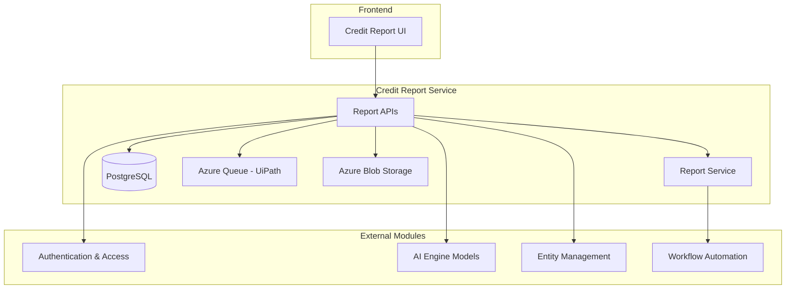
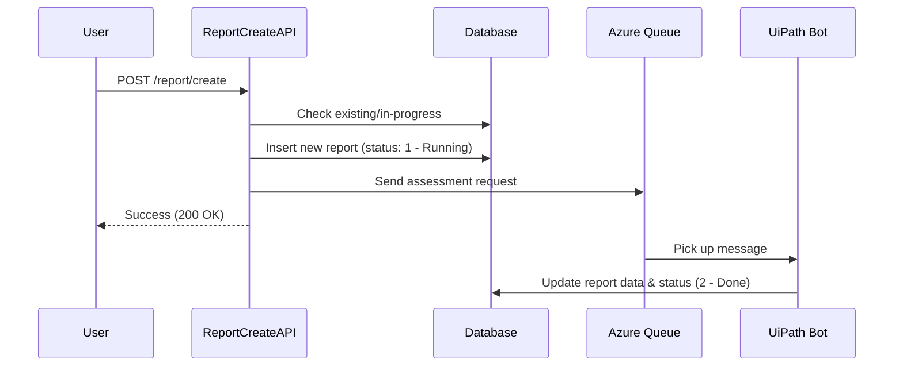

# Credit Report Service

## Overview
The **Credit Report Service** is a core module responsible for managing the lifecycle of credit reports for both existing and potential customers. It provides a comprehensive suite of APIs and services to create, assess, retrieve, save, and download credit reports.

The service integrates with automated workflows (RPA via UiPath), AI engines for risk assessment, and Azure Storage for document management. It ensures that credit analysts can perform thorough financial evaluations, track historical assessments, and maintain up-to-date risk profiles.

## Architecture
The module follows a resource-service pattern, where RESTful resources handle HTTP requests and delegate business logic to specialized services.

### Component Diagram

## Sub-modules

### 1. [Report Management API](report_management.md)
Handles the core CRUD operations and listing of credit reports.
- **Report List**: Filtering and pagination of existing reports.
- **Report Creation**: Initiating new credit assessments.
- **Report Detail**: Fetching comprehensive data including history and attachments.
- **Report Save**: Versioning and manual overrides of report data.

### 2. [Assessment & Workflow](assessment_workflow.md)
Manages the integration with automated assessment tools.
- **Triggering**: Sending messages to Azure Queue for UiPath RPA processing.
- **Re-assessment**: Logic for updating existing reports with new data.

### 3. [Document & Export](document_export.md)
Handles the generation and retrieval of report documents.
- **Download**: Fetching PDF and XLSX versions from Azure Blob Storage.
- **Generation**: Frontend components for PPT and PDF generation.

## Key Workflows

### Credit Report Creation Flow

## Related Modules
- [AI Engine Models](AI_Engine_Models.md): Provides the intelligence for risk assessment and drafting.
- [Entity Management](Entity_Management.md): Manages the corporate hierarchy and relationships.
- [Workflow Automation](Workflow_Automation.md): Handles complex re-assessment and recommendation logic.
- [Authentication & Access](Authentication_Access.md): Secures the APIs and manages user sessions.
