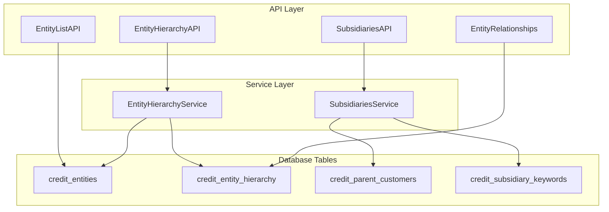

# Entity Management Module

## Overview
The **Entity Management** module is a core component of the system responsible for managing corporate entities, their hierarchical relationships, and subsidiary data. It provides the foundational data structure used by other modules like [Credit_Report_Service](Credit_Report_Service.md) and [News_Intelligence](News_Intelligence.md) to perform risk assessments and news monitoring.

The module handles:
*   **Entity Identification**: Searching and listing entities based on names, tickers, or Capital IQ (CIQ) IDs.
*   **Hierarchy Management**: Building and visualizing complex parent-child corporate structures.
*   **Subsidiary Tracking**: Managing lists of subsidiaries for specific parent companies, supporting both automated and manual updates.
*   **Relationship Synchronization**: Processing raw relationship data into structured hierarchy tables.

## Architecture

The module follows a service-oriented architecture, separating the API layer (Resources) from the business logic (Services).

## Sub-Modules

The Entity Management module is divided into two primary functional areas:

### 1. [Entity Hierarchy and Relationships](entity_hierarchy.md)
Focuses on the structural organization of companies. It allows the system to understand which companies own others, enabling aggregated risk views.
*   **Core Components**: `EntityHierarchyAPI`, `EntityListAPI`, `EntityRelationships`, `EntityHierarchyService`.
*   **Key Functionality**: Recursive hierarchy building, entity searching, and relationship data ingestion.

### 2. [Subsidiary Management](subsidiary_management.md)
Handles the granular tracking of subsidiaries and keywords associated with a parent entity. This is crucial for the [News_Intelligence](News_Intelligence.md) module to monitor relevant events across an entire corporate group.
*   **Core Components**: `SubsidiariesAPI`, `SubsidiariesService`.
*   **Key Functionality**: Manual subsidiary entry, automated keyword synchronization, and integration with reassessment workflows.

## Data Flow: Entity Search to Hierarchy
1.  **Search**: User searches for an entity via `EntityListAPI`.
2.  **Selection**: An `entity_id` is selected.
3.  **Hierarchy Retrieval**: `EntityHierarchyAPI` calls `EntityHierarchyService` to fetch all related parents and children.
4.  **Enrichment**: The hierarchy is enriched with real-time credit data (risk categories, insurance coverage) from the `credit_report` table.
5.  **Visualization**: A structured tree is returned to the frontend.

## Integration with Other Modules
*   **[Credit_Report_Service](Credit_Report_Service.md)**: Provides the `credit_report` data used to enrich hierarchy nodes with risk information.
*   **[News_Intelligence](News_Intelligence.md)**: Consumes subsidiary keywords to trigger news alerts and reassessments.
*   **[Workflow_Automation](Workflow_Automation.md)**: Triggered when subsidiaries are updated to initiate recommendation workflows.
