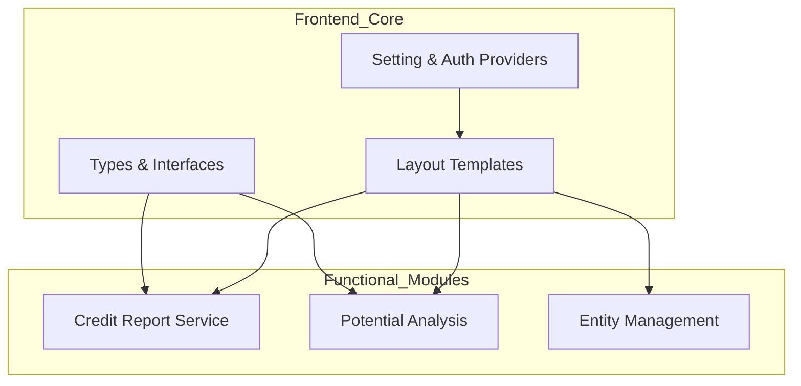
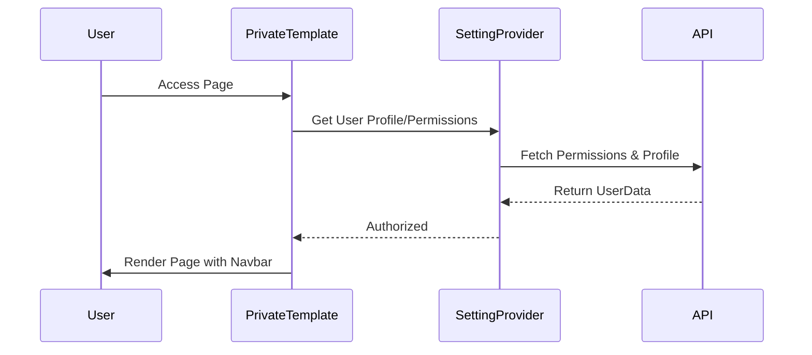

# Frontend Core Module

## Overview
The **Frontend_Core** module serves as the foundational layer for the system's user interface. It defines the global type system, provides essential context providers for application state (such as user settings and permissions), and establishes the primary layout templates for the application.

This module ensures consistency across the frontend by centralizing data structures and shared logic used by other functional modules like [Credit_Report_Service](Credit_Report_Service.md) and [Potential_Analysis](Potential_Analysis.md).

## Architecture

The Frontend Core is structured into three main pillars:
1.  **Type Definitions**: Centralized TypeScript interfaces and types.
2.  **State Management (Providers)**: Context providers for global settings and security.
3.  **Layout Templates**: Reusable UI wrappers for private and public views.

## Sub-modules

### [Types and Data Structures](frontend_types.md)
Contains the comprehensive TypeScript definitions for the entire application. It includes:
*   **Report & Potential Details**: Structures for credit assessments and entity intelligence.
*   **Financial Data**: Definitions for `FactsheetData` and risk rating scores.
*   **API Responses**: Standardized wrappers for backend communication.

### [Application Providers](frontend_providers.md)
Manages global application state and logic:
*   **SettingProvider**: Handles user profiles, environment detection, and granular permission checks (RBAC).
*   **Filter Management**: Persists and updates table filters across different pages.

### [UI Templates](frontend_templates.md)
Provides the structural skeleton for the application:
*   **PrivateTemplate**: A secure layout wrapper that includes the navigation bar, background styling, and logout logic.

## Component Relationships

## Cross-Module References
*   **Authentication**: Integrates with [Authentication_Access](Authentication_Access.md) for session management.
*   **Data Display**: Types defined here are consumed by [Credit_Report_Service](Credit_Report_Service.md) for rendering reports.
