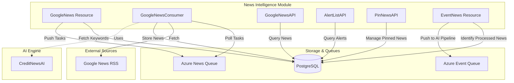
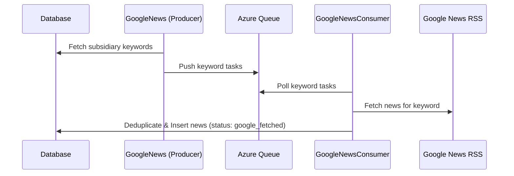

# News Intelligence Module

## Overview
The **News Intelligence** module is a critical component of the credit risk assessment system. It provides automated news monitoring, aggregation, and alerting capabilities to track market events and potential risks associated with corporate entities and their subsidiaries.

The module leverages Google News RSS feeds, Azure Storage Queues for asynchronous processing, and specialized AI models to filter, categorize, and rank news events based on their relevance to credit risk.

## Core Functionality
- **Automated News Crawling**: Periodically fetches news based on entity-specific keywords.
- **Risk Alerting**: Identifies high-risk news items using keyword-based filtering and AI analysis.
- **News Management**: Allows users to "pin" relevant news to specific credit reports.
- **Event Processing**: Categorizes news into specific event types (e.g., financial distress, management changes).
- **Asynchronous Workflow**: Uses a producer-consumer architecture with Azure Queues to handle high volumes of news data without blocking API responses.

## Architecture Overview

## Sub-Modules

The News Intelligence module is organized into the following functional areas:

### 1. [News Acquisition and Processing](news_processing.md)
Handles the lifecycle of news data from discovery to storage.
- **Components**: `GoogleNews`, `GoogleNewsConsumer`
- **Key Tasks**: Keyword management, RSS fetching, deduplication, and database persistence.

### 2. [News Delivery and Alerts](news_delivery.md)
Provides interfaces for the frontend and other services to consume processed news.
- **Components**: `GoogleNewsAPI`, `AlertListAPI`
- **Key Tasks**: Pagination, alert filtering, and HKT timezone adjustment.

### 3. [News Interaction](news_interaction.md)
Manages user-driven actions on news items.
- **Components**: `PinNewsAPI`, `UnpinNewsAPI`
- **Key Tasks**: Linking specific news articles to credit reports for documentation.

### 4. [Event Intelligence](event_intelligence.md)
Bridges the gap between raw news and structured risk events.
- **Components**: `EventNews`
- **Key Tasks**: Triggering downstream AI analysis for news that has been successfully fetched and cleaned.

## Data Flow Diagram

## Integration with Other Modules
- **[AI_Engine_Models](AI_Engine_Models.md)**: Uses `CreditNewsAI` for advanced relevance scoring and event extraction.
- **[Entity_Management](Entity_Management.md)**: Retrieves subsidiary keywords and parent-child relationships to drive news searches.
- **[Credit_Report_Service](Credit_Report_Service.md)**: News items are pinned to reports generated by this service.
