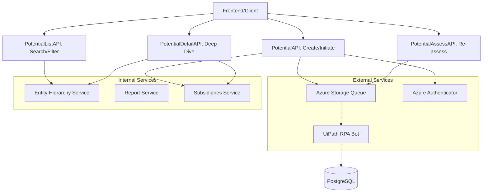

# Potential Analysis Module

## Overview
The **Potential Analysis** module is a core component of the Credit Risk Management system, specifically designed to evaluate and manage credit risks for prospective (potential) customers. It provides a comprehensive suite of tools for initiating credit assessments, managing a searchable list of potential leads, and performing deep-dive analysis into company hierarchies and financial health.

The module distinguishes between **listed** companies (tracked via ticker codes and automated RPA workflows) and **non-listed** companies (managed via manual data entry and subsidiary mapping).

## Architecture and Data Flow

The module follows a RESTful API architecture, interacting with a PostgreSQL database for persistence and Azure Storage Queues to trigger asynchronous Robotic Process Automation (RPA) jobs for data gathering.

### Component Interaction Diagram

## Core Functionality

### 1. Assessment Initiation (`PotentialAPI`)
Handles the creation of new potential company records. 
- **Listed Companies:** Triggers an RPA workflow via Azure Queue to fetch market data based on a ticker code.
- **Non-listed Companies:** Initializes a manual entry workflow and integrates with the [Subsidiary Management](Entity_Management.md) to map corporate structures.

### 2. Lead Management (`PotentialListAPI`)
Provides a paginated, filterable list of all potential companies under assessment.
- Supports complex filtering by risk rating, reviewer, and date ranges.
- Integrates with [Entity Hierarchy](Entity_Management.md) to display parent-child relationships directly in the list view.
- Allows users to save persistent filters for their workspace.

### 3. Detailed Analysis (`PotentialDetailAPI`)
Aggregates all data points for a specific company, including:
- **Assessment History:** A versioned timeline of previous credit reviews.
- **Financial Factsheets:** Detailed financial data (if available).
- **Hierarchy Mapping:** Visualizes the company's position within a corporate group and inherits risk ratings from parent entities where applicable.
- **Attachments:** Links to generated PDF reports and supporting documents managed by the [Document Export](Credit_Report_Service.md) sub-module.

### 4. Re-assessment Workflow (`PotentialAssessAPI`)
Allows users to trigger a fresh assessment for existing entities. This increments the report version and re-queues the RPA job to ensure the latest market data is captured.

## Sub-modules
Due to the complexity of data handling and external integrations, the module is divided into the following functional areas:

| Sub-module | Responsibility |
| :--- | :--- |
| [Assessment Workflow](assessment_workflow.md) | Managing the lifecycle of a credit report from initiation to RPA triggering. |
| [Data Retrieval & Listing](data_retrieval_listing.md) | Handling complex SQL queries for filtering and hierarchy-aware listing. |
| [Entity Intelligence](entity_intelligence.md) | Integrating with corporate hierarchy and subsidiary services to contextualize risk. |

## Related Modules
- [Credit Report Service](Credit_Report_Service.md): Handles the actual generation and storage of the final credit report documents.
- [Entity Management](Entity_Management.md): Provides the underlying services for hierarchy and subsidiary tracking.
- [Workflow Automation](Workflow_Automation.md): Manages the RPA helpers and UIPath integrations.
