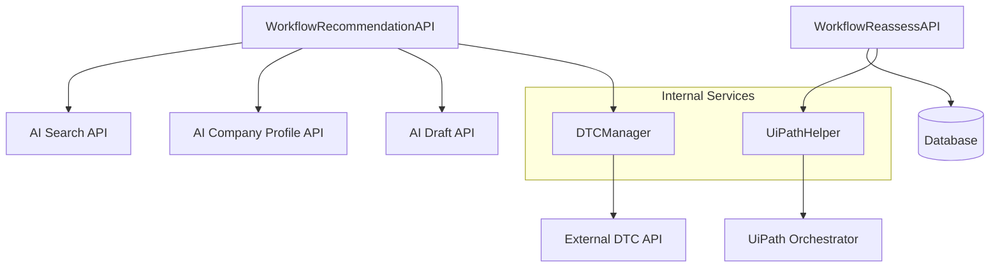
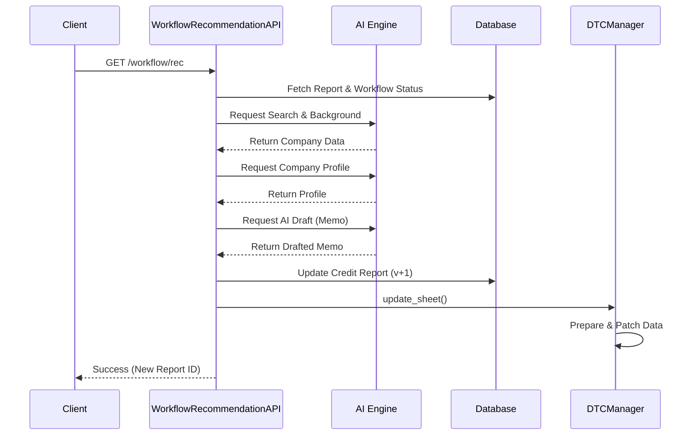

# Workflow Automation Module

## Overview
The **Workflow Automation** module is the orchestration engine of the Credit AI system. It manages the end-to-end lifecycle of credit assessments, from triggering periodic re-assessments to generating AI-driven credit recommendations and synchronizing data with external business systems like DTC (Data Tracking Center) and UiPath RPA robots.

This module acts as a bridge between the [AI Engine Models](AI_Engine_Models.md), [Credit Report Service](Credit_Report_Service.md), and external automation platforms.

## Architecture
The module follows a service-oriented architecture where API resources trigger complex workflows managed by specialized managers and utility helpers.

## Key Sub-modules

### 1. [Assessment Workflow](assessment_workflow.md)
Handles the logic for generating credit recommendations and managing periodic reviews. It orchestrates multiple AI calls to gather company background, external ratings, and financial drafts to produce a comprehensive credit memo.

### 2. [External Integration](external_integration.md)
Manages communication with third-party systems:
- **DTC Manager**: Synchronizes assessment results with the Data Tracking Center (DTC) via REST APIs.
- **UiPath Helper**: Interfaces with UiPath Orchestrator to trigger RPA jobs for automated data computation and exposure analysis.

## Process Flow: Credit Recommendation
The following diagram illustrates the sequence of events when a recommendation workflow is triggered:

## Component Summary
| Component | Responsibility |
|-----------|----------------|
| `WorkflowReassessAPI` | Identifies reports due for review and triggers re-assessment workflows. |
| `WorkflowRecommendationAPI` | Orchestrates the AI-driven drafting process for credit memos. |
| `DTCManager` | Formats and pushes credit assessment data to the DTC platform. |
| `UiPathHelper` | Interfaces with UiPath Orchestrator to start automation jobs. |
