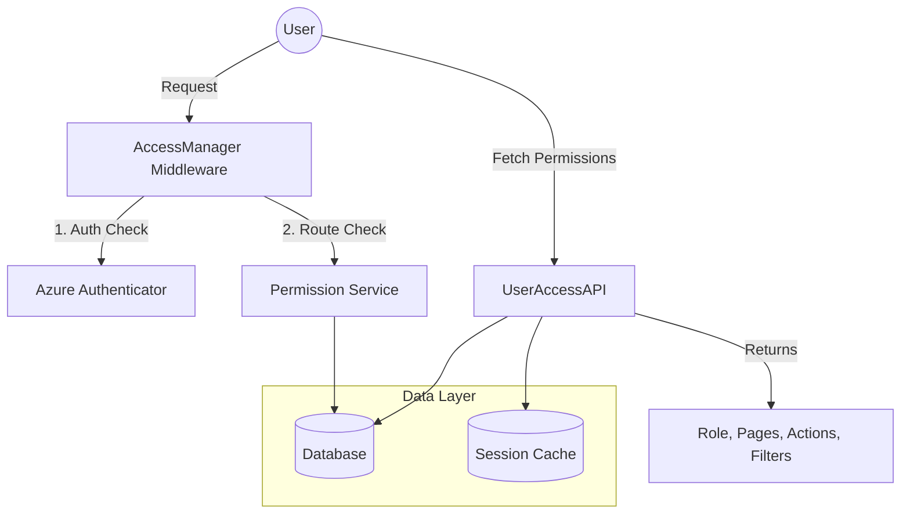
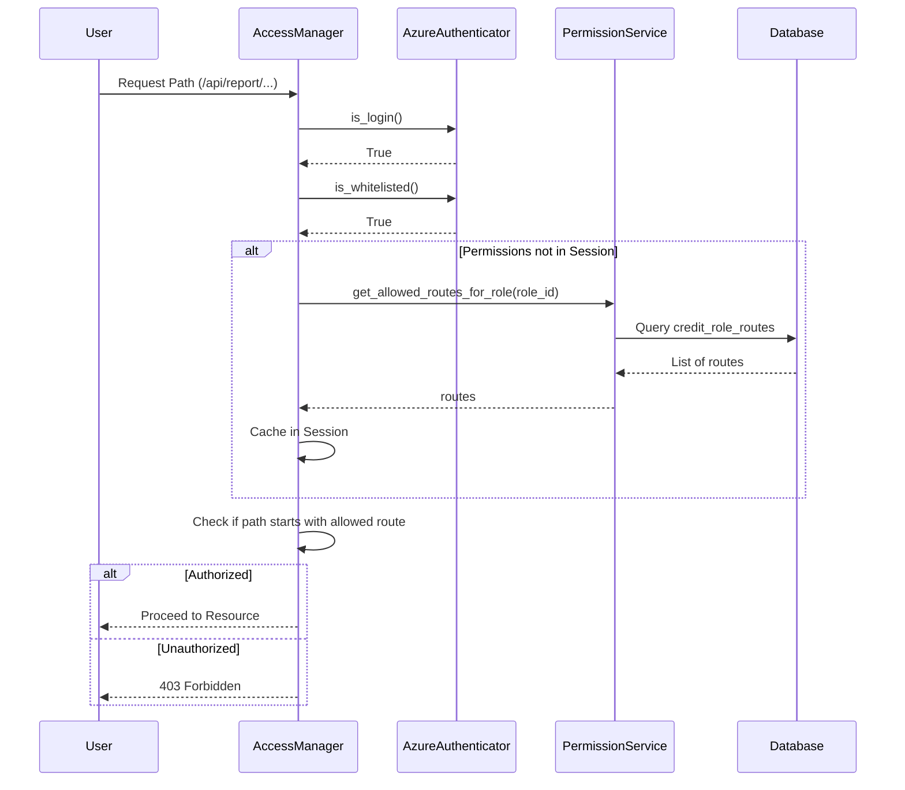

# Access Control Module

The **Access Control** module is a core security component of the system, responsible for managing user permissions, role-based access control (RBAC), and session-based authorization. It acts as a gatekeeper, ensuring that users can only access resources and perform actions permitted by their assigned roles.

## Overview

The module integrates with [Azure Authenticator](authentication_provider.md) to verify user identity and then applies granular permission checks based on roles defined in the database. It manages:
- **Route Authorization**: Controlling access to specific API endpoints and frontend paths.
- **Page & Action Permissions**: Defining which UI components and functional actions (e.g., "edit", "download") are available to a user.
- **User Filters**: Retrieving personalized data filters saved by users.
- **Session Management**: Caching permissions to optimize performance.

## Architecture

The module follows a layered architecture where the `AccessManager` handles middleware-level request filtering, while `UserAccessAPI` provides the frontend with the necessary permission metadata.

## Core Components

### AccessManager
Located in `services/user/access_manager.py`, this class serves as the primary middleware for request authorization.

- **Role Access Check**: Intercepts every request to verify if the user is logged in and if their role has permission to access the requested path.
- **Whitelist Bypass**: Allows specific paths (defined in `NO_LOGIN_REQUIRED_PATHS`) to bypass authentication.
- **Admin Override**: Grants full access to `admin` and `credit` roles.
- **Route Validation**: Dynamically fetches and caches allowed routes for the current user's role.

### UserAccessAPI
Located in `resource/user/access.py`, this RESTful resource provides the frontend with the user's security context.

- **Permission Aggregation**: Combines allowed pages and specific actions (e.g., `{'report_page': ['view', 'download']}`) into a single response.
- **Debug Mode**: Allows developers to simulate different roles using the `role_debug` parameter (restricted by environment/session).
- **Filter Retrieval**: Loads user-specific saved filters from the `credit_filters` table.

## Data Flow

### Authorization Process
The following sequence diagram illustrates how a request is authorized:

## Integration with Other Modules

- **[Authentication Provider](authentication_provider.md)**: Relies on `AzureAuthenticator` for identity verification.
- **[Session Lifecycle](session_lifecycle.md)**: Uses the `LogoutAPI` to clear session data managed by this module.
- **Frontend Core**: The `UserAccessAPI` output is consumed by the frontend to conditionally render navigation items and buttons.

## Database Schema Reference

The module interacts with the following tables:
- `public.credit_roles`: Stores role definitions.
- `public.credit_pages`: Stores application page identifiers.
- `public.credit_actions`: Stores specific action types (view, edit, etc.).
- `public.credit_role_page_actions`: Mapping table for RBAC.
- `public.credit_routes`: Stores API and frontend route paths.
- `public.credit_filters`: Stores user-specific data view preferences.
