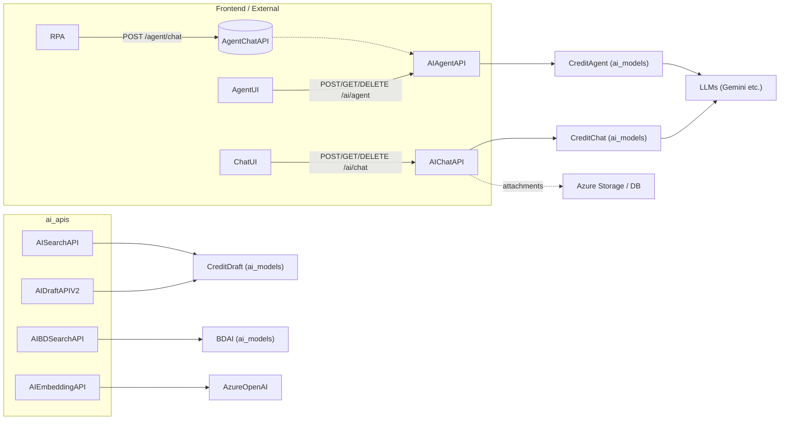
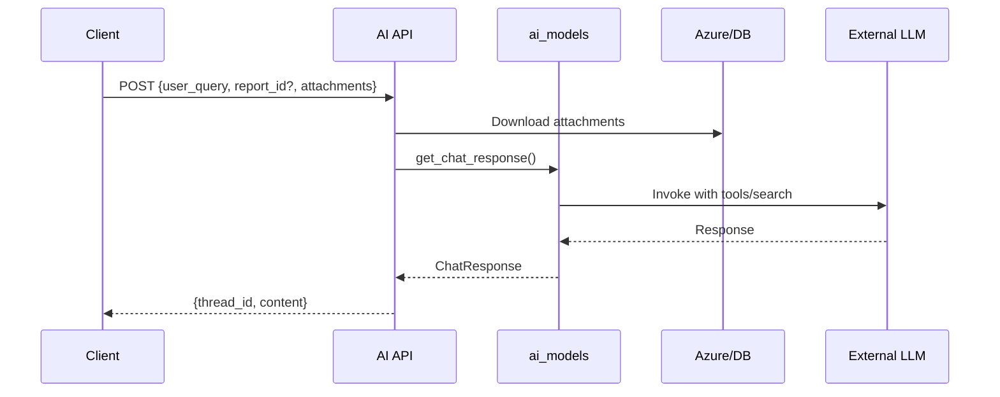

# AI APIs Module Documentation

## Introduction and Purpose

The `ai_apis` module exposes RESTful API endpoints for AI-driven functionalities in the credit analysis platform. It acts as the gateway for frontend and external systems (e.g., RPA) to interact with AI models for chat, report drafting, search, embeddings, and business development insights.

Core purpose:
- Facilitate AI chat and agent interactions with report context and attachments.
- Generate AI drafts for credit reports.
- Provide search, BD profiles, and embeddings.

Integrates with [ai_models](ai_models.md) for AI logic, [attachments_management](attachments_management.md) for file handling, [report_management](report_management.md) for report data, and Azure Storage/DB.

## Architecture Overview

### Component Diagram

### Chat Data Flow

## Sub-modules

- **[AI Core APIs](ai_core_apis.md)**: Main endpoints from `resource/ai_api.py`.
- **[Agent Chat Proxy](agent_chat_proxy.md)**: Proxy endpoint from `resource/agent/chat.py`.

## High-level Functionality

See sub-module docs for details. Key integrations:
- Chat APIs use PostgresSaver for thread persistence.
- Draft/Search use prompt directories and parallel execution.
- All return standardized JSON {code, msg, data}.

## System Fit
Serves [frontend_ui](frontend_ui.md), [potential_management](potential_management.md), [report_management](report_management.md). Used in workflows for AI-assisted analysis.
