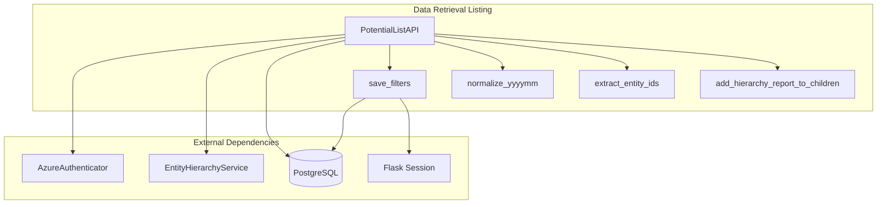
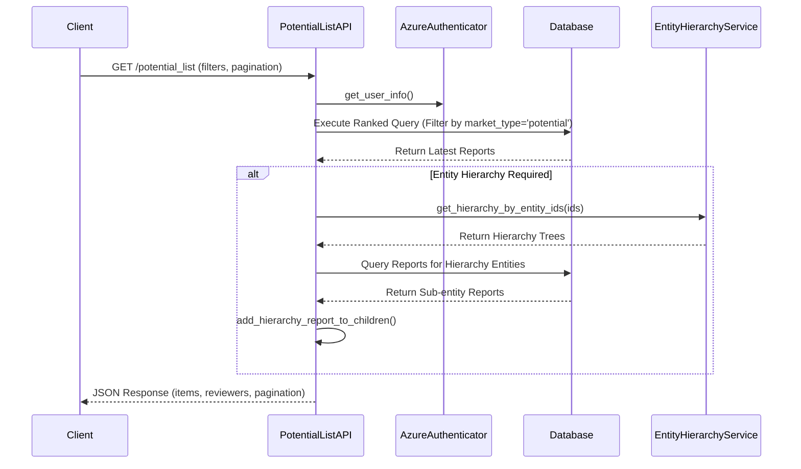

# Data Retrieval Listing Module

## Introduction
The **Data Retrieval Listing** module is a specialized component within the [Potential Analysis](potential_analysis.md) system. Its primary responsibility is to provide a robust, filtered, and paginated interface for retrieving "Potential" market type credit reports. It serves as the data backbone for the potential entity dashboard, integrating complex database queries with entity hierarchy information to provide a comprehensive view of business prospects.

## Core Functionality
- **Advanced Filtering**: Supports multi-criteria filtering including company name, ticker code, risk ratings, reviewers, and date ranges.
- **Hierarchy Integration**: Automatically resolves and attaches entity hierarchy data to each listing item using the [Entity Management](entity_management.md) services.
- **User Preference Persistence**: Allows users to save their filter configurations for consistent session-based or persistent views.
- **Role-Based Data Masking**: Implements business logic to restrict certain high-risk recommendations from being visible to specific roles (e.g., Business Development).
- **Version Control**: Ensures only the most relevant (latest or reviewed) version of a credit report is displayed for each entity.

## Architecture and Component Relationships

### Component Diagram

## Data Flow and Process

The following sequence illustrates how a request for the potential list is processed:

## Key Components

### PotentialListAPI
The main entry point for the module. It handles both `GET` and `POST` requests to retrieve the list of potential entities.
- **Path**: `resource/potential_list_api.py`
- **Key Logic**:
    - Uses a Common Table Expression (CTE) `review_ranked` to partition data by company name and select the highest version/reviewed status.
    - Normalizes risk rating strings (e.g., "A" to "A/%") to match database storage patterns.
    - Integrates with `EntityHierarchyService` to provide a nested view of corporate structures.

### Helper Functions
| Function | Description |
| :--- | :--- |
| `normalize_yyyymm` | Ensures date strings are in the correct format for database comparison. |
| `save_filters` | Persists user-specific filter settings into the `credit_filters` table. |
| `extract_entity_ids` | Recursively traverses hierarchy trees to collect all related entity IDs. |
| `add_hierarchy_report_to_children` | Maps specific report IDs to child nodes within a hierarchy structure. |

## Integration with Other Modules
- **[Authentication & Access](authentication_access.md)**: Uses `AzureAuthenticator` to identify the user and `session` to determine role-based access levels.
- **[Entity Management](entity_management.md)**: Relies on `EntityHierarchyService` to fetch the organizational structure of the entities being listed.
- **[Credit Report Service](credit_report_service.md)**: Queries the `credit_report` and `credit_report_review` tables which are managed by the report service.
- **[AI Engine Models](ai_engine_models.md)**: Displays risk ratings and assessments generated by the AI Core Engine.

## Database Interaction
The module performs complex joins between:
1. `credit_report`: The primary data source for entity assessments.
2. `credit_report_review`: To fetch reviewer names and status.
3. `credit_filters`: To store and retrieve user preferences.

### Risk Rating Mapping
The module includes a mapping layer for risk categories to handle UI-to-DB string discrepancies:
- `A` -> `A/`
- `C-WATCHLIST` -> `C (WATCHLIST)`
- `D-WATCHLIST` -> `D (WATCHLIST)`
