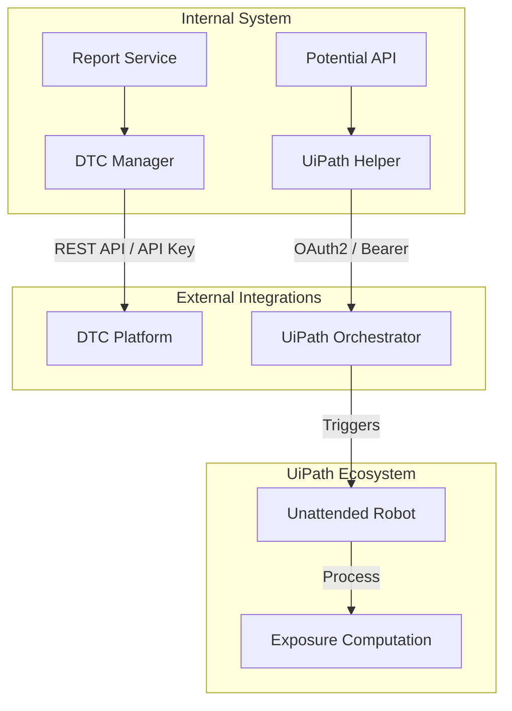
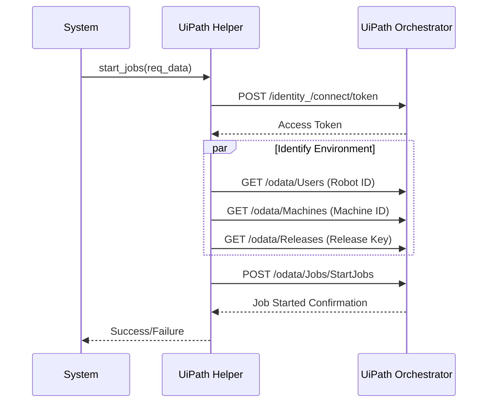

# External Integration Module

The `external_integration` module serves as the bridge between the Credit AI system and external enterprise platforms. It facilitates automated data synchronization with the **DTC (Data Tracking Center)** and orchestrates robotic process automation (RPA) via **UiPath** for complex exposure computations.

## Overview

This module is a critical component of the [Workflow Automation](workflow_automation.md) layer. It ensures that credit assessments generated within the system are reflected in external tracking tools and triggers automated background jobs for financial analysis.

### Key Responsibilities
- **DTC Synchronization**: Automatically updates external tracking sheets with the latest credit ratings, financial metrics, and assessment memos.
- **RPA Orchestration**: Interfaces with UiPath Orchestrator to trigger "Exposure Computation" robots based on entity location and market type.
- **Data Transformation**: Normalizes internal credit data (memos, factsheets, risk ratings) into formats required by external APIs.

## Architecture and Data Flow

The module interacts with external cloud services using secure API protocols (REST/OAuth2).

## Component Details

### DTC Manager (`DTCManager`)
Located in `services/dtc/dtc_manager.py`, this component manages the lifecycle of data synchronization with the DTC platform.

#### Core Logic:
1. **Data Aggregation**: Combines data from [AI Engine Models](ai_engine_models.md) (Final Memo, Risk Rating) and [Credit Report Service](credit_report_service.md) (Factsheet).
2. **Row Matching**: Fetches existing sheet data to determine if a company should be updated (matching `Company Name`) or if a new entry should be created at the next available index.
3. **Formatting**: Converts internal date formats and handles currency string-to-float conversions (e.g., handling bracketed negative values like `(100.0)`).

#### Data Mapping:
| DTC Field | Source Component | Logic/Transformation |
| :--- | :--- | :--- |
| `Risk Level` | `final_memo` | Maps internal slugs (low, mid-high) to display labels. |
| `S&P Rating` | `final_memo` | Parses rating strings (e.g., "S&P: BBB+"). |
| `Revenue/EBT` | `factsheet` | Extracts the latest annual period values. |

### UiPath Helper (`UiPathHelper`)
Located in `util/uipath_helper.py`, this utility handles the authentication and job dispatching for UiPath robots.

#### Process Flow:

#### Release Selection Logic:
The helper dynamically selects the RPA process based on the `market_type` and `location_type`:
- **Potential Market**: Triggers `LF_PotentialExposureComputation`.
- **Onshore Location**: Triggers `LF_ExposureComputation_OnShore`.
- **Offshore/Default**: Triggers `LF_ExposureComputation`.

## Integration with Other Modules

- **[AI Engine Models](ai_engine_models.md)**: Provides the `RiskAssessment` and `CreditRating` data used by `DTCManager`.
- **[Credit Report Service](credit_report_service.md)**: Supplies the `FactsheetData` and `ReportService` context for external updates.
- **[Potential Analysis](potential_analysis.md)**: Utilizes `UiPathHelper` to trigger exposure calculations during the potential assessment workflow.

## Configuration

The module relies on the following environment variables:

| Variable | Description |
| :--- | :--- |
| `DTC_API_KEY` | Authentication key for DTC API. |
| `DTC_SHEET_ID` | Comma-separated list of target sheet IDs. |
| `UIPATH_APPID` | Client ID for UiPath Orchestrator. |
| `UIPATH_APP_SECRET` | Client Secret for UiPath Orchestrator. |
| `UIPATH_OrganizationUnitId` | Folder/Organization ID in UiPath. |
