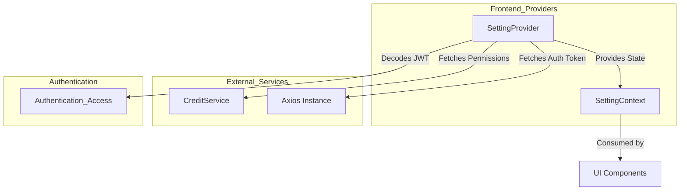
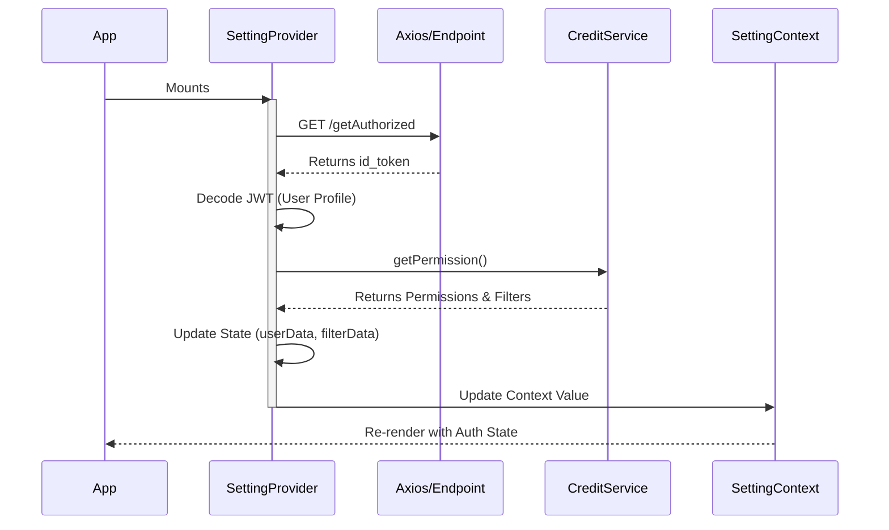

# Frontend Providers Module

## Introduction
The `frontend_providers` module serves as the global state management and configuration layer for the frontend application. It primarily centers around the `SettingProvider`, which utilizes the React Context API to distribute user profiles, environment configurations, and granular permission settings across the entire component tree.

This module acts as the bridge between the backend's access control logic and the frontend's UI rendering, ensuring that users only see and interact with features they are authorized to use.

## Architecture and Component Relationships

The module is a core part of the [Frontend_Core](frontend_core.md) system. It interacts with backend services to initialize the application state upon startup.

### Component Diagram


## Core Functionality

### 1. Global State Management
The `SettingProvider` manages several critical pieces of state:
*   **User Profile**: Decoded information from the JWT (name, email).
*   **User Data**: Comprehensive permission sets, including allowed pages and action maps.
*   **Application Environment**: Identifies if the app is running in production (`prd`) or other environments.
*   **Filter Persistence**: Stores and retrieves user-specific filter settings for different pages (e.g., list views).

### 2. Access Control Logic
The provider exposes several helper functions to simplify permission checks within UI components:

| Function | Description |
| :--- | :--- |
| `allowPage(pageName)` | Checks if the user has access to a specific route/page. |
| `hasPermission(page, action)` | Checks if a specific action (e.g., 'delete') is allowed on a page. |
| `hasEditPermission(page)` | A specialized check for complex edit permissions across detail pages. |

### 3. Data Flow
The following sequence diagram illustrates the initialization process when the application first loads:



## Integration with Other Modules

*   **[Frontend_Core](frontend_core.md)**: Uses types defined in `frontend/src/types/app.ts` (e.g., `UserInfo`, `PermissionResponse`) to ensure type safety.
*   **[Authentication_Access](authentication_access.md)**: Relies on the backend authentication flow to provide the necessary tokens for the `SettingProvider` to decode.
*   **[Credit_Report_Service](credit_report_service.md)** & **[Potential_Analysis](potential_analysis.md)**: These modules consume the `hasEditPermission` and `getFilter` functions to control UI elements on their respective detail and list pages.

## Implementation Details

### SettingContextType
The core interface defining the provided context:
```typescript
interface SettingContextType {
  userProfile: UserInfo | null;
  userData: any;
  appEnv: string;
  loading: boolean;
  allowPage: (pageName: string) => boolean;
  hasPermission: (pageName: string, permissionName: string) => boolean;
  hasEditPermission: (pageName: string) => boolean;
  getFilter: (pageName: string) => any;
  updateFilter: (pageName: string, filterData: any) => void;
}
```

### Permission Mapping
The `hasEditPermission` function contains specific logic for `existing_detail` and `potential_detail` pages, checking for a suite of edit capabilities such as `edit_final_memo`, `edit_factsheet`, and `edit_risk_category`. This ensures a unified "Edit Mode" toggle can be implemented across different sections of the application.
