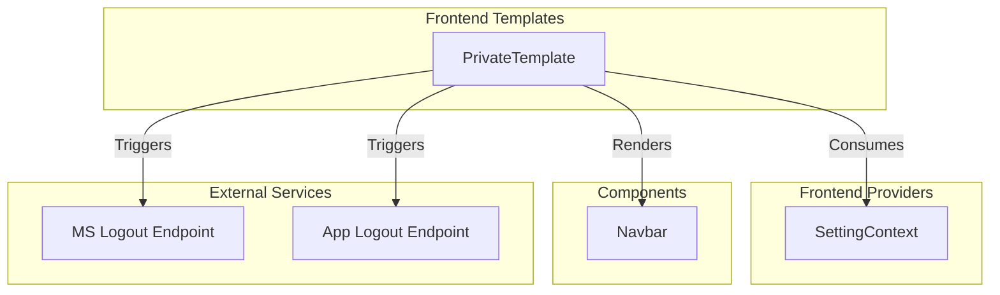
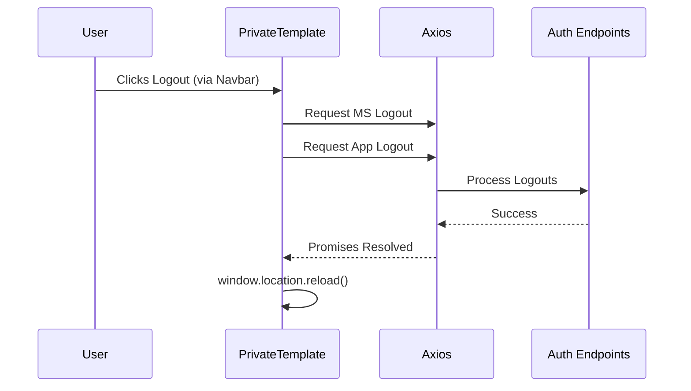

# Frontend Templates Module

## Introduction
The `frontend_templates` module provides the foundational layout structures for the application's user interface. Its primary responsibility is to ensure a consistent look and feel across protected routes by managing common UI elements like navigation bars, background styling, and global state integration.

## Core Functionality
The module currently centers around the `PrivateTemplate` component, which serves as the standard wrapper for all authenticated pages within the system.

### Key Features:
- **Layout Consistency**: Standardizes the page structure with a responsive container and consistent background.
- **Navigation Integration**: Conditionally renders the global `Navbar` with user profile data.
- **Authentication Handling**: Provides a centralized `onLogout` mechanism that triggers both Microsoft and Application-level logout sequences.
- **Context Awareness**: Consumes global settings (like user profiles) via the `SettingProvider`.

## Component Architecture

### PrivateTemplate
The `PrivateTemplate` is a Higher-Order Component (HOC) style wrapper that utilizes React's `PropsWithChildren`.



## Data Flow and Dependencies

### Authentication Flow
When a user initiates a logout within the template, the module coordinates multiple asynchronous requests to ensure a clean session termination across different authentication providers.



### Component Relationships
- **[frontend_providers](frontend_providers.md)**: The template relies on `SettingProvider` to retrieve the `userProfile` for the navigation bar.
- **[Authentication_Access](Authentication_Access.md)**: Interacts with the backend logout APIs defined in the authentication module.
- **Navbar Component**: A child component used to display navigation links and user actions.

## Technical Reference

### Props Interface
| Property | Type | Default | Description |
| :--- | :--- | :--- | :--- |
| `showNavbar` | `boolean` | `true` | Determines if the top navigation bar should be visible. |
| `className` | `string` | `undefined` | CSS classes applied to the outermost container. |
| `childClassName`| `string` | `undefined` | CSS classes applied to the content wrapper. |
| `children` | `ReactNode` | - | The page content to be rendered inside the template. |

## Usage Example
```tsx
import PrivateTemplate from "templates/privateTemplate";

const DashboardPage = () => {
  return (
    <PrivateTemplate>
      <h1>Welcome to the Dashboard</h1>
      {/* Page Content */}
    </PrivateTemplate>
  );
};
```

## Styling
The module uses a combination of:
- **Tailwind CSS**: For utility-first styling and responsiveness.
- **Lucide/Shadcn Patterns**: Utilizing `cn` (classnames) utility for dynamic class merging.
- **Static Assets**: Uses a global background image (`background.png`) to maintain brand identity across the application.
