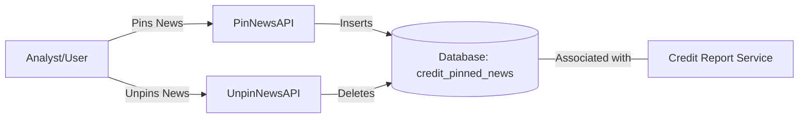
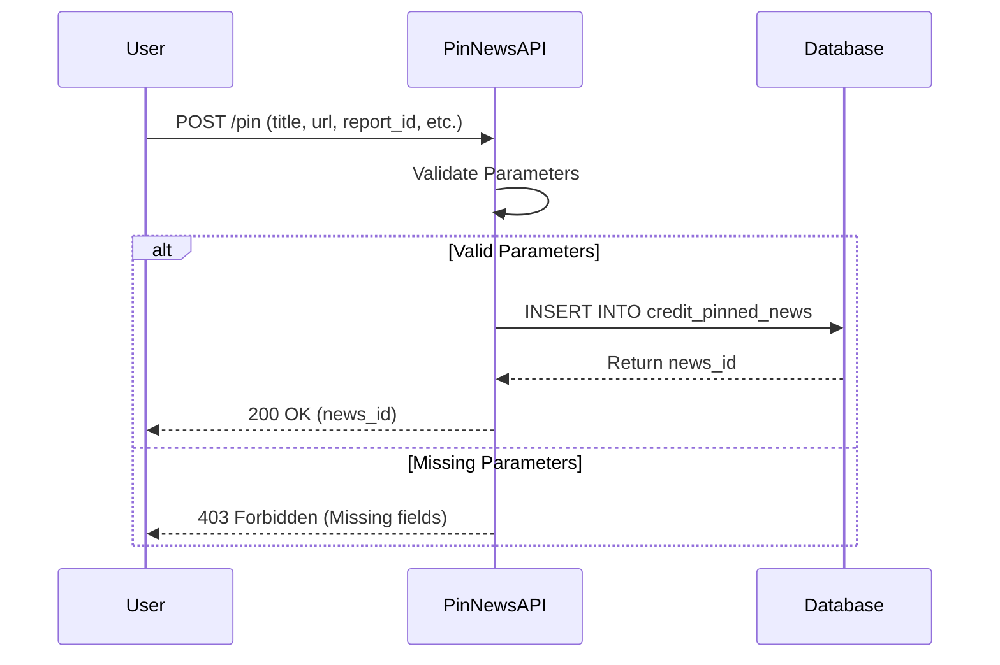

# News Interaction Module

## Introduction
The **News Interaction** module is a specialized component within the [News Intelligence](news_intelligence.md) system. Its primary purpose is to manage user interactions with news articles, specifically allowing users to "pin" relevant news items to specific credit reports and "unpin" them when they are no longer needed.

This module acts as the bridge between the raw news data stream and the [Credit Report Service](credit_report_service.md), enabling analysts to curate significant events that impact credit assessments.

## Architecture and Component Relationships

The module is built using the Flask-RESTful framework and interacts directly with the database to persist user selections.

### Core Components
- **PinNewsAPI**: Handles the logic for associating a news article with a specific report.
- **UnpinNewsAPI**: Handles the removal of a news article association from the system.

### System Context Diagram

## Data Flow and Process

### Pinning News Process
When a user identifies a relevant news article (e.g., from [News Delivery](news_delivery.md)), they can pin it to a report. The process follows these steps:

1. **Request Validation**: The API validates required fields: `report_id`, `title`, `url`, and `date_published`.
2. **Persistence**: The article metadata is stored in the `credit_pinned_news` table.
3. **Association**: The article is linked to a `report_id`, making it available for the [Credit Drafting AI](credit_drafting_ai.md) or manual review during report generation.

### Unpinning News Process
To remove a news item from a report:
1. **Identification**: The user provides the unique `news_id`.
2. **Verification**: The system checks if the record exists.
3. **Removal**: The record is deleted from the `credit_pinned_news` table.

## Integration with Other Modules

- **[News Intelligence](news_intelligence.md)**: This module provides the interface for the broader news ecosystem.
- **[Credit Report Service](credit_report_service.md)**: Pinned news items are typically retrieved by the report service to provide context or evidence for credit ratings.
- **[Authentication Access](authentication_access.md)**: Uses `AzureAuthenticator` (imported in `news_api.py`) to ensure that only authorized users can modify pinned news.

## API Reference

### Pin News
- **Endpoint**: `POST`
- **Arguments**:
    - `title` (string, required): The headline of the news.
    - `source_origin` (string, required): The publisher or source.
    - `url` (string, required): Link to the original article.
    - `date_published` (int, required): Timestamp of publication.
    - `report_id` (int, required): The ID of the report this news belongs to.

### Unpin News
- **Endpoint**: `POST`
- **Arguments**:
    - `news_id` (int, required): The unique identifier of the pinned news record.
