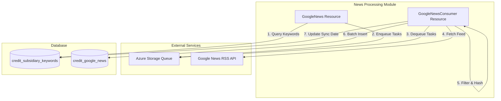
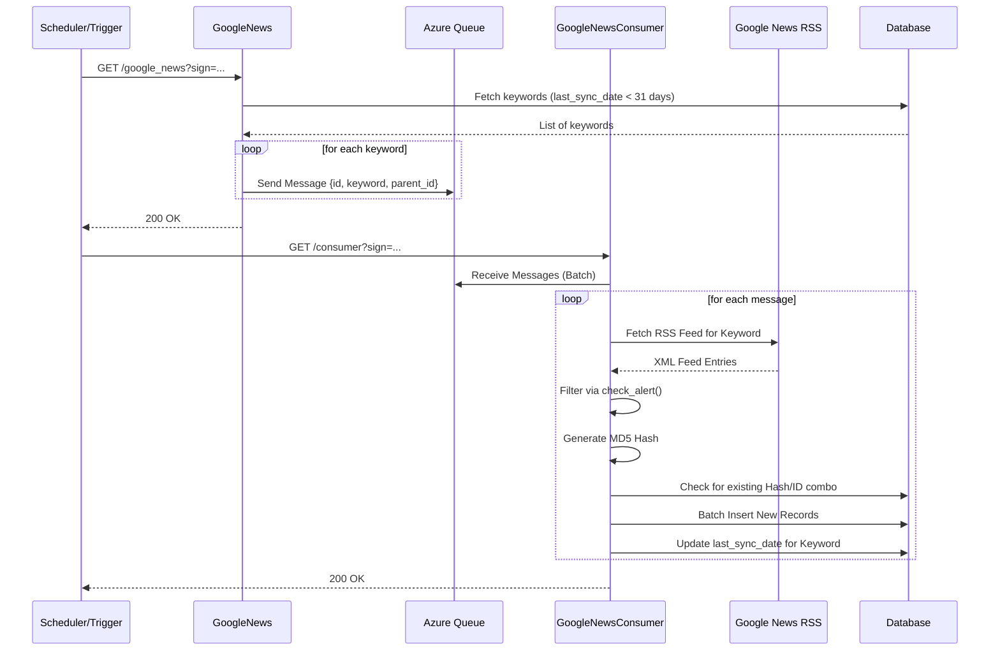

# News Processing Module

The **News Processing** module is a core component of the [News Intelligence](News_Intelligence.md) system. it is responsible for the automated discovery, ingestion, and filtering of news articles related to corporate subsidiaries and parent entities.

The module implements a producer-consumer architecture using Azure Storage Queues to handle high-volume news fetching from Google News RSS feeds, ensuring that risk-relevant information is captured and stored for further analysis by the [AI Engine Models](AI_Engine_Models.md).

## Architecture Overview

The module operates in two distinct phases:
1.  **Discovery (Producer):** Identifies keywords that need synchronization based on their last sync date and queues them for processing.
2.  **Ingestion (Consumer):** Pulls keywords from the queue, fetches RSS feeds, filters for risk alerts, and persists new entries to the database.

### Component Relationship

## Core Components

### GoogleNews (`resource/news/google_news.py`)
The producer component. It acts as a trigger to start the news collection process.

*   **Functionality:**
    *   Queries the `credit_subsidiary_keywords` table for entities requiring a news update (typically those not synced within the last 31 days).
    *   Serializes keyword metadata (ID, Parent ID, Keyword string) into JSON messages.
    *   Dispatches messages to the Azure Storage Queue defined by `CREDIT_NEWS_QUEUE`.
*   **Security:** Validates requests using a signature-based authentication (`gen_sign`).

### GoogleNewsConsumer (`resource/news/consumer.py`)
The consumer component. It performs the heavy lifting of data retrieval and processing.

*   **Functionality:**
    *   **Queue Management:** Retrieves messages from both standard and reassess queues using a multi-threaded approach (`ThreadPoolExecutor`).
    *   **Feed Fetching:** Uses `feedparser` to retrieve RSS content from Google News based on entity keywords.
    *   **Risk Filtering:** Integrates with `util.news.check_alert` to determine if a news title contains risk-relevant keywords before processing.
    *   **Deduplication:** Generates an MD5 hash of the news title to prevent duplicate entries in the database.
    *   **Batch Persistence:** Efficiently inserts news records into `credit_google_news` using batch SQL operations.

## Data Flow

## Integration with Other Modules

*   **[Entity Management](Entity_Management.md):** Provides the keywords and hierarchy (Parent/Subsidiary relationships) that drive the news search.
*   **[News Intelligence](News_Intelligence.md):** The broader module containing this processing logic, also handling event categorization and manual pinning.
*   **[AI Engine Models](AI_Engine_Models.md):** Consumes the data stored in `credit_google_news` to perform sentiment analysis and risk scoring via `CreditNewsAI`.

## Configuration

The module requires the following environment variables:
*   `CREDIT_AZURE_STORAGE_CONNECTION_STRING`: Connection string for Azure Storage account.
*   `CREDIT_NEWS_QUEUE`: Primary queue name for news tasks.
*   `CREDIT_NEWS_REASSESS_QUEUE`: Queue for high-priority or re-processing tasks.
