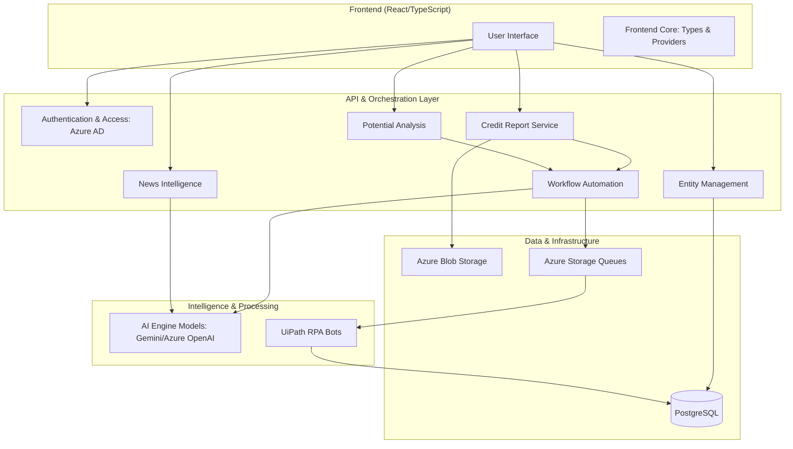

# LFCreditAI Repository Overview

## Purpose
The **LFCreditAI** repository is a comprehensive Credit Analysis and Risk Management platform. It leverages Large Language Models (LLMs), Robotic Process Automation (RPA), and real-time news intelligence to automate the lifecycle of credit assessments for both existing and potential corporate entities. The platform transforms raw financial data, corporate hierarchies, and global news feeds into structured credit memos, risk ratings, and actionable business development insights.

## End-to-End Architecture
The system follows a service-oriented architecture, integrating a React-based frontend with a Python backend that orchestrates AI models, database persistence, and external automation tools.

## Core Modules Documentation

The repository is organized into several specialized modules, each handling a specific domain of the credit assessment process:

### 1. [AI Engine Models](AI_Engine_Models.md)
The core intelligence layer. It utilizes Google Gemini and Azure OpenAI to perform RAG (Retrieval-Augmented Generation), news sentiment analysis, and automated drafting of credit memos.

### 2. [Credit Report Service](Credit_Report_Service.md)
Manages the lifecycle of credit reports. It handles the creation, versioning, and storage of financial assessments, including PDF/XLSX exports and integration with RPA for data gathering.

### 3. [Entity Management](Entity_Management.md)
Handles corporate identity and structure. It manages complex parent-child hierarchies and subsidiary tracking, providing the foundational data for risk aggregation.

### 4. [News Intelligence](News_Intelligence.md)
An automated monitoring system that crawls Google News for entity-specific keywords, uses AI to categorize risk events, and allows analysts to "pin" relevant news to credit reports.

### 5. [Potential Analysis](Potential_Analysis.md)
Specifically designed for lead management and prospective customer evaluation. It distinguishes between listed and non-listed companies to trigger appropriate data-gathering workflows.

### 6. [Workflow Automation](Workflow_Automation.md)
The orchestration engine that bridges internal services with external platforms like **UiPath** (for RPA) and **DTC** (Data Tracking Center) to automate periodic re-assessments.

### 7. [Authentication & Access](Authentication_Access.md)
Security module integrating **Azure Active Directory** for identity management and implementing Role-Based Access Control (RBAC) across the platform.

### 8. [Frontend Core](Frontend_Core.md)
The foundational UI layer containing global TypeScript definitions, context providers for application state, and standardized layout templates.