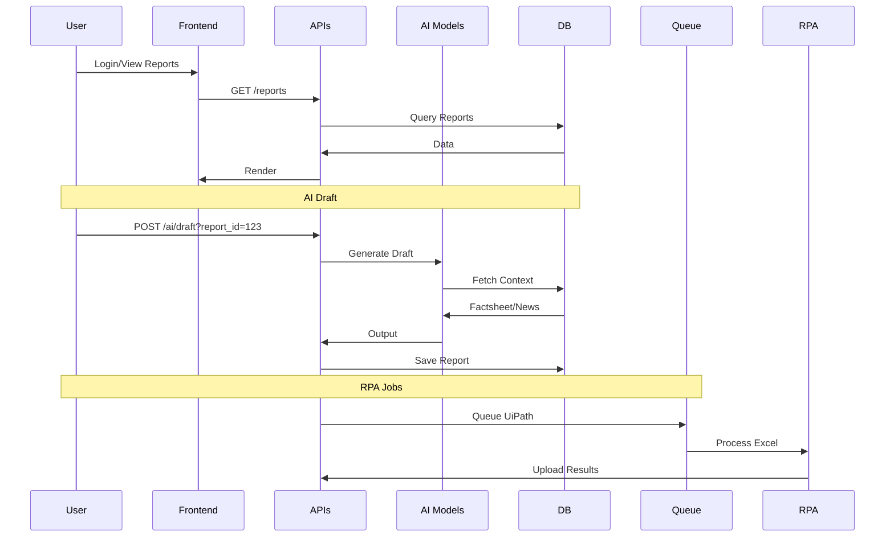

# LFCreditAI Module Documentation

## Introduction and Purpose

**LFCreditAI** is a comprehensive AI-powered platform designed for credit risk assessment and management within Li & Fung's supply chain ecosystem. It integrates frontend React applications for user interfaces, backend Flask APIs for data handling, AI models leveraging Google's Gemini for automated report drafting, company profiling, news analysis, and chat functionalities, and robust database and storage integrations for persistence.

### Core Functionality
- **Credit Report Generation & Management**: Automates drafting of credit memos, risk ratings, and financial factsheets using AI.
- **Company Profiling (BD AI)**: Generates detailed company profiles including logos, images, social media, revenue breakdowns via web scraping and AI summarization.
- **News Monitoring & Risk Alerts**: Crawls Google News, classifies events (e.g., bankruptcy), and generates alerts.
- **Entity Hierarchy & Relationships**: Manages company hierarchies from Excel transformations and SPG data.
- **Chat & Agent Interfaces**: AI chatbots for querying reports, with attachment support and tool integrations.
- **Frontend Dashboards**: Interactive UIs for reports, potentials, news, with PPT/PDF exports.

The module fits into the broader LF Credit system as the AI intelligence layer, enhancing manual processes with automation, reducing assessment time from days to minutes.

## Architecture Overview

```
graph TD
    subgraph Frontend
        A[React/TS Types & Components] --> B[Navbar, Login, Report Views, PPT Gen]
    end
    subgraph Backend APIs
        C[Flask Routes: AI, Reports, News, Entities] --> D[DB: PostgreSQL]
    end
    subgraph AI Layer
        E[CreditAI Base] --> F[BDAI: Profiles]
        E --> G[CreditDraft: Reports]
        E --> H[CreditChat/Agent: Queries]
        E --> I[CreditNewsAI: Events]
    end
    subgraph Data
        D --> J[Azure Blob: Attachments]
        D --> K[Azure Queue: Jobs/RPA]
    end
    subgraph External
        L[Google Gemini LLM] <--> E
        M[Google News/Firecrawl] <--> I
        N[UiPath RPA] <--> K
    end
    B <--> C
    C <--> E
    E <--> L
    I <--> M
    K <--> N
```

**Component Relationships**:
- **Types** define data structures used across frontend/backend.
- **AI Models** (ai_bd.py, ai_draft.py) depend on prompts/DB for generation.
- **APIs** (ai_api.py) orchestrate AI calls, DB queries.
- **News Pipeline** (google_news.py, event_consumer.py) feeds risk data.
- **Entity Services** build hierarchies for reports.
- **Reports** integrate all for full credit memos.

See sub-module docs for details:
- [AI Core](ai_core.md)
- [News Processing](news_processing.md)
- [Entity Management](entity_management.md)
- [Report Services](report_services.md)
- [Frontend Types](frontend_types.md)

## High-Level Functionality

| Sub-Module | Purpose | Key Components |
|------------|---------|----------------|
| [AI Core](ai_core.md) | AI drafting/profiling/chat | BDAI, CreditDraft, CreditChat |
| [News Processing](news_processing.md) | News crawling/classification | GoogleNewsConsumer, CreditNewsAI |
| [Entity Management](entity_management.md) | Hierarchies/relationships | EntityHierarchyService, ExcelTransformation |
| [Report Services](report_services.md) | CRUD/Excel extraction | ReportService, ExcelExtractor |
| [Frontend Types](frontend_types.md) | TS interfaces | Entity, CompanyCredit, etc. |

## Data Flow



## Dependencies
- **External**: Google Gemini, Azure Blob/Queue, UiPath RPA, Firecrawl.
- **Internal**: PostgreSQL schemas (credit_report, etc.).

For detailed sub-module breakdowns, see linked docs.
