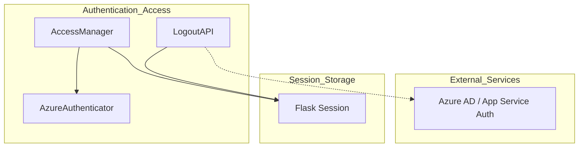
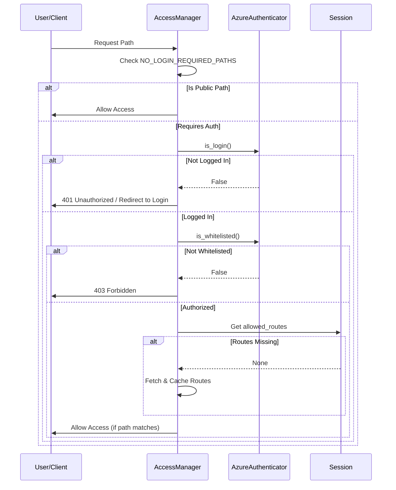

# Session Lifecycle Documentation

## Introduction
The `session_lifecycle` module is a critical component of the **Authentication_Access** system. It manages the end-to-end lifecycle of a user session, from validating access rights during active requests to securely terminating sessions. It ensures that only authenticated and authorized users can interact with the system's resources, such as [Credit_Report_Service](credit_report_service.md) and [Potential_Analysis](potential_analysis.md).

## Architecture and Component Relationships

The module operates as a middleware layer between the incoming requests and the application's business logic. It relies heavily on the `AzureAuthenticator` for identity verification and the `PermissionService` for route-based access control.

### Core Components

| Component | Path | Responsibility |
|:---|:---|:---|
| **AccessManager** | `services/user/access_manager.py` | Intercepts requests to validate login status, whitelist membership, and role-based route permissions. |
| **LogoutAPI** | `resource/logout_api.py` | Handles session termination by clearing session data and invalidating authentication cookies. |

### Dependency Diagram

## Data Flow and Process Logic

### 1. Access Validation Flow
The `AccessManager` performs a multi-stage check for every request (excluding public paths).

### 2. Session Termination (Logout)
The `LogoutAPI` ensures that all sensitive user information is purged from the server-side session and the client-side cookie.

**Cleared Session Keys:**
*   `user_email`, `user_id`, `user_name`
*   `role`, `role_id`, `permissions`
*   `user_filters`, `allowed_routes`

**Cookie Invalidation:**
*   Sets `AppServiceAuthSession` to an empty string with `max_age=0`.

## Integration with Other Modules

*   **[Authentication_Access](authentication_access.md):** Uses `AzureAuthenticator` to verify the underlying identity token provided by Azure AD.
*   **[Frontend_Core](frontend_core.md):** The frontend reacts to the 401/403 status codes returned by `AccessManager` to trigger login modals or permission alerts.
*   **System-wide:** Every module (e.g., [News_Intelligence](news_intelligence.md), [Entity_Management](entity_management.md)) is protected by the `AccessManager` middleware, ensuring that data leakage is prevented at the routing level.

## Configuration
The `AccessManager` behavior is influenced by:
*   `NO_LOGIN_REQUIRED_PATHS`: A list of paths that bypass authentication.
*   Session-stored `role`: Users with `admin` or `credit` roles bypass specific route checks.
