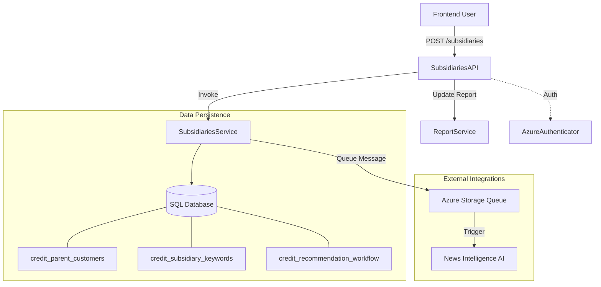
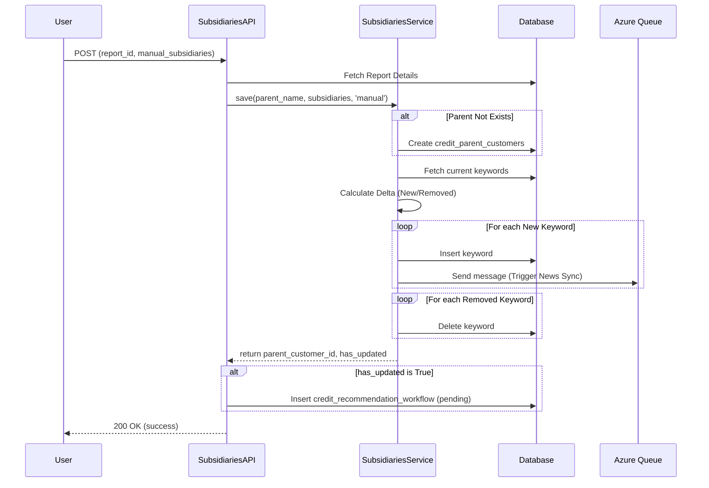

# Subsidiary Management Module

## Introduction
The **Subsidiary Management** module is a core component of the [Entity Management](entity_management.md) system. It is responsible for managing the relationships between parent corporations and their subsidiaries. This module allows users to manually define subsidiary keywords, which are then used to drive news intelligence, risk assessment, and automated credit recommendation workflows.

## Architecture and Component Relationships

The module follows a standard service-resource pattern, interfacing with the database and external Azure services.

### Core Components

| Component | Type | Description |
|:---|:---|:---|
| `SubsidiariesAPI` | Resource (REST) | Handles HTTP POST requests for saving and updating manual subsidiary lists for a specific report. |
| `SubsidiariesService` | Service | Contains the business logic for persisting parent-subsidiary relationships and managing subsidiary keywords. |

### System Interaction Diagram

## Functional Overview

### 1. Subsidiary Keyword Management
The module manages "keywords" that represent subsidiaries. These keywords are categorized by their source:
*   **Manual**: Keywords entered by users via the UI.
*   **Excel**: Keywords imported from external data sources.

When keywords are added, the `SubsidiariesService` calculates the delta (missing vs. extra keywords) and updates the `credit_subsidiary_keywords` table accordingly.

### 2. News Intelligence Integration
When new subsidiary keywords are added, the system automatically triggers a news reassessment process.
*   **Process**: New keywords are pushed to an Azure Storage Queue (`CREDIT_NEWS_REASSESS_QUEUE`).
*   **Downstream**: This triggers the [News Intelligence AI](news_intelligence_ai.md) to begin searching for relevant risk events associated with the new subsidiary.

### 3. Workflow Automation
Updating subsidiaries often impacts the credit risk profile of the parent entity.
*   **Trigger**: If the subsidiary list is modified, the `SubsidiariesAPI` inserts a record into the `credit_recommendation_workflow`.
*   **Status**: The workflow is set to `pending`, signaling to the [Workflow Automation](workflow_automation.md) module that a new credit recommendation needs to be generated or reviewed.

## Data Flow: Saving Subsidiaries

The following sequence diagram illustrates the process of updating subsidiaries for a credit report:

## Dependencies

*   **[Credit Report Service](credit_report_service.md)**: Used to link subsidiaries to specific credit reports and update parent customer metadata.
*   **[Authentication Access](authentication_access.md)**: Uses `AzureAuthenticator` to validate user sessions and log actions.
*   **[AI Engine Models](ai_engine_models.md)**: Indirectly triggered via the Azure Queue to perform news embedding and risk analysis.
*   **[Workflow Automation](workflow_automation.md)**: Consumes the workflow tasks generated by this module.

## Database Schema Reference

*   **`credit_parent_customers`**: Stores the unique identity of the parent entities.
*   **`credit_subsidiary_keywords`**: Stores the mapping of subsidiaries to parents, including the source and synchronization timestamps.
*   **`credit_recommendation_workflow`**: Tracks the status of credit assessments triggered by subsidiary changes.
