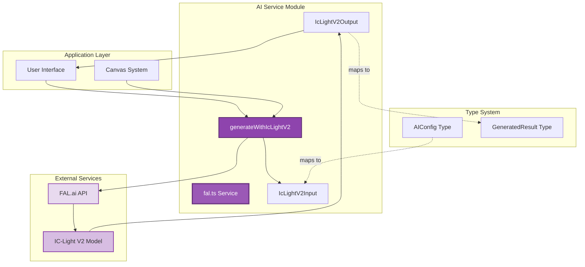
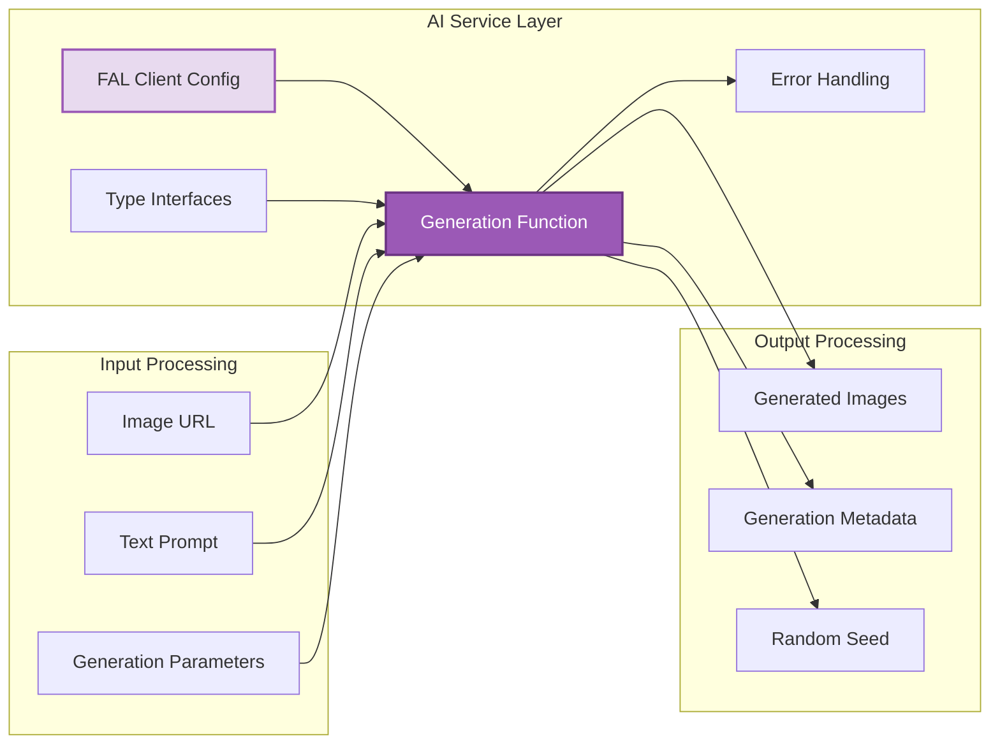
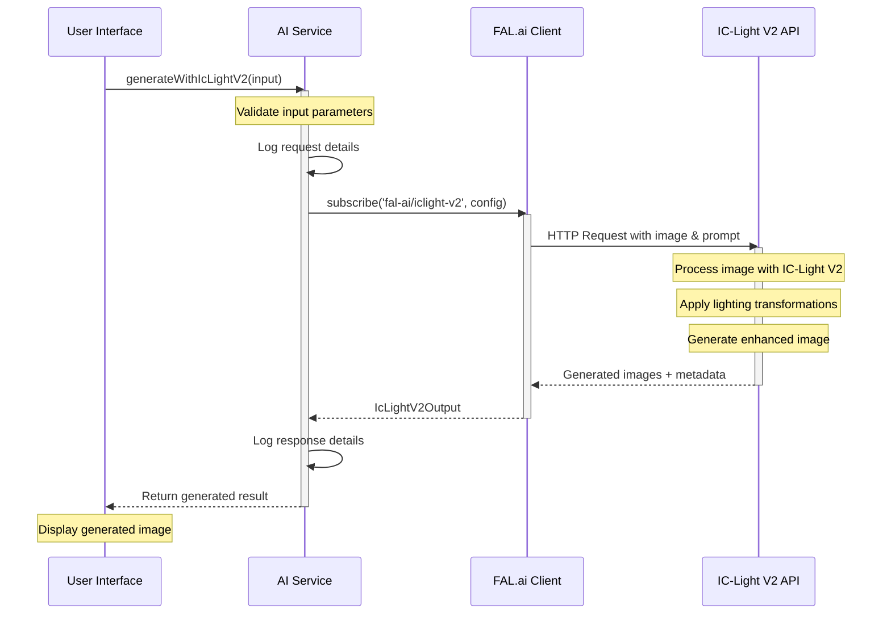
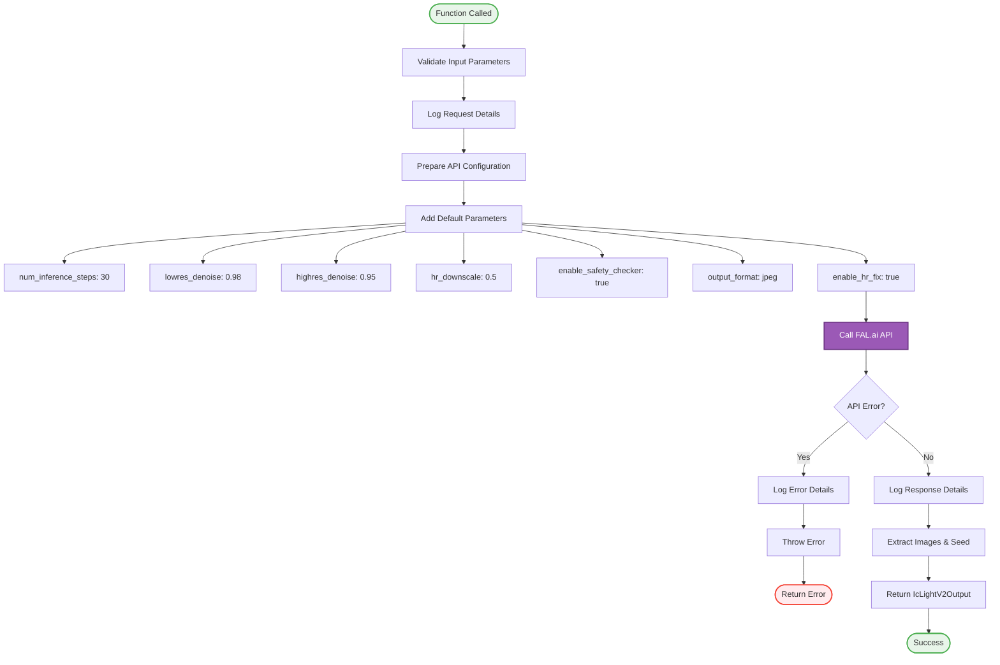
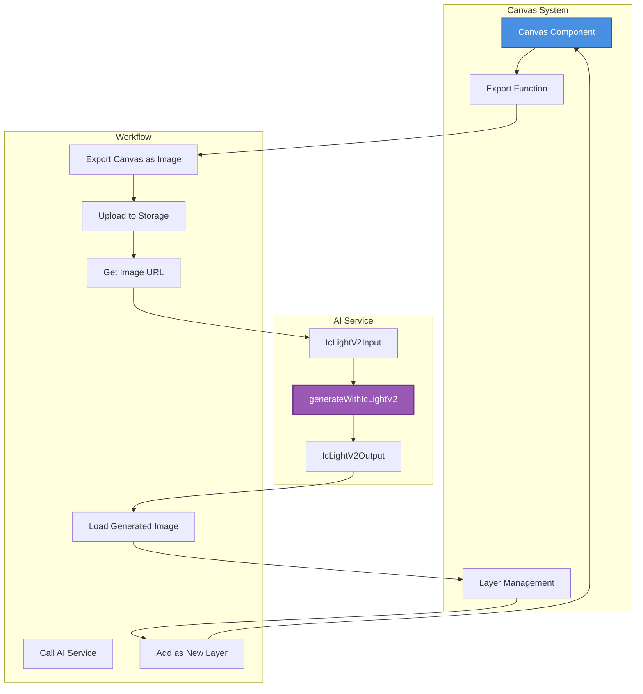
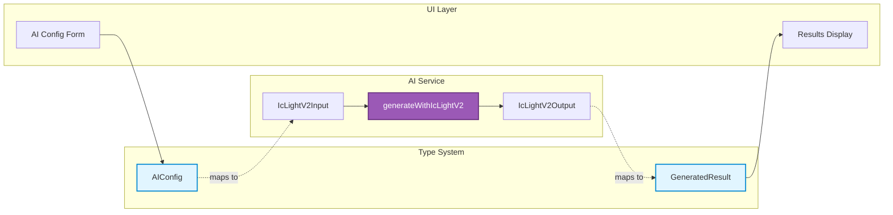
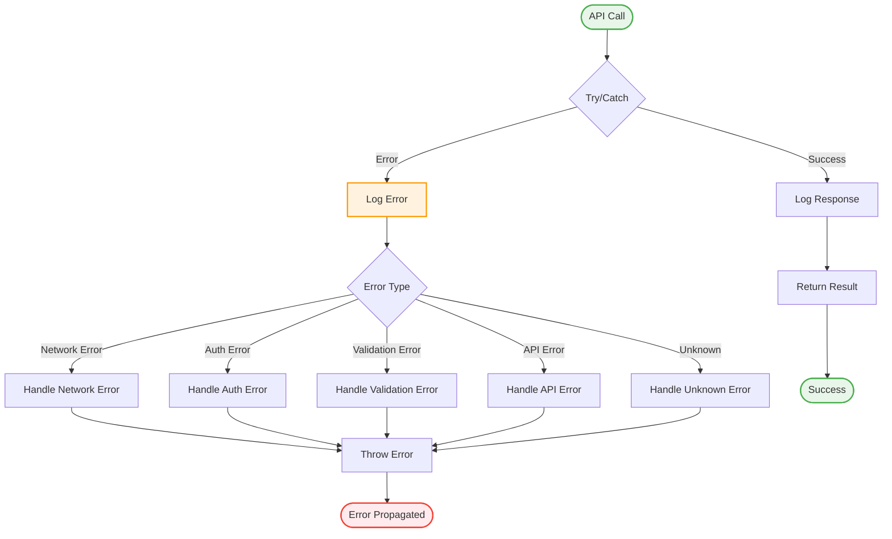
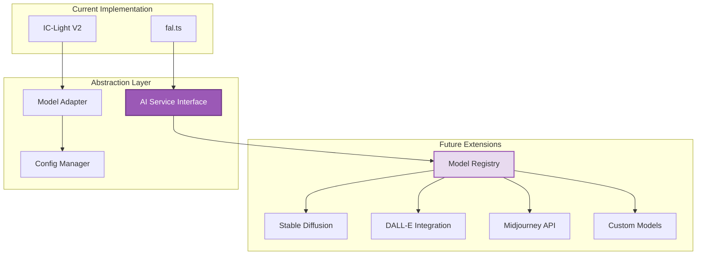
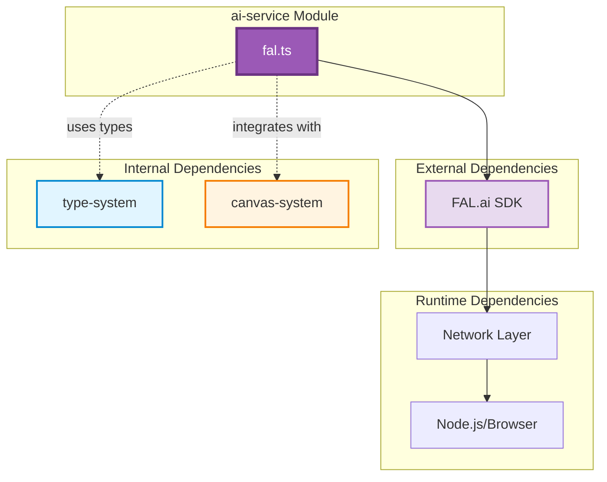

# AI Service Module

## Overview

The **ai-service** module provides AI-powered image generation and manipulation capabilities through integration with the FAL.ai platform. Specifically, it implements the IC-Light V2 model for intelligent image relighting and enhancement. This module acts as the bridge between the application and external AI services, enabling users to apply sophisticated AI-driven transformations to their images with natural language prompts.

The module is built around the `fal.ts` service file, which encapsulates all interactions with the FAL.ai API, providing a clean, type-safe interface for AI image generation operations.

## Architecture

### High-Level Architecture



### Service Architecture



### Data Flow



## Core Components

### 1. IcLightV2Input Interface

**Purpose**: Defines the input parameters for IC-Light V2 image generation requests.

**Type Definition**:
```typescript
interface IcLightV2Input {
  image_url: string;
  prompt: string;
  negative_prompt?: string;
  initial_latent?: 'None' | 'Left' | 'Right' | 'Top' | 'Bottom';
  cfg?: number;
  background_threshold?: number;
  image_size?: 'square_hd' | 'square' | 'portrait_4_3' | 'portrait_16_9' | 
                'landscape_4_3' | 'landscape_16_9';
  num_images?: number;
  seed?: number;
}
```

**Properties**:

| Property | Type | Required | Description |
|----------|------|----------|-------------|
| `image_url` | `string` | Yes | URL of the source image to be processed |
| `prompt` | `string` | Yes | Natural language description of desired lighting/effects |
| `negative_prompt` | `string` | No | Description of unwanted features or effects |
| `initial_latent` | `'None' \| 'Left' \| 'Right' \| 'Top' \| 'Bottom'` | No | Initial latent direction for generation |
| `cfg` | `number` | No | Classifier-free guidance scale (controls prompt adherence) |
| `background_threshold` | `number` | No | Threshold for background separation |
| `image_size` | `string` | No | Output image dimensions preset |
| `num_images` | `number` | No | Number of variations to generate |
| `seed` | `number` | No | Random seed for reproducible results |

**Relationship to Type System**:
- Maps to `AIConfig` from [type-system](type-system.md) for UI configuration
- Extends base AI configuration with IC-Light V2 specific parameters

### 2. IcLightV2Output Interface

**Purpose**: Defines the structure of responses from IC-Light V2 generation requests.

**Type Definition**:
```typescript
interface IcLightV2Output {
  images: Array<{
    url: string;
  }>;
  seed: number;
}
```

**Properties**:

| Property | Type | Description |
|----------|------|-------------|
| `images` | `Array<{ url: string }>` | Array of generated image objects with URLs |
| `seed` | `number` | Random seed used for generation (for reproducibility) |

**Relationship to Type System**:
- Maps to `GeneratedResult` from [type-system](type-system.md) for result storage
- Provides image URLs that can be loaded into [canvas-system](canvas-system.md)

### 3. generateWithIcLightV2 Function

**Purpose**: Main service function that orchestrates AI image generation through the FAL.ai platform.

**Signature**:
```typescript
const generateWithIcLightV2 = async (
  input: IcLightV2Input
): Promise<IcLightV2Output>
```

**Functionality**:



**Parameters**:
- `input`: IcLightV2Input object containing all generation parameters

**Returns**:
- `Promise<IcLightV2Output>`: Generated images and metadata

**Default Configuration**:
The function automatically applies the following default parameters:

| Parameter | Value | Purpose |
|-----------|-------|---------|
| `num_inference_steps` | 30 | Number of denoising steps |
| `lowres_denoise` | 0.98 | Low-resolution denoising strength |
| `highres_denoise` | 0.95 | High-resolution denoising strength |
| `hr_downscale` | 0.5 | High-resolution downscale factor |
| `enable_safety_checker` | true | Enable content safety filtering |
| `output_format` | 'jpeg' | Output image format |
| `enable_hr_fix` | true | Enable high-resolution fix |

**Error Handling**:
- Catches and logs all API errors
- Re-throws errors for upstream handling
- Provides detailed error context in console logs

## Integration Points

### Integration with Canvas System



**Integration Flow**:
1. User exports current canvas state as image
2. Image is uploaded to accessible storage
3. Image URL is passed to `generateWithIcLightV2` with user prompt
4. Generated result is loaded as new layer in canvas
5. User can compare, blend, or further edit the result

See [canvas-system](canvas-system.md) for detailed canvas operations.

### Integration with Type System



**Type Mappings**:

**AIConfig → IcLightV2Input**:
```typescript
// UI configuration (from type-system)
const aiConfig: AIConfig = {
  prompt: "dramatic sunset lighting",
  negative_prompt: "dark, shadows",
  initial_latent: "Top",
  cfg: 7.5,
  background_threshold: 0.5,
  image_size: "landscape_16_9",
  num_images: 1
};

// Maps to AI service input
const input: IcLightV2Input = {
  image_url: canvasImageUrl,
  ...aiConfig
};
```

**IcLightV2Output → GeneratedResult**:
```typescript
// AI service output
const output: IcLightV2Output = {
  images: [{ url: "https://..." }],
  seed: 12345
};

// Maps to application result (from type-system)
const result: GeneratedResult = {
  imageUrl: output.images[0].url,
  timestamp: new Date().toISOString()
};
```

See [type-system](type-system.md) for complete type definitions.

## API Configuration

### FAL Client Initialization

The module initializes the FAL.ai client with authentication credentials:

```typescript
fal.config({
  credentials: '[redacted]'
});
```

**Security Considerations**:
- ⚠️ Credentials are currently hardcoded in the source
- **Recommendation**: Move to environment variables for production
- Consider implementing credential rotation
- Use server-side proxy for API calls in production

### API Endpoint

The service uses the FAL.ai subscription model:
- **Model**: `fal-ai/iclight-v2`
- **Method**: `fal.subscribe()`
- **Protocol**: Asynchronous subscription with promise-based response

## Usage Examples

### Basic Image Generation

```typescript
import { generateWithIcLightV2 } from './services/fal';

// Basic usage with minimal parameters
const result = await generateWithIcLightV2({
  image_url: 'https://example.com/image.jpg',
  prompt: 'soft natural lighting from the left'
});

console.log('Generated image:', result.images[0].url);
console.log('Seed for reproduction:', result.seed);
```

### Advanced Configuration

```typescript
// Advanced usage with full parameter control
const result = await generateWithIcLightV2({
  image_url: 'https://example.com/portrait.jpg',
  prompt: 'dramatic cinematic lighting, golden hour, rim light',
  negative_prompt: 'flat lighting, overexposed, washed out',
  initial_latent: 'Left',
  cfg: 8.5,
  background_threshold: 0.7,
  image_size: 'portrait_4_3',
  num_images: 3,
  seed: 42 // For reproducible results
});

// Process multiple generated variations
result.images.forEach((img, index) => {
  console.log(`Variation ${index + 1}:`, img.url);
});
```

### Integration with Canvas

```typescript
import { generateWithIcLightV2 } from './services/fal';
import { CanvasRef } from './components/Canvas/Canvas';

async function enhanceCanvasWithAI(
  canvasRef: React.RefObject<CanvasRef>,
  prompt: string
) {
  // Export current canvas state
  const canvasImageUrl = await canvasRef.current?.exportAsImage();
  
  if (!canvasImageUrl) {
    throw new Error('Failed to export canvas');
  }
  
  // Generate AI-enhanced version
  const result = await generateWithIcLightV2({
    image_url: canvasImageUrl,
    prompt: prompt,
    image_size: 'landscape_16_9',
    cfg: 7.5
  });
  
  // Load result back into canvas as new layer
  const generatedUrl = result.images[0].url;
  await canvasRef.current?.addImageLayer(generatedUrl);
  
  return result;
}
```

### Error Handling Pattern

```typescript
import { generateWithIcLightV2 } from './services/fal';

async function safeGenerate(input: IcLightV2Input) {
  try {
    const result = await generateWithIcLightV2(input);
    return { success: true, data: result };
  } catch (error) {
    console.error('AI generation failed:', error);
    
    // Handle specific error types
    if (error instanceof TypeError) {
      return { success: false, error: 'Invalid input parameters' };
    }
    
    if (error.message?.includes('network')) {
      return { success: false, error: 'Network connection failed' };
    }
    
    return { success: false, error: 'AI service unavailable' };
  }
}
```

## Logging and Debugging

The module implements comprehensive logging for debugging and monitoring:

### Request Logging

```typescript
console.log('Calling FAL iclight-v2 with input:', {
  ...input,
  image_url: input.image_url.substring(0, 100) + '...'
});
```

**Logged Information**:
- All input parameters
- Truncated image URL (first 100 characters for readability)
- Timestamp of request

### Response Logging

```typescript
console.log('FAL API response:', {
  seed: result.seed,
  imageCount: result.images?.length || 0,
  firstImageUrl: result.images?.[0]?.url
});
```

**Logged Information**:
- Random seed used
- Number of images generated
- URL of first generated image
- Response timestamp

### Error Logging

```typescript
console.error('FAL API error:', error);
```

**Logged Information**:
- Complete error object
- Stack trace
- Error message and code

## Performance Considerations

### Asynchronous Processing

```mermaid
gantt
    title AI Generation Timeline
    dateFormat X
    axisFormat %S
    
    section Request
    Prepare Input     :0, 1
    Upload Image      :1, 3
    
    section API Call
    Send Request      :3, 4
    Queue Processing  :4, 6
    
    section AI Processing
    Model Inference   :6, 20
    Post-processing   :20, 23
    
    section Response
    Download Result   :23, 26
    Load into Canvas  :26, 28
```



**Typical Processing Times**:
- Input preparation: < 1 second
- API request/response: 1-3 seconds
- AI model inference: 10-20 seconds (varies by complexity)
- Total time: 15-30 seconds per generation

**Optimization Strategies**:
1. **Caching**: Store generated results with seed for reproducibility
2. **Batch Processing**: Generate multiple variations in single request
3. **Progressive Loading**: Show preview while processing
4. **Background Processing**: Use Web Workers for non-blocking operations

### Resource Management

**Memory Considerations**:
- Generated images are returned as URLs (minimal memory footprint)
- Original images should be cleaned up after processing
- Consider implementing image compression for large canvases

**Network Optimization**:
- Compress images before upload when possible
- Use appropriate image_size parameter to balance quality and speed
- Implement request queuing for multiple generations

## Error Handling

### Error Types and Handling



### Common Error Scenarios

| Error Type | Cause | Handling Strategy |
|------------|-------|-------------------|
| **Network Error** | Connection timeout, DNS failure | Retry with exponential backoff |
| **Authentication Error** | Invalid credentials | Check API key configuration |
| **Validation Error** | Invalid input parameters | Validate input before API call |
| **Rate Limit Error** | Too many requests | Implement request throttling |
| **API Error** | Service unavailable | Show user-friendly error message |
| **Timeout Error** | Processing took too long | Increase timeout or reduce complexity |

### Error Recovery Pattern

```typescript
async function generateWithRetry(
  input: IcLightV2Input,
  maxRetries: number = 3
): Promise<IcLightV2Output> {
  let lastError: Error;
  
  for (let attempt = 1; attempt <= maxRetries; attempt++) {
    try {
      return await generateWithIcLightV2(input);
    } catch (error) {
      lastError = error;
      console.warn(`Attempt ${attempt} failed:`, error);
      
      // Don't retry on validation errors
      if (error.message?.includes('validation')) {
        throw error;
      }
      
      // Wait before retry (exponential backoff)
      if (attempt < maxRetries) {
        await new Promise(resolve => 
          setTimeout(resolve, Math.pow(2, attempt) * 1000)
        );
      }
    }
  }
  
  throw lastError;
}
```

## Future Enhancements

### Planned Features

1. **Multiple AI Model Support**
   - Add support for other FAL.ai models
   - Implement model selection interface
   - Create unified API abstraction

2. **Advanced Configuration**
   - Expose more IC-Light V2 parameters
   - Add preset configurations for common use cases
   - Implement parameter validation

3. **Performance Optimization**
   - Implement request caching
   - Add progress tracking for long operations
   - Support batch processing

4. **Enhanced Error Handling**
   - Implement automatic retry logic
   - Add detailed error messages
   - Create fallback strategies

5. **Security Improvements**
   - Move credentials to environment variables
   - Implement server-side API proxy
   - Add request signing and validation

### Extensibility Points



## Best Practices

### Input Validation

```typescript
function validateInput(input: IcLightV2Input): void {
  // Validate required fields
  if (!input.image_url || !input.prompt) {
    throw new Error('image_url and prompt are required');
  }
  
  // Validate URL format
  try {
    new URL(input.image_url);
  } catch {
    throw new Error('Invalid image_url format');
  }
  
  // Validate numeric ranges
  if (input.cfg !== undefined && (input.cfg < 1 || input.cfg > 20)) {
    throw new Error('cfg must be between 1 and 20');
  }
  
  if (input.background_threshold !== undefined && 
      (input.background_threshold < 0 || input.background_threshold > 1)) {
    throw new Error('background_threshold must be between 0 and 1');
  }
}
```

### Prompt Engineering

**Effective Prompts**:
- Be specific about lighting direction and quality
- Include style descriptors (cinematic, natural, dramatic)
- Mention color temperature (warm, cool, golden hour)
- Specify intensity (soft, harsh, subtle)

**Example Good Prompts**:
```typescript
// Portrait lighting
"soft diffused lighting from the right, warm golden hour tones, gentle rim light"

// Product photography
"clean studio lighting, white background, even illumination, professional"

// Dramatic scene
"dramatic side lighting, high contrast, moody atmosphere, cinematic"
```

### Resource Cleanup

```typescript
async function generateAndCleanup(input: IcLightV2Input) {
  let tempImageUrl: string | null = null;
  
  try {
    // Generate temporary image URL if needed
    tempImageUrl = await uploadTemporaryImage(input.image_url);
    
    // Use temporary URL for generation
    const result = await generateWithIcLightV2({
      ...input,
      image_url: tempImageUrl
    });
    
    return result;
  } finally {
    // Always cleanup temporary resources
    if (tempImageUrl) {
      await deleteTemporaryImage(tempImageUrl);
    }
  }
}
```

## Testing Considerations

### Unit Testing

```typescript
import { generateWithIcLightV2 } from './fal';
import * as fal from '@fal-ai/serverless-client';

jest.mock('@fal-ai/serverless-client');

describe('AI Service', () => {
  it('should call FAL API with correct parameters', async () => {
    const mockResult = {
      images: [{ url: 'https://example.com/result.jpg' }],
      seed: 12345
    };
    
    (fal.subscribe as jest.Mock).mockResolvedValue(mockResult);
    
    const input = {
      image_url: 'https://example.com/input.jpg',
      prompt: 'test prompt'
    };
    
    const result = await generateWithIcLightV2(input);
    
    expect(fal.subscribe).toHaveBeenCalledWith(
      'fal-ai/iclight-v2',
      expect.objectContaining({
        input: expect.objectContaining({
          image_url: input.image_url,
          prompt: input.prompt
        })
      })
    );
    
    expect(result).toEqual(mockResult);
  });
});
```

### Integration Testing

```typescript
describe('AI Service Integration', () => {
  it('should generate image from canvas export', async () => {
    // Setup canvas with test image
    const canvas = createTestCanvas();
    const exportedUrl = await canvas.exportAsImage();
    
    // Generate with AI
    const result = await generateWithIcLightV2({
      image_url: exportedUrl,
      prompt: 'test lighting'
    });
    
    // Verify result
    expect(result.images).toHaveLength(1);
    expect(result.images[0].url).toMatch(/^https?:\/\//);
    expect(result.seed).toBeGreaterThan(0);
  });
});
```

## Related Documentation

- **[type-system](type-system.md)**: Core type definitions including AIConfig and GeneratedResult
- **[canvas-system](canvas-system.md)**: Canvas integration and image layer management
- **[SmartDesign](SmartDesign.md)**: Overall system architecture and component relationships

## Dependencies

### External Libraries

- **@fal-ai/serverless-client**: FAL.ai SDK for API communication
  - Version: Latest
  - Purpose: AI model inference and management
  - Documentation: https://fal.ai/docs

### Internal Dependencies

- **type-system**: Type definitions for AI configuration and results
- **canvas-system**: Canvas export and image loading capabilities

### Dependency Graph



## Conclusion

The **ai-service** module provides a robust, type-safe interface for AI-powered image generation and enhancement. By encapsulating the complexity of external AI service integration, it enables the application to offer sophisticated image manipulation capabilities through simple, intuitive APIs. The module's clean architecture and comprehensive error handling make it a reliable foundation for AI-driven features, while its extensibility points ensure it can grow to support additional AI models and capabilities in the future.
