# Canvas System Module

## Overview

The **canvas-system** module provides a sophisticated image manipulation and composition interface built on top of Konva.js and React. It enables users to upload, transform, layer, and edit images with real-time visual feedback through an interactive canvas workspace. The module serves as the core visual editing engine of the application, offering professional-grade image manipulation capabilities including transformations, filters, and layer management.

## Architecture

### High-Level Architecture

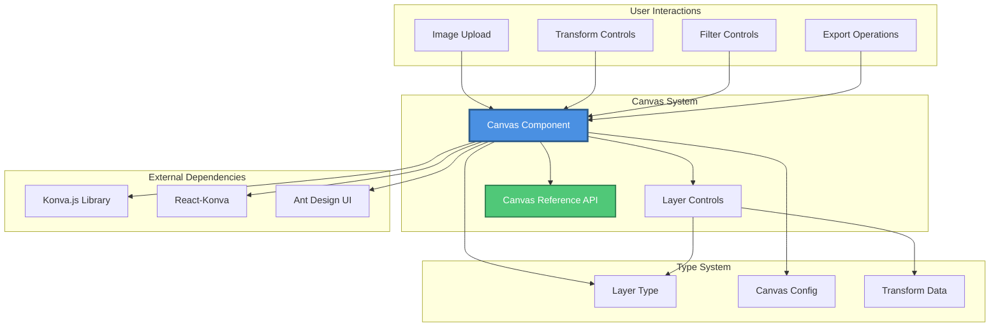

### Component Architecture

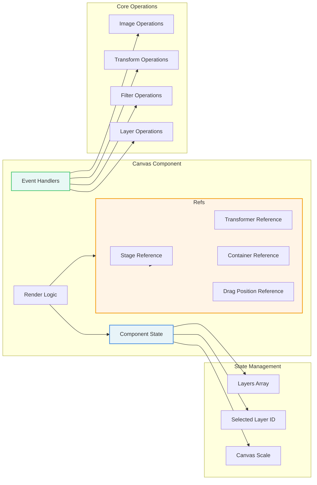

## Core Components

### CanvasRef Interface

The `CanvasRef` interface provides imperative access to canvas operations from parent components.

```typescript
export interface CanvasRef {
  getDataUrl: () => string | null;
}
```

**Purpose**: Exposes canvas export functionality to parent components through React's `forwardRef` and `useImperativeHandle` pattern.

**Key Method**:
- `getDataUrl()`: Exports the current canvas state as a base64-encoded PNG data URL with high quality (2x pixel ratio)

### Canvas Component

The main Canvas component is a complex React component that manages the entire image editing workspace.

**Props**:
```typescript
interface CanvasProps {
  config: CanvasConfig;
}
```

**Key Features**:
- Multi-layer image composition
- Real-time transformations (move, scale, rotate)
- Image filters (brightness, contrast, saturation, hue)
- Layer management (add, delete, duplicate, reorder)
- Responsive canvas scaling
- Keyboard shortcuts support
- High-quality export

## Data Flow

### Image Upload Flow

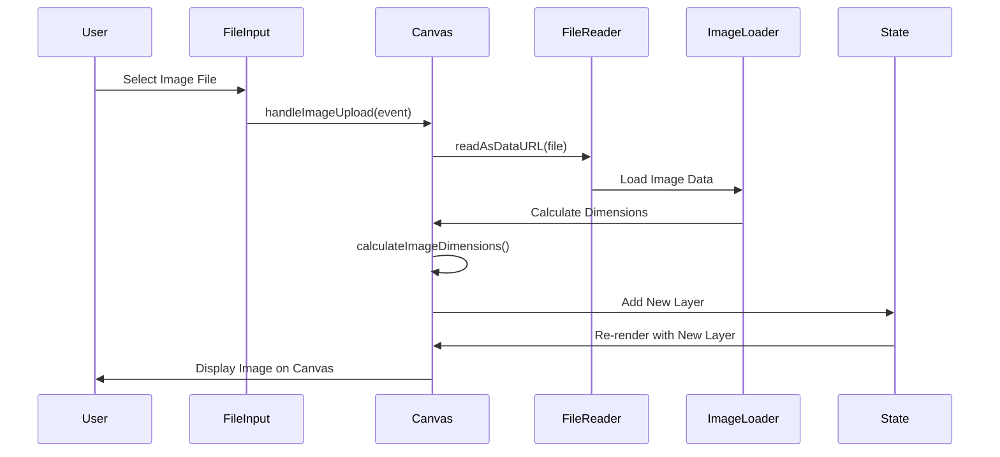

### Transform Operation Flow

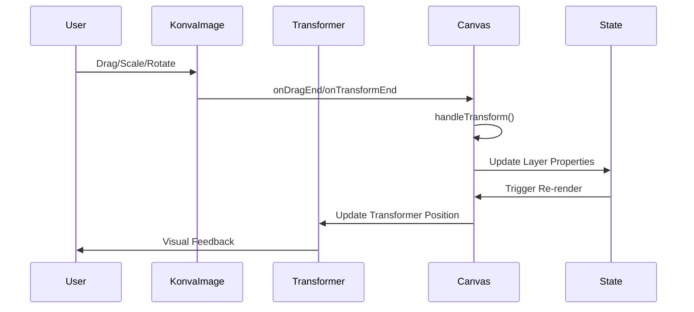

### Layer Selection Flow

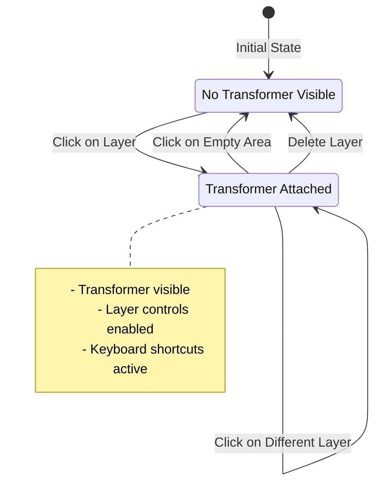

## State Management

### Component State Structure

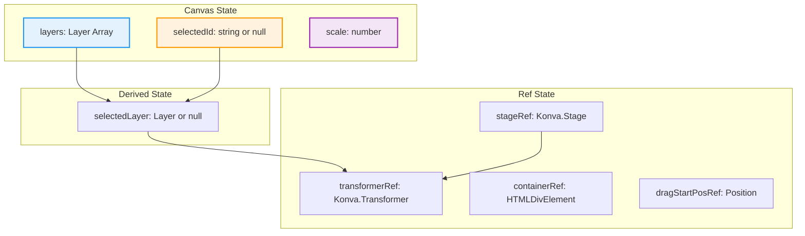

### State Update Patterns

**Layer Updates**:
```typescript
// Immutable update pattern used throughout
setLayers(prev => prev.map(layer => 
  layer.id === selectedId
    ? { ...layer, ...updates }
    : layer
));
```

**Selection Management**:
```typescript
// Selection triggers transformer attachment
useEffect(() => {
  if (!selectedId) {
    transformerRef.current?.nodes([]);
    return;
  }
  
  const node = stageRef.current.findOne('#' + selectedId);
  if (node) {
    transformerRef.current.nodes([node]);
  }
}, [selectedId]);
```

## Core Operations

### Image Operations

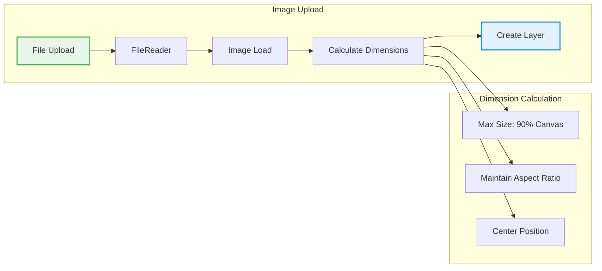

**Key Algorithm - Image Dimension Calculation**:
```typescript
calculateImageDimensions(imageWidth, imageHeight) {
  const maxWidth = config.width * 0.9;
  const maxHeight = config.height * 0.9;
  
  let newWidth = imageWidth;
  let newHeight = imageHeight;
  const aspectRatio = imageWidth / imageHeight;

  // Scale down if exceeds canvas bounds
  if (imageWidth > maxWidth || imageHeight > maxHeight) {
    if (maxWidth / maxHeight > aspectRatio) {
      newHeight = maxHeight;
      newWidth = maxHeight * aspectRatio;
    } else {
      newWidth = maxWidth;
      newHeight = maxWidth / aspectRatio;
    }
  }

  // Center on canvas
  return {
    width: newWidth,
    height: newHeight,
    scaleX: 1,
    scaleY: 1,
    x: (config.width - newWidth) / 2,
    y: (config.height - newHeight) / 2
  };
}
```

### Transform Operations

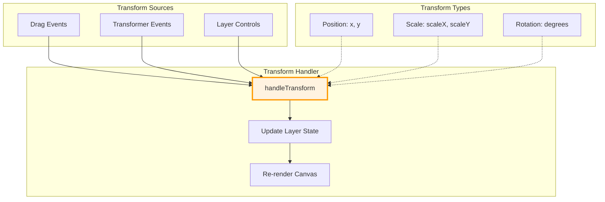

**Transform Handler Implementation**:
```typescript
const handleTransform = useCallback((transform: Partial<LayerType>) => {
  if (!selectedId) return;
  
  setLayers(prev => prev.map(layer => 
    layer.id === selectedId
      ? { ...layer, ...transform }
      : layer
  ));
}, [selectedId]);
```

### Filter Operations

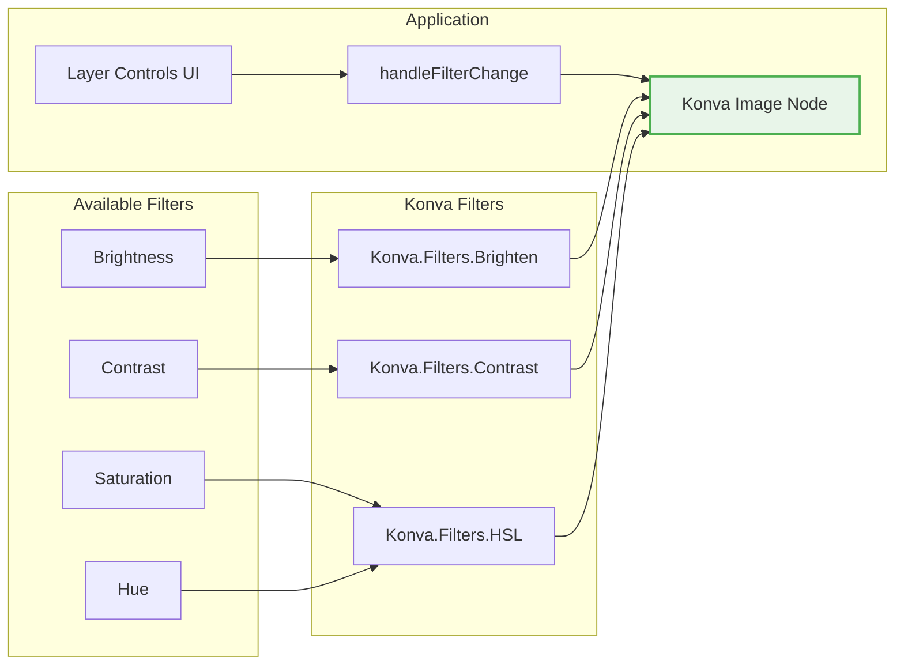

### Layer Management Operations

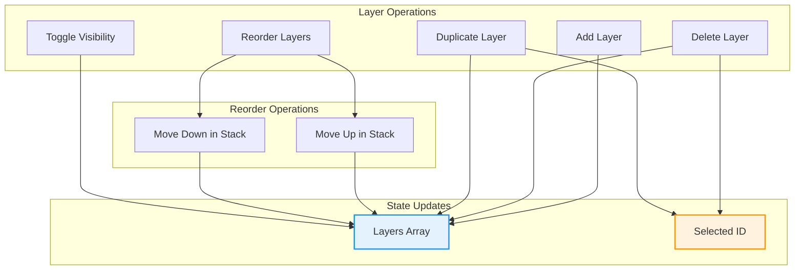

**Layer Reordering Algorithm**:
```typescript
// Move layer up in z-index
handleMoveUp() {
  const index = layers.findIndex(l => l.id === selectedId);
  if (index < layers.length - 1) {
    const newLayers = [...layers];
    [newLayers[index], newLayers[index + 1]] = 
      [newLayers[index + 1], newLayers[index]];
    setLayers(newLayers);
  }
}

// Move layer down in z-index
handleMoveDown() {
  const index = layers.findIndex(l => l.id === selectedId);
  if (index > 0) {
    const newLayers = [...layers];
    [newLayers[index], newLayers[index - 1]] = 
      [newLayers[index - 1], newLayers[index]];
    setLayers(newLayers);
  }
}
```

## Export System

### Export Process Flow

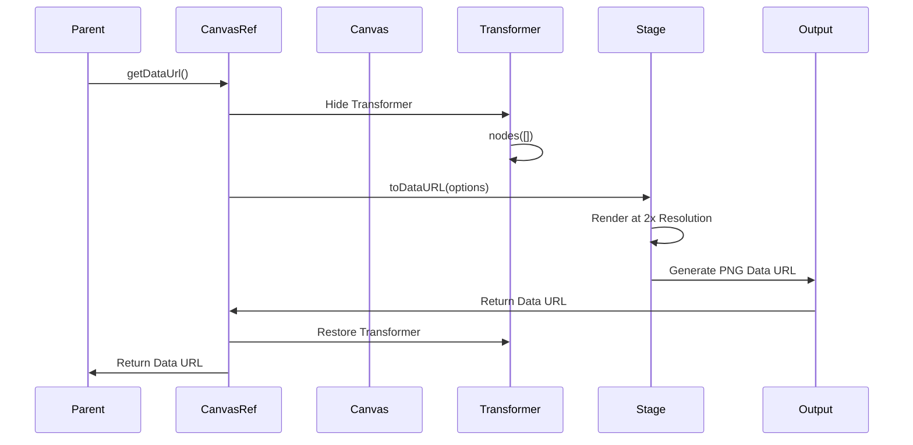

**Export Configuration**:
```typescript
{
  pixelRatio: 2,      // 2x resolution for high quality
  mimeType: 'image/png',
  quality: 1          // Maximum quality
}
```

### Export Features

- **High Resolution**: 2x pixel ratio for crisp output
- **Clean Export**: Transformer controls hidden during export
- **State Preservation**: Transformer restored after export
- **Format**: PNG with maximum quality
- **Transparency**: Supports transparent backgrounds

## Responsive Design

### Canvas Scaling System

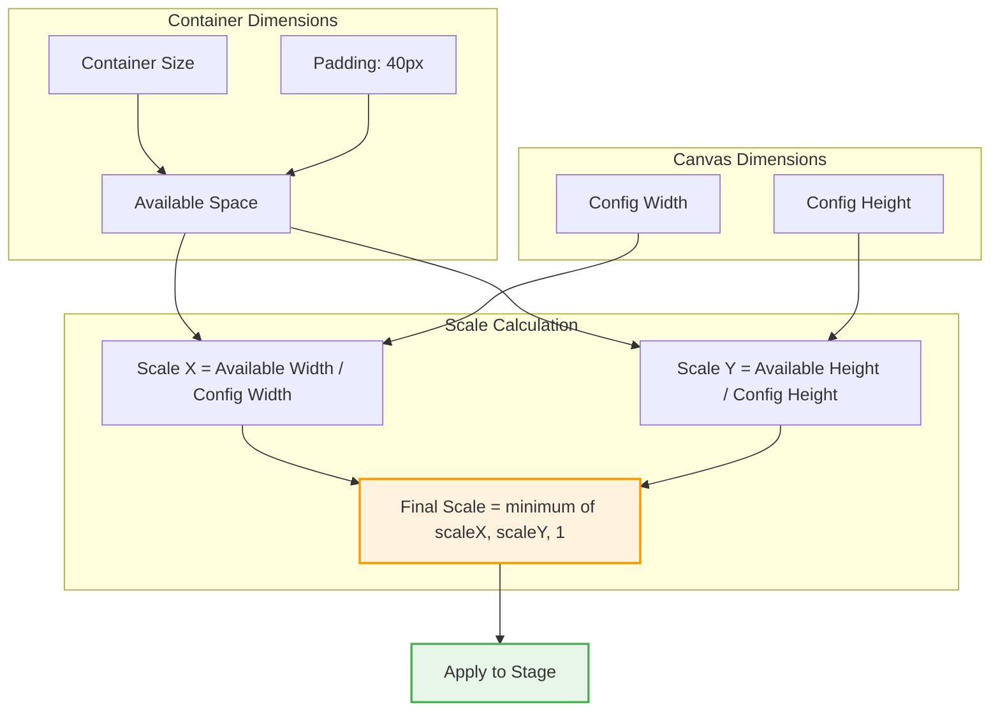

**Scaling Implementation**:
```typescript
useEffect(() => {
  if (containerRef.current) {
    const padding = 40;
    const containerWidth = containerRef.current.offsetWidth - padding;
    const containerHeight = containerRef.current.offsetHeight - padding;
    const scaleX = containerWidth / config.width;
    const scaleY = containerHeight / config.height;
    const newScale = Math.min(scaleX, scaleY, 1);
    setScale(newScale);
  }
}, [config.width, config.height]);
```

## User Interactions

### Interaction Flow Map

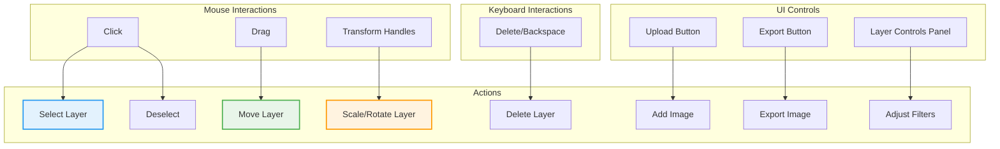

### Keyboard Shortcuts

| Shortcut | Action |
|----------|--------|
| `Delete` / `Backspace` | Delete selected layer |

### Drag and Drop Behavior

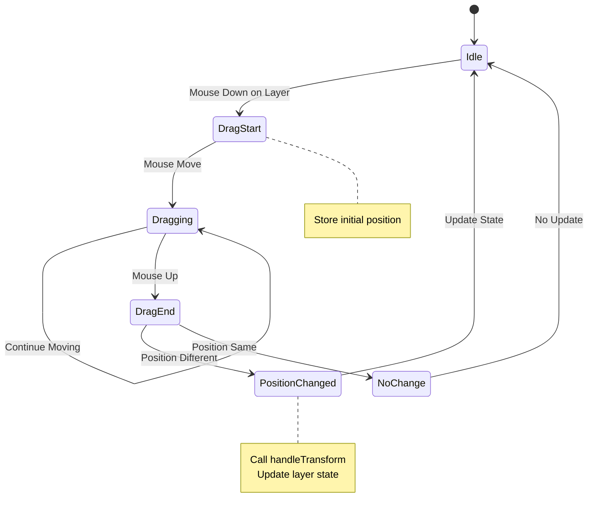

## Performance Optimizations

### Optimization Strategies

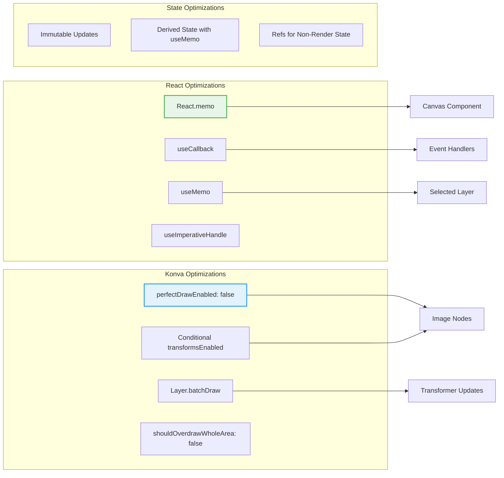

**Key Optimizations**:

1. **Component Memoization**: Entire Canvas wrapped in `React.memo`
2. **Callback Memoization**: All event handlers use `useCallback`
3. **Derived State**: `selectedLayer` computed with `useMemo`
4. **Konva Performance**:
   - `perfectDrawEnabled: false` - Faster rendering
   - Conditional `transformsEnabled` - Only selected layer fully transformable
   - `shouldOverdrawWholeArea: false` - Optimized transformer rendering
5. **Ref Usage**: Non-render state (drag position) stored in refs

## Integration Points

### Type System Integration

The canvas-system heavily depends on types from the [type-system](type-system.md) module:

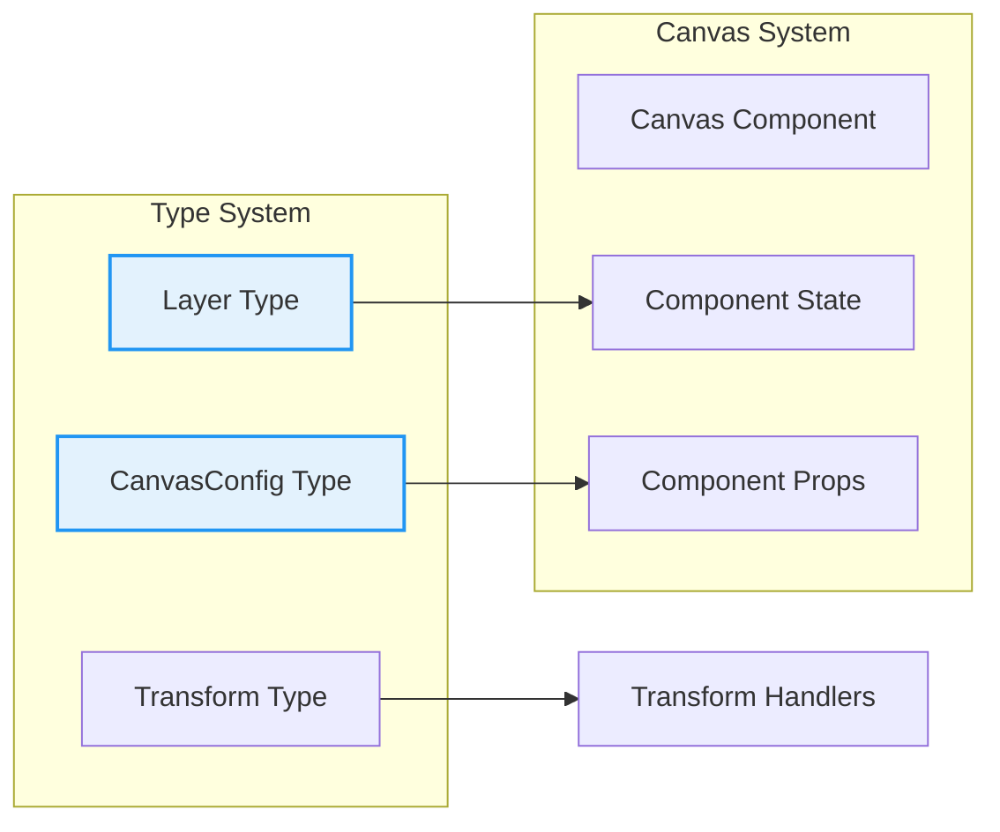

**Key Type Dependencies**:
- `Layer`: Defines the structure of each image layer with transform and filter properties
- `CanvasConfig`: Configures canvas dimensions and background
- Transform properties: Used in `handleTransform` operations

### External Library Dependencies

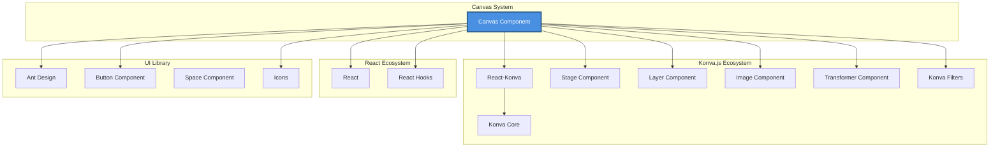

## Usage Example

### Basic Usage

```typescript
import Canvas, { CanvasRef } from './components/Canvas/Canvas';
import { CanvasConfig } from './types';

function App() {
  const canvasRef = useRef<CanvasRef>(null);
  
  const config: CanvasConfig = {
    width: 1024,
    height: 768,
    background: '#ffffff'
  };
  
  const handleExport = () => {
    const dataUrl = canvasRef.current?.getDataUrl();
    if (dataUrl) {
      // Use the exported image
      console.log('Exported:', dataUrl);
    }
  };
  
  return (
    <div>
      <Canvas ref={canvasRef} config={config} />
      <button onClick={handleExport}>Export Canvas</button>
    </div>
  );
}
```

### Advanced Usage with AI Integration

```typescript
import Canvas, { CanvasRef } from './components/Canvas/Canvas';
import { generateImage } from './services/fal';

function AIImageEditor() {
  const canvasRef = useRef<CanvasRef>(null);
  
  const handleAIGenerate = async () => {
    // Get current canvas state
    const currentImage = canvasRef.current?.getDataUrl();
    
    if (currentImage) {
      // Send to AI service for processing
      const result = await generateImage({
        image_url: currentImage,
        // ... other AI parameters
      });
      
      // Result can be loaded back into canvas
      console.log('AI processed:', result);
    }
  };
  
  return (
    <div>
      <Canvas ref={canvasRef} config={config} />
      <button onClick={handleAIGenerate}>AI Enhance</button>
    </div>
  );
}
```

## Component Lifecycle

### Lifecycle Flow

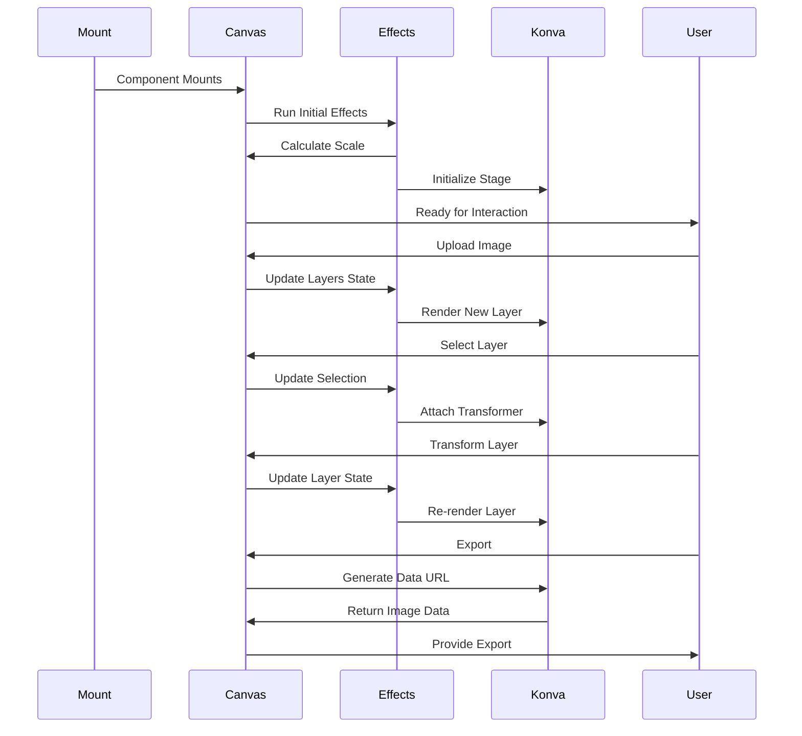

### Effect Dependencies

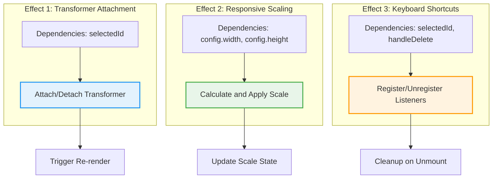

## Error Handling and Edge Cases

### Handled Edge Cases

```mermaid
graph TB
    subgraph "Transform Validation"
        MinSize[Minimum Size Check]
        BoundBox[Bound Box Validation]
    end
    
    subgraph "Selection Safety"
        NullCheck[Null Selection Check]
        NodeExists[Node Existence Check]
    end
    
    subgraph "Drag Optimization"
        PositionChange[Position Change Detection]
        NoUpdate[Skip Update if No Change]
    end
    
    subgraph "Export Safety"
        StageExists[Stage Existence Check]
        TransformerHide[Hide Transformer Before Export]
        TransformerRestore[Restore After Export]
    end
    
    MinSize --> Safe1[Prevent Invalid Transforms]
    BoundBox --> Safe1
    
    NullCheck --> Safe2[Prevent Null Reference Errors]
    NodeExists --> Safe2
    
    PositionChange --> Safe3[Optimize Performance]
    NoUpdate --> Safe3
    
    StageExists --> Safe4[Ensure Clean Export]
    TransformerHide --> Safe4
    TransformerRestore --> Safe4
    
    style Safe1 fill:#E8F5E9,stroke:#4CAF50,stroke-width:2px
    style Safe2 fill:#E8F5E9,stroke:#4CAF50,stroke-width:2px
    style Safe3 fill:#E8F5E9,stroke:#4CAF50,stroke-width:2px
    style Safe4 fill:#E8F5E9,stroke:#4CAF50,stroke-width:2px
```

**Key Safety Checks**:

1. **Transform Bounds**: Prevents layers from being scaled below 5x5 pixels
2. **Null Safety**: All operations check for `selectedId` existence
3. **Node Validation**: Verifies Konva nodes exist before manipulation
4. **Drag Optimization**: Only updates state if position actually changed
5. **Export Safety**: Ensures transformer is hidden and stage exists

## Future Enhancements

### Potential Improvements

```mermaid
mindmap
  root((Canvas System<br/>Enhancements))
    Performance
      Virtual Layer Rendering
      Web Workers for Filters
      Canvas Caching
      Lazy Loading
    Features
      Undo/Redo System
      Layer Groups
      Blend Modes
      Custom Filters
      Text Layers
      Shape Tools
    UX
      Touch Gestures
      Keyboard Shortcuts
      Context Menus
      Drag to Upload
      Layer Thumbnails
    Integration
      Cloud Storage
      Real-time Collaboration
      AI Filter Presets
      Template System
```

### Recommended Additions

1. **History Management**: Implement undo/redo with command pattern
2. **Layer Groups**: Support hierarchical layer organization
3. **Blend Modes**: Add Photoshop-style blend modes
4. **Performance**: Implement virtual rendering for many layers
5. **Collaboration**: Add real-time multi-user editing
6. **Templates**: Pre-configured canvas templates
7. **Gestures**: Touch and multi-touch support for mobile
8. **Accessibility**: Keyboard navigation and screen reader support

## Related Modules

- **[type-system](type-system.md)**: Provides core type definitions (`Layer`, `CanvasConfig`, `Transform`)
- **ai-service**: Can consume canvas exports for AI processing (see `CanvasRef.getDataUrl()`)

## Technical Specifications

### Browser Compatibility

- **Modern Browsers**: Chrome 90+, Firefox 88+, Safari 14+, Edge 90+
- **Required APIs**: Canvas API, FileReader API, Blob API
- **Optional APIs**: Clipboard API (for future copy/paste)

### Performance Characteristics

- **Layer Limit**: Recommended max 50 layers for optimal performance
- **Image Size**: Supports images up to 8192x8192 pixels
- **Export Time**: ~100-500ms depending on canvas size and layer count
- **Memory Usage**: ~50-200MB depending on image sizes and layer count

### Dependencies

```json
{
  "react": "^18.x",
  "react-konva": "^18.x",
  "konva": "^9.x",
  "antd": "^5.x"
}
```

## Conclusion

The canvas-system module provides a robust, performant, and feature-rich image editing interface. Built on Konva.js and React, it offers professional-grade capabilities while maintaining excellent performance through careful optimization. The module's clean API design (via `CanvasRef`) makes it easy to integrate with other systems, particularly AI services that can process canvas exports. Its comprehensive layer management, real-time transformations, and filter system make it suitable for a wide range of image editing applications.
