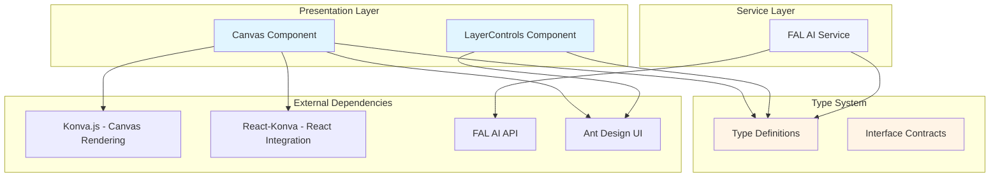
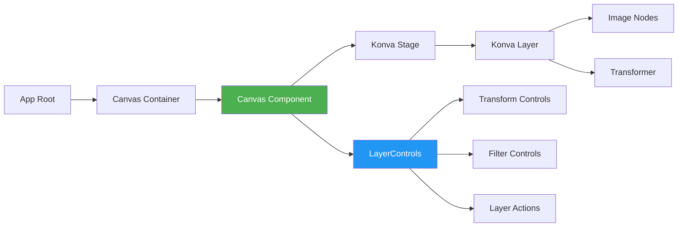
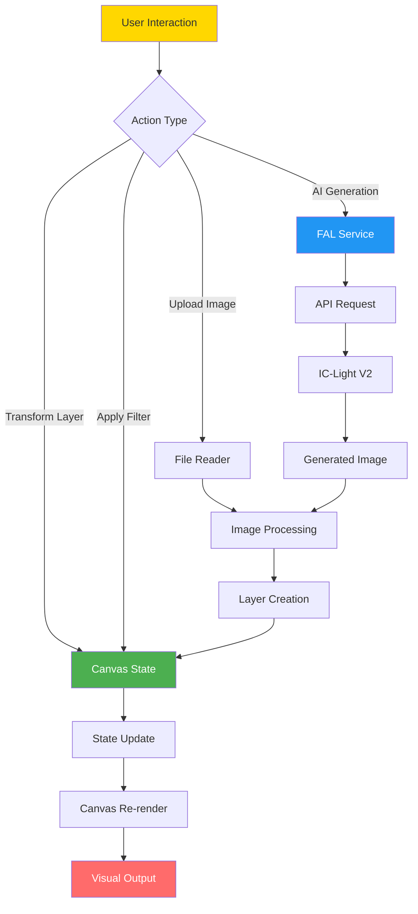
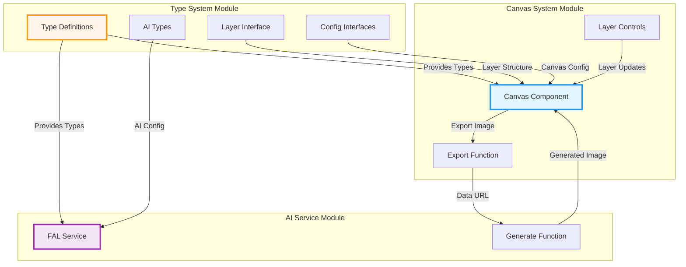
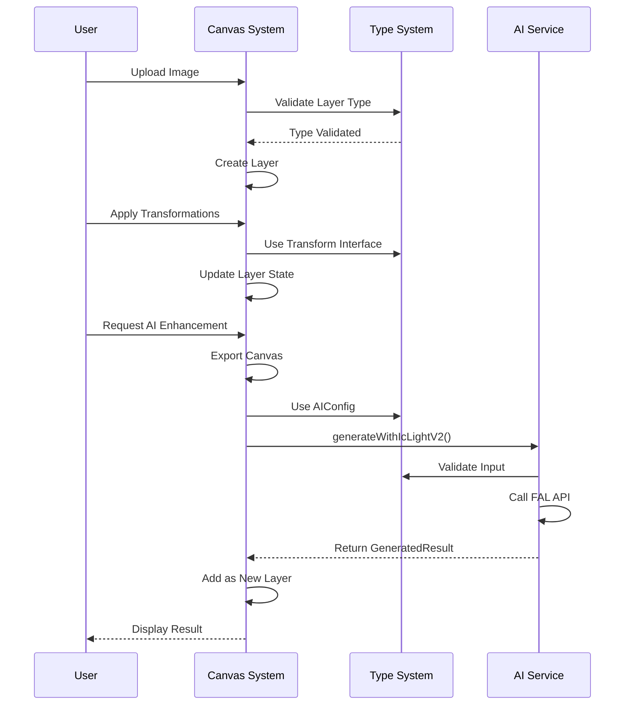
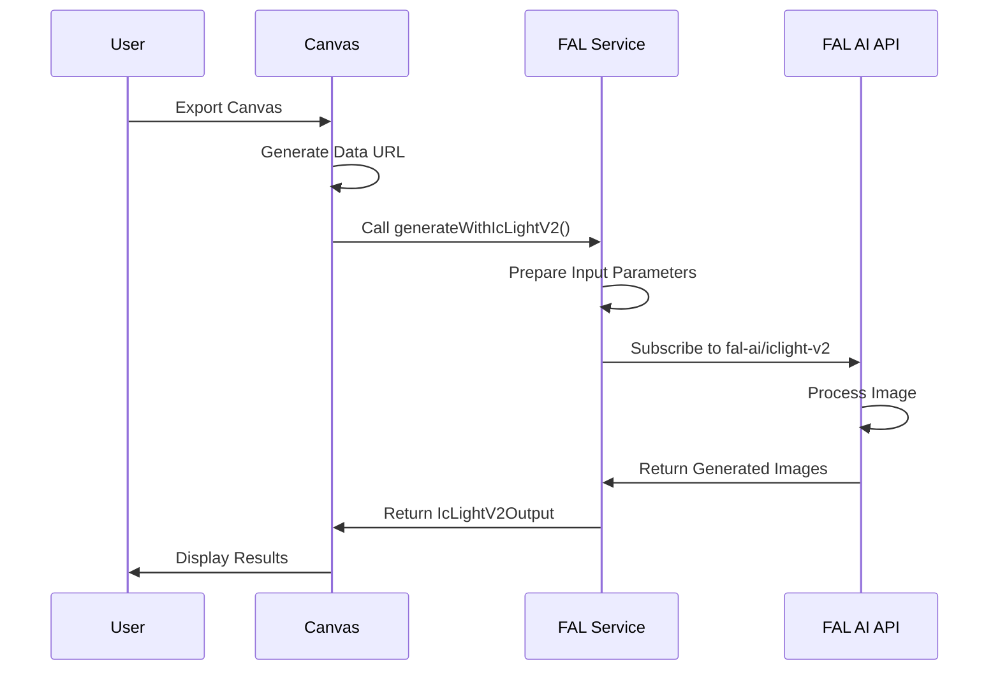
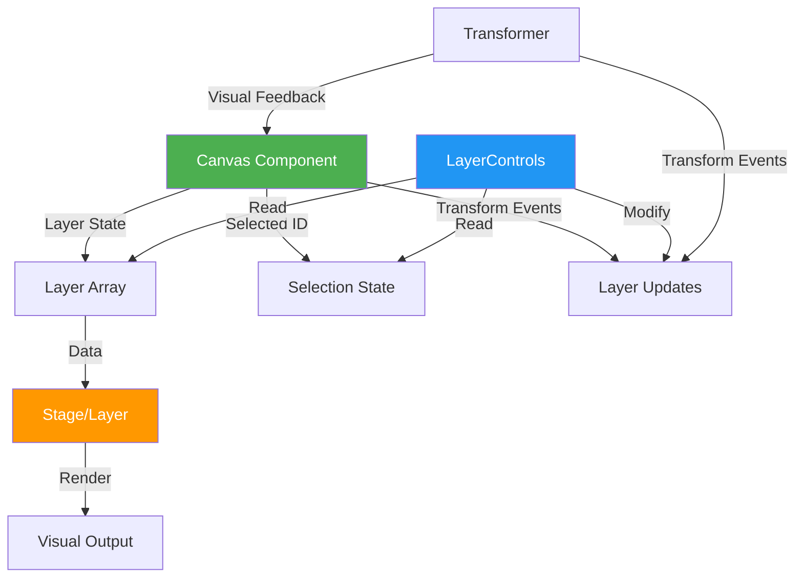
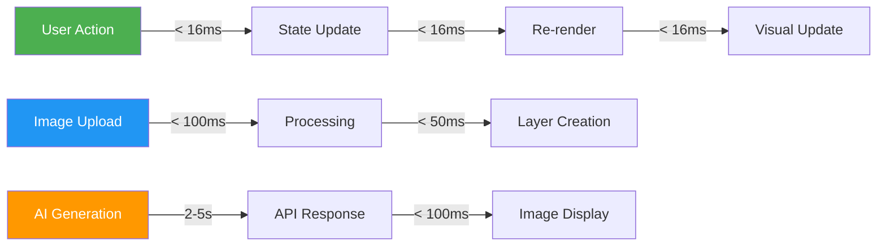
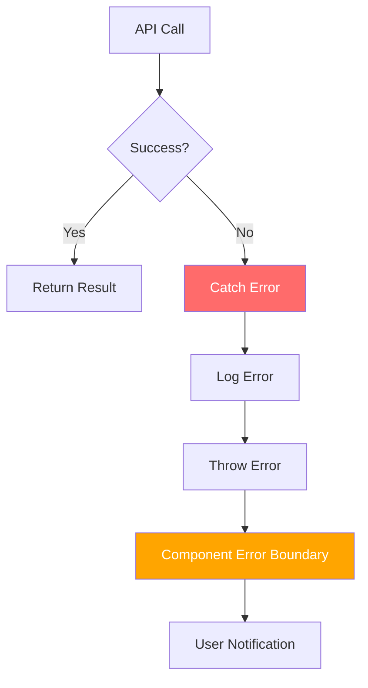

# SmartDesign Module Documentation

## Table of Contents

1. [Overview](#overview)
2. [Purpose](#purpose)
3. [Architecture Overview](#architecture-overview)
4. [System Architecture](#system-architecture)
   - [Component Hierarchy](#component-hierarchy)
   - [Data Flow Architecture](#data-flow-architecture)
5. [Module Structure](#module-structure)
   - [Type System](#1-type-system)
   - [Canvas System](#2-canvas-system)
   - [AI Service Integration](#3-ai-service-integration)
6. [Inter-Module Relationships](#inter-module-relationships)
7. [Key Features](#key-features)
   - [Layer Management](#layer-management)
   - [Image Transformations](#image-transformations)
   - [Image Filters](#image-filters)
   - [AI-Powered Features](#ai-powered-features)
8. [Technology Stack](#technology-stack)
9. [Integration Points](#integration-points)
10. [Performance Considerations](#performance-considerations)
11. [Usage Examples](#usage-examples)
12. [Error Handling](#error-handling)
13. [Future Enhancements](#future-enhancements)
14. [Dependencies](#dependencies)
15. [Configuration](#configuration)
16. [Troubleshooting](#troubleshooting)
17. [Best Practices](#best-practices)
18. [Related Modules](#related-modules)
19. [Conclusion](#conclusion)

---

## Overview

SmartDesign is an AI-powered image composition and editing application that enables users to create, manipulate, and enhance images through an interactive canvas interface. The module integrates with FAL AI's IC-Light V2 service to provide intelligent lighting and image generation capabilities, combined with a sophisticated layer-based editing system.

### Quick Start

```typescript
// 1. Import required components and types
import Canvas, { CanvasRef } from './components/Canvas/Canvas';
import { CanvasConfig, AIConfig } from './types';
import { generateWithIcLightV2 } from './services/fal';

// 2. Set up canvas configuration
const config: CanvasConfig = {
  width: 1024,
  height: 768,
  background: '#ffffff'
};

// 3. Create canvas reference
const canvasRef = useRef<CanvasRef>(null);

// 4. Render canvas
<Canvas ref={canvasRef} config={config} />

// 5. Export and enhance with AI
const handleAIEnhance = async () => {
  const dataUrl = canvasRef.current?.getDataUrl();
  if (dataUrl) {
    const result = await generateWithIcLightV2({
      image_url: dataUrl,
      prompt: "professional studio lighting",
      cfg: 7,
      num_images: 1
    });
    // Use result.images[0].url
  }
};
```

## Purpose

The SmartDesign module serves as a comprehensive image design tool that:
- Provides an interactive canvas for multi-layer image composition
- Enables real-time image transformations (position, rotation, scale, opacity)
- Offers advanced image filtering capabilities (brightness, contrast, saturation, hue)
- Integrates AI-powered image generation and lighting effects via FAL AI
- Supports image import/export functionality
- Delivers a professional-grade layer management system

## Architecture Overview

The SmartDesign module follows a modular architecture with clear separation of concerns:



## System Architecture

### Component Hierarchy



### Data Flow Architecture



## Module Structure

The SmartDesign module is organized into three main sub-modules, each with dedicated documentation:

### 1. [Type System](type-system.md)
**Purpose**: Defines the core data structures and interfaces used throughout the application.

**Key Components:**
- `Layer` - Represents individual image layers with transformation and filter properties
- `CanvasConfig` - Configuration for canvas dimensions and background
- `AIConfig` - Configuration for AI image generation parameters
- `GeneratedResult` - Structure for AI-generated image results
- `Transform` - Transformation properties for layer manipulation

**Responsibilities:**
- Type safety across the application
- Contract definitions for component interfaces
- Data structure standardization
- Interface consistency between modules

**Documentation**: See [Type System Module Documentation](type-system.md) for detailed type definitions, usage examples, and best practices.

---

### 2. [Canvas System](canvas-system.md)
**Purpose**: Implements the interactive canvas interface for image composition and editing.

**Key Components:**
- `Canvas` - Main canvas component with layer management and rendering
- `CanvasRef` - Imperative handle for canvas operations (export, state access)
- `LayerControls` - UI controls for layer manipulation and filtering

**Responsibilities:**
- Multi-layer image rendering with Konva.js
- Real-time transformations (drag, rotate, scale)
- Image filtering and effects (brightness, contrast, saturation, hue)
- Layer management (add, delete, duplicate, reorder, visibility)
- Export functionality with high-quality output
- User interaction handling and event management
- Performance optimization for smooth rendering

**Documentation**: See [Canvas System Module Documentation](canvas-system.md) for component architecture, interaction patterns, and implementation details.

---

### 3. [AI Service Integration](ai-service.md)
**Purpose**: Provides integration with FAL AI's IC-Light V2 service for intelligent image generation.

**Key Components:**
- `generateWithIcLightV2` - Main API integration function
- `IcLightV2Input` - Input parameters for AI generation
- `IcLightV2Output` - Output structure from AI service

**Responsibilities:**
- FAL AI client configuration and initialization
- API request handling with proper error management
- Image generation with intelligent lighting effects
- Background separation and threshold control
- Error handling and comprehensive logging
- Response transformation and validation

**Documentation**: See [AI Service Module Documentation](ai-service.md) for API integration details, configuration options, and usage patterns.

---

## Inter-Module Relationships

The three sub-modules work together to provide a cohesive image editing experience:



### Data Flow Between Modules



### Module Dependencies

| Module | Depends On | Provides To |
|--------|-----------|-------------|
| **Type System** | None (Foundation) | Canvas System, AI Service |
| **Canvas System** | Type System, Konva.js, React-Konva, Ant Design | User Interface, Export API |
| **AI Service** | Type System, FAL AI SDK | Canvas System, External Integrations |

## Key Features

### Layer Management
- **Multi-layer Support**: Unlimited layers with independent transformations
- **Layer Ordering**: Z-index management with move up/down functionality
- **Visibility Toggle**: Show/hide layers without deletion
- **Layer Duplication**: Quick copy of existing layers

### Image Transformations
- **Position**: Drag-and-drop positioning
- **Rotation**: 360-degree rotation with visual handles
- **Scale**: Proportional and non-proportional scaling
- **Opacity**: Transparency control (0-100%)

### Image Filters
- **Brightness**: Adjust image brightness (-100 to +100)
- **Contrast**: Modify image contrast (-100 to +100)
- **Saturation**: Control color saturation (-100 to +100)
- **Hue**: Shift color hue (0-360 degrees)

### AI-Powered Features
- **Intelligent Lighting**: IC-Light V2 integration for realistic lighting
- **Background Control**: Threshold-based background separation
- **Multiple Outputs**: Generate multiple variations simultaneously
- **Configurable Parameters**: Fine-tune generation with CFG, seed, and size options

## Technology Stack

### Core Technologies
- **React 18+**: Component framework with hooks
- **TypeScript**: Type-safe development
- **Konva.js**: HTML5 Canvas library for 2D rendering
- **React-Konva**: React bindings for Konva

### UI Framework
- **Ant Design**: Professional UI component library
- **Custom CSS**: Tailored styling for canvas interface

### External Services
- **FAL AI**: Serverless AI inference platform
- **IC-Light V2**: Advanced lighting and image generation model

## Integration Points

### External API Integration



### Component Communication



## Performance Considerations

### Optimization Strategies

1. **Memoization**
   - Canvas component wrapped with `React.memo`
   - Computed values cached with `useMemo`
   - Callbacks stabilized with `useCallback`

2. **Rendering Optimization**
   - `perfectDrawEnabled={false}` for faster rendering
   - Conditional transformer enabling
   - Selective layer re-rendering

3. **State Management**
   - Minimal state updates
   - Batched transformations
   - Efficient layer filtering

### Performance Metrics



## Usage Examples

### Basic Canvas Setup

```typescript
import Canvas, { CanvasRef } from './components/Canvas/Canvas';
import { CanvasConfig } from './types';

const config: CanvasConfig = {
  width: 1024,
  height: 768,
  background: '#ffffff'
};

const canvasRef = useRef<CanvasRef>(null);

<Canvas ref={canvasRef} config={config} />
```

### Exporting Canvas

```typescript
const handleExport = () => {
  if (canvasRef.current) {
    const dataUrl = canvasRef.current.getDataUrl();
    if (dataUrl) {
      // Use the exported image
      console.log('Exported:', dataUrl);
    }
  }
};
```

### AI Image Generation

```typescript
import { generateWithIcLightV2 } from './services/fal';
import { AIConfig } from './types';

const generateImage = async (imageUrl: string, config: AIConfig) => {
  const result = await generateWithIcLightV2({
    image_url: imageUrl,
    prompt: config.prompt,
    negative_prompt: config.negative_prompt,
    initial_latent: config.initial_latent,
    cfg: config.cfg,
    background_threshold: config.background_threshold,
    image_size: config.image_size,
    num_images: config.num_images
  });
  
  return result.images[0].url;
};
```

## Error Handling

### Service Layer Errors



### Canvas Error Handling

- **File Upload Validation**: Type and size checks
- **Transform Boundaries**: Minimum size constraints
- **State Consistency**: Validation before updates
- **Memory Management**: Image cleanup on layer deletion

## Future Enhancements

### Planned Features
1. **Undo/Redo System**: History management for all operations
2. **Layer Groups**: Organize layers into collapsible groups
3. **Blend Modes**: Advanced layer blending options
4. **Custom Filters**: User-defined filter presets
5. **Collaborative Editing**: Real-time multi-user support
6. **Cloud Storage**: Save and load projects from cloud
7. **Export Formats**: Support for multiple output formats (PNG, JPEG, SVG)
8. **Keyboard Shortcuts**: Comprehensive hotkey system

### Technical Improvements
1. **WebGL Rendering**: Hardware-accelerated rendering for better performance
2. **Web Workers**: Offload heavy computations to background threads
3. **Progressive Loading**: Lazy load layers for large projects
4. **Caching Strategy**: Intelligent caching of rendered layers
5. **TypeScript Strict Mode**: Enhanced type safety

## Dependencies

### Runtime Dependencies
```json
{
  "react": "^18.0.0",
  "react-konva": "^18.0.0",
  "konva": "^9.0.0",
  "antd": "^5.0.0",
  "@fal-ai/serverless-client": "^0.7.0"
}
```

### Development Dependencies
```json
{
  "typescript": "^5.0.0",
  "@types/react": "^18.0.0",
  "@types/node": "^20.0.0"
}
```

## Configuration

### FAL AI Setup
```typescript
fal.config({
  credentials: 'YOUR_API_KEY:YOUR_API_SECRET'
});
```

### Canvas Configuration
```typescript
interface CanvasConfig {
  width: number;        // Canvas width in pixels
  height: number;       // Canvas height in pixels
  background?: string;  // Background color (optional)
}
```

### AI Generation Configuration
```typescript
interface AIConfig {
  prompt: string;                    // Generation prompt
  negative_prompt: string;           // What to avoid
  initial_latent: string;            // Starting position
  cfg: number;                       // Guidance scale (1-20)
  background_threshold: number;      // Background separation (0-1)
  image_size: string;                // Output dimensions
  num_images: number;                // Number of variations (1-4)
}
```

## Troubleshooting

### Common Issues

**Issue**: Canvas not rendering
- **Solution**: Ensure container has defined dimensions
- **Check**: Stage ref is properly initialized

**Issue**: Transformer not appearing
- **Solution**: Verify layer is selected and visible
- **Check**: Transformer ref is connected to stage

**Issue**: AI generation fails
- **Solution**: Validate API credentials
- **Check**: Input image URL is accessible
- **Check**: Network connectivity

**Issue**: Performance degradation
- **Solution**: Limit number of active layers
- **Check**: Image sizes are optimized
- **Check**: Disable unnecessary filters

## Best Practices

### Component Usage
1. Always use `useCallback` for event handlers
2. Memoize expensive computations with `useMemo`
3. Implement proper cleanup in `useEffect`
4. Use TypeScript strict mode for type safety

### State Management
1. Keep state minimal and normalized
2. Avoid deep nesting in state objects
3. Use immutable update patterns
4. Batch related state updates

### Performance
1. Optimize image sizes before upload
2. Limit simultaneous transformations
3. Use `perfectDrawEnabled={false}` for drafts
4. Implement virtual scrolling for large layer lists

## Related Modules

This module operates independently but can be integrated with:
- **Asset Management System**: For image library integration
- **User Authentication**: For project saving and sharing
- **Cloud Storage**: For persistent project storage
- **Analytics Module**: For usage tracking and insights

## Conclusion

The SmartDesign module provides a robust, performant, and extensible platform for AI-powered image composition and editing. Its modular architecture, comprehensive type system, and integration with cutting-edge AI services make it suitable for both simple image editing tasks and complex design workflows.

### Key Strengths

1. **Type Safety**: Comprehensive TypeScript interfaces ensure compile-time safety and excellent IDE support
2. **Performance**: Optimized rendering with React.memo, useMemo, and useCallback patterns
3. **Extensibility**: Modular architecture allows easy addition of new features and integrations
4. **User Experience**: Intuitive interface with real-time visual feedback and professional-grade controls
5. **AI Integration**: Seamless integration with state-of-the-art AI models for intelligent image enhancement

### Documentation Navigation

For detailed information about specific sub-modules, please refer to:

- **[Type System Documentation](type-system.md)** - Complete type definitions, interfaces, and data structures
- **[Canvas System Documentation](canvas-system.md)** - Canvas component architecture, layer management, and interaction patterns
- **[AI Service Documentation](ai-service.md)** - FAL AI integration, API usage, and configuration options

### Quick Links

| Topic | Documentation |
|-------|---------------|
| Type Definitions | [type-system.md](type-system.md) |
| Canvas Components | [canvas-system.md](canvas-system.md) |
| AI Integration | [ai-service.md](ai-service.md) |
| Layer Management | [canvas-system.md#layer-management](canvas-system.md) |
| Image Transformations | [canvas-system.md#transformations](canvas-system.md) |
| AI Configuration | [ai-service.md#configuration](ai-service.md) |
