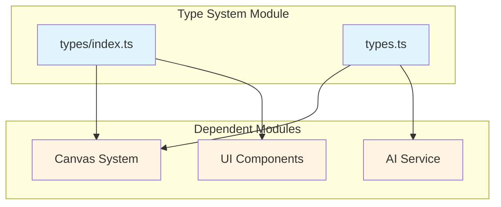
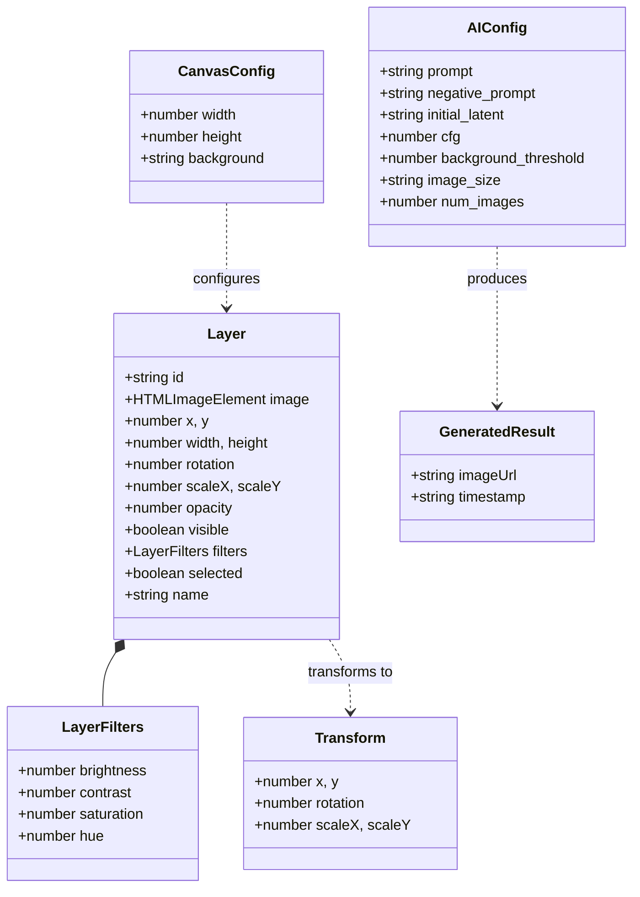
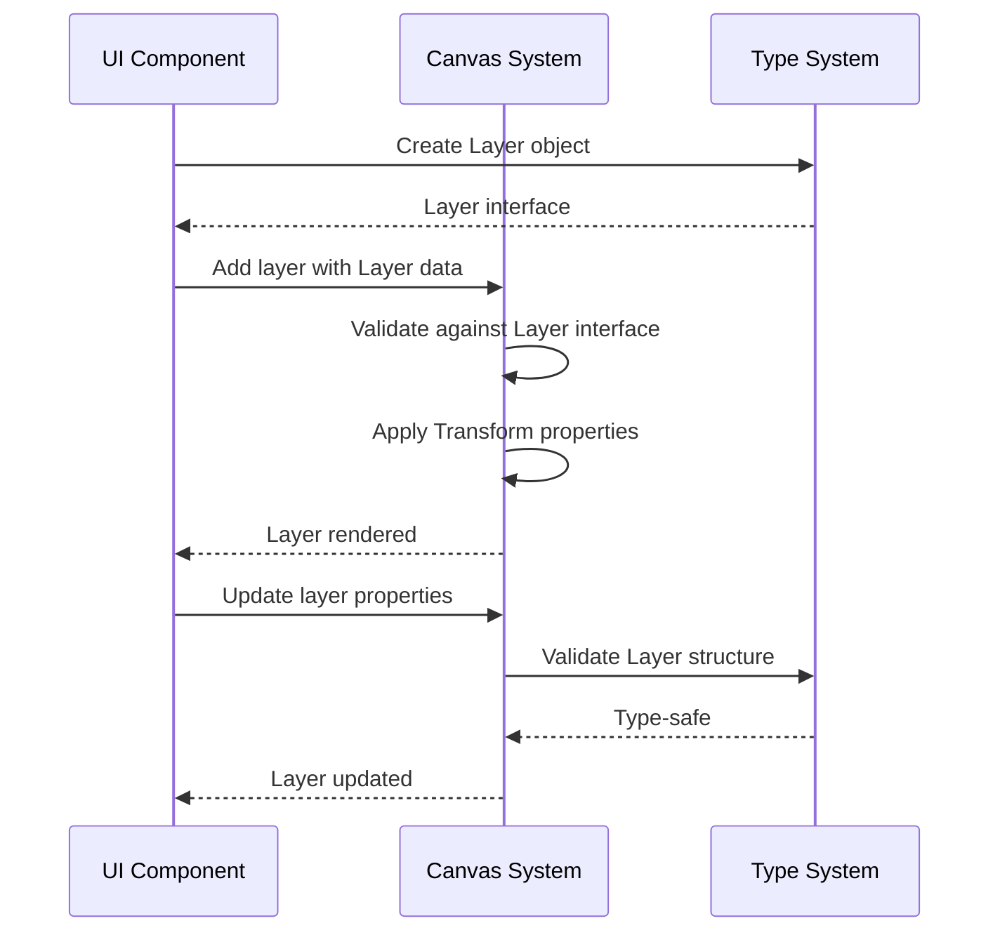
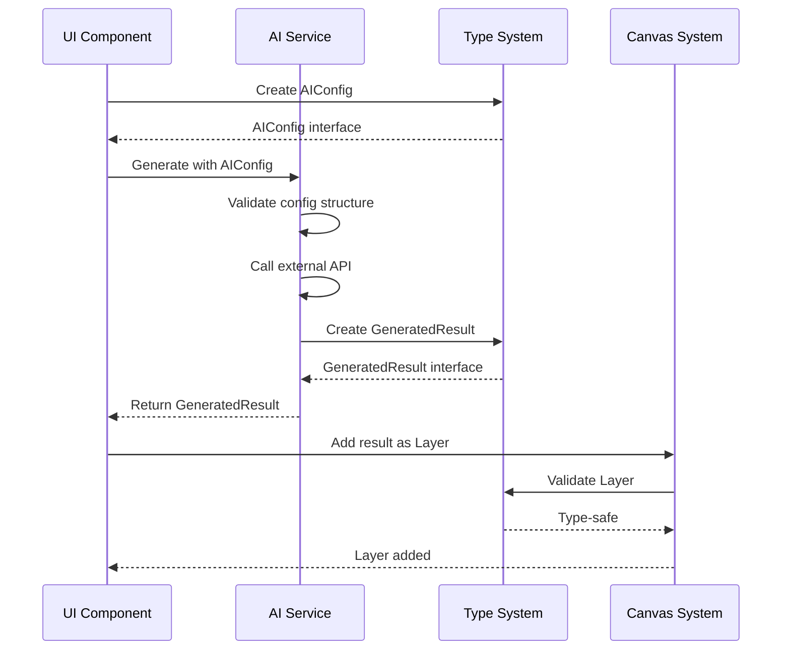
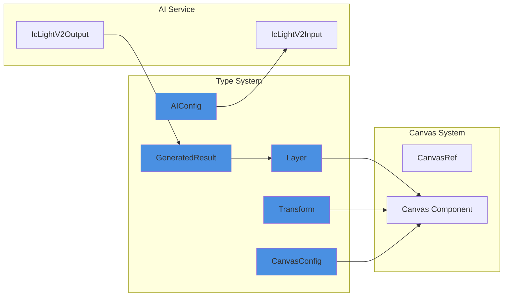
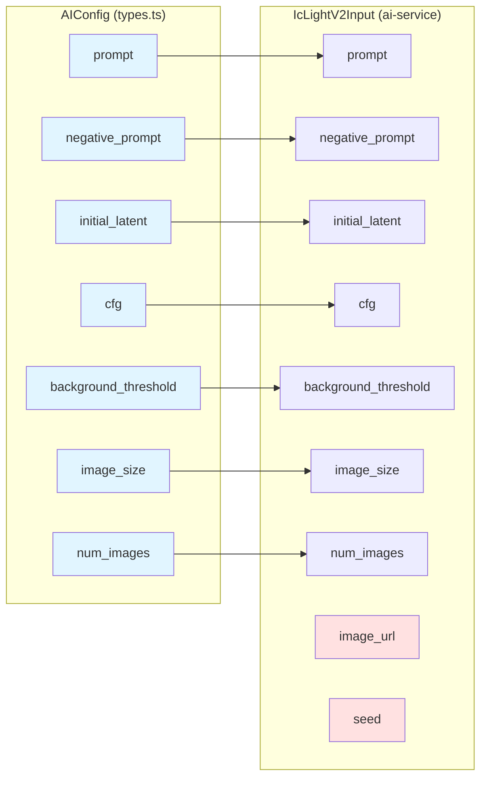

# Type System Module

## Overview

The **type-system** module serves as the foundational type definition layer for the entire application, providing TypeScript interfaces that define the data structures used across canvas manipulation, AI image generation, and layer management. This module establishes the contract between different system components, ensuring type safety and consistency throughout the application.

The module consists of two primary files:
- **`app/src/types/index.ts`**: Extended type definitions with additional properties for advanced features
- **`app/src/types.ts`**: Core type definitions with stricter type constraints

## Architecture

### Module Structure



### Type Hierarchy



## Core Components

### 1. Layer Interface

The `Layer` interface represents a single image layer in the canvas system with complete transformation and styling properties.

**Purpose**: Define the structure for manipulable image layers with visual properties and transformations.

**Properties**:

| Property | Type | Description |
|----------|------|-------------|
| `id` | `string` | Unique identifier for the layer |
| `image` | `HTMLImageElement` | The actual image element |
| `x`, `y` | `number` | Position coordinates on canvas |
| `width`, `height` | `number` | Dimensions of the layer |
| `rotation` | `number` | Rotation angle in degrees |
| `scaleX`, `scaleY` | `number` | Scale factors for horizontal/vertical |
| `opacity` | `number` | Transparency level (0-1) |
| `visible` | `boolean` | Visibility toggle |
| `filters` | `LayerFilters` | Image filter settings |
| `selected` | `boolean?` | Selection state (index.ts only) |
| `name` | `string?` | Layer name (index.ts only) |

**Filters Object**:
```typescript
{
  brightness: number;  // Brightness adjustment
  contrast: number;    // Contrast adjustment
  saturation: number;  // Color saturation
  hue: number;        // Hue rotation
}
```

**Usage Context**: Used by [canvas-system](canvas-system.md) for layer management and rendering.

### 2. Transform Interface

The `Transform` interface encapsulates geometric transformation properties for layers.

**Purpose**: Provide a lightweight structure for layer transformations without the full layer data.

**Properties**:

| Property | Type | Description |
|----------|------|-------------|
| `x`, `y` | `number` | Translation coordinates |
| `rotation` | `number` | Rotation angle |
| `scaleX`, `scaleY` | `number` | Scale factors |

**Usage Pattern**:
```typescript
// Extract transform from layer
const transform: Transform = {
  x: layer.x,
  y: layer.y,
  rotation: layer.rotation,
  scaleX: layer.scaleX,
  scaleY: layer.scaleY
};
```

### 3. CanvasConfig Interface

The `CanvasConfig` interface defines the canvas dimensions and appearance settings.

**Purpose**: Configure the canvas workspace dimensions and background.

**Variants**:

**types/index.ts** (Extended):
```typescript
interface CanvasConfig {
  width: number;
  height: number;
  background?: string;  // Optional background color/pattern
}
```

**types.ts** (Core):
```typescript
interface CanvasConfig {
  width: number;
  height: number;
}
```

**Usage Context**: Used by [canvas-system](canvas-system.md) for canvas initialization.

### 4. AIConfig Interface

The `AIConfig` interface defines parameters for AI-powered image generation.

**Purpose**: Configure AI image generation requests with prompts and generation parameters.

**Variants**:

**types/index.ts** (Flexible):
```typescript
interface AIConfig {
  prompt: string;
  negative_prompt: string;
  initial_latent: string;              // Any string value
  cfg: number;
  background_threshold: number;
  image_size: string;                  // Any string value
  num_images: number;
}
```

**types.ts** (Strict):
```typescript
interface AIConfig {
  prompt: string;
  negative_prompt: string;
  initial_latent: 'None' | 'Left' | 'Right' | 'Top' | 'Bottom';
  cfg: number;
  background_threshold: number;
  image_size: 'square_hd' | 'square' | 'portrait_4_3' | 'portrait_16_9' | 
              'landscape_4_3' | 'landscape_16_9';
  num_images: number;
}
```

**Property Details**:

| Property | Type | Description |
|----------|------|-------------|
| `prompt` | `string` | Positive prompt for generation |
| `negative_prompt` | `string` | Negative prompt to avoid features |
| `initial_latent` | `string/enum` | Starting latent position |
| `cfg` | `number` | Classifier-free guidance scale |
| `background_threshold` | `number` | Background separation threshold |
| `image_size` | `string/enum` | Output image dimensions |
| `num_images` | `number` | Number of images to generate |

**Usage Context**: Used by [ai-service](ai-service.md) for image generation requests.

### 5. GeneratedResult Interface

The `GeneratedResult` interface represents the output from AI image generation.

**Purpose**: Encapsulate generated image data with metadata.

**Variants**:

**types/index.ts** (Minimal):
```typescript
interface GeneratedResult {
  imageUrl: string;
}
```

**types.ts** (With Metadata):
```typescript
interface GeneratedResult {
  imageUrl: string;
  timestamp: string;  // Generation timestamp
}
```

**Usage Context**: Returned by [ai-service](ai-service.md) after successful generation.

## Data Flow

### Layer Lifecycle



### AI Generation Flow



## Type Relationships

### Cross-Module Dependencies



### Type Mapping: AIConfig to IcLightV2Input

The `AIConfig` interface maps to the AI service's `IcLightV2Input`:



## File Comparison

### types/index.ts vs types.ts

| Aspect | types/index.ts | types.ts |
|--------|----------------|----------|
| **Purpose** | Extended definitions for UI | Core definitions with strict types |
| **Layer** | Includes `selected`, `name` | Basic properties only |
| **CanvasConfig** | Includes `background` | Width and height only |
| **AIConfig** | String types (flexible) | Union types (strict) |
| **GeneratedResult** | URL only | URL + timestamp |
| **Transform** | ✅ Defined | ❌ Not defined |
| **Use Case** | UI components, extended features | Core logic, API integration |

### Migration Considerations

When working with both files:

```typescript
// Converting from types.ts to types/index.ts
import { Layer as CoreLayer } from './types';
import { Layer as ExtendedLayer } from './types/index';

function extendLayer(coreLayer: CoreLayer): ExtendedLayer {
  return {
    ...coreLayer,
    selected: false,
    name: `Layer ${coreLayer.id}`
  };
}

// Converting AIConfig
import { AIConfig as CoreAIConfig } from './types';
import { AIConfig as FlexibleAIConfig } from './types/index';

function toFlexibleConfig(config: CoreAIConfig): FlexibleAIConfig {
  return config; // Compatible due to structural typing
}
```

## Usage Patterns

### Creating a New Layer

```typescript
import { Layer } from './types/index';

function createLayer(image: HTMLImageElement): Layer {
  return {
    id: crypto.randomUUID(),
    image,
    x: 0,
    y: 0,
    width: image.width,
    height: image.height,
    rotation: 0,
    scaleX: 1,
    scaleY: 1,
    opacity: 1,
    visible: true,
    filters: {
      brightness: 100,
      contrast: 100,
      saturation: 100,
      hue: 0
    },
    selected: false,
    name: 'New Layer'
  };
}
```

### Configuring AI Generation

```typescript
import { AIConfig } from './types';

const aiConfig: AIConfig = {
  prompt: 'A beautiful sunset over mountains',
  negative_prompt: 'blurry, low quality',
  initial_latent: 'None',
  cfg: 7.5,
  background_threshold: 0.5,
  image_size: 'landscape_16_9',
  num_images: 1
};
```

### Applying Transformations

```typescript
import { Layer, Transform } from './types/index';

function applyTransform(layer: Layer, transform: Transform): Layer {
  return {
    ...layer,
    x: transform.x,
    y: transform.y,
    rotation: transform.rotation,
    scaleX: transform.scaleX,
    scaleY: transform.scaleY
  };
}
```

### Canvas Configuration

```typescript
import { CanvasConfig } from './types/index';

const canvasConfig: CanvasConfig = {
  width: 1920,
  height: 1080,
  background: '#ffffff'
};
```

## Type Safety Benefits

### Compile-Time Validation

```typescript
import { AIConfig } from './types';

// ✅ Valid - all enum values are correct
const validConfig: AIConfig = {
  prompt: 'test',
  negative_prompt: '',
  initial_latent: 'Left',  // Type-safe enum
  cfg: 7.5,
  background_threshold: 0.5,
  image_size: 'square_hd',  // Type-safe enum
  num_images: 1
};

// ❌ Compile error - invalid enum value
const invalidConfig: AIConfig = {
  prompt: 'test',
  negative_prompt: '',
  initial_latent: 'Center',  // Error: not in union type
  cfg: 7.5,
  background_threshold: 0.5,
  image_size: 'invalid',  // Error: not in union type
  num_images: 1
};
```

### Runtime Type Guards

```typescript
import { Layer, GeneratedResult } from './types';

function isLayer(obj: any): obj is Layer {
  return (
    typeof obj === 'object' &&
    typeof obj.id === 'string' &&
    obj.image instanceof HTMLImageElement &&
    typeof obj.x === 'number' &&
    typeof obj.y === 'number' &&
    typeof obj.visible === 'boolean'
  );
}

function isGeneratedResult(obj: any): obj is GeneratedResult {
  return (
    typeof obj === 'object' &&
    typeof obj.imageUrl === 'string' &&
    typeof obj.timestamp === 'string'
  );
}
```

## Integration Points

### With Canvas System

The type-system provides the foundational types used by [canvas-system](canvas-system.md):

- **Layer**: Core data structure for canvas layers
- **Transform**: Geometric transformations
- **CanvasConfig**: Canvas initialization

```typescript
// Canvas system uses these types
import { Layer, CanvasConfig, Transform } from './types/index';

interface CanvasRef {
  getDataUrl: () => string | null;
  addLayer: (layer: Layer) => void;
  updateLayer: (id: string, updates: Partial<Layer>) => void;
  applyTransform: (id: string, transform: Transform) => void;
}
```

### With AI Service

The type-system defines the contract for [ai-service](ai-service.md):

- **AIConfig**: Input configuration
- **GeneratedResult**: Output structure

```typescript
// AI service implements these types
import { AIConfig, GeneratedResult } from './types';

async function generateImage(config: AIConfig): Promise<GeneratedResult> {
  // Implementation maps AIConfig to IcLightV2Input
  const input: IcLightV2Input = {
    ...config,
    image_url: getCanvasDataUrl(),
    seed: Math.random() * 1000000
  };
  
  const output = await callAPI(input);
  
  return {
    imageUrl: output.images[0].url,
    timestamp: new Date().toISOString()
  };
}
```

## Best Practices

### 1. Choose the Right Type File

- Use **`types.ts`** for:
  - Core business logic
  - API integrations
  - Strict type validation
  - Backend communication

- Use **`types/index.ts`** for:
  - UI components
  - Extended features
  - Flexible configurations
  - Frontend-only logic

### 2. Maintain Type Consistency

```typescript
// ✅ Good - consistent type usage
import { Layer } from './types/index';

function processLayers(layers: Layer[]): Layer[] {
  return layers.map(layer => ({
    ...layer,
    opacity: Math.min(layer.opacity, 1)
  }));
}

// ❌ Bad - mixing types
import { Layer as CoreLayer } from './types';
import { Layer as ExtendedLayer } from './types/index';

function processLayers(layers: CoreLayer[]): ExtendedLayer[] {
  // Type mismatch issues
}
```

### 3. Use Partial Types for Updates

```typescript
import { Layer } from './types/index';

// ✅ Good - partial updates
function updateLayer(id: string, updates: Partial<Layer>): void {
  // Only update specified properties
}

// ❌ Bad - requires full object
function updateLayer(id: string, layer: Layer): void {
  // Must provide all properties
}
```

### 4. Leverage Type Inference

```typescript
import { Transform } from './types/index';

// ✅ Good - type inference
const transform = {
  x: 100,
  y: 200,
  rotation: 45,
  scaleX: 1.5,
  scaleY: 1.5
} satisfies Transform;

// Type is inferred and validated
```

## Future Considerations

### Potential Enhancements

1. **Versioning**: Add version fields to track schema changes
2. **Validation**: Include runtime validation schemas (Zod, Yup)
3. **Serialization**: Add toJSON/fromJSON methods
4. **Immutability**: Consider readonly properties for immutable data
5. **Generics**: Add generic types for extensibility

### Type Evolution

```typescript
// Future: Versioned types
interface LayerV2 extends Layer {
  version: '2.0';
  blendMode: 'normal' | 'multiply' | 'screen';
  mask?: HTMLImageElement;
}

// Future: Generic result type
interface GeneratedResult<T = string> {
  imageUrl: T;
  timestamp: string;
  metadata?: Record<string, any>;
}
```

## Related Documentation

- [Canvas System](canvas-system.md) - Uses Layer, Transform, and CanvasConfig types
- [AI Service](ai-service.md) - Uses AIConfig and GeneratedResult types

## Summary

The **type-system** module is the cornerstone of type safety in the application, providing:

- **Comprehensive type definitions** for all major data structures
- **Two-tier approach** with flexible and strict type variants
- **Strong integration** with canvas and AI systems
- **Type safety** at compile-time and runtime
- **Clear contracts** between system components

This module ensures consistency, reduces bugs, and provides excellent developer experience through TypeScript's type system.
