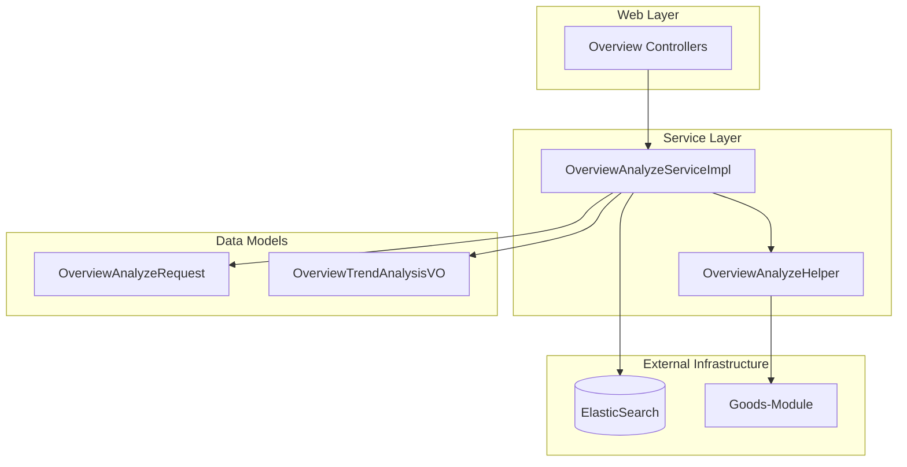
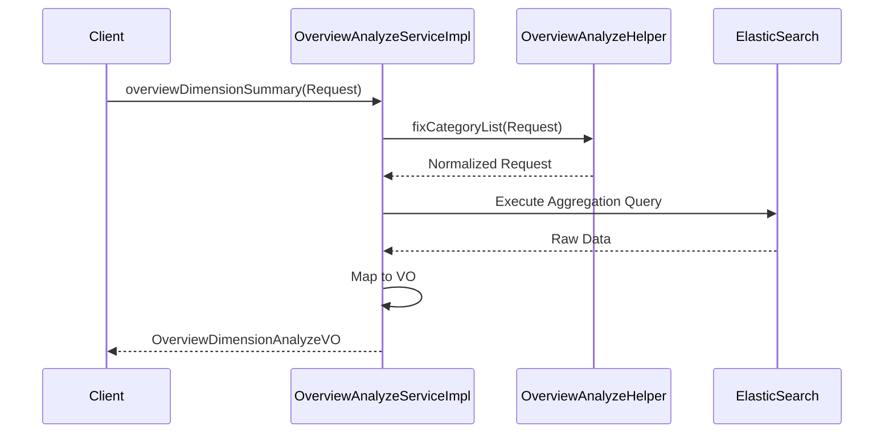

# Analysis-Insight-Module

## Introduction
The **Analysis-Insight-Module** is a core analytical component of the Abroad Dataline system. Its primary purpose is to provide high-level market insights, trend analysis, and multi-dimensional data aggregation for global e-commerce and social media data.

This module processes complex datasets from various sources (such as Goods, TikTok, and Instagram) to generate actionable business intelligence, including price trend analysis, category performance, and cross-dimensional market overviews.

## Architecture Overview
The module follows a standard layered architecture within the Spring Boot ecosystem, interacting heavily with ElasticSearch for high-performance data aggregation.

### Key Components
- **OverviewAnalyzeServiceImpl**: The primary service implementation handling the business logic for dimension summaries, trend analysis, and box plot generation.
- **OverviewAnalyzeHelper**: A utility component providing complex data transformation logic, recursive tree flattening for cross-analysis, and category list normalization.
- **OverviewAnalyzeRequest**: The standard DTO for market insight queries, supporting parameters for price ranges, dimensions, and specific market models.
- **OverviewTrendAnalysisVO**: The data structure used to return time-series analysis, including period-over-period (PoP) growth and distribution ratios.

## High-Level Functionality

### 1. Market Trend Analysis
Provides time-series data for various metrics. It allows users to track how specific categories or attributes (like color or style) evolve over time.
- **Detailed Documentation**: [Overview Analysis Sub-module](overview_analysis.md)
- **Related Components**: `OverviewTrendAnalysisVO`, `OverviewAnalyzeServiceImpl::overviewDimensionTrend`

### 2. Multi-Dimensional Aggregation
Supports "Cross-Analysis" where data is sliced by multiple dimensions (e.g., Category vs. Region). The module handles hierarchical data structures to represent these relationships.
- **Detailed Documentation**: [Overview Analysis Sub-module](overview_analysis.md)
- **Related Components**: `OverviewAnalyzeHelper::flatMapCrossAnalyzeVOs`, `OverviewAnalyzeHelper::getMaxLevelList`

### 3. Category & Industry Normalization
Ensures that requests from different platforms (Normal vs. Origin categories) are mapped correctly to the underlying data schema in ElasticSearch.
- **Detailed Documentation**: [Overview Analysis Sub-module](overview_analysis.md)
- **Related Components**: `OverviewAnalyzeHelper::fixCategoryList`

## Integration with Other Modules
- **[Goods-Module](Goods-Module.md)**: Provides the underlying product data and category structures used for market analysis.
- **[ElasticSearch-Infrastructure](ElasticSearch-Infrastructure.md)**: Used for executing complex aggregations and retrieving time-series data.
- **[Translation-Module](Translation-Module.md)**: Utilized when analysis results need to be presented in different languages for global stakeholders.

## Data Flow

