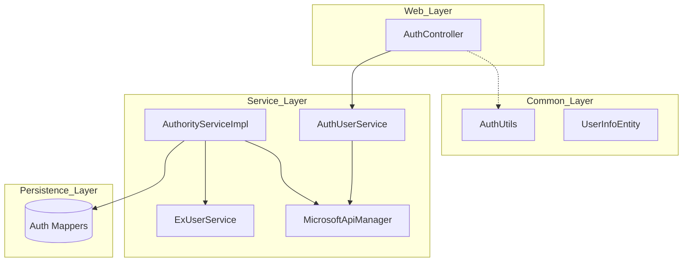

# Auth-Account-Module

## Overview
The **Auth-Account-Module** is a core component of the Abroad Dataline system, responsible for managing user authentication, authorization, and account-related operations. It provides a robust framework for handling Microsoft-based SSO (Single Sign-On), role-based access control (RBAC), and fine-grained permission management across various dimensions such as categories, brands, and system functions.

## Architecture
The module follows a layered architecture, integrating with external identity providers (Microsoft) and internal data persistence layers.

## Key Functionalities

### 1. Authentication & Identity Management
Handles user login and logout processes, primarily through Microsoft integration.
- **Login/Logout**: Managed via `AuthController` and `AuthUserService`.
- **Session Context**: `AuthUtils` provides static methods to retrieve current user information (ID, Email, Token) from the request context.

### 2. Role-Based Access Control (RBAC)
The module implements a complex RBAC system where users are assigned roles, and roles are mapped to specific permissions.
- **Role Management**: Creation, editing, and deletion of roles.
- **Permission Mapping**: Roles can have multiple types of permissions:
    - **Page Permissions**: Access to specific UI routes.
    - **Function Permissions**: Access to specific system operations (e.g., `ROLE_CONFIG`).
    - **Data Permissions**: Scoped access to Categories, Brands, and Customers.

### 3. User-Role Relationships
Manages the association between users and roles, including administrative privileges within a specific role.

## Sub-Modules

Due to the complexity of the authority and authentication logic, the module is divided into the following sub-modules:

| Sub-module | Description |
| --- | --- |
| [Authority Management](authority_management.md) | Handles RBAC, role definitions, and permission assignments. |
| [Authentication Service](authentication_service.md) | Manages login, logout, and Microsoft integration. |
| [User Context & Entities](user_context.md) | Defines user data structures and utility methods for accessing session data. |

## Detailed Component Reference

### Core Services
- **AuthorityServiceImpl**: The central logic for role and permission management. It interacts with multiple mappers (`AuthRoleMapper`, `AuthPermissionMapper`, etc.) to persist and retrieve authorization data.
- **AuthController**: The primary entry point for authentication-related API calls, delegating to `AuthUserService`.

### Utility & Data Models
- **AuthUtils**: A utility class providing static access to the current user's context (ID, Email, Token) from the `RequestContextHolder`.
- **UserInfoEntity**: A simple domain entity representing basic user and team identification.

## Integration with Other Modules
- **[Monitor-Module](Monitor-Module.md)**: Uses authentication data to filter custom shop monitors.
- **[Goods-Module](Goods-Module.md)**: Permissions defined here (Categories/Brands) are used to filter goods listings.
- **[Translation-Module](Translation-Module.md)**: May use user context for personalized translation settings.
