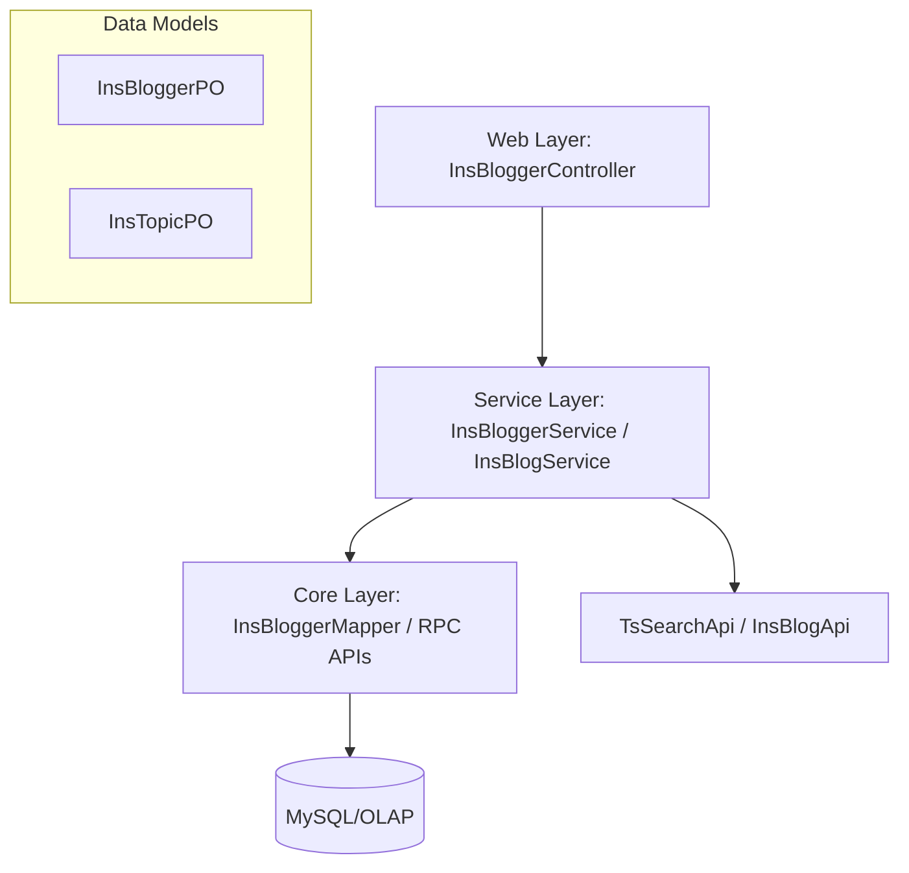
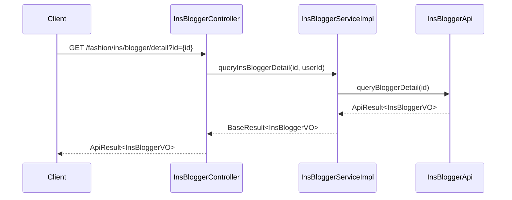

# Fashion-Ins-Module Documentation

## Introduction
The **Fashion-Ins-Module** is a core component of the abroad-dataline system, specifically designed to handle Instagram (INS) related fashion data. It provides comprehensive capabilities for managing Instagram bloggers, tracking fashion topics, and analyzing social media trends to provide actionable insights for the fashion industry.

## Architecture Overview
The module follows a standard layered architecture (Web -> Service -> Core/DAO) and interacts with external search services and internal data stores.

### Component Diagram

## Sub-modules

### 1. [Blogger Management](blogger_management.md)
Handles the lifecycle and metadata of Instagram bloggers. This includes profile information, follower statistics, engagement metrics, and categorization (region, industry, style).
- **Core Components**: `InsBloggerPO`, `InsBloggerServiceImpl`, `InsBloggerController`, `InsBloggerMapper`.

### 2. [Content & Topic Analysis](content_topic_analysis.md)
Focuses on the actual content (blogs/posts) and trending topics on Instagram. It tracks how topics evolve and how bloggers interact with specific hashtags or themes.
- **Core Components**: `InsTopicPO`, `InsBlogServiceImpl`.

## Key Functionalities
- **Blogger Discovery & Search**: Advanced filtering of bloggers by industry, style, and engagement metrics.
- **Trend Analysis**: Tracking follower growth, like trends, and interaction rates over time.
- **Interaction Mapping**: Analyzing "@" mentions and topic-based interactions between bloggers.
- **Monitoring**: Specialized lists for tracking specific bloggers' performance and updates.

## Integration with Other Modules
- **[Goods-Module](Goods-Module.md)**: Links Instagram content to specific product SKUs and goods data.
- **[Monitor-Module](Monitor-Module.md)**: Utilizes the monitoring flags in `InsBloggerRequest` to feed into the system-wide monitoring service.
- **[Auth-Account-Module](Auth-Account-Module.md)**: Uses `AuthUtils` for team and user-based data filtering and permission control.
- **[ElasticSearch-Infrastructure](ElasticSearch-Infrastructure.md)**: Leverages ES for high-performance searching of blogger and blog data via `TsSearchApi`.

## Data Flow: Blogger Detail Retrieval

