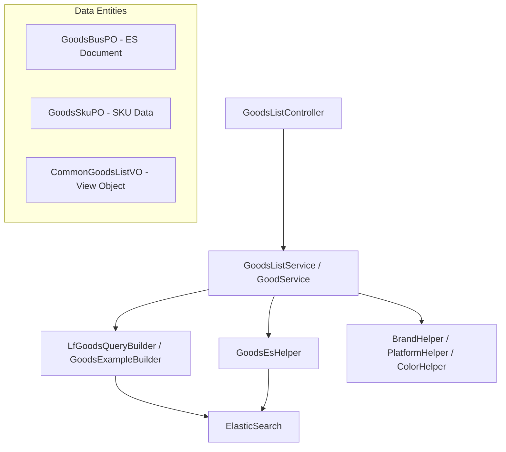

# Goods Module Documentation

## Overview
The **Goods Module** is a core component of the Abroad Dataline system, responsible for managing, searching, and analyzing global e-commerce product data. It aggregates product information from multiple platforms (e.g., Shein, Amazon, AliExpress) and provides advanced search capabilities, including text-based search, image-based similarity search, and trend analysis.

The module leverages **ElasticSearch** for high-performance data retrieval and complex filtering, supporting features like "New Arrival Calendars," "Site-specific Product Lists," and "Similarity Recommendations."

## Architecture
The module follows a layered architecture:
- **Web Layer**: REST controllers handling user requests.
- **Service Layer**: Business logic for product filtering, sorting, and data enrichment.
- **Core/Helper Layer**: Specialized logic for brand handling, platform rules, and image processing.
- **Infrastructure/ES Layer**: ElasticSearch query builders and helpers for efficient data access.

### Component Interaction Diagram

## Sub-modules
The Goods Module is divided into several functional areas:

| Sub-module | Description |
|------------|-------------|
| [Goods Search & Listing](goods_search_listing.md) | Handles text search, site-specific listings, and complex filtering logic. |
| [Product Discovery](product_discovery.md) | Manages "New Arrival" calendars and similarity-based product discovery (Image Search). |
| [Data Models](goods_data_models.md) | Defines the core POs and VOs for product and SKU data. |

## Integration with Other Modules
- **[Fashion-Ins-Module](Fashion-Ins-Module.md)**: Provides design and style options for product categorization.
- **[Auth-Account-Module](Auth-Account-Module.md)**: Manages user permissions for filtering "already visited" products.
- **[ElasticSearch-Infrastructure](ElasticSearch-Infrastructure.md)**: Provides the underlying ES client configuration and index constants.
- **[Translation-Module](Translation-Module.md)**: Used for translating product properties and names.
