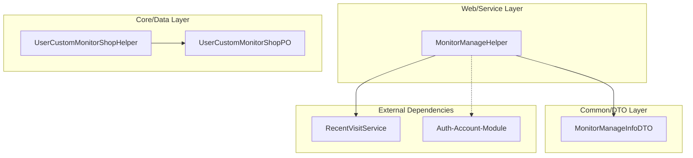

# Monitor-Module

## Introduction
The **Monitor-Module** is a specialized component within the Abroad Dataline system designed to manage and track user-defined monitoring activities. It primarily focuses on "Custom Monitor Shops," allowing users and teams to track specific entities (like shops) across different platforms, manage monitoring statuses, and analyze engagement through visit history.

The module provides the infrastructure to:
*   Track which users or teams are monitoring specific shops.
*   Manage the lifecycle of a monitoring request (status, creation, updates).
*   Provide helper utilities for sorting, filtering, and paginating monitoring data.
*   Integrate with workplace services to track the "Last Visit" activity for monitored entities.

## Architecture Overview

The Monitor-Module follows a layered architecture typical of the system, interacting with core data access layers and providing services to the web layer.

### Component Relationships
*   **MonitorManageHelper**: The central logic hub for processing monitoring data. It handles complex operations like sorting by time, filtering by user, and aggregating visit records from the `RecentVisitService`.
*   **UserCustomMonitorShopPO**: The persistent entity representing a user's subscription to monitor a specific shop.
*   **MonitorManageInfoDTO**: A data transfer object used to aggregate monitoring status with user information and visit timestamps for UI display.

## High-Level Functionality

### 1. Monitoring Management
The module tracks which entities are being monitored. It supports multi-tenant (team-based) monitoring where multiple users within a team might monitor the same entity.

### 2. Visit Tracking Integration
By collaborating with the `RecentVisitService`, the module can determine the "Last Visit Time" for any monitored entity. This helps users identify which monitored shops have been neglected or recently reviewed.

### 3. Data Processing Utilities
The `MonitorManageHelper` provides standardized ways to:
*   **Sort**: Order monitored entities by `monitorTime` or `lastVisitTime` (ascending/descending).
*   **Filter**: Narrow down monitoring lists to specific users.
*   **Paginate**: Handle large lists of monitored entities efficiently in memory.

## Sub-Modules

Due to the focused nature of this module, the components are categorized as follows:

*   **Monitor Core**: Contains the persistence logic and POs for custom shop monitoring.
    *   See [monitor_core.md](monitor_core.md)
*   **Monitor Services & Helpers**: Contains the business logic for managing and displaying monitor information.
    *   See [monitor_services.md](monitor_services.md)

## Cross-Module References
*   **Workplace Service**: Used via `RecentVisitService` to fetch interaction history.
*   **[Auth-Account-Module](Auth-Account-Module.md)**: Provides user and team context for monitoring records.
*   **[Goods-Module](Goods-Module.md)**: Often the target of monitoring (shops/products).
