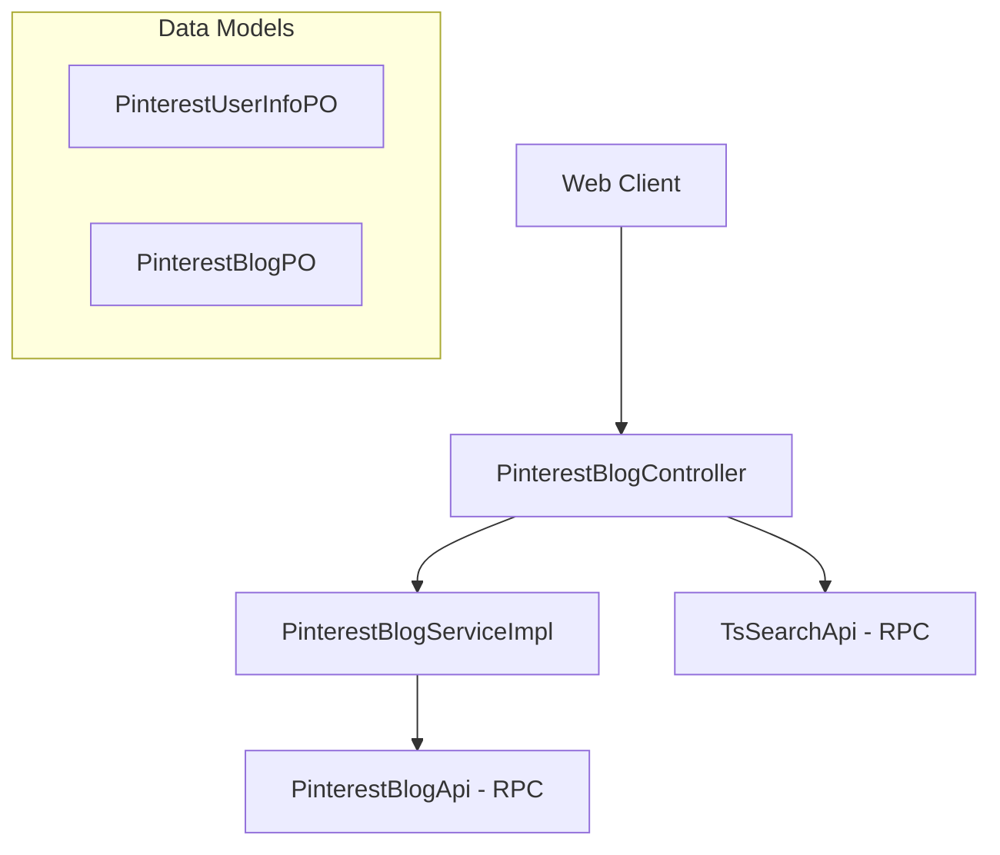

# Pinterest Module Documentation

## Overview
The Pinterest Module is a core component of the Abroad Dataline system, designed to handle data integration, storage, and retrieval for Pinterest-related content. It provides functionalities for managing Pinterest user information and blog posts (Pins), supporting features like content discovery, trend analysis, and detailed metadata tracking.

## Architecture Overview
The module follows a standard layered architecture:
- **Web Layer**: Handles HTTP requests and provides RESTful APIs.
- **Service Layer**: Implements business logic and coordinates between data sources.
- **Core/Data Layer**: Manages data persistence (PostgreSQL/Hologres) and external RPC calls.
- **Common Layer**: Defines shared Data Transfer Objects (DTOs), Persistence Objects (POs), and Value Objects (VOs).

### Component Interaction Diagram

## Sub-modules

### 1. [Pinterest Blog Management](pinterest_blog_management.md)
Focuses on the retrieval and display of Pinterest blog posts (Pins).
- **Key Components**: `PinterestBlogController`, `PinterestBlogServiceImpl`, `PinterestBlogPO`.
- **Functionality**: Search listing, paginated blog lists, and detailed Pin information.

### 2. [Pinterest User Data](pinterest_user_data.md)
Manages metadata for Pinterest creators and influencers.
- **Key Components**: `PinterestUserInfoPO`.
- **Functionality**: Tracking follower counts, engagement metrics (monthly views), and user categorization (industry, style).

## Data Flow
1. **Search/Listing**: Requests for Pin lists are either routed through `TsSearchApi` for elastic search capabilities or through `PinterestBlogService` for direct data retrieval.
2. **Detail Retrieval**: Specific Pin details are fetched via the service layer which interacts with internal RPC APIs (`PinterestBlogApi`).

## Related Modules
- [ElasticSearch-Infrastructure](ElasticSearch-Infrastructure.md): Provides the underlying search capabilities used by `TsSearchApi`.
- [Fashion-Ins-Module](Fashion-Ins-Module.md): Similar social media integration for Instagram.
- [TikTok-Module](TikTok-Module.md): Similar social media integration for TikTok.
