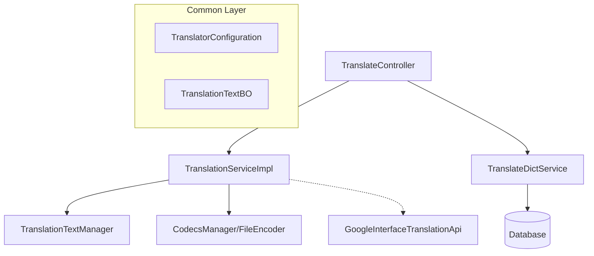
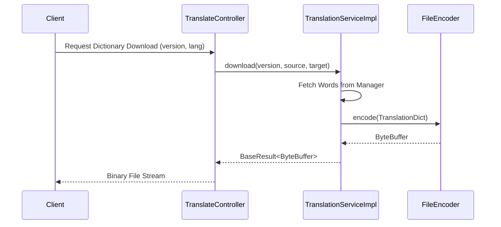

# Translation Module

## Introduction
The **Translation Module** is a core service within the system designed to handle multi-language support, dictionary management, and automated translation services. It provides a robust framework for managing translation keys, serving localized content to various clients, and integrating with external translation providers like Google Translate.

## Architecture Overview
The module follows a layered architecture, separating configuration, service logic, and external API interactions.

### Component Diagram

## Sub-modules

### 1. [Translation Core Service](translation_core.md)
Responsible for the business logic of retrieving translation dictionaries and encoding them into specific file formats for client consumption.
- **Key Component:** `TranslationServiceImpl`
- **Functionality:** 
    - Dictionary retrieval based on source and target languages.
    - Versioned file downloads using custom encoders (`FileEncoder`).
    - Data transformation from internal Business Objects (BO) to protocol-compliant `TranslationDict`.

### 2. [Dictionary Management](dictionary_management.md)
Handles the administrative tasks of maintaining the translation database, including batch operations for adding, updating, and deleting translation keys.
- **Key Component:** `TranslateController`
- **Functionality:**
    - RESTful endpoints for CRUD operations on translation data.
    - Support for namespace-based dictionary filtering.
    - Integration with `@Translated` and `@TranslateResponseAnnotation` for automated field translation handling.

### 3. [External Integration](external_integration.md)
Provides a gateway to third-party translation services.
- **Key Component:** `GoogleInterfaceTranslationApi`
- **Functionality:**
    - Feign client implementation for Google Cloud Translation API.
    - Supports batch text translation via POST requests to Google's V2 translation endpoint.

### 4. Configuration
Defines the structure for translator settings, including supported languages and data loaders.
- **Key Component:** `TranslatorConfiguration`

## Data Flow

## Related Modules
- [Auth-Account-Module](Auth-Account-Module.md): Used for securing translation management endpoints.
- [Goods-Module](Goods-Module.md): Consumes translation services for multi-language product descriptions.
