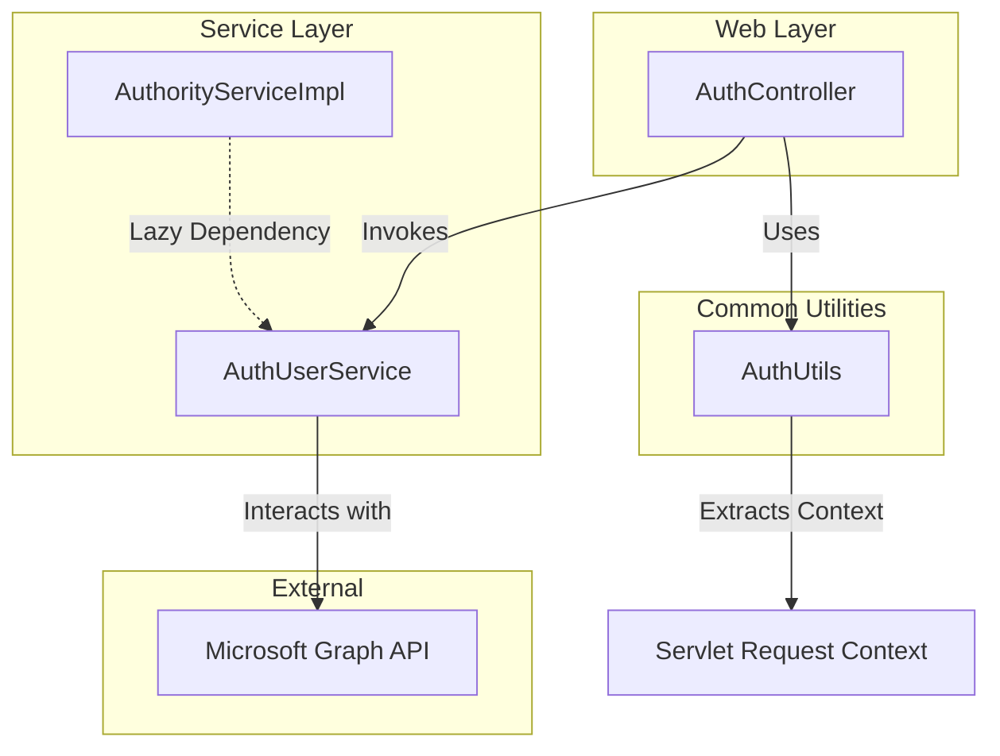
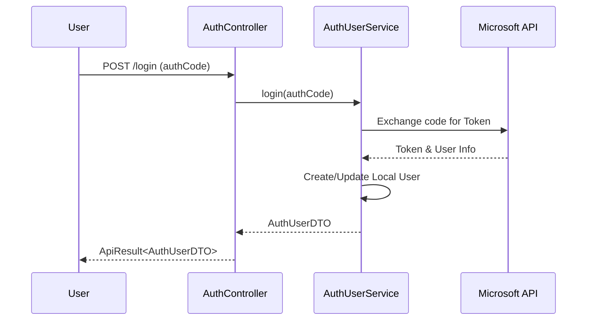

# Authentication Service Module

The `authentication_service` module is a critical component of the **Auth-Account-Module**, responsible for handling user authentication, Microsoft account integration, and session management. It provides the primary interface for users to log in, log out, and manage their identity within the system.

## Core Functionality

- **Microsoft OAuth Integration**: Handles login via authorization codes and manages Microsoft user profiles.
- **Session Management**: Provides endpoints for user login, logout, and retrieving current session information.
- **User Discovery**: Allows searching for users within the organization and retrieving detailed user information by email or ID.
- **Invitation & Authorization**: Facilitates inviting new users and granting specific permissions or roles.

## Architecture and Component Relationships

The module follows a standard web-service-core architecture, interacting with common utilities and service layers.

### Component Interaction Diagram

## Key Components

### AuthController
The primary REST controller (`/microsoft/auth/`) that exposes endpoints for:
- `login`: Authenticates users using a Microsoft authorization code.
- `logout`: Terminates the user session.
- `get-me`: Retrieves the current authenticated user's profile.
- `users`: Searches for users (typically within the Microsoft directory).
- `invitation`: Handles user invitation logic.
- `grant-auth`: Manages the granting of specific authorizations to users.

### AuthUserService (Service Interface)
While the implementation details are encapsulated, this service handles the business logic for:
- Validating OAuth tokens.
- Mapping Microsoft user data to internal `AuthUserDTO` and `MicrosoftUserDTO` objects.
- Managing user state and permissions in conjunction with the [authority_management](authority_management.md) sub-module.

### AuthUtils
A utility class used across the system to extract user context (User ID, Email, Tokens) from the current thread's request attributes.

## Data Flow: Login Process

The following sequence diagram illustrates the flow of a typical login request:

## Integration with Other Modules

- **[authority_management](authority_management.md)**: This module provides the underlying role and permission checks. `AuthController` uses `AuthUserService` which often coordinates with `AuthorityService` to ensure users have the correct roles assigned upon login or invitation.
- **[user_context](user_context.md)**: Uses `AuthUtils` and `UserInfoEntity` to maintain the security context across different service calls.

## API Reference Summary

| Endpoint | Method | Description |
| :--- | :--- | :--- |
| `/login` | POST | Login via Microsoft Authorization Code |
| `/logout` | POST | Logout current user |
| `/get-me` | GET | Get current user profile |
| `/users` | GET | Search for Microsoft users |
| `/get-user-by-mail`| GET | Retrieve user details by email |
| `/invitation` | POST | Invite a user to the platform |
| `/grant-auth` | POST | Grant specific permissions to a user |
