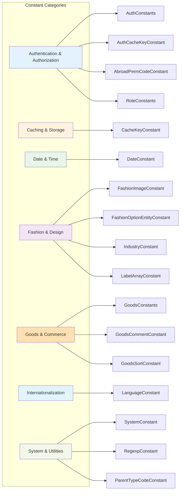
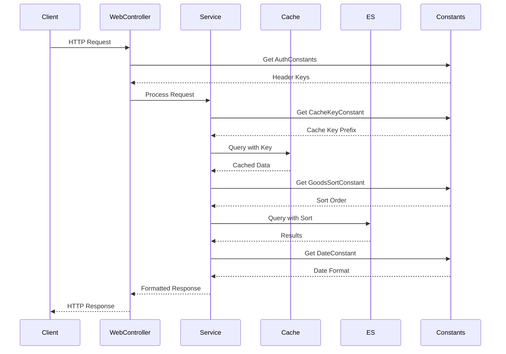
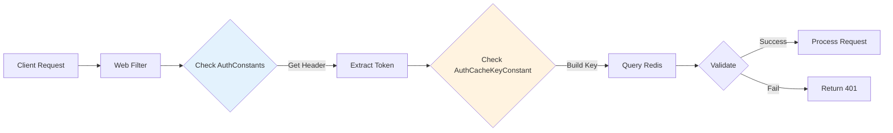
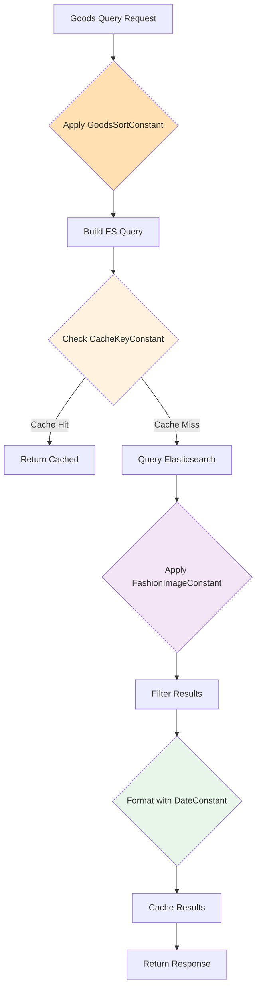
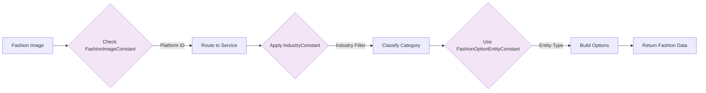
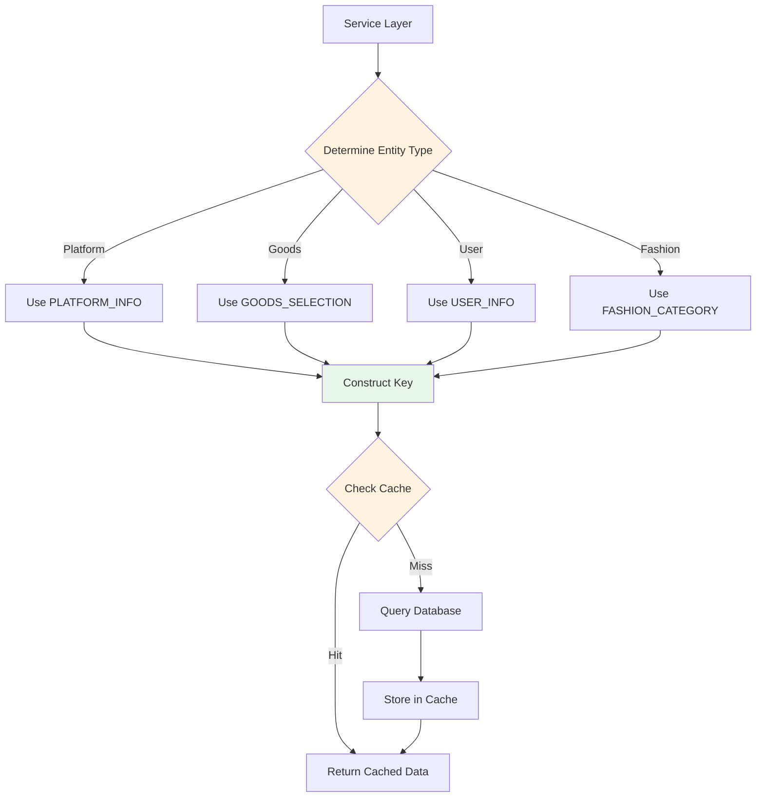
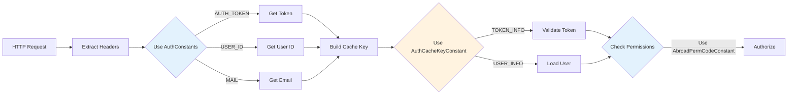
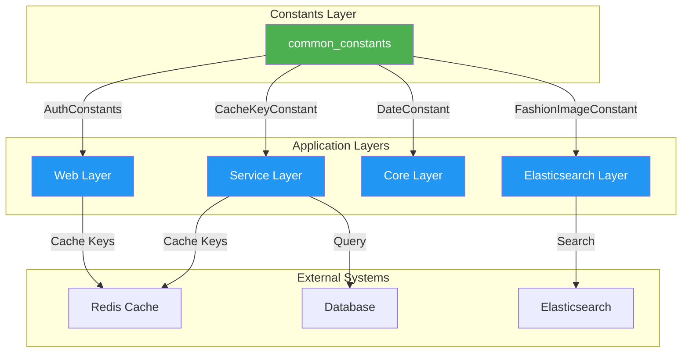

# Common Constants Module

## Overview

The **common_constants** module serves as the central repository for all system-wide constant definitions in the TrendEngine backend application. This module provides a comprehensive collection of immutable values, configuration keys, and standardized identifiers used across different functional domains including authentication, caching, goods management, fashion data, internationalization, and system-level operations.

## Module Purpose

The common_constants module fulfills several critical functions:

1. **Centralized Configuration**: Provides a single source of truth for constant values used throughout the application
2. **Type Safety**: Ensures consistent usage of predefined values across different modules
3. **Maintainability**: Simplifies updates to constant values by centralizing their definitions
4. **Domain Organization**: Groups related constants by functional domain for better code organization
5. **Cross-Module Standardization**: Enables consistent behavior across service, web, core, and elasticsearch modules

## Architecture

### Module Structure

```mermaid
graph TB
    subgraph "Common Constants Module"
        AC[AbroadPermCodeConstant]
        AUTH[AuthConstants]
        AUTHC[AuthCacheKeyConstant]
        CK[CacheKeyConstant]
        DC[DateConstant]
        FIC[FashionImageConstant]
        FOE[FashionOptionEntityConstant]
        GCC[GoodsCommentConstant]
        GC[GoodsConstants]
        GSC[GoodsSortConstant]
        IC[IndustryConstant]
        LAC[LabelArrayConstant]
        LC[LanguageConstant]
        PTC[ParentTypeCodeConstant]
        RC[RegexpConstant]
        ROLEC[RoleConstants]
        SC[SystemConstant]
    end
    
    subgraph "Dependent Modules"
        SVC[Service Layer]
        WEB[Web Controllers]
        CORE[Core Components]
        ES[Elasticsearch]
        CACHE[Cache Management]
    end
    
    AC --> SVC
    AUTH --> WEB
    AUTHC --> CACHE
    CK --> CACHE
    DC --> SVC
    FIC --> ES
    FOE --> SVC
    GCC --> SVC
    GC --> SVC
    GSC --> WEB
    IC --> ES
    LAC --> ES
    LC --> WEB
    PTC --> CORE
    RC --> SVC
    ROLEC --> WEB
    SC --> SVC
    
    style AC fill:#e1f5ff
    style AUTH fill:#e1f5ff
    style AUTHC fill:#e1f5ff
    style CK fill:#fff4e1
    style DC fill:#e8f5e9
    style FIC fill:#f3e5f5
    style FOE fill:#f3e5f5
    style GCC fill:#ffe0b2
    style GC fill:#ffe0b2
    style GSC fill:#ffe0b2
    style IC fill:#f3e5f5
    style LAC fill:#f3e5f5
    style LC fill:#e1f5ff
    style PTC fill:#e8f5e9
    style RC fill:#e8f5e9
    style ROLEC fill:#e1f5ff
    style SC fill:#e8f5e9
```



### Constant Categories

The module organizes constants into the following functional categories:



## Core Components

### 1. Authentication & Authorization Constants

#### AuthConstants
Defines HTTP header constants for authentication and user identification.

**Key Constants:**
- `Authorization`: Standard authorization header
- `AUTH_TOKEN`: Custom authentication token header
- `USER_ID`: User identifier header
- `USER_NAME`: Username header
- `MAIL`: Email header

**Usage Context:**
- HTTP request/response processing
- User session management
- API authentication
- See [web_config](web_config.md) for authentication configuration

#### AuthCacheKeyConstant
Redis cache key prefixes for authentication-related data.

**Key Constants:**
- `USER_INFO`: User information cache key
- `TOKEN_INFO`: Token information cache key
- `EMAIL_INFO`: Email information cache key

**Usage Context:**
- User session caching
- Token validation
- Authentication state management
- See [common_cache](common_cache.md) for cache implementation

#### AbroadPermCodeConstant
Permission codes for cross-border (abroad) functionality access control.

**Key Constants:**
- `ABROAD_PRODUCT_CODE`: Product code identifier (value: 1)
- `SSO_PERM_CODE`: SSO permission code ("dl_aboard")
- `ABROAD_MYSELF_PLATFORM`: Personal platform permission
- `ABROAD_MONITOR_7DAY_LIMIT`: 7-day monitoring limit bypass permission

**Usage Context:**
- Feature access control
- SSO integration
- Monitoring restrictions
- See [service_authority](service_authority.md) for authorization logic

#### RoleConstants
Role-based access control identifiers and permission categories.

**Key Constants:**
- `ROLE_ID_ADMIN`: Administrator role ID
- `ROLE_ID_DEFAULT`: Default user role ID
- `ROLE_NAME_ADMIN`: Administrator role name
- `ROLE_NAME_DEFAULT`: Default role name
- `ALL_CATEGORY`: All categories permission
- `ALL_BRAND`: All brands permission
- `ALL_INTERNAL_BRAND`: Internal brands permission
- `ALL_INTERNAL_CUSTOMER`: Internal customers permission
- `ROLE_CONFIG`: Role configuration permission
- `CONTENT_REVIEW`: Content review permission

**Usage Context:**
- Role assignment
- Permission checking
- Access control lists
- See [service_authority](service_authority.md) for role management

### 2. Caching Constants

#### CacheKeyConstant
Comprehensive collection of Redis cache key prefixes organized by functional domain.

**Platform Information Keys:**
- `PLATFORM_INFO`: Platform information cache
- `PLATFORM_LIST`: Platform list cache
- `MN_AND_PLATFORM_LIST`: MN platform list cache
- `MONITOR_PLATFORM_LIST`: Monitored platforms cache
- `PLATFORM_SELECTION`: Platform selection options cache
- `PLATFORM_TAB_PAGE_CONFIG`: Platform tab configuration cache

**Platform Rules Keys:**
- `PLATFORM_RULE`: Platform rules cache
- `PLATFORM_RULE_LIST`: Platform rules list cache
- `RULE_SUPPORT_LIST`: Rule support information cache

**Selection Options Keys:**
- `ORIGIN_CATEGORY_INFO`: Original category information
- `FASHION_CATEGORY`: Fashion category cache
- `FASHION_LABEL`: Fashion label cache
- `FASHION_STYLE`: Fashion style cache
- `FASHION_COLOR`: Fashion color cache
- `DESIGN_MENU_LIST`: Design menu list cache
- `GOODS_SELECTION`: Goods selection options cache

**Ranking Keys:**
- `RANK_INFO`: Ranking information cache
- `RANK_ANALYZE_CONFIG`: Ranking analysis configuration
- `RANK_TIPS`: Ranking tips cache

**Metrics Keys:**
- `PLATFORM_UPDATE_GOODS_COUNT`: Platform daily update count
- `PLATFORM_GOODS_COUNT`: Total goods count
- `PLATFORM_SALE_VOLUME_30DAY`: 30-day sales volume

**Social Media Keys:**
- `INS_MARK_BLOGGER`: Instagram marked bloggers
- `INS_TOPIC_LIST`: Instagram topic list
- `TIKTOK_STREAMER_SELECTION`: TikTok streamer selection
- `TIKTOK_VIDEO_SELECTION`: TikTok video selection
- `PINTEREST_SELECTION`: Pinterest selection options
- `META_AD_BLOG_SELECTION`: Meta ad blog selection

**Search History Keys:**
- `SEARCH_HISTORY_KEYWORD`: Keyword search history
- `SEARCH_HISTORY_PLATFORM`: Platform search history
- `SEARCH_HISTORY_KJ_CATEGORY`: Category search history

**Other Keys:**
- `ES_CACHE`: Elasticsearch cache
- `TRANSLATE_WORD`: Translation word cache
- `IMG_SEARCH_LAST`: Last image search cache
- `GOODS_SKC_INFO`: Goods SKC information cache

**Usage Context:**
- Data caching strategy
- Performance optimization
- Cache invalidation
- See [common_cache](common_cache.md) for cache management

### 3. Date & Time Constants

#### DateConstant
Standard date and time format patterns used throughout the application.

**Key Constants:**
- `DATE_FORMATTER`: Full datetime format ("yyyy-MM-dd HH:mm:ss")
- `DAY_DATE_FORMATTER`: Date only format ("yyyy-MM-dd")
- `MONTH_DATE_FORMATTER`: Month format ("yyyy-MM")
- `DATA_DATE_FORMATTER`: Compact date format ("yyyyMMdd")
- `MM_DD_FORMATTER`: Month/day format ("MM/dd")
- `DAY_SEC`: Seconds in a day (86400)

**Usage Context:**
- Date parsing and formatting
- Time calculations
- Data export formatting
- See [common_utilities](common_utilities.md) for date utilities

### 4. Fashion & Design Constants

#### FashionImageConstant
Constants related to fashion image processing and platform identification.

**Image Processing:**
- `MAIN_IMAGE_INDEX`: Main image position (value: 1)
- `QUALITY_FILTER_YES`: Quality filter flag
- `IMAGE_ACCESS_GREEN`: Green access status
- `IMAGE_ACCESS_BLACK`: Black access status

**Platform IDs:**
- `MN_INS_BLOG_PLATFORM_ID`: MN Instagram blog platform (97)
- `MN_INS_ITEM_PLATFORM_ID`: MN Instagram item platform (98)
- `MN_RUNWAY_PLATFORM_ID`: MN runway platform (99)
- `MN_RUNWAY_DETAIL_PLATFORM_ID`: MN runway detail platform (100)
- `INS_PLATFORM_id`: Instagram platform (11)
- `INS_ITEM_PLATFORM_id`: Instagram item platform (41)
- `RUNWAY_PLATFORM_ID`: Runway platform (2)
- `RUNWAY_DETAIL_PLATFORM_ID`: Runway detail platform (46)

**Category Labels:**
- `WOMEN`: Women's clothing ("女装")
- `MEN`: Men's clothing ("男装")
- `SHOES`: Footwear ("鞋靴")
- `KIDS`: Children's clothing ("童装")
- `GIRLS`: Girls' clothing ("女童")
- `BOYS`: Boys' clothing ("男童")
- `SKI_SUIT`: Ski suit ("滑雪服")

**Usage Context:**
- Fashion image recognition
- Platform routing
- Category classification
- See [service_fashion](service_fashion.md) for fashion services

#### FashionOptionEntityConstant
Entity type identifiers for fashion-related selection options.

**Key Constants:**
- `FASHION_CATEGORY`: Category entity type
- `FASHION_COLOR`: Color entity type
- `FASHION_SKIN_COLOR`: Skin color entity type
- `FASHION_STYLE`: Style entity type
- `FASHION_REGION`: Region entity type
- `FASHION_SEASON`: Season entity type
- `FASHION_COLUMN_NAME`: Column name entity type
- `FASHION_IDENTITY`: Identity entity type
- `FASHION_BLOGGER_SHAPE`: Blogger shape entity type
- `FASHION_BLOGGER_FANS_TREND`: Fans trend entity type
- `FASHION_BLOGGER_HOT_CATEGORY`: Hot category entity type
- `FASHION_BLOGGER_HOT_RATIO`: Hot ratio entity type
- `FASHION_BLOGGER_AVG_LIKE`: Average likes entity type
- `FASHION_BRAND`: Brand entity type
- `FASHION_BRAND_TYPE`: Brand type entity type
- `FASHION_BRAND_STYLE`: Brand style entity type
- `FASHION_OPTION_TYPE_RECOGNITION`: Recognition type
- `FASHION_OPTION_TYPE_RECOGNITION_WOMEN`: Women's recognition type
- `FASHION_OPTION_TYPE_RUNWAY`: Runway type
- `SEARCH_LIST_SORT`: Search list sort type

**Helper Methods:**
- `getRecognitions()`: Returns list of all recognition types

**Usage Context:**
- Fashion option filtering
- Entity type validation
- Selection UI generation
- See [service_fashion](service_fashion.md) for option services

#### IndustryConstant
Industry classification constants for fashion categories.

**Bag Categories:**
- `INDUSTRY_WOMEN_BAGS`: Women's bags ("女包")
- `INDUSTRY_MEN_BAGS`: Men's bags ("男包")
- `INDUSTRY_CHILD_BAGS`: Children's bags ("童包")

**Shoe Categories:**
- `INDUSTRY_WOMEN_SHOES`: Women's shoes ("女鞋")
- `INDUSTRY_MEN_SHOES`: Men's shoes ("男鞋")
- `INDUSTRY_CHILD_SHOES`: Children's shoes ("童鞋")

**Model Recognition Industries (Inner Class):**
- `INDUSTRY_SHOES`: Footwear ("鞋靴")
- `INDUSTRY_MAN_CLOTHES`: Men's clothing ("男装")
- `INDUSTRY_WOMAN_CLOTHES`: Women's clothing ("女装")
- `INDUSTRY_BOY_CLOTHES`: Boys' clothing ("男童")
- `INDUSTRY_GIRL_CLOTHES`: Girls' clothing ("女童")
- `INDUSTRY_BAGS`: Bags ("箱包")
- `INDUSTRY_CHILDREN`: Children's clothing ("童装")

**Helper Methods:**
- `allowedRecognitionIndustryTagsForIns()`: Returns allowed Instagram industry tags
- `allowedRecognitionClothIndustryTagsForIns()`: Returns allowed clothing industry tags
- `allowedRecognitionShoeIndustryTagsForIns()`: Returns allowed shoe industry tags
- `mapToDataTags()`: Maps industry labels to data tags
- `banedRecognitionIndustryListForIns()`: Returns banned industry list

**Enums:**
- `ModelUsedBigIndustry`: CLOTH, SHOES

**Usage Context:**
- Industry classification
- Image recognition filtering
- Category mapping
- See [elasticsearch_fields](elasticsearch_fields.md) for field definitions

#### LabelArrayConstant
Label array field attribute values used in Elasticsearch indices.

**Key Constants:**
- `SUIT`: Suit label ("套装")

**Usage Context:**
- Elasticsearch document labeling
- Product attribute tagging
- See [elasticsearch_domain](elasticsearch_domain.md) for document structure

### 5. Goods & Commerce Constants

#### GoodsConstants
Core constants for goods-related metrics and operations.

**Metric Names:**
- `itemCommentSum`: Total item comments
- `firstSaleItemNum`: First sale item count
- `noFirstSaleItemNum`: Non-first sale item count
- `putOnSaleItemNum`: Items put on sale count
- `saleVolume`: Sales volume
- `saleAmount`: Sales amount
- `styleCount`: Style count
- `colorCount`: Color count
- `categoryCount`: Category count

**Currency:**
- `COMMON_CURRENCY`: Default currency ("USD")

**Usage Context:**
- Goods metrics calculation
- Sales analytics
- Currency conversion
- See [service_goods](service_goods.md) for goods services

#### GoodsCommentConstant
Constants for goods comment analysis and processing.

**Key Constants:**
- `KEYWORD_RELATE_TOP_NUM`: Top related comments per keyword (3)
- `TOP_KEYWORD_NUN`: Maximum keyword count (50)
- `STAR`: Star rating label ("星")
- `PLAIN_TEXT`: Plain text comment type ("纯文字")
- `WITH_IMAGE`: Comment with image type ("带图")
- `DIMENSION_NAN_LABEL`: NaN dimension label ("nan")

**Usage Context:**
- Comment analysis
- Keyword extraction
- Comment filtering
- See [service_goods](service_goods.md) for comment services

#### GoodsSortConstant
Sort order constants for goods listing and search results.

**Sort Types:**
- `SYNTHESIZE` (0): Comprehensive sort (relevance + sales + recency)
- `ON_SALE_DATE_DESC` (1): On-sale date descending
- `SCORE_DESC` (2): Score descending
- `COMMENT_NUM_DESC` (3): Comment count descending
- `SPRICE_DESC` (4): Price descending
- `SPRICE_ASC` (5): Price ascending
- `ON_SALE_DATE_ASC` (6): On-sale date ascending
- `NEW_IN_SALE_VOLUME_7DAY_DESC` (7): 7-day new sales descending
- `SALE_VOLUME_30DAY_DESC` (8): 30-day sales volume descending
- `PERIOD_SALE_VOLUME_DESC` (9): Period sales volume descending
- `PERIOD_COMMENT_NUM_DESC` (10): Period comment count descending
- `SALE_VOLUME_15DAY_DESC` (11): 15-day sales volume descending
- `SALE_VOLUME_7DAY_DESC` (12): 7-day sales volume descending
- `COMMENT_NUM_7DAY_DESC` (13): 7-day comment count descending
- `COMMENT_NUM_30DAY_DESC` (14): 30-day comment count descending
- `SCORE_ASC` (15): Score ascending
- `PERIOD_SALE_AMOUNT_DESC` (16): Period sales amount descending
- `SALE_VOLUME_DESC` (17): Sales volume descending
- `NEW_IN_STOCK_CHANGE_COUNT_7DAY_DESC` (20): 7-day new stock change count descending
- `STOCK_CHANGE_COUNT_7DAY_DESC` (21): 7-day stock change count descending
- `STOCK_CHANGE_COUNT_30DAY_DESC` (22): 30-day stock change count descending
- `SHEIN_DAILY_NEW_RECOMMEND_RANK` (23): Shein daily new recommendation rank
- `NEW_MONITOR` (24): Recently monitored
- `USD_SPRICE_DESC` (25): USD price descending
- `USD_SPRICE_ASC` (26): USD price ascending
- `NEGATIVE_COMMENT_NUM_DESC` (27): Negative comment count descending
- `NEW_IN_COMMENT_NUM_7DAY_DESC` (28): 7-day new comment count descending
- `SALE_VOLUME_YESTERDAY_DESC` (29): Yesterday's sales volume descending
- `SALE_AMOUNT_30DAY_DESC` (30): 30-day sales amount descending
- `SALE_AMOUNT_15DAY_DESC` (31): 15-day sales amount descending
- `SALE_AMOUNT_7DAY_DESC` (32): 7-day sales amount descending
- `SALE_AMOUNT_YESTERDAY_DESC` (33): Yesterday's sales amount descending
- `PERIOD_CUSTOM_SALE_VOLUME_DESC` (34): Custom period sales volume descending
- `PERIOD_CUSTOM_COMMENT_NUM_DESC` (35): Custom period comment count descending
- `PERIOD_CUSTOM_OUT_OF_STOCK_RATE_DESC` (36): Custom period out-of-stock rate descending
- `OUT_OF_STOCK_RATE_DESC` (37): Out-of-stock rate descending

**Usage Context:**
- Goods list sorting
- Search result ordering
- Analytics ranking
- See [service_goods](service_goods.md) for sorting implementation

### 6. Internationalization Constants

#### LanguageConstant
Language and localization constants.

**Key Constants:**
- `LANGUAGE`: Language header key ("abroad_language")
- `CHINESE`: Chinese language code ("zh")
- `ENGLISH`: English language code ("en")

**Usage Context:**
- Language detection
- Content translation
- Locale switching
- See [common_translation](common_translation.md) for translation services

### 7. System & Utility Constants

#### SystemConstant
General system-level constants and utility values.

**Security:**
- `REMOTE_TOKEN`: External API request token

**Limits:**
- `ES_SIZE_LIMIT`: Elasticsearch size limit (9000)
- `DATA_SIZE_LIMIT`: Data size limit (9000)

**String Values:**
- `ONE_STR_NEGATIVE`: String "-1"
- `ZERO_STR`: String "0"
- `ONE_STR`: String "1"

**Delimiters:**
- `COMMA_SPLIT`: Comma separator (",")
- `CHAR_COMMA_SPLIT`: Comma character
- `VERTICAL_SPLIT`: Vertical bar separator ("\\｜")
- `COLON_SPLIT`: Colon separator (":")
- `SNOW_SPLIT`: Asterisk separator ("*")
- `WAVE_SPLIT`: Tilde separator ("~")
- `HORIZONTAL_LINE_SPLIT`: Hyphen separator ("-")
- `UNDERLINE`: Underscore ("_")
- `SLASH`: Forward slash ("/")
- `NUMBER_SIGN`: Hash sign ("#")
- `SPACE`: Space character (" ")
- `GT_STR`: Greater than symbol (">")

**Patterns:**
- `PROPERTIES_PATTERN`: Property matching pattern (":.*?")
- `ALL_PROPERTIES_PATTERN`: All properties pattern (".*?:.*?")
- `PROPERTIES_TYPE_PATTERN`: Property type pattern ("$.*?")
- `PROPERTIES_TYPE_EMPTY_FLAG`: Empty flag placeholder ("占位符")

**Display Values:**
- `EMPTY_STR`: Empty string
- `DEFAULT_GROUP`: Default group name ("默认分组")
- `UNRECORD`: Unrecorded label ("(未收录)")
- `UNKNOW`: Unknown label ("无法确认")
- `INCLUDE_OPERATION`: Include operation label ("收录操作")

**Dimensions:**
- `HEIGHT`: Default height (500)
- `WIDETH`: Default width (500)

**Time:**
- `THIRTY_DAYS`: 30 days constant

**Gender:**
- `FEMALE`: Female label ("女")
- `MALE`: Male label ("男")

**File:**
- `WEBP_SUFFIX`: WebP file suffix (".webp")

**Usage Context:**
- String manipulation
- Data validation
- UI display
- File processing
- See [common_utilities](common_utilities.md) for utility functions

#### RegexpConstant
Regular expression patterns for data validation.

**Key Constants:**
- `DATE_PATTERN_YYYY_MM_DD`: Date pattern ("\\d{4}-\\d{2}-\\d{2}")
- `TEN_NUMBER_UPPER_LETTER_PATTERN`: 10-character alphanumeric pattern

**Usage Context:**
- Input validation
- Data parsing
- Format checking
- See [common_utilities](common_utilities.md) for validation utilities

#### ParentTypeCodeConstant
Parent type code identifiers for hierarchical data structures.

**Key Constants:**
- `QUERY_CATEGORY`: Query category type code

**Usage Context:**
- Category hierarchy
- Type classification
- Query filtering

## Dependencies

### Module Dependencies

```mermaid
graph TB
    subgraph "Common Constants"
        CC[common_constants]
    end
    
    subgraph "Core Modules"
        CE[common_entities_*]
        CU[common_utilities]
        CT[common_translation]
        CACHE[common_cache]
    end
    
    subgraph "Service Layer"
        SA[service_authority]
        SF[service_fashion]
        SG[service_goods]
        SP[service_platform]
        ST[service_tiktok]
        SPINT[service_pinterest]
    end
    
    subgraph "Web Layer"
        WC[web_controllers_*]
        WCONF[web_config]
    end
    
    subgraph "Elasticsearch"
        EB[elasticsearch_builders]
        EF[elasticsearch_fields]
        ED[elasticsearch_domain]
    end
    
    CC --> CE
    CC --> CU
    CC --> CT
    CC --> CACHE
    CC --> SA
    CC --> SF
    CC --> SG
    CC --> SP
    CC --> ST
    CC --> SPINT
    CC --> WC
    CC --> WCONF
    CC --> EB
    CC --> EF
    CC --> ED
    
    style CC fill:#4CAF50,color:#fff
    style CE fill:#2196F3,color:#fff
    style CU fill:#2196F3,color:#fff
    style CT fill:#2196F3,color:#fff
    style CACHE fill:#2196F3,color:#fff
```



### Usage Flow

The following diagram illustrates how constants flow through the application layers:



## Integration Points

### 1. Authentication Flow



### 2. Goods Query Flow



### 3. Fashion Data Processing



## Usage Patterns

### Best Practices

1. **Import Constants Statically**
   ```java
   import static com.zhiyi.abroad.common.common.SystemConstant.*;
   import static com.zhiyi.abroad.common.common.GoodsSortConstant.*;
   ```

2. **Use Constants for Cache Keys**
   ```java
   String cacheKey = CacheKeyConstant.PLATFORM_INFO + platformId;
   redisClient.get(cacheKey);
   ```

3. **Apply Sort Constants in Queries**
   ```java
   if (sortType == GoodsSortConstant.SALE_VOLUME_30DAY_DESC) {
       query.addSort("saleVolume30Day", SortOrder.DESC);
   }
   ```

4. **Format Dates Consistently**
   ```java
   SimpleDateFormat sdf = new SimpleDateFormat(DateConstant.DAY_DATE_FORMATTER);
   String dateStr = sdf.format(new Date());
   ```

5. **Check Permissions**
   ```java
   if (userPermissions.contains(AbroadPermCodeConstant.SSO_PERM_CODE)) {
       // Grant access
   }
   ```

### Common Patterns

#### Cache Key Construction
```java
// Platform cache key
String key = CacheKeyConstant.PLATFORM_INFO + ":" + platformId;

// User cache key
String userKey = AuthCacheKeyConstant.USER_INFO + userId;

// Goods cache key
String goodsKey = CacheKeyConstant.GOODS_SELECTION + ":" + categoryId;
```

#### Sort Order Handling
```java
switch (sortType) {
    case GoodsSortConstant.SYNTHESIZE:
        // Apply comprehensive sort
        break;
    case GoodsSortConstant.SALE_VOLUME_30DAY_DESC:
        // Sort by 30-day sales
        break;
    case GoodsSortConstant.PRICE_DESC:
        // Sort by price descending
        break;
}
```

#### Industry Classification
```java
List<String> industries = Arrays.asList("童装");
List<String> mappedIndustries = IndustryConstant.ModelUsedRecognitionIndustry
    .mapToDataTags(industries);
// Returns ["男童", "女童"]
```

## Data Flow Diagrams

### Cache Key Usage Flow



### Authentication Constant Flow



## System Integration

### Cross-Module Constant Usage



## Related Modules

- **[common_cache](common_cache.md)**: Cache management implementation using CacheKeyConstant
- **[common_utilities](common_utilities.md)**: Utility functions using SystemConstant and DateConstant
- **[common_translation](common_translation.md)**: Translation services using LanguageConstant
- **[service_authority](service_authority.md)**: Authorization logic using AuthConstants and RoleConstants
- **[service_goods](service_goods.md)**: Goods services using GoodsConstants and GoodsSortConstant
- **[service_fashion](service_fashion.md)**: Fashion services using FashionImageConstant and IndustryConstant
- **[web_config](web_config.md)**: Web configuration using AuthConstants
- **[elasticsearch_fields](elasticsearch_fields.md)**: Elasticsearch field definitions using various constants
- **[elasticsearch_domain](elasticsearch_domain.md)**: Domain objects using LabelArrayConstant

## Summary

The **common_constants** module is a foundational component that provides:

1. **Centralized Configuration**: Single source of truth for all constant values
2. **Type Safety**: Compile-time checking of constant usage
3. **Domain Organization**: Logical grouping by functional area
4. **Cross-Module Consistency**: Standardized values across all layers
5. **Maintainability**: Easy updates and refactoring

This module is essential for maintaining consistency, reducing errors, and improving code maintainability across the entire TrendEngine backend application. All modules depend on these constants for proper operation, making it a critical infrastructure component.
