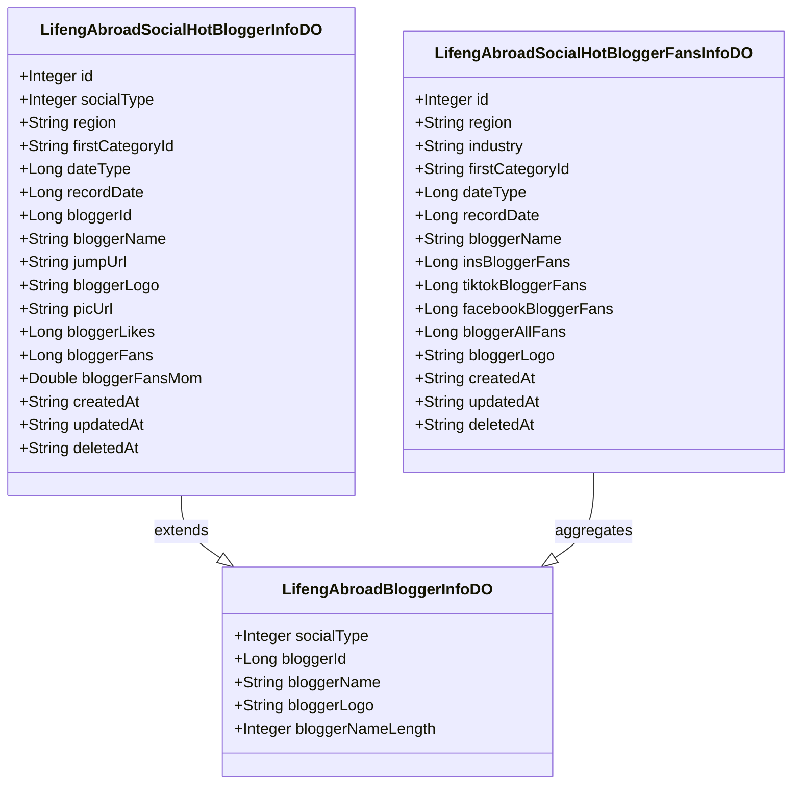
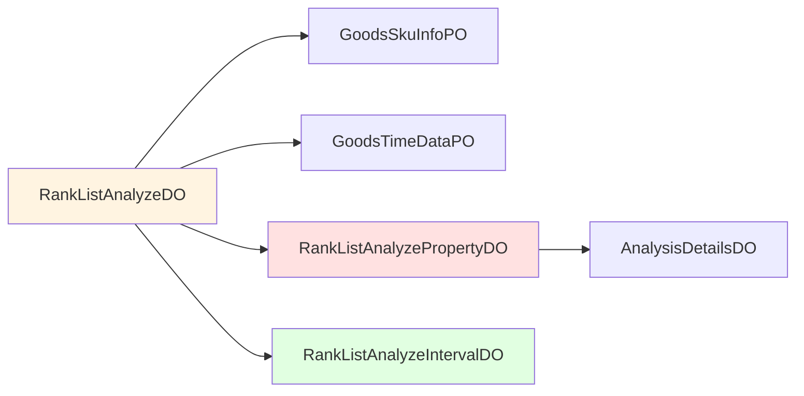
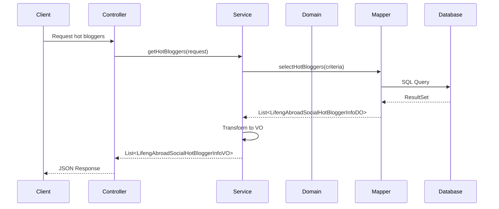
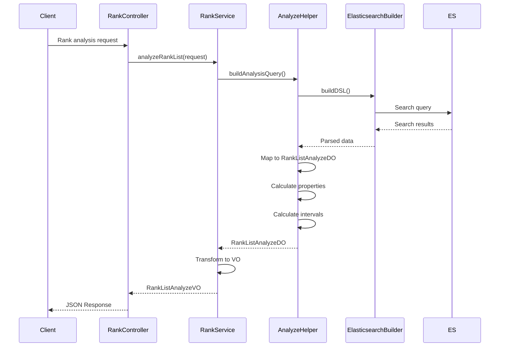
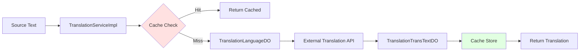
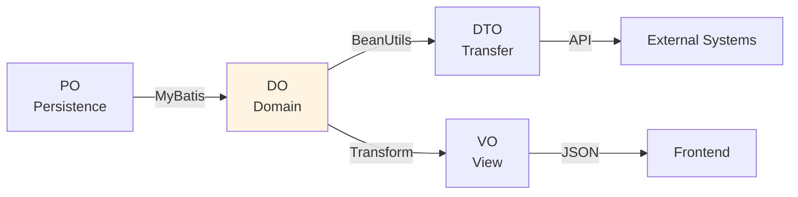
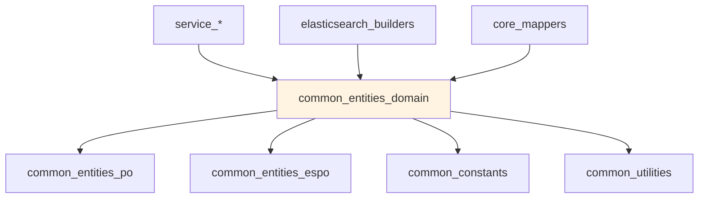

# Common Entities Domain Module

## Overview

The **common_entities_domain** module serves as the core domain object layer for the TrendEngine backend system. It contains Domain Objects (DO) that represent business entities and data structures used throughout the application. These domain objects act as an intermediate layer between the persistence layer (PO - Persistence Objects) and the presentation layer (VO - View Objects), encapsulating business logic and data transformations.

### Module Purpose

- **Domain Modeling**: Defines business domain entities that represent core concepts in the fashion trend analysis system
- **Data Transfer**: Facilitates data transfer between different layers of the application
- **Business Logic Encapsulation**: Contains domain-specific data structures for consumer analysis, rank list analysis, translation, and user management
- **Type Safety**: Provides strongly-typed objects for business operations

### Key Characteristics

- **Layer Independence**: Domain objects are independent of persistence and presentation concerns
- **Business-Centric**: Focuses on business concepts rather than technical implementation
- **Immutable Design**: Uses Lombok annotations for clean, maintainable code
- **MyBatis Integration**: Annotated with MyBatis-Plus for database mapping where needed

---

## Architecture

### Module Structure

```mermaid
graph TB
    subgraph "Common Entities Domain Module"
        subgraph "Consumer Analysis Domain"
            CA1[LifengAbroadBloggerInfoDO]
            CA2[LifengAbroadSocialHotBloggerInfoDO]
            CA3[LifengAbroadSocialHotBlogInfoDO]
            CA4[LifengAbroadSocialHotTopicInfoDO]
            CA5[LifengAbroadSocialBlogKeywordsInfoDO]
            CA6[LifengAbroadSocialBrandInfoDO]
            CA7[LifengAbroadKeywordCategoryInfoDO]
            CA8[LifengAbroadCategoryKeywordNumDO]
            CA9[LifengAbroadKeywordCategoryCountAggDO]
            CA10[LifengAbroadSocialHotBloggerFansInfoDO]
        end
        
        subgraph "Rank List Analysis Domain"
            RL1[RankListAnalyzeDO]
            RL2[RankListAnalyzePropertyDO]
            RL3[RankListAnalyzeIntervalDO]
            RL4[AnalysisDetailsDO]
        end
        
        subgraph "Translation Domain"
            TR1[TranslationLanguageDO]
            TR2[TranslationTransTextDO]
            TR3[TranslationMetaTextDO]
            TR4[TranslationTextBO]
        end
        
        subgraph "User Domain"
            US1[UserInfoEntity]
            US2[IUnionIdFilter]
        end
        
        subgraph "Other Domains"
            OT1[HomepageUserCustomisationDO]
            OT2[CommonRespDO]
            OT3[TraceLog]
            OT4[LocalTraceLog]
        end
    end
    
    subgraph "Related Modules"
        PO[common_entities_po<br/>Persistence Objects]
        VO[common_entities_vo<br/>View Objects]
        DTO[common_entities_dto<br/>Data Transfer Objects]
        SVC[service_*<br/>Business Services]
    end
    
    PO -->|Maps to| CA1
    PO -->|Maps to| RL1
    PO -->|Maps to| TR1
    
    CA1 -->|Transforms to| VO
    RL1 -->|Transforms to| VO
    TR1 -->|Transforms to| VO
    
    SVC -->|Uses| CA1
    SVC -->|Uses| RL1
    SVC -->|Uses| TR1
    SVC -->|Uses| US1
    
    DTO -->|Converts to| CA1
    DTO -->|Converts to| RL1

    style CA1 fill:#e1f5ff
    style RL1 fill:#fff4e1
    style TR1 fill:#f0e1ff
    style US1 fill:#e1ffe1
```



### Domain Object Categories

The module organizes domain objects into logical categories based on business functionality:

| Category | Purpose | Key Objects |
|----------|---------|-------------|
| **Consumer Analysis** | Social media analytics and trend discovery | Blogger info, hot topics, keywords, brand analysis |
| **Rank List Analysis** | Product ranking and competitive analysis | Rank data, property analysis, interval statistics |
| **Translation** | Multi-language support | Language configuration, text translation |
| **User Management** | User and team information | User entities, authentication data |
| **Overview & Insights** | Business intelligence and analytics | Price ranges, discount ranges, key-value pairs |
| **Tracing & Monitoring** | System observability | Trace logs, local logs |

---

## Core Components

### 1. Consumer Analysis Domain Objects

These objects support social media analysis, trend discovery, and consumer insights across multiple platforms (Instagram, TikTok, Facebook).

#### 1.1 LifengAbroadBloggerInfoDO

**Purpose**: Represents basic social media blogger/influencer information.

**Key Fields**:
- `socialType`: Platform identifier (1=Instagram, 2=TikTok, 3=Facebook, 0=All)
- `bloggerId`: Unique blogger identifier
- `bloggerName`: Blogger's display name
- `bloggerLogo`: Profile picture URL
- `bloggerNameLength`: Name length for display optimization

**Database Mapping**: `lifeng_abroad_blogger_info`

**Usage Context**: Used in blogger search, recommendation, and profile display features.



#### 1.2 LifengAbroadSocialHotBloggerInfoDO

**Purpose**: Detailed hot blogger information with metrics and temporal data.

**Key Features**:
- Regional and category segmentation
- Time-series data support (monthly/quarterly)
- Engagement metrics (likes, fans)
- Growth indicators (MoM fan growth)

**Database Mapping**: `lifeng_abroad_social_hot_blogger_info_v2`

**Related Services**: 
- `service_consumer_analysis.ConsumerAnalysisServiceImpl`
- `service_social.SocialAnalysisServiceImpl`

#### 1.3 LifengAbroadSocialHotBlogInfoDO

**Purpose**: Represents trending social media posts/content.

**Key Fields**:
- `blogId`: Unique blog/post identifier
- `bloggerId`: Author identifier
- `blogLikes`: Engagement metric
- `blogType`: Content type (0=Image, 1=Video)
- `picUrl`: Cover image URL
- `jumpUrl`: Original platform link

**Database Mapping**: `lifeng_abroad_social_hot_blog_info_v3`

**Business Logic**: Supports hot content discovery, trend analysis, and content recommendation.

#### 1.4 LifengAbroadSocialHotTopicInfoDO

**Purpose**: Tracks trending topics and hashtags across social platforms.

**Key Fields**:
- `topic`: Topic/hashtag text
- `topicCnt`: Occurrence count
- `topicUrl`: Platform-specific topic URL
- Multi-level category support (first/second/third)

**Database Mapping**: `lifeng_abroad_social_hot_topic_info_v3`

**Analytics Support**: Powers topic trend analysis, category insights, and content discovery.

#### 1.5 LifengAbroadSocialBlogKeywordsInfoDO

**Purpose**: Links keywords to social media content for search and discovery.

**Key Fields**:
- `keywords`: Search keyword
- `blogId`: Associated content ID
- `blogContent`: Post content text
- `industry`: Industry classification
- Category hierarchy (first/second level)

**Database Mapping**: `lifeng_abroad_social_blog_keywords_info_v2`

**Search Integration**: Enables keyword-based content discovery and trend analysis.

#### 1.6 LifengAbroadSocialBrandInfoDO

**Purpose**: Brand information for social media analysis.

**Key Fields**:
- `brandName`: Brand identifier
- Audit timestamps (created/updated)

**Database Mapping**: `lifeng_abroad_social_brand_info`

**Brand Analytics**: Supports brand monitoring and competitive analysis.

#### 1.7 Keyword and Category Analysis Objects

**LifengAbroadKeywordCategoryInfoDO**: Maps keywords to visual content
- `keyword`: Search term
- `picUrl`: Representative image

**LifengAbroadCategoryKeywordNumDO**: Keyword count by category
- `categoryId`: Category identifier
- `keywordNum`: Number of keywords

**LifengAbroadKeywordCategoryCountAggDO**: Aggregated keyword statistics
- Multi-level category hierarchy
- `keywordNum`: Aggregated count

---

### 2. Rank List Analysis Domain Objects

These objects support product ranking analysis, competitive intelligence, and market insights.

#### 2.1 RankListAnalyzeDO

**Purpose**: Core ranking analysis data structure for products.

**Key Fields**:
```java
- id: Integer                    // Ranking product ID
- productId: String              // Product identifier
- productName: String            // Product name
- platformType: Integer          // Platform (1=Shein, 2=Zaful, 3=Asos)
- skuId: String                  // SKU identifier
- score: BigDecimal              // Product rating
- commentNum: BigDecimal         // Review count
- date: String                   // Analysis date
- size: Integer                  // Period length
- firCategoryId: Integer         // First-level category
- secCategoryId: Integer         // Second-level category
- thdCategoryId: Integer         // Third-level category
- originCategoryId: String       // Original platform category
- categoryName: String           // Category name
- skuInfoList: List<GoodsSkuInfoPO>  // SKU details
- color: String                  // Color attribute
- properties: String             // Style properties
- timeData: List<GoodsTimeDataPO>    // Time-series data
- sprice: BigDecimal             // Sale price
```

**Dependencies**:
- `GoodsSkuInfoPO` from [common_entities_espo](common_entities_espo.md)
- `GoodsTimeDataPO` from [common_entities_espo](common_entities_espo.md)

**Usage**: Powers rank list analysis, competitive benchmarking, and trend identification.



#### 2.2 RankListAnalyzePropertyDO

**Purpose**: Property-based analysis (category, color, style) for ranked products.

**Key Fields**:
- `termField`: Property field name (category/color/style)
- `itemNum`: Unique product count
- `goodsCount`: Total count (with duplicates)
- `itemRatio`: Product ratio
- `distanctItemNum`: Distinct item count
- `buckets`: Time-series details (List<AnalysisDetailsDO>)

**Nested Class**: `AnalysisDetailsDO`
- `date`: Time period
- `itemNum`: Product count
- `itemRatio`: Ratio for period

**Analytics**: Supports property distribution analysis, trend identification, and market segmentation.

#### 2.3 RankListAnalyzeIntervalDO

**Purpose**: Interval-based analysis for numeric properties (price, rating).

**Key Fields**:
- `distanctItemNum`: Distinct product count
- `maxProperty`: Maximum value in interval
- `minProperty`: Minimum value in interval
- `itemNum`: Total product count
- `itemRatio`: Interval ratio

**Use Cases**: Price band analysis, rating distribution, market positioning.

---

### 3. Translation Domain Objects

Support multi-language functionality across the platform.

#### 3.1 TranslationLanguageDO

**Purpose**: Language configuration and metadata.

**Key Fields**:
- `id`: Primary key
- `lang`: Language code (e.g., "en", "zh", "es")
- `desc`: Language description
- Audit timestamps (created/updated/deleted)

**Integration**: Used by [common_translation](common_translation.md) module for language management.

#### 3.2 Translation Text Objects

**TranslationTransTextDO**: Translated text storage
**TranslationMetaTextDO**: Translation metadata
**TranslationTextBO**: Business object for translation operations

**Related Services**: `service_translate.TranslationServiceImpl`

---

### 4. User Domain Objects

#### 4.1 UserInfoEntity

**Purpose**: Core user information entity.

**Key Fields**:
- `userId`: User identifier
- `teamId`: Team/organization identifier

**Constructors**:
- Default constructor
- Parameterized constructor for quick instantiation

**Usage**: Authentication, authorization, and user context management.

**Related Modules**:
- [service_account](service_account.md)
- [service_authority](service_authority.md)

#### 4.2 IUnionIdFilter

**Purpose**: Interface for union ID filtering operations.

**Usage**: User identity resolution across multiple authentication providers.

---

### 5. Other Domain Objects

#### 5.1 HomepageUserCustomisationDO

**Purpose**: User homepage customization preferences.

**Related**: Homepage personalization features.

#### 5.2 CommonRespDO

**Purpose**: Generic response wrapper for domain operations.

**Usage**: Standardized response format across services.

#### 5.3 Trace and Monitoring Objects

**TraceLog**: Distributed tracing information
**LocalTraceLog**: Local trace context

**Integration**: System observability and debugging.

---

## Data Flow

### Consumer Analysis Data Flow



### Rank List Analysis Data Flow



### Translation Data Flow



---

## Integration Points

### 1. Persistence Layer Integration

Domain objects integrate with the persistence layer through MyBatis-Plus annotations:

```java
@Data
@TableName("lifeng_abroad_social_hot_blogger_info_v2")
public class LifengAbroadSocialHotBloggerInfoDO implements Serializable {
    // Fields mapped to database columns
}
```

**Related Mappers**:
- `LifengAbroadSocialBlogKeywordsInfoMapper` (from [core_mappers](core_mappers.md))
- `FacebookBloggerMappingMapper`
- Various entity-specific mappers

### 2. Service Layer Integration

Domain objects are consumed by service implementations:

**Consumer Analysis Services**:
- `service_consumer_analysis.ConsumerAnalysisServiceImpl`
- `service_social.SocialAnalysisServiceImpl`

**Rank Analysis Services**:
- `service_rank_list.RankListServiceImpl`
- `service_rank_list.RankListManagerServiceImpl`
- `service_overview.OverviewAnalyzeServiceImpl`

**Translation Services**:
- `service_translate.TranslationServiceImpl`
- `service_translate.TranslateDictServiceImpl`

### 3. Elasticsearch Integration

Rank analysis domain objects integrate with Elasticsearch through query builders:

**Related Builders** (from [elasticsearch_builders](elasticsearch_builders.md)):
- `LfGoodsQueryBuilder`
- `LfGoodsSkcQueryBuilder`
- `SearchKeyGoogleTrendQueryBuilder`

### 4. DTO/VO Transformation

Domain objects transform to/from DTOs and VOs:



**Transformation Utilities**:
- `BeanUtils` from [common_utilities](common_utilities.md)
- Custom transformation logic in service layer

---

## Design Patterns

### 1. Data Transfer Object (DTO) Pattern

Domain objects serve as DTOs between layers, ensuring:
- **Separation of Concerns**: Business logic separated from presentation
- **Type Safety**: Strongly-typed data structures
- **Validation**: Data integrity through annotations

### 2. Builder Pattern

Complex domain objects support builder-style construction:

```java
RankListAnalyzeDO rankData = new RankListAnalyzeDO();
rankData.setProductId(productId);
rankData.setProductName(name);
rankData.setSkuInfoList(skuList);
rankData.setTimeData(timeSeriesData);
```

### 3. Composition Pattern

Domain objects compose other domain objects:

```java
public class RankListAnalyzeDO {
    private List<GoodsSkuInfoPO> skuInfoList;      // Composition
    private List<GoodsTimeDataPO> timeData;        // Composition
}

public class RankListAnalyzePropertyDO {
    private List<AnalysisDetailsDO> buckets;       // Composition
}
```

### 4. Serialization Pattern

All domain objects implement `Serializable` for:
- **Caching**: Redis serialization
- **Distributed Systems**: Cross-service communication
- **Session Management**: User context persistence

---

## Usage Examples

### Example 1: Consumer Analysis - Hot Blogger Query

```java
// Service layer
public List<LifengAbroadSocialHotBloggerInfoVO> getHotBloggers(
    String region, String categoryId, Long recordDate) {
    
    // Query domain objects from database
    List<LifengAbroadSocialHotBloggerInfoDO> bloggers = 
        bloggerMapper.selectHotBloggers(region, categoryId, recordDate);
    
    // Transform to view objects
    return bloggers.stream()
        .map(this::convertToVO)
        .collect(Collectors.toList());
}

private LifengAbroadSocialHotBloggerInfoVO convertToVO(
    LifengAbroadSocialHotBloggerInfoDO domain) {
    
    LifengAbroadSocialHotBloggerInfoVO vo = new LifengAbroadSocialHotBloggerInfoVO();
    BeanUtils.copyProperties(domain, vo);
    
    // Additional transformations
    vo.setFansGrowthRate(calculateGrowthRate(domain.getBloggerFansMom()));
    vo.setPlatformName(getPlatformName(domain.getSocialType()));
    
    return vo;
}
```

### Example 2: Rank List Analysis

```java
// Service layer
public RankListAnalyzeVO analyzeRankList(RankListAnalyzeRequest request) {
    
    // Build Elasticsearch query
    SearchRequest searchRequest = buildRankAnalysisQuery(request);
    
    // Execute search
    SearchResponse response = elasticsearchClient.search(searchRequest);
    
    // Parse results to domain objects
    List<RankListAnalyzeDO> rankData = parseSearchResults(response);
    
    // Perform property analysis
    List<RankListAnalyzePropertyDO> propertyAnalysis = 
        analyzeProperties(rankData, request.getPropertyFields());
    
    // Perform interval analysis
    List<RankListAnalyzeIntervalDO> intervalAnalysis = 
        analyzeIntervals(rankData, request.getIntervalField());
    
    // Build response VO
    RankListAnalyzeVO result = new RankListAnalyzeVO();
    result.setRankData(convertToVOList(rankData));
    result.setPropertyAnalysis(convertPropertyToVO(propertyAnalysis));
    result.setIntervalAnalysis(convertIntervalToVO(intervalAnalysis));
    
    return result;
}
```

### Example 3: Translation Language Management

```java
// Service layer
public List<TranslationLanguageDO> getSupportedLanguages() {
    // Query from database
    return translationLanguageMapper.selectAll();
}

public void addLanguage(String langCode, String description) {
    TranslationLanguageDO language = new TranslationLanguageDO();
    language.setLang(langCode);
    language.setDesc(description);
    language.setCreatedAt(DateUtil.now());
    
    translationLanguageMapper.insert(language);
}
```

### Example 4: User Context Management

```java
// Service layer
public UserInfoEntity getCurrentUser() {
    Integer userId = AuthUtils.getUserId();
    Integer teamId = AuthUtils.getTeamId();
    
    return new UserInfoEntity(userId, teamId);
}

public boolean hasTeamAccess(UserInfoEntity user, Integer targetTeamId) {
    return user.getTeamId().equals(targetTeamId);
}
```

---

## Best Practices

### 1. Domain Object Design

**DO**:
- ✅ Keep domain objects focused on business concepts
- ✅ Use meaningful field names that reflect business terminology
- ✅ Include audit fields (created/updated/deleted timestamps)
- ✅ Implement `Serializable` for caching and distribution
- ✅ Use appropriate data types (BigDecimal for money, Long for IDs)

**DON'T**:
- ❌ Include presentation logic in domain objects
- ❌ Mix persistence annotations with business logic
- ❌ Create circular dependencies between domain objects
- ❌ Use primitive types for nullable fields

### 2. Transformation Guidelines

```java
// Good: Explicit transformation with validation
public LifengAbroadSocialHotBloggerInfoVO toVO(LifengAbroadSocialHotBloggerInfoDO domain) {
    if (domain == null) {
        return null;
    }
    
    LifengAbroadSocialHotBloggerInfoVO vo = new LifengAbroadSocialHotBloggerInfoVO();
    BeanUtils.copyProperties(domain, vo);
    
    // Business logic transformations
    vo.setPlatformName(resolvePlatformName(domain.getSocialType()));
    vo.setFormattedFans(formatNumber(domain.getBloggerFans()));
    
    return vo;
}

// Bad: Direct exposure of domain objects
public LifengAbroadSocialHotBloggerInfoDO getBlogger(Long id) {
    return bloggerMapper.selectById(id); // Don't return DO directly to controller
}
```

### 3. Null Safety

```java
// Use Optional for nullable domain objects
public Optional<TranslationLanguageDO> findLanguage(String langCode) {
    return Optional.ofNullable(languageMapper.selectByLangCode(langCode));
}

// Defensive null checks in transformations
public RankListAnalyzeVO toVO(RankListAnalyzeDO domain) {
    RankListAnalyzeVO vo = new RankListAnalyzeVO();
    
    if (domain.getSkuInfoList() != null) {
        vo.setSkuList(domain.getSkuInfoList().stream()
            .map(this::convertSkuToVO)
            .collect(Collectors.toList()));
    }
    
    return vo;
}
```

### 4. Performance Considerations

```java
// Lazy loading for expensive operations
public class RankListAnalyzeDO {
    private List<GoodsSkuInfoPO> skuInfoList;
    
    // Don't load all SKUs by default
    public List<GoodsSkuInfoPO> getSkuInfoList() {
        if (skuInfoList == null) {
            skuInfoList = loadSkuInfo(); // Load on demand
        }
        return skuInfoList;
    }
}

// Batch operations for multiple domain objects
public List<LifengAbroadSocialHotBloggerInfoDO> getBloggersBatch(List<Long> bloggerIds) {
    return bloggerMapper.selectBatchIds(bloggerIds); // Single query
}
```

---

## Dependencies

### Internal Dependencies



**Direct Dependencies**:
- [common_entities_po](common_entities_po.md) - Persistence objects for database mapping
- [common_entities_espo](common_entities_espo.md) - Elasticsearch persistence objects
- [common_constants](common_constants.md) - System constants and enumerations
- [common_utilities](common_utilities.md) - Utility functions (BeanUtils, DateUtil)

**Dependent Modules**:
- [service_consumer_analysis](service_consumer_analysis.md)
- [service_rank_list](service_rank_list.md)
- [service_translate](service_translate.md)
- [service_social](service_social.md)
- [elasticsearch_builders](elasticsearch_builders.md)
- [core_mappers](core_mappers.md)

### External Dependencies

- **MyBatis-Plus**: `@TableName` annotations for ORM mapping
- **Lombok**: `@Data` annotations for boilerplate code reduction
- **Swagger**: `@ApiModelProperty` for API documentation
- **Java Serialization**: `Serializable` interface for object serialization

---

## Configuration

### MyBatis-Plus Configuration

Domain objects use MyBatis-Plus annotations for database mapping:

```java
@TableName("table_name")  // Maps to database table
public class DomainObject implements Serializable {
    @TableId(type = IdType.AUTO)  // Auto-increment primary key
    private Integer id;
    
    @TableField("column_name")     // Custom column mapping
    private String fieldName;
}
```

**Configuration Reference**: See [core_configuration](core_configuration.md) for MyBatis-Plus setup.

### Serialization Configuration

All domain objects implement `Serializable` for:
- Redis caching (see [common_cache](common_cache.md))
- Distributed session management
- Message queue integration

---

## Testing Considerations

### Unit Testing Domain Objects

```java
@Test
public void testRankListAnalyzeDO_Construction() {
    RankListAnalyzeDO rankData = new RankListAnalyzeDO();
    rankData.setProductId("PROD123");
    rankData.setProductName("Test Product");
    rankData.setScore(new BigDecimal("4.5"));
    
    assertEquals("PROD123", rankData.getProductId());
    assertEquals("Test Product", rankData.getProductName());
    assertEquals(0, new BigDecimal("4.5").compareTo(rankData.getScore()));
}

@Test
public void testUserInfoEntity_ConstructorInitialization() {
    UserInfoEntity user = new UserInfoEntity(100, 200);
    
    assertEquals(Integer.valueOf(100), user.getUserId());
    assertEquals(Integer.valueOf(200), user.getTeamId());
}
```

### Integration Testing with Mappers

```java
@SpringBootTest
public class BloggerDomainIntegrationTest {
    
    @Autowired
    private LifengAbroadSocialBlogKeywordsInfoMapper mapper;
    
    @Test
    public void testBloggerInfoMapping() {
        LifengAbroadSocialHotBloggerInfoDO blogger = 
            mapper.selectById(1);
        
        assertNotNull(blogger);
        assertNotNull(blogger.getBloggerName());
        assertTrue(blogger.getSocialType() >= 0 && blogger.getSocialType() <= 3);
    }
}
```

---

## Troubleshooting

### Common Issues

#### 1. Serialization Errors

**Problem**: `NotSerializableException` when caching domain objects

**Solution**:
```java
// Ensure all domain objects implement Serializable
public class MyDomainObject implements Serializable {
    private static final long serialVersionUID = 1L;
    // fields...
}
```

#### 2. MyBatis Mapping Issues

**Problem**: Fields not mapping correctly from database

**Solution**:
```java
// Use @TableField for custom column mapping
@TableField("db_column_name")
private String javaFieldName;

// Or configure MyBatis to use camelCase mapping
mybatis-plus:
  configuration:
    map-underscore-to-camel-case: true
```

#### 3. Null Pointer Exceptions

**Problem**: NPE when accessing nested domain objects

**Solution**:
```java
// Use defensive null checks
public List<GoodsSkuInfoPO> getSkuInfoList() {
    return skuInfoList != null ? skuInfoList : Collections.emptyList();
}

// Or use Optional
public Optional<List<GoodsSkuInfoPO>> getSkuInfoListOptional() {
    return Optional.ofNullable(skuInfoList);
}
```

#### 4. BigDecimal Precision Issues

**Problem**: Incorrect decimal calculations in financial fields

**Solution**:
```java
// Always use BigDecimal for monetary values
private BigDecimal sprice;  // ✅ Correct

// Set scale explicitly
BigDecimal price = new BigDecimal("19.99").setScale(2, RoundingMode.HALF_UP);
```

---

## Performance Optimization

### 1. Lazy Loading

```java
// Load expensive nested objects only when needed
public class RankListAnalyzeDO {
    private transient List<GoodsSkuInfoPO> skuInfoList;  // transient = not serialized
    
    public List<GoodsSkuInfoPO> getSkuInfoList() {
        if (skuInfoList == null && productId != null) {
            skuInfoList = skuService.loadSkusByProductId(productId);
        }
        return skuInfoList;
    }
}
```

### 2. Batch Operations

```java
// Fetch multiple domain objects in single query
public List<LifengAbroadSocialHotBloggerInfoDO> getBloggersBatch(List<Long> ids) {
    if (ids.isEmpty()) {
        return Collections.emptyList();
    }
    return bloggerMapper.selectBatchIds(ids);  // Single SQL query
}
```

### 3. Caching Strategy

```java
// Cache frequently accessed domain objects
@Cacheable(value = "languages", key = "#langCode")
public TranslationLanguageDO getLanguage(String langCode) {
    return languageMapper.selectByLangCode(langCode);
}
```

---

## Future Enhancements

### Planned Improvements

1. **Immutable Domain Objects**: Consider using immutable objects with builders for thread safety
2. **Validation Annotations**: Add JSR-303 validation annotations for data integrity
3. **Audit Trail**: Enhance audit fields with user tracking and change history
4. **Event Sourcing**: Implement domain events for better observability
5. **GraphQL Support**: Add GraphQL schema generation from domain objects

### Migration Considerations

When evolving domain objects:
- Maintain backward compatibility with existing VOs/DTOs
- Version domain objects for breaking changes
- Document migration paths in service layer
- Use database migration tools (Flyway/Liquibase) for schema changes

---

## Related Documentation

- [common_entities_po](common_entities_po.md) - Persistence Objects
- [common_entities_vo](common_entities_vo.md) - View Objects
- [common_entities_dto](common_entities_dto.md) - Data Transfer Objects
- [common_entities_espo](common_entities_espo.md) - Elasticsearch Persistence Objects
- [service_consumer_analysis](service_consumer_analysis.md) - Consumer Analysis Services
- [service_rank_list](service_rank_list.md) - Rank List Services
- [service_translate](service_translate.md) - Translation Services
- [core_mappers](core_mappers.md) - MyBatis Mappers
- [elasticsearch_builders](elasticsearch_builders.md) - Elasticsearch Query Builders
- [common_utilities](common_utilities.md) - Utility Functions

---

## Summary

The **common_entities_domain** module is a critical component of the TrendEngine backend, providing:

- **Business Domain Modeling**: Clear representation of business concepts
- **Layer Separation**: Clean separation between persistence, domain, and presentation
- **Type Safety**: Strongly-typed objects for compile-time safety
- **Flexibility**: Support for complex analytics and multi-platform data
- **Integration**: Seamless integration with MyBatis, Elasticsearch, and caching layers

By following the patterns and best practices outlined in this documentation, developers can effectively use and extend domain objects to support new business requirements while maintaining code quality and system performance.
