# Common Entities DTO Module

## Overview

The **common_entities_dto** module serves as the Data Transfer Object (DTO) layer for the TrendEngine backend system. It contains specialized data structures designed for transferring data between different layers of the application, particularly between the service layer and external interfaces (controllers, remote APIs, message queues). DTOs provide a clean separation between internal domain models and external data representations, enabling flexible data transformation, validation, and API contract management.

### Module Purpose

- **Data Transfer**: Facilitates efficient and type-safe data transfer between application layers
- **API Contract Definition**: Defines clear contracts for data exchange with external systems and clients
- **Data Aggregation**: Combines data from multiple domain objects into cohesive transfer structures
- **Decoupling**: Isolates internal domain models from external API changes
- **Validation Support**: Provides structures optimized for data validation and transformation

### Key Characteristics

- **Layer Bridge**: Acts as a bridge between domain objects (DO), persistence objects (PO), and view objects (VO)
- **Lightweight**: Contains minimal business logic, focusing on data structure and transfer
- **Serialization-Ready**: Designed for JSON/XML serialization for API responses
- **Immutable Design**: Uses Lombok annotations for clean, maintainable code
- **Type Safety**: Provides strongly-typed objects for all data transfer operations

---

## Architecture

### Module Structure

```mermaid
graph TB
    subgraph "Common Entities DTO Module"
        subgraph "Authentication & Authorization"
            AUTH1[TranslateDataDTO]
            AUTH2[UserRoleDTO]
        end
        
        subgraph "Social Media Platform DTOs"
            SOCIAL1[PinterestBindLogDTO]
            SOCIAL2[TiktokBindLogDTO]
            SOCIAL3[FollowLogDTO]
            SOCIAL4[InsAtBloggerDTO]
            SOCIAL5[PinterestBoardDTO]
            SOCIAL6[PinterestMonitorUserDTO]
            SOCIAL7[TiktokStreamerDTO]
            SOCIAL8[TiktokStreamerStatsDTO]
            SOCIAL9[TiktokVideoDTO]
        end
        
        subgraph "Export & Task Management"
            EXPORT1[ExportExcelDTO]
            EXPORT2[ExportTaskDTO]
        end
        
        subgraph "Goods & Product DTOs"
            GOODS1[GoodsPkDTO]
            GOODS2[GoodsRankMetricDTO]
            GOODS3[RankMetric]
            GOODS4[GoodsListAggProcessDTO]
            GOODS5[GoodsMetricDataDTO]
            GOODS6[PlatformGoodsMetricDTO]
            GOODS7[GoodsStyleExtraDataDTO]
            GOODS8[ConsumerProductDTO]
        end
        
        subgraph "Analytics & Metrics"
            METRIC1[OverviewAggDTO]
            METRIC2[OverviewMetricDTO]
            METRIC3[OverviewMulitLevelMetricDTO]
            METRIC4[OverviewPutOnSaleVO]
            METRIC5[PeriodMetricDTO]
            METRIC6[PriceBandDTO]
            METRIC7[PriceDataDTO]
            METRIC8[DateRangeDTO]
        end
        
        subgraph "Monitoring & Management"
            MONITOR1[EntityMonitorStatusDTO]
            MONITOR2[MonitorManageInfoDTO]
            MONITOR3[GroupEntityCountDTO]
        end
        
        subgraph "Image & Recognition"
            IMAGE1[ImageEntityDTO]
            IMAGE2[BaseLabelValueDTO]
        end
        
        subgraph "Category & Properties"
            CAT1[CategoryMappingDTO]
            CAT2[PropertiesInfoDTO]
            CAT3[PropertyTopValueDTO]
        end
        
        subgraph "Translation & Localization"
            TRANS1[TranslateDictDTO]
        end
        
        subgraph "Market Analysis"
            MARKET1[AssortmentComparisonDTO]
            MARKET2[BrandInfo]
            MARKET3[GoogleSearchCount]
            MARKET4[KeywordProductSocialCount]
        end
        
        subgraph "Internal Analytics"
            INTERNAL1[Blogger]
            INTERNAL2[InternalFiberStatisticsDTO]
        end
    end
    
    subgraph "Related Modules"
        DO[common_entities_domain<br/>Domain Objects]
        PO[common_entities_po<br/>Persistence Objects]
        VO[common_entities_vo<br/>View Objects]
        REQ[common_entities_request<br/>Request Objects]
        SVC[service_*<br/>Business Services]
        CTRL[web_controllers_*<br/>REST Controllers]
    end
    
    DO -->|Converts to| GOODS1
    DO -->|Converts to| METRIC1
    DO -->|Converts to| SOCIAL7
    
    PO -->|Maps to| GOODS1
    PO -->|Maps to| MONITOR1
    PO -->|Maps to| TRANS1
    
    GOODS1 -->|Transforms to| VO
    METRIC1 -->|Transforms to| VO
    SOCIAL7 -->|Transforms to| VO
    
    REQ -->|Processes to| GOODS1
    REQ -->|Processes to| METRIC1
    
    SVC -->|Uses| GOODS1
    SVC -->|Uses| METRIC1
    SVC -->|Uses| SOCIAL7
    SVC -->|Returns| EXPORT2
    
    CTRL -->|Receives| REQ
    CTRL -->|Returns| GOODS1
    CTRL -->|Returns| METRIC1
    
    style GOODS1 fill:#e1f5ff
    style METRIC1 fill:#fff4e1
    style SOCIAL7 fill:#f0e1ff
    style MONITOR1 fill:#e1ffe1
```

### DTO Categories

The module organizes DTOs into functional categories based on their business domain:

| Category | DTOs | Purpose |
|----------|------|---------|
| **Authentication** | TranslateDataDTO, UserRoleDTO | User authentication and role management |
| **Social Media** | PinterestBindLogDTO, TiktokBindLogDTO, FollowLogDTO, InsAtBloggerDTO, etc. | Social platform integration and monitoring |
| **Export** | ExportExcelDTO, ExportTaskDTO | Data export and task management |
| **Goods** | GoodsPkDTO, GoodsRankMetricDTO, GoodsMetricDataDTO, etc. | Product and goods data transfer |
| **Analytics** | OverviewMetricDTO, PeriodMetricDTO, PriceBandDTO, etc. | Metrics and analytical data |
| **Monitoring** | EntityMonitorStatusDTO, MonitorManageInfoDTO | Entity monitoring and status tracking |
| **Image** | ImageEntityDTO, BaseLabelValueDTO | Image recognition and labeling |
| **Category** | CategoryMappingDTO, PropertiesInfoDTO | Product categorization and properties |
| **Translation** | TranslateDictDTO | Multi-language support |
| **Market** | AssortmentComparisonDTO, BrandInfo, GoogleSearchCount | Market analysis and trends |

---

## Component Relationships

### Data Flow Architecture

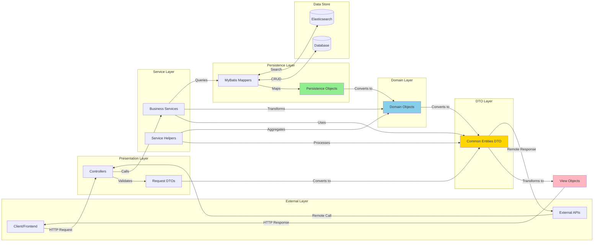

### DTO Transformation Pipeline

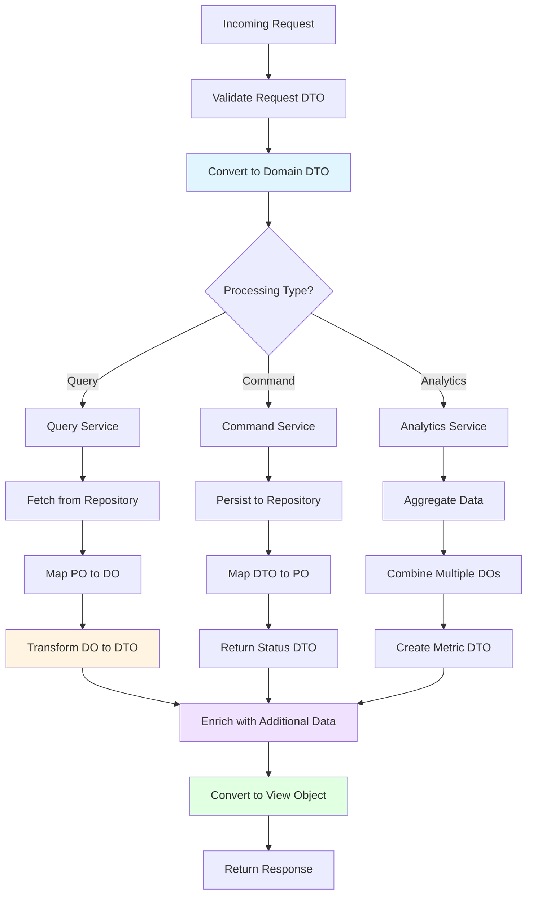

---

## Core DTO Categories

### 1. Authentication & Authorization DTOs

These DTOs handle user authentication, authorization, and role management.

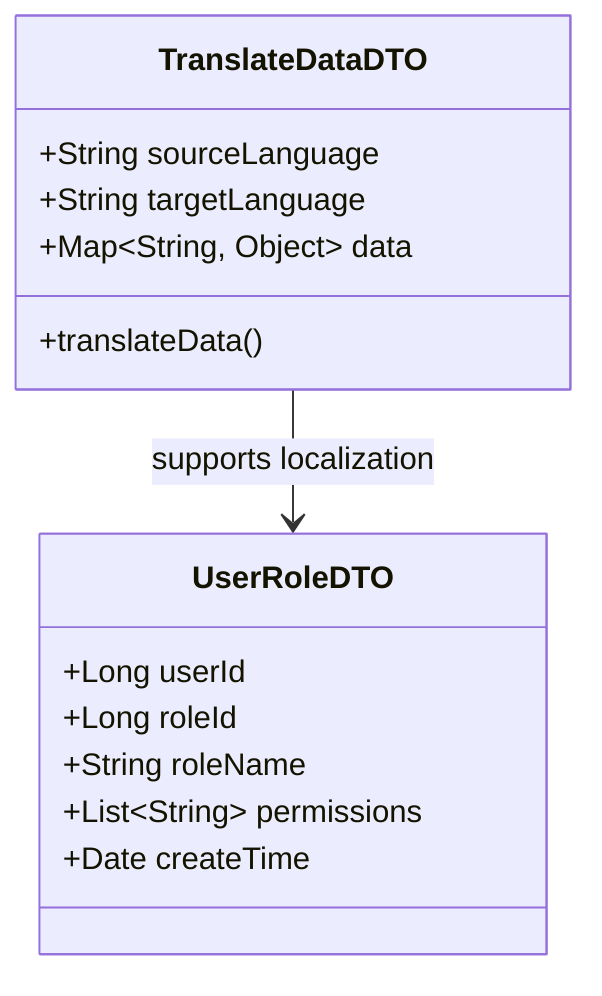

**Key Features:**
- User role and permission management
- Multi-language data translation support
- Session and authentication token handling

**Related Modules:**
- [common_entities_domain](common_entities_domain.md) - UserInfoEntity
- [service_authority](service_authority.md) - AuthorityServiceImpl

---

### 2. Social Media Platform DTOs

DTOs for integrating with and monitoring social media platforms (Pinterest, TikTok, Instagram).

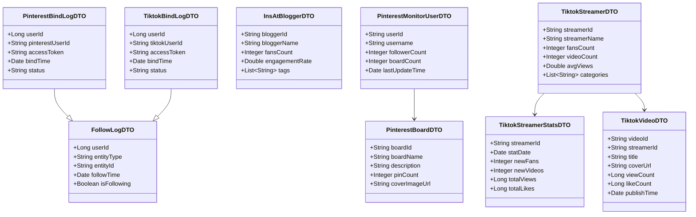

**Key Features:**
- Social platform account binding and authentication
- Influencer/blogger monitoring and tracking
- Engagement metrics and statistics
- Content (pins, videos, posts) management

**Related Modules:**
- [service_pinterest](service_pinterest.md) - Pinterest integration services
- [service_tiktok](service_tiktok.md) - TikTok integration services
- [service_fashion](service_fashion.md) - Instagram fashion blogger services

---

### 3. Export & Task Management DTOs

DTOs for managing data export operations and asynchronous task tracking.

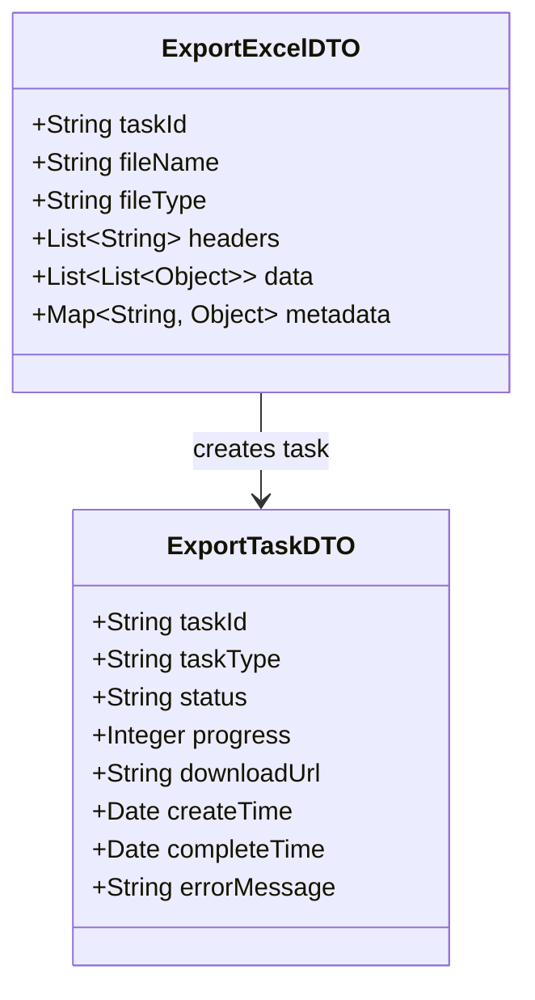

**Key Features:**
- Excel/CSV export configuration
- Asynchronous task status tracking
- Progress monitoring
- Download URL generation

**Related Modules:**
- [common_entities_po](common_entities_po.md) - ExportTaskPO
- Service layer export implementations

---

### 4. Goods & Product DTOs

DTOs for product data, metrics, and ranking information.

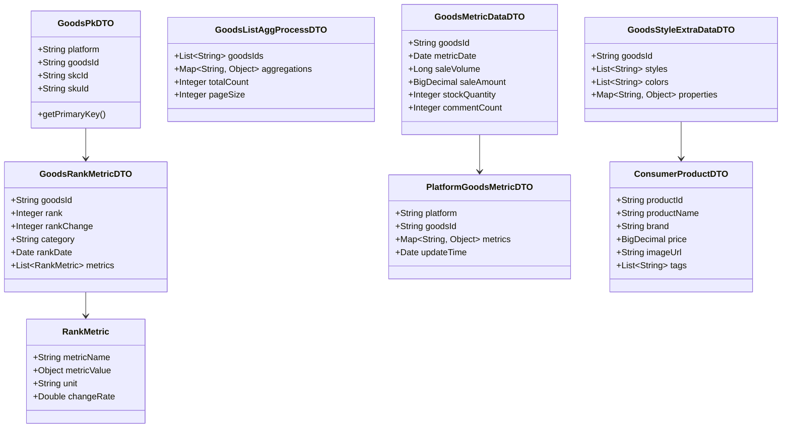

**Key Features:**
- Product identification across platforms
- Ranking and metric tracking
- Sales and inventory data
- Style and property information
- Multi-platform product aggregation

**Related Modules:**
- [common_entities_espo](common_entities_espo.md) - Elasticsearch goods entities
- [service_goods](service_goods.md) - Goods business services
- [service_rank_list](service_rank_list.md) - Ranking services

---

### 5. Analytics & Metrics DTOs

DTOs for analytical data, metrics, and statistical information.

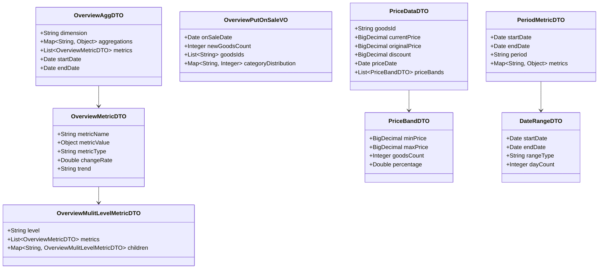

**Key Features:**
- Multi-dimensional metric aggregation
- Time-series data analysis
- Price band analysis
- Trend calculation and comparison
- Hierarchical metric structures

**Related Modules:**
- [service_overview](service_overview.md) - Overview analytics services
- [service_price_range](service_price_range.md) - Price analysis services

---

### 6. Monitoring & Management DTOs

DTOs for entity monitoring, status tracking, and management operations.

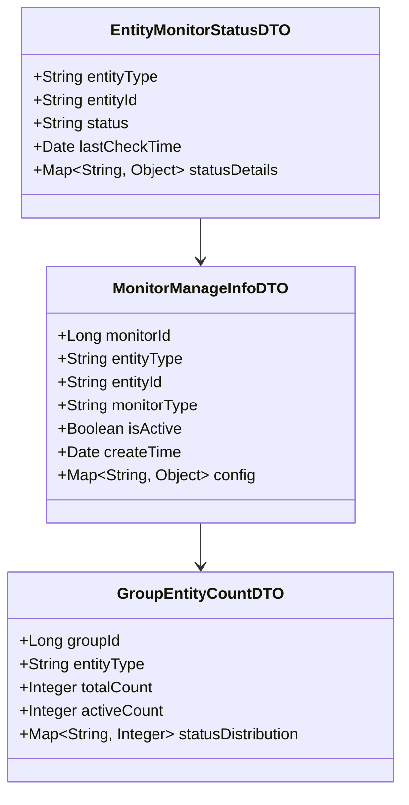

**Key Features:**
- Entity monitoring configuration
- Status tracking and alerting
- Group-based entity management
- Monitor lifecycle management

**Related Modules:**
- [service_helpers](service_helpers.md) - MonitorManageHelper
- User group monitoring services

---

### 7. Image & Recognition DTOs

DTOs for image processing, recognition, and labeling.

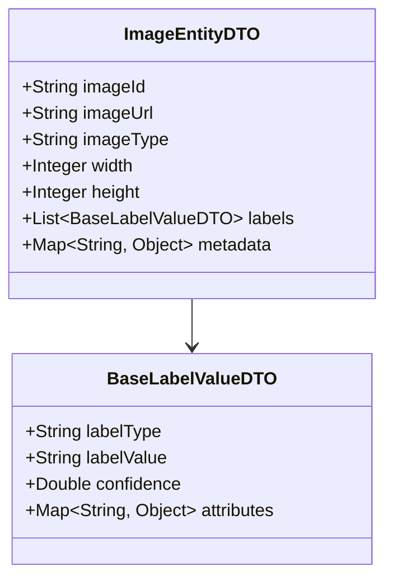

**Key Features:**
- Image metadata management
- Recognition label storage
- Confidence scoring
- Multi-label support

**Related Modules:**
- [elasticsearch_domain](elasticsearch_domain.md) - ImageBusEntityDO
- [service_fashion](service_fashion.md) - FashionImageServiceImpl

---

### 8. Category & Properties DTOs

DTOs for product categorization and property management.

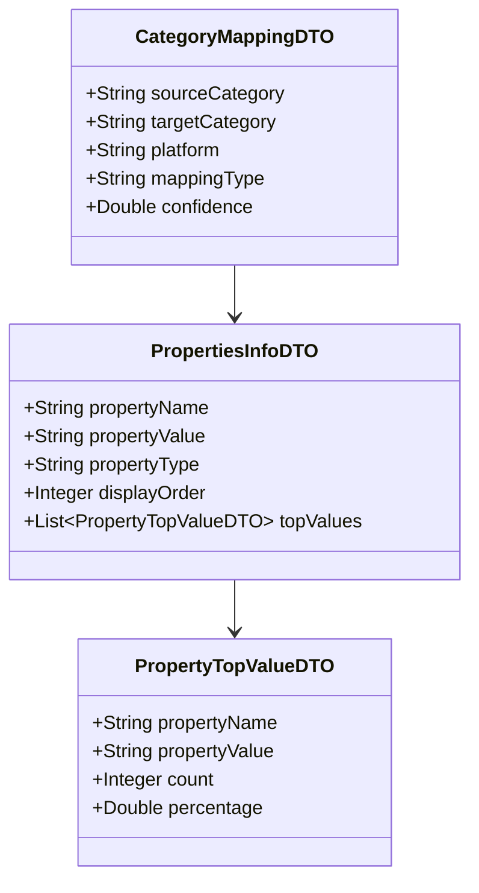

**Key Features:**
- Cross-platform category mapping
- Property value aggregation
- Top value statistics
- Property hierarchy management

**Related Modules:**
- [service_goods](service_goods.md) - GoodsCategoryServiceImpl, GoodsPropertyServiceImpl

---

### 9. Translation & Localization DTOs

DTOs for multi-language support and translation management.

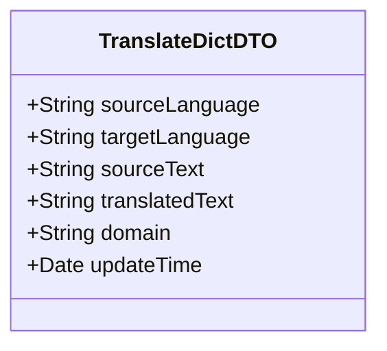

**Key Features:**
- Translation dictionary management
- Domain-specific translations
- Language pair support
- Translation caching

**Related Modules:**
- [common_translation](common_translation.md) - Translation framework
- [service_translate](service_translate.md) - Translation services

---

### 10. Market Analysis DTOs

DTOs for market analysis, brand information, and trend data.

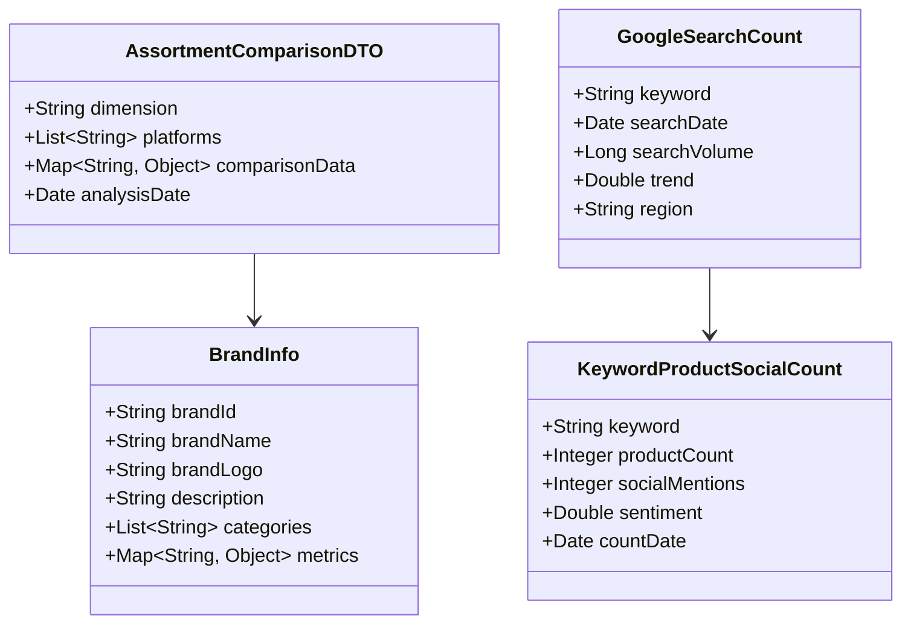

**Key Features:**
- Brand information aggregation
- Search trend analysis
- Social media mention tracking
- Cross-platform comparison

**Related Modules:**
- [service_market_analysis](service_market_analysis.md) - Market analysis services
- [service_consumer_analysis](service_consumer_analysis.md) - Consumer analysis services

---

### 11. Internal Analytics DTOs

DTOs for internal system analytics and statistics.

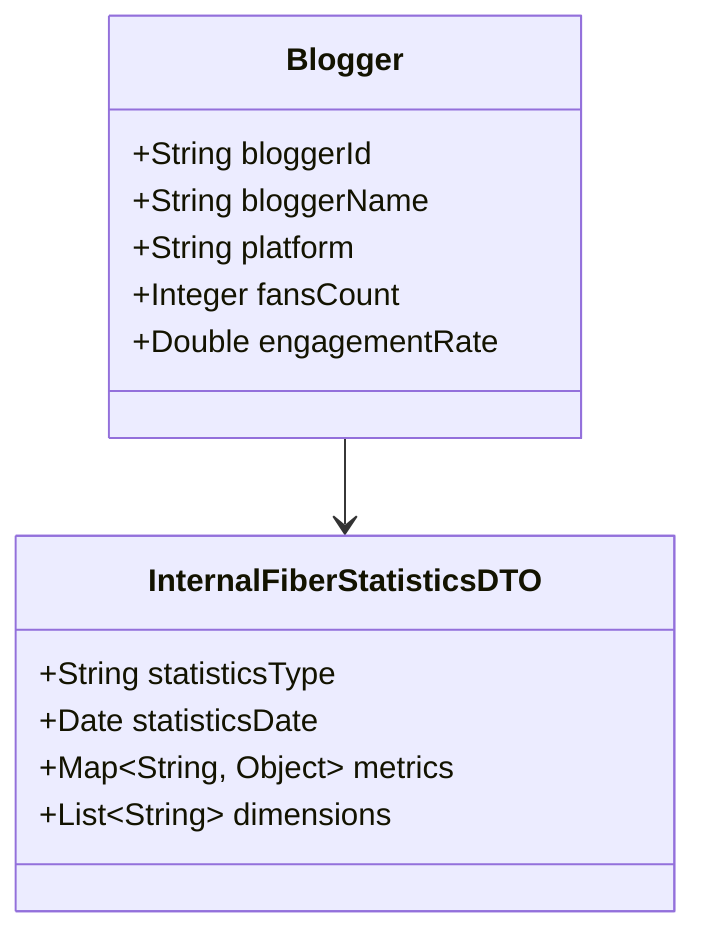

**Key Features:**
- Internal metrics tracking
- Blogger statistics
- System performance data
- Usage analytics

**Related Modules:**
- [service_internal](service_internal.md) - Internal services

---

## DTO Usage Patterns

### Pattern 1: Request-Response Flow

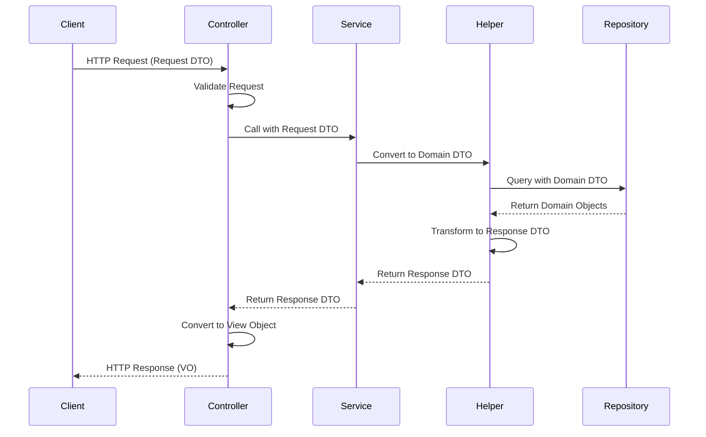

### Pattern 2: Aggregation Flow

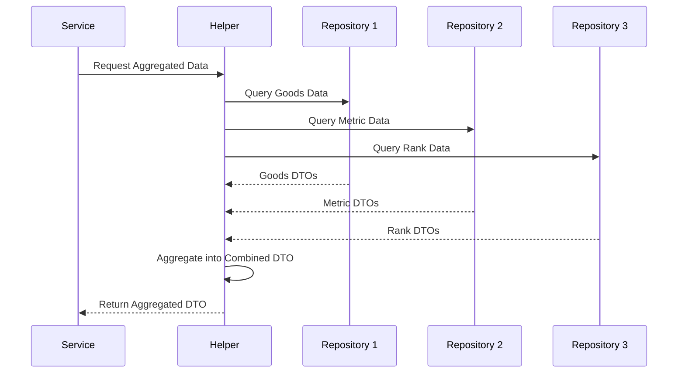

### Pattern 3: Export Flow

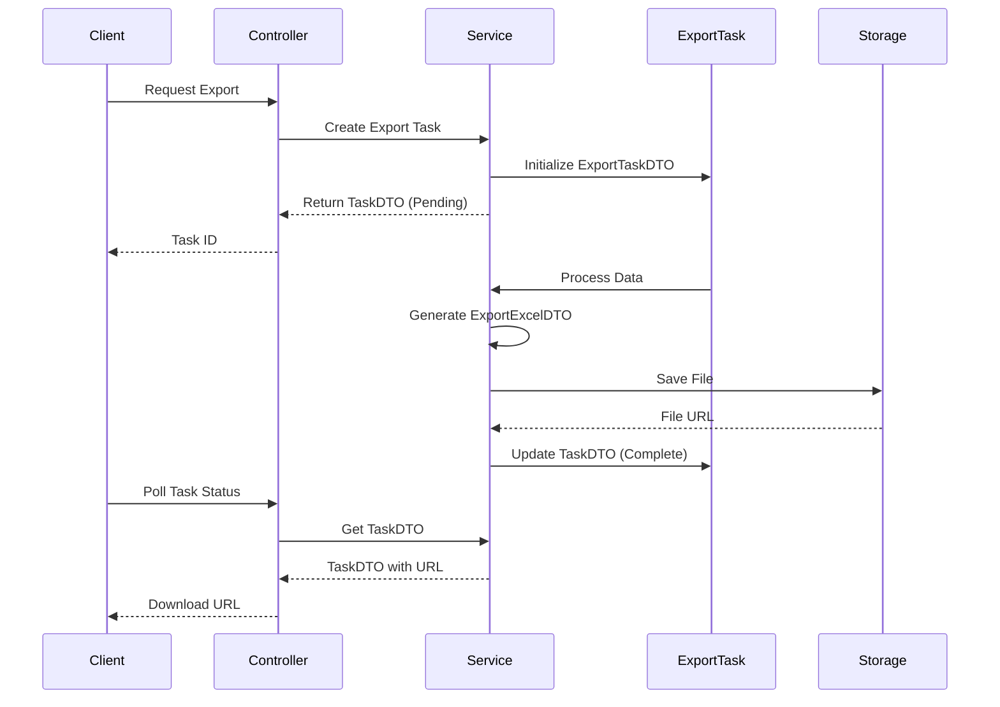

---

## Integration Points

### 1. Controller Layer Integration

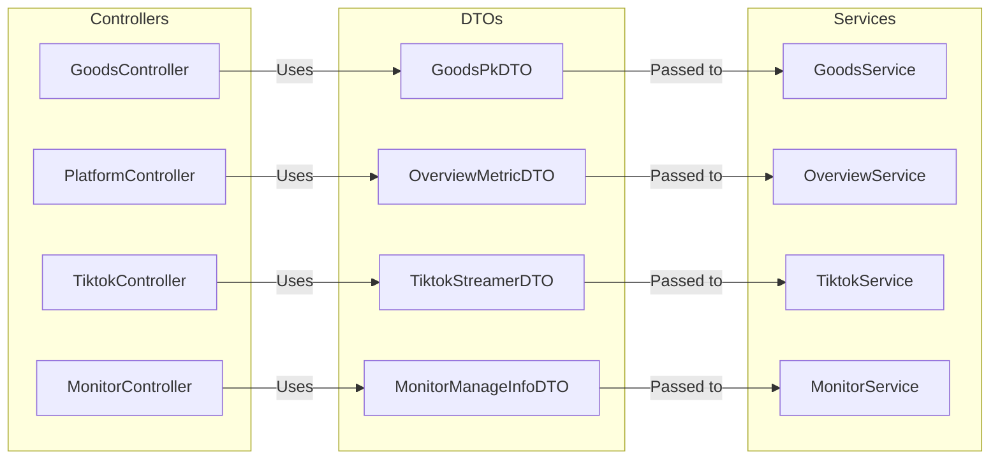

### 2. Service Layer Integration

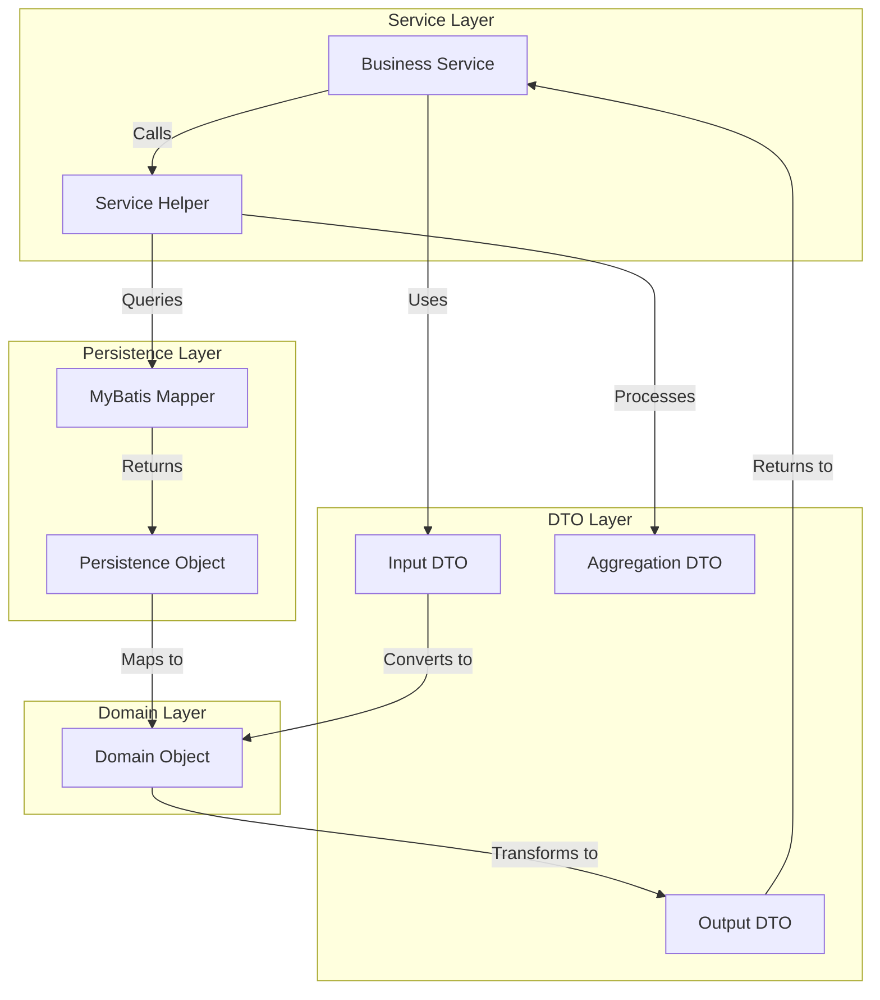

### 3. Remote API Integration

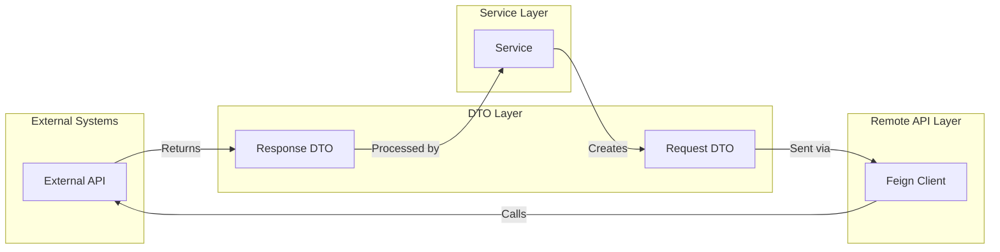

---

## Data Transformation Strategies

### 1. Simple Mapping

Direct field-to-field mapping between DTOs and domain objects:

```java
// PO -> DTO
GoodsPkDTO dto = new GoodsPkDTO();
dto.setPlatform(po.getPlatform());
dto.setGoodsId(po.getGoodsId());
dto.setSkcId(po.getSkcId());
```

### 2. Aggregation Mapping

Combining multiple sources into a single DTO:

```java
// Multiple DOs -> Single DTO
OverviewMetricDTO dto = new OverviewMetricDTO();
dto.setSaleVolume(salesDO.getVolume());
dto.setSaleAmount(salesDO.getAmount());
dto.setGrowthRate(trendDO.getGrowthRate());
dto.setRanking(rankDO.getCurrentRank());
```

### 3. Enrichment Mapping

Adding computed or derived data to DTOs:

```java
// DO -> Enriched DTO
GoodsRankMetricDTO dto = mapper.map(goodsDO);
dto.setRankChange(calculateRankChange(goodsDO));
dto.setTrendIndicator(analyzeTrend(goodsDO));
dto.setMetrics(computeMetrics(goodsDO));
```

### 4. Hierarchical Mapping

Building nested DTO structures:

```java
// Multiple levels -> Hierarchical DTO
OverviewMulitLevelMetricDTO dto = new OverviewMulitLevelMetricDTO();
dto.setLevel("category");
dto.setMetrics(categoryMetrics);
dto.setChildren(buildChildMetrics(subCategories));
```

---

## Best Practices

### 1. DTO Design Principles

- **Single Responsibility**: Each DTO should represent a specific data transfer concern
- **Immutability**: Use `@Data` and `@Builder` for immutable DTOs where possible
- **Validation**: Include validation annotations for data integrity
- **Documentation**: Document complex DTOs with JavaDoc
- **Serialization**: Ensure DTOs are serialization-friendly

### 2. Naming Conventions

- **Suffix**: Always use `DTO` suffix for data transfer objects
- **Descriptive**: Use clear, descriptive names that indicate purpose
- **Consistency**: Follow consistent naming patterns across related DTOs
- **Avoid Abbreviations**: Use full words unless abbreviation is standard

### 3. Field Design

- **Primitive Wrappers**: Use wrapper classes (Integer, Long) instead of primitives for nullable fields
- **Collections**: Use interfaces (List, Map) instead of implementations
- **Date/Time**: Use appropriate date/time types (Date, LocalDateTime)
- **BigDecimal**: Use BigDecimal for monetary values

### 4. Transformation Guidelines

- **Null Safety**: Always check for null values during transformation
- **Default Values**: Provide sensible defaults for missing data
- **Error Handling**: Handle transformation errors gracefully
- **Performance**: Optimize transformations for large datasets

### 5. Version Management

- **Backward Compatibility**: Maintain backward compatibility when modifying DTOs
- **Deprecation**: Use `@Deprecated` for obsolete fields
- **Documentation**: Document breaking changes in release notes
- **Migration**: Provide migration guides for major DTO changes

---

## Related Modules

### Core Dependencies

- **[common_entities_domain](common_entities_domain.md)**: Domain objects that DTOs transform to/from
- **[common_entities_po](common_entities_po.md)**: Persistence objects that map to DTOs
- **[common_entities_vo](common_entities_vo.md)**: View objects that DTOs transform into
- **[common_entities_request](common_entities_request.md)**: Request objects that convert to DTOs

### Service Layer

- **[service_goods](service_goods.md)**: Goods-related DTO processing
- **[service_overview](service_overview.md)**: Analytics and metrics DTO handling
- **[service_tiktok](service_tiktok.md)**: TikTok DTO processing
- **[service_pinterest](service_pinterest.md)**: Pinterest DTO processing
- **[service_fashion](service_fashion.md)**: Fashion and Instagram DTO handling

### Presentation Layer

- **[web_controllers_goods](web_controllers_goods.md)**: Goods API endpoints using DTOs
- **[web_controllers_platform](web_controllers_platform.md)**: Platform API endpoints
- **[web_controllers_tiktok](web_controllers_tiktok.md)**: TikTok API endpoints
- **[web_controllers_overview](web_controllers_overview.md)**: Analytics API endpoints

### Utilities

- **[common_utilities](common_utilities.md)**: Utility functions for DTO transformation
- **[common_translation](common_translation.md)**: Translation support for DTOs

---

## Summary

The **common_entities_dto** module is a critical component of the TrendEngine backend system, providing:

1. **Clean Separation**: Decouples internal domain models from external API contracts
2. **Type Safety**: Ensures type-safe data transfer across application layers
3. **Flexibility**: Enables independent evolution of internal and external data structures
4. **Aggregation**: Supports complex data aggregation from multiple sources
5. **Validation**: Provides structures optimized for data validation
6. **Serialization**: Ensures efficient JSON/XML serialization for APIs
7. **Documentation**: Serves as living documentation of API contracts

The module supports the entire data flow pipeline from external requests through business processing to response generation, making it essential for maintaining clean architecture and separation of concerns in the TrendEngine system.

