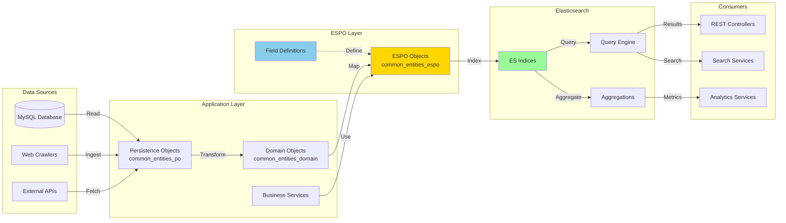
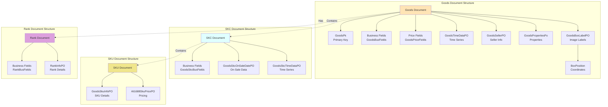
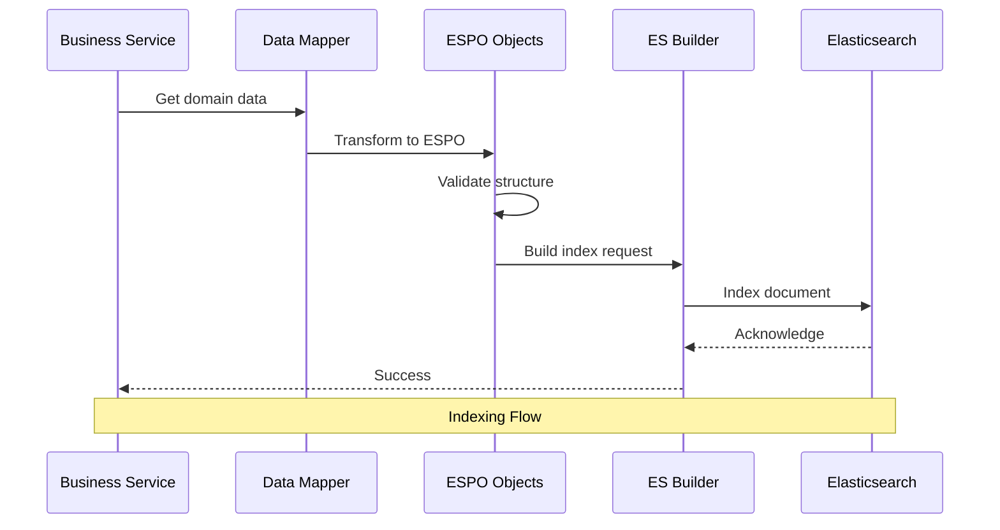
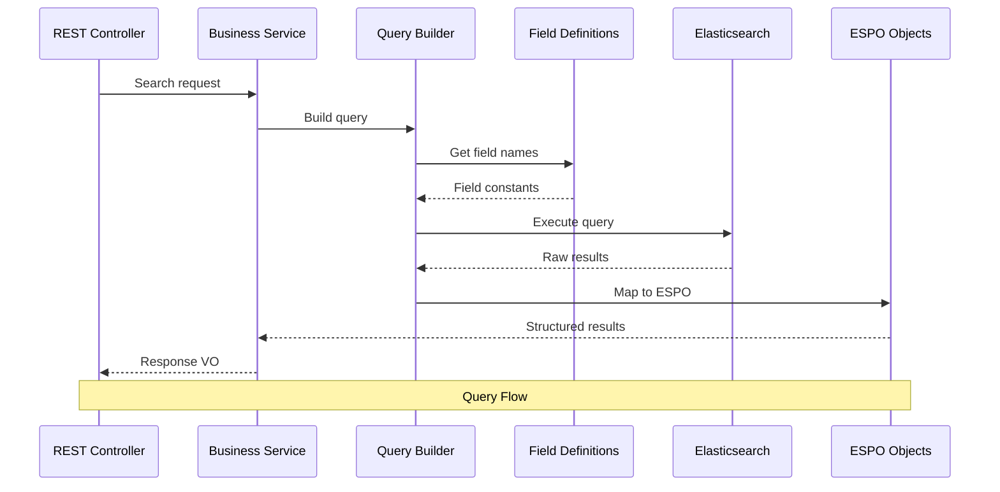
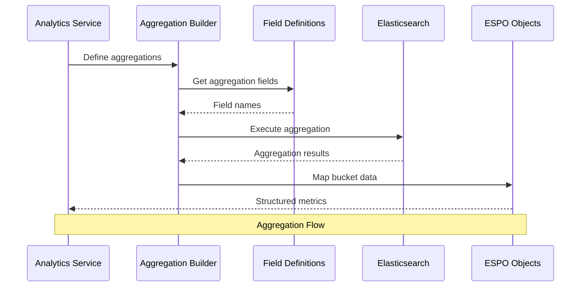
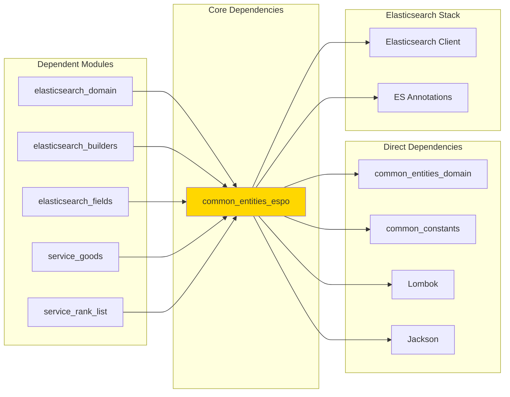

# Common Entities ESPO Module

## Overview

The **common_entities_espo** module serves as the Elasticsearch Persistence Object (ESPO) layer for the TrendEngine backend system. It contains specialized data structures designed to map application domain models to Elasticsearch documents, providing efficient search, aggregation, and analytics capabilities for fashion trend data. ESPOs act as the bridge between the application's business logic and Elasticsearch's document-oriented storage, enabling high-performance queries and real-time analytics.

### Module Purpose

- **Elasticsearch Mapping**: Defines document structures optimized for Elasticsearch storage and retrieval
- **Search Optimization**: Provides field definitions and structures tailored for full-text search and aggregations
- **Data Indexing**: Facilitates efficient indexing of goods, rankings, and SKU data into Elasticsearch
- **Query Performance**: Optimizes data structures for complex analytical queries and aggregations
- **Type Safety**: Ensures type-safe interactions with Elasticsearch documents

### Key Characteristics

- **Document-Oriented**: Designed specifically for Elasticsearch's document model
- **Field Definitions**: Contains explicit field name constants for consistent Elasticsearch queries
- **Nested Structures**: Supports complex nested objects for hierarchical data representation
- **Serialization-Ready**: Optimized for JSON serialization to Elasticsearch documents
- **Analytics-Focused**: Structured to support aggregations, metrics, and analytical queries

---

## Architecture

### Module Structure

```mermaid
graph TB
    subgraph "Common Entities ESPO Module"
        subgraph "Field Definition Classes"
            FIELD1[GoodsBusFields]
            FIELD2[GoodsPriceFields]
            FIELD3[GoodsSkcFields]
            FIELD4[RankBusFields]
            FIELD5[GoodsSkcBusFields]
        end
        
        subgraph "Goods Persistence Objects"
            GOODS1[GoodsPk]
            GOODS2[GoodsBoxLabelPO]
            GOODS3[GoodsOnSaleDatePO]
            GOODS4[GoodsProductIdBusPO]
            GOODS5[GoodsSaleDatePO]
            GOODS6[GoodsSellerPO]
            GOODS7[GoodsTimeDataPO]
            GOODS8[GoodsPropertiesPo]
        end
        
        subgraph "SKU/SKC Persistence Objects"
            SKU1[GoodsSkuInfoPO]
            SKU2[Ali1688SkuPricePO]
            SKU3[GoodsSkcOnSaleDataPO]
            SKU4[GoodsSkcTimeDataPO]
        end
        
        subgraph "Ranking Persistence Objects"
            RANK1[RankInfoPO]
        end
        
        subgraph "Common Objects"
            COMMON1[BoxPosition]
        end
    end
    
    subgraph "Related Modules"
        ES_DOMAIN[elasticsearch_domain<br/>ES Domain Objects]
        ES_BUILDER[elasticsearch_builders<br/>Query Builders]
        DOMAIN[common_entities_domain<br/>Domain Objects]
        PO[common_entities_po<br/>Database POs]
        SERVICE[service_goods<br/>Business Services]
    end
    
    FIELD1 -.->|Defines fields for| GOODS1
    FIELD2 -.->|Defines fields for| GOODS1
    FIELD3 -.->|Defines fields for| SKU1
    FIELD4 -.->|Defines fields for| RANK1
    FIELD5 -.->|Defines fields for| SKU3
    
    DOMAIN -->|Transforms to| GOODS1
    DOMAIN -->|Transforms to| SKU1
    DOMAIN -->|Transforms to| RANK1
    
    GOODS1 -->|Indexed in| ES_DOMAIN
    SKU1 -->|Indexed in| ES_DOMAIN
    RANK1 -->|Indexed in| ES_DOMAIN
    
    ES_BUILDER -->|Queries| GOODS1
    ES_BUILDER -->|Queries| SKU1
    ES_BUILDER -->|Queries| RANK1
    
    SERVICE -->|Uses| GOODS1
    SERVICE -->|Uses| SKU1
    SERVICE -->|Uses| RANK1
    
    PO -.->|Syncs with| GOODS1
    
    style FIELD1 fill:#e1f5ff
    style GOODS1 fill:#fff4e1
    style SKU1 fill:#f0e1ff
    style RANK1 fill:#e1ffe1
```



### ESPO Categories

The module organizes Elasticsearch persistence objects into several functional categories:

#### 1. **Field Definition Classes**
Constants and field name definitions for Elasticsearch document mapping:
- `GoodsBusFields`: Business fields for goods documents
- `GoodsPriceFields`: Price-related fields for goods
- `GoodsSkcFields`: SKC (Stock Keeping Color) level fields
- `RankBusFields`: Business fields for ranking documents
- `GoodsSkcBusFields`: Business fields for SKC documents

#### 2. **Goods Persistence Objects**
Core goods-related Elasticsearch documents:
- `GoodsPk`: Primary key structure for goods
- `GoodsBoxLabelPO`: Image recognition box labels for goods
- `GoodsOnSaleDatePO`: On-sale date information
- `GoodsProductIdBusPO`: Product ID business data
- `GoodsSaleDatePO`: Sale date tracking
- `GoodsSellerPO`: Seller information
- `GoodsTimeDataPO`: Time-series data for goods
- `GoodsPropertiesPo`: Product properties and attributes

#### 3. **SKU/SKC Persistence Objects**
Stock keeping unit and color level documents:
- `GoodsSkuInfoPO`: SKU-level information
- `Ali1688SkuPricePO`: Ali1688 platform SKU pricing
- `GoodsSkcOnSaleDataPO`: SKC on-sale data
- `GoodsSkcTimeDataPO`: SKC time-series data

#### 4. **Ranking Persistence Objects**
Ranking and analytics documents:
- `RankInfoPO`: Ranking information for goods

#### 5. **Common Objects**
Shared structures across documents:
- `BoxPosition`: Position data for image recognition boxes

---

## Component Relationships

### Data Flow Architecture



### Elasticsearch Document Hierarchy



---

## Core Components

### Field Definition Classes

Field definition classes provide constant field names for Elasticsearch queries, ensuring consistency and type safety across the application.

#### GoodsBusFields
Defines business-related field names for goods documents:
- Product identification fields
- Category and classification fields
- Brand and seller fields
- Status and lifecycle fields
- Metadata fields

**Usage Context**: Used by query builders and aggregation services to construct Elasticsearch queries without hardcoding field names.

#### GoodsPriceFields
Defines price-related field names:
- Current price fields
- Historical price fields
- Discount and promotion fields
- Currency fields
- Price change tracking fields

**Usage Context**: Essential for price analysis, trend detection, and pricing strategy services.

#### GoodsSkcFields
Defines SKC (Stock Keeping Color) level field names:
- Color variant fields
- SKC-level metrics
- Inventory fields
- Sales performance fields

**Usage Context**: Used for color-level analysis and inventory management queries.

#### RankBusFields
Defines ranking-related field names:
- Rank position fields
- Rank category fields
- Rank change tracking fields
- Rank metrics fields

**Usage Context**: Critical for ranking analysis and competitive intelligence features.

#### GoodsSkcBusFields
Defines business fields specific to SKC documents:
- SKC business metrics
- Performance indicators
- Lifecycle status fields

**Usage Context**: Used in SKC-level business analytics and reporting.

---

### Goods Persistence Objects

#### GoodsPk
**Purpose**: Primary key structure for uniquely identifying goods across platforms.

**Key Fields**:
- Platform identifier
- Product ID
- Region/market identifier

**Relationships**:
- Used as the document ID in Elasticsearch
- Referenced by all goods-related queries
- Links to external platform product pages

**Usage Pattern**:
```java
// Conceptual usage
GoodsPk pk = new GoodsPk();
pk.setPlatform("shein");
pk.setProductId("12345");
pk.setRegion("us");
```

#### GoodsBoxLabelPO
**Purpose**: Stores image recognition box labels and coordinates for product images.

**Key Fields**:
- Label type (category, style, color, etc.)
- Confidence score
- Box position (BoxPosition object)
- Recognition metadata

**Relationships**:
- Nested within goods documents
- Used by image search services
- Links to fashion recognition systems

**Usage Context**: Powers visual search, style recognition, and image-based product discovery features.

#### GoodsOnSaleDatePO
**Purpose**: Tracks when products go on sale and their sale periods.

**Key Fields**:
- First on-sale date
- Latest on-sale date
- Sale period duration
- On-sale status

**Relationships**:
- Part of goods time-series data
- Used for new product detection
- Feeds into trend analysis

**Usage Context**: Critical for identifying new arrivals, tracking product lifecycle, and analyzing launch patterns.

#### GoodsProductIdBusPO
**Purpose**: Business-level product identification and categorization.

**Key Fields**:
- Internal product ID
- External platform IDs
- Category mappings
- Product type classification

**Relationships**:
- Links to multiple platform identifiers
- Maps to internal category system
- Used for cross-platform product matching

#### GoodsSaleDatePO
**Purpose**: Comprehensive sale date tracking and history.

**Key Fields**:
- Sale start dates
- Sale end dates
- Historical sale periods
- Sale frequency metrics

**Relationships**:
- Extends GoodsOnSaleDatePO
- Used for promotional analysis
- Feeds into pricing strategy services

#### GoodsSellerPO
**Purpose**: Seller and shop information for products.

**Key Fields**:
- Seller ID
- Shop name
- Seller rating
- Seller location
- Seller performance metrics

**Relationships**:
- Links to shop analysis modules
- Used for seller performance tracking
- Connects to shop monitoring features

**Usage Context**: Enables shop-level analysis, seller comparison, and shop monitoring features.

#### GoodsTimeDataPO
**Purpose**: Time-series metrics and performance data for products.

**Key Fields**:
- Daily/weekly/monthly metrics
- Sales volume over time
- Price changes over time
- Inventory changes over time
- Engagement metrics over time

**Relationships**:
- Core component of goods documents
- Used by all trend analysis features
- Feeds into forecasting models

**Usage Context**: Powers trend charts, performance dashboards, and predictive analytics.

#### GoodsPropertiesPo
**Purpose**: Product properties, attributes, and specifications.

**Key Fields**:
- Material properties
- Size information
- Style attributes
- Design elements
- Technical specifications

**Relationships**:
- Used for product filtering
- Powers property-based search
- Feeds into style analysis

**Usage Context**: Enables detailed product filtering, attribute-based search, and property trend analysis.

---

### SKU/SKC Persistence Objects

#### GoodsSkuInfoPO
**Purpose**: Stock Keeping Unit level information and metrics.

**Key Fields**:
- SKU identifier
- Size information
- Color details
- SKU-level pricing
- SKU-level inventory
- SKU-level sales metrics

**Relationships**:
- Nested within SKC documents
- Links to size analysis
- Used for inventory management

**Usage Context**: Critical for size analysis, inventory tracking, and SKU-level performance monitoring.

#### Ali1688SkuPricePO
**Purpose**: Ali1688 platform-specific SKU pricing information.

**Key Fields**:
- Wholesale price tiers
- Minimum order quantities
- Bulk pricing
- Supplier pricing

**Relationships**:
- Platform-specific extension of SKU data
- Used for sourcing analysis
- Links to supplier comparison features

**Usage Context**: Enables wholesale pricing analysis and supplier sourcing features for Ali1688 platform.

#### GoodsSkcOnSaleDataPO
**Purpose**: SKC-level on-sale status and availability data.

**Key Fields**:
- SKC on-sale status
- Available sizes
- Stock status by size
- Launch date by color

**Relationships**:
- Part of SKC document structure
- Used for availability tracking
- Feeds into stock analysis

**Usage Context**: Powers color availability tracking and SKC-level inventory monitoring.

#### GoodsSkcTimeDataPO
**Purpose**: Time-series data at the SKC (color) level.

**Key Fields**:
- SKC-level sales over time
- Color popularity trends
- SKC inventory changes
- Color performance metrics

**Relationships**:
- Core component of SKC documents
- Used for color trend analysis
- Feeds into color popularity rankings

**Usage Context**: Enables color trend analysis, color performance comparison, and color-based forecasting.

---

### Ranking Persistence Objects

#### RankInfoPO
**Purpose**: Product ranking information across various dimensions.

**Key Fields**:
- Rank position
- Rank category (sales, new arrivals, trending, etc.)
- Rank change (up/down movement)
- Rank history
- Rank score/metrics

**Relationships**:
- Associated with goods documents
- Used by ranking analysis services
- Links to competitive intelligence features

**Usage Context**: Powers ranking dashboards, competitive analysis, and rank tracking features.

---

### Common Objects

#### BoxPosition
**Purpose**: Geometric position data for image recognition bounding boxes.

**Key Fields**:
- X coordinate
- Y coordinate
- Width
- Height
- Rotation (if applicable)

**Relationships**:
- Used within GoodsBoxLabelPO
- Referenced by image search services
- Used by visual recognition systems

**Usage Context**: Essential for image-based search, visual similarity matching, and style recognition features.

---

## Integration Patterns

### Elasticsearch Indexing Flow



### Query Execution Flow



### Aggregation Flow



---

## Usage Examples

### Example 1: Goods Document Structure

```java
// Conceptual representation of a goods document in Elasticsearch
{
  "goodsPk": {
    "platform": "shein",
    "productId": "SW2203123456",
    "region": "us"
  },
  "goodsBusFields": {
    "title": "Summer Floral Dress",
    "category": "dresses",
    "brand": "SHEIN",
    "status": "on_sale"
  },
  "goodsPriceFields": {
    "currentPrice": 29.99,
    "originalPrice": 49.99,
    "currency": "USD",
    "discount": 40
  },
  "goodsTimeDataPO": {
    "dailyMetrics": [
      {
        "date": "2024-01-15",
        "salesVolume": 150,
        "views": 5000,
        "addToCarts": 300
      }
    ]
  },
  "goodsSellerPO": {
    "sellerId": "shop_12345",
    "shopName": "Fashion Store",
    "rating": 4.5
  },
  "goodsPropertiesPo": {
    "material": "Cotton Blend",
    "style": "Casual",
    "season": "Summer",
    "neckline": "V-Neck"
  },
  "goodsBoxLabelPO": [
    {
      "label": "dress",
      "confidence": 0.95,
      "boxPosition": {
        "x": 100,
        "y": 150,
        "width": 200,
        "height": 300
      }
    }
  ]
}
```

### Example 2: SKC Document Structure

```java
// Conceptual SKC document structure
{
  "goodsPk": {
    "platform": "shein",
    "productId": "SW2203123456",
    "region": "us"
  },
  "skcId": "SW2203123456-RED",
  "goodsSkcBusFields": {
    "color": "Red",
    "colorCode": "#FF0000",
    "colorFamily": "Warm"
  },
  "goodsSkcOnSaleDataPO": {
    "onSaleStatus": true,
    "firstOnSaleDate": "2024-01-01",
    "availableSizes": ["S", "M", "L", "XL"]
  },
  "goodsSkcTimeDataPO": {
    "dailyMetrics": [
      {
        "date": "2024-01-15",
        "salesVolume": 50,
        "stockLevel": 200
      }
    ]
  }
}
```

### Example 3: Query Using Field Definitions

```java
// Conceptual query building using field definitions
public List<GoodsESPO> searchGoods(String category, Double minPrice, Double maxPrice) {
    SearchRequest request = new SearchRequest("goods_index");
    
    BoolQueryBuilder query = QueryBuilders.boolQuery()
        .must(QueryBuilders.termQuery(GoodsBusFields.CATEGORY, category))
        .must(QueryBuilders.rangeQuery(GoodsPriceFields.CURRENT_PRICE)
            .gte(minPrice)
            .lte(maxPrice));
    
    SearchSourceBuilder sourceBuilder = new SearchSourceBuilder()
        .query(query)
        .size(100);
    
    request.source(sourceBuilder);
    
    // Execute and map results to ESPO objects
    return executeSearch(request);
}
```

### Example 4: Aggregation Using Field Definitions

```java
// Conceptual aggregation using field definitions
public Map<String, Long> getCategoryDistribution() {
    SearchRequest request = new SearchRequest("goods_index");
    
    AggregationBuilder aggregation = AggregationBuilders
        .terms("category_distribution")
        .field(GoodsBusFields.CATEGORY)
        .size(50);
    
    SearchSourceBuilder sourceBuilder = new SearchSourceBuilder()
        .aggregation(aggregation)
        .size(0);
    
    request.source(sourceBuilder);
    
    // Execute and process aggregation results
    return executeAggregation(request);
}
```

---

## Dependencies

### Module Dependencies



### Related Modules

| Module | Relationship | Description |
|--------|--------------|-------------|
| [common_entities_domain](common_entities_domain.md) | Source | Provides domain objects that transform into ESPOs |
| [common_entities_po](common_entities_po.md) | Parallel | Database persistence objects that sync with ESPOs |
| [common_constants](common_constants.md) | Dependency | Provides constant values used in field definitions |
| [elasticsearch_domain](elasticsearch_domain.md) | Consumer | Uses ESPOs for Elasticsearch operations |
| [elasticsearch_builders](elasticsearch_builders.md) | Consumer | Builds queries using ESPO field definitions |
| [elasticsearch_fields](elasticsearch_fields.md) | Related | Additional field definitions for ES operations |
| [service_goods](service_goods.md) | Consumer | Business services that use goods ESPOs |
| [service_rank_list](service_rank_list.md) | Consumer | Ranking services that use rank ESPOs |

---

## Design Patterns

### 1. Field Definition Pattern

**Purpose**: Centralize field name definitions to avoid hardcoding and ensure consistency.

**Implementation**:
- Static final constants for all field names
- Grouped by functional area (business, price, SKC, rank)
- Used across query builders and aggregations

**Benefits**:
- Type safety for field references
- Easy refactoring when field names change
- Consistent naming across the application
- IDE autocomplete support

### 2. Nested Document Pattern

**Purpose**: Represent hierarchical data structures within Elasticsearch documents.

**Implementation**:
- GoodsBoxLabelPO contains BoxPosition
- Goods documents contain nested SKC and SKU data
- Time-series data nested within parent documents

**Benefits**:
- Efficient querying of related data
- Reduced document duplication
- Better data locality
- Simplified aggregations

### 3. Composite Key Pattern

**Purpose**: Uniquely identify documents across multiple dimensions.

**Implementation**:
- GoodsPk combines platform, productId, and region
- Used as document ID in Elasticsearch
- Ensures uniqueness across platforms

**Benefits**:
- Cross-platform product tracking
- Prevents duplicate documents
- Enables multi-region analysis
- Simplifies data synchronization

### 4. Time-Series Embedding Pattern

**Purpose**: Store time-series data efficiently within documents.

**Implementation**:
- GoodsTimeDataPO contains arrays of daily metrics
- GoodsSkcTimeDataPO for SKC-level time series
- Optimized for range queries and aggregations

**Benefits**:
- Fast time-range queries
- Efficient metric aggregations
- Reduced index size
- Better query performance

---

## Best Practices

### 1. Field Definition Usage

**DO**:
- Always use field definition constants in queries
- Keep field definitions synchronized with Elasticsearch mappings
- Document the purpose of each field constant
- Group related fields logically

**DON'T**:
- Hardcode field names in queries
- Create duplicate field definitions
- Use inconsistent naming conventions
- Mix field definitions across modules

### 2. Document Structure Design

**DO**:
- Keep document structure flat when possible
- Use nested objects for truly hierarchical data
- Include only searchable/aggregatable fields
- Optimize field types for query patterns

**DON'T**:
- Over-nest document structures
- Include large binary data in documents
- Create deeply nested hierarchies
- Store redundant data

### 3. ESPO Object Creation

**DO**:
- Validate data before creating ESPOs
- Use builder patterns for complex objects
- Set all required fields
- Handle null values appropriately

**DON'T**:
- Create ESPOs with incomplete data
- Bypass validation logic
- Ignore field constraints
- Mix domain logic with ESPO creation

### 4. Performance Optimization

**DO**:
- Use appropriate field types for queries
- Index only necessary fields
- Optimize document size
- Use bulk operations for indexing

**DON'T**:
- Index unnecessary fields
- Create overly large documents
- Perform single-document operations in loops
- Ignore index performance metrics

---

## Performance Considerations

### Indexing Performance

1. **Bulk Indexing**: Use bulk operations for indexing multiple documents
2. **Refresh Interval**: Adjust refresh interval based on real-time requirements
3. **Document Size**: Keep documents under 100KB for optimal performance
4. **Field Count**: Limit fields to essential data for queries and aggregations

### Query Performance

1. **Field Selection**: Use source filtering to return only needed fields
2. **Query Complexity**: Avoid deeply nested queries when possible
3. **Aggregation Optimization**: Use appropriate aggregation types for data
4. **Caching**: Leverage Elasticsearch query cache for repeated queries

### Storage Optimization

1. **Field Types**: Use appropriate field types (keyword vs text, integer vs long)
2. **Index Compression**: Enable compression for large text fields
3. **Time-Based Indices**: Consider time-based indices for time-series data
4. **Data Retention**: Implement data lifecycle policies for old data

---

## Monitoring and Maintenance

### Health Checks

1. **Index Health**: Monitor index health status (green/yellow/red)
2. **Document Count**: Track document count growth over time
3. **Query Performance**: Monitor query latency and throughput
4. **Indexing Rate**: Track indexing rate and failures

### Maintenance Tasks

1. **Index Optimization**: Periodically optimize indices (force merge)
2. **Mapping Updates**: Plan and execute mapping updates carefully
3. **Data Reindexing**: Implement reindexing strategies for schema changes
4. **Backup and Recovery**: Regular snapshots of critical indices

### Troubleshooting

1. **Slow Queries**: Analyze slow query logs and optimize
2. **Indexing Failures**: Monitor and handle indexing errors
3. **Mapping Conflicts**: Resolve field type conflicts
4. **Storage Issues**: Monitor disk usage and implement cleanup

---

## Future Enhancements

### Planned Improvements

1. **Enhanced Field Definitions**: Add more granular field definitions for advanced queries
2. **Dynamic Mapping**: Support for dynamic field mapping based on platform
3. **Multi-Language Support**: Enhanced text analysis for multiple languages
4. **Vector Search**: Integration of vector embeddings for similarity search
5. **Real-Time Analytics**: Improved real-time aggregation capabilities

### Scalability Considerations

1. **Sharding Strategy**: Optimize shard count for data volume
2. **Index Lifecycle Management**: Implement automated ILM policies
3. **Cross-Cluster Search**: Support for multi-cluster deployments
4. **Data Partitioning**: Time-based or category-based index partitioning

---

## Conclusion

The **common_entities_espo** module is a critical component of the TrendEngine system, providing the foundation for high-performance search and analytics capabilities. By defining clear document structures, field definitions, and integration patterns, it enables efficient querying and analysis of fashion trend data at scale.

### Key Takeaways

1. **Structured Approach**: Well-defined field definitions ensure consistency across queries
2. **Performance Focus**: Optimized document structures for search and aggregation performance
3. **Type Safety**: Strong typing prevents errors and improves maintainability
4. **Scalability**: Designed to handle large-scale fashion data efficiently
5. **Integration**: Seamless integration with Elasticsearch and business services

### Related Documentation

- [common_entities_domain](common_entities_domain.md) - Domain object layer
- [common_entities_po](common_entities_po.md) - Database persistence layer
- [elasticsearch_domain](elasticsearch_domain.md) - Elasticsearch domain operations
- [elasticsearch_builders](elasticsearch_builders.md) - Query building utilities
- [service_goods](service_goods.md) - Goods business services
- [service_rank_list](service_rank_list.md) - Ranking analysis services

---

**Module Version**: 1.0  
**Last Updated**: 2024  
**Maintained By**: TrendEngine Backend Team
