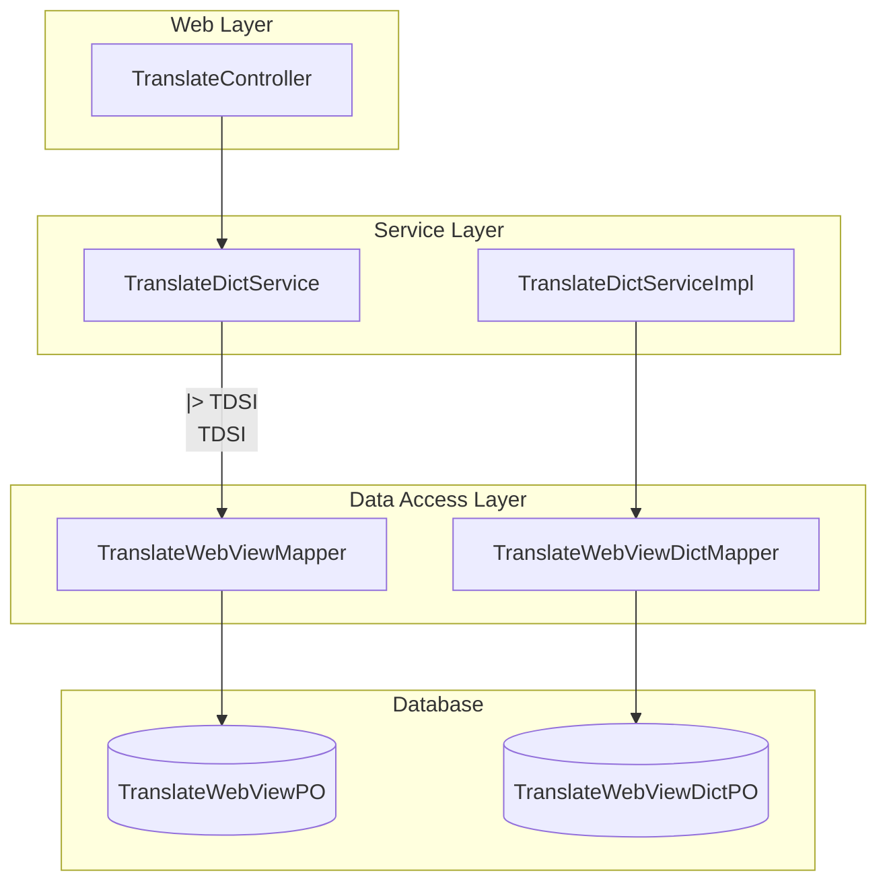
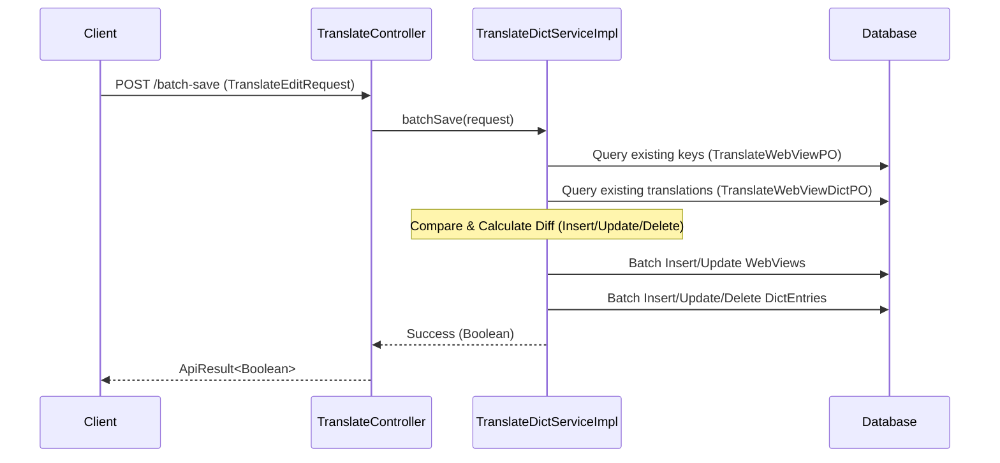

# Dictionary Management Module

## Introduction
The **Dictionary Management** module is a sub-component of the [Translation-Module](translation_core.md) responsible for managing multi-language translation dictionaries. It provides a centralized interface for creating, updating, deleting, and retrieving translation keys and their corresponding values across different languages and namespaces. This module is primarily used to support internationalization (i18n) for the web interface and other client-facing components.

## Architecture and Component Relationships

The module follows a standard layered architecture:
- **Controller Layer**: Handles HTTP requests and provides API endpoints for dictionary operations.
- **Service Layer**: Contains the business logic for batch processing, synchronization, and data transformation.
- **Data Access Layer**: Interacts with the database to persist translation keys and dictionary entries.

### Component Diagram

## Core Functionality

### 1. Dictionary Data Management
The module allows for batch operations on translation data. A "Dictionary" entry consists of:
- **View Key**: A unique identifier for the translation string (e.g., `common.button.save`).
- **Namespace**: A logical grouping for keys (e.g., `frontend`, `mobile`).
- **Description**: Metadata explaining the context of the key.
- **Translations**: A map of language codes (e.g., `en`, `zh`) to their respective translated text.

### 2. Batch Save and Update
The `batchSave` process is synchronized to ensure data consistency. It performs a "diff" between the incoming request and existing database records to determine which entries need to be inserted, updated, or deleted.

### 3. Retrieval Mechanisms
- **Full Dictionary**: Retrieves all keys and their translations, grouped by language.
- **Key-Value Map**: Retrieves a flat map of keys to translations for a specific language and namespace, optimized for client-side consumption.

## Data Flow

### Batch Save Process Flow

## Component Details

### TranslateController
Exposes RESTful endpoints for dictionary management.
- `POST /translate/batch-save`: Batch create or update dictionary entries.
- `GET /translate/exclude/list-key-dict`: Retrieve the full dictionary structure.
- `GET /translate/exclude/list-key-dict-map`: Retrieve a simplified key-value map for a specific language.
- `POST /translate/batch-delete`: Batch delete keys and their translations.

### TranslateDictServiceImpl
The core logic engine.
- **Synchronization**: Uses `synchronized` on `batchSave` to prevent concurrent modification issues.
- **Namespace Filtering**: Supports filtering dictionary entries by namespace to allow modular loading of translations.

## Integration with Other Modules
- **[Translation-Module](translation_core.md)**: This module provides the underlying dictionary data that the core translation services may use for lookups.
- **[Auth-Account-Module](auth_account_management.md)**: Access to dictionary management endpoints is typically restricted via the gateway (though some endpoints use `/exclude/` for specific bypass scenarios).

## Data Models

| Entity | Description |
| :--- | :--- |
| `TranslateWebViewPO` | Stores the unique translation keys, namespaces, and descriptions. |
| `TranslateWebViewDictPO` | Stores the actual translated text mapped to a `viewKey` and `lang`. |
| `TranslateEditRequest` | DTO containing a list of dictionary entries for batch processing. |
| `TranslateWebViewRespDTO` | Response object containing the full dictionary and supported languages. |
