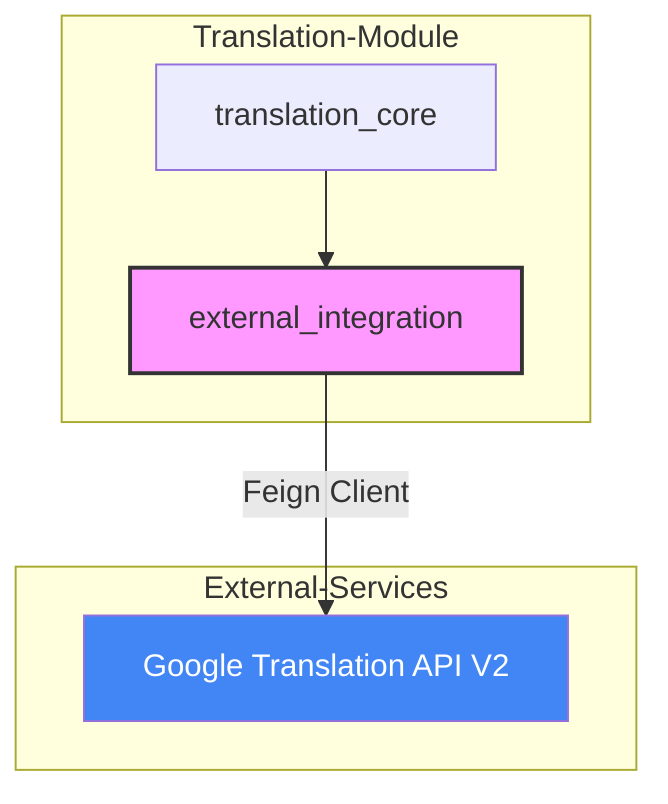
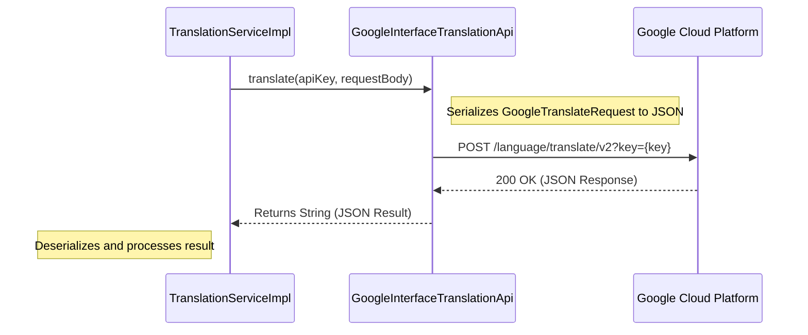

# External Integration Module

The `external_integration` module serves as the gateway for the system to interact with third-party services. Currently, its primary responsibility is managing the integration with the **Google Cloud Translation API**, providing the necessary infrastructure for cross-language data processing within the platform.

## Overview

This module is a sub-component of the [Translation-Module](translation_module.md). It abstracts the complexities of external API communication, specifically handling the network protocols, authentication (via API keys), and request/response mapping for Google's translation services.

### Key Responsibilities
- **API Client Definition**: Defines the Feign client for Google Translation services.
- **External Communication**: Manages HTTP requests to `https://translation.googleapis.com`.
- **Integration Point**: Acts as the low-level provider for the `translation_core` sub-module.

## Architecture

The module utilizes **Spring Cloud OpenFeign** to create a declarative REST client. This approach decouples the business logic in the service layer from the specific implementation details of the external HTTP calls.

### Component Relationship

## Core Components

### GoogleInterfaceTranslationApi
This is the central interface of the module. It is annotated with `@FeignClient` to automatically generate the implementation for calling Google's RESTful endpoints.

- **URL**: `https://translation.googleapis.com`
- **Endpoint**: `/language/translate/v2`
- **Method**: `POST`
- **Security**: Authenticated via a `key` query parameter.

| Method | Parameters | Description |
| :--- | :--- | :--- |
| `translate` | `String key`, `GoogleTranslateRequest requests` | Sends a batch of text to Google for translation into a target language. |

## Data Flow

The following diagram illustrates how a translation request flows from the system to the external provider and back.

## Integration with Other Modules

- **[Translation-Module](translation_module.md)**: The `TranslationServiceImpl` (in `translation_core`) depends on this module to perform actual translations.
- **[Goods-Module](goods_module.md)**: Indirectly uses this module when product titles or descriptions require localization for international markets.
- **[Fashion-Ins-Module](fashion_ins_module.md) / [TikTok-Module](tiktok_module.md)**: Utilizes translation services to analyze social media content and topics across different regions.

## Configuration

The integration requires a valid Google Cloud API Key. This is typically managed via the `TranslatorConfiguration` found in the [translation_core](translation_module.md) sub-module, which ensures that the `GoogleInterfaceTranslationApi` is correctly instantiated and provided with the necessary credentials at runtime.
