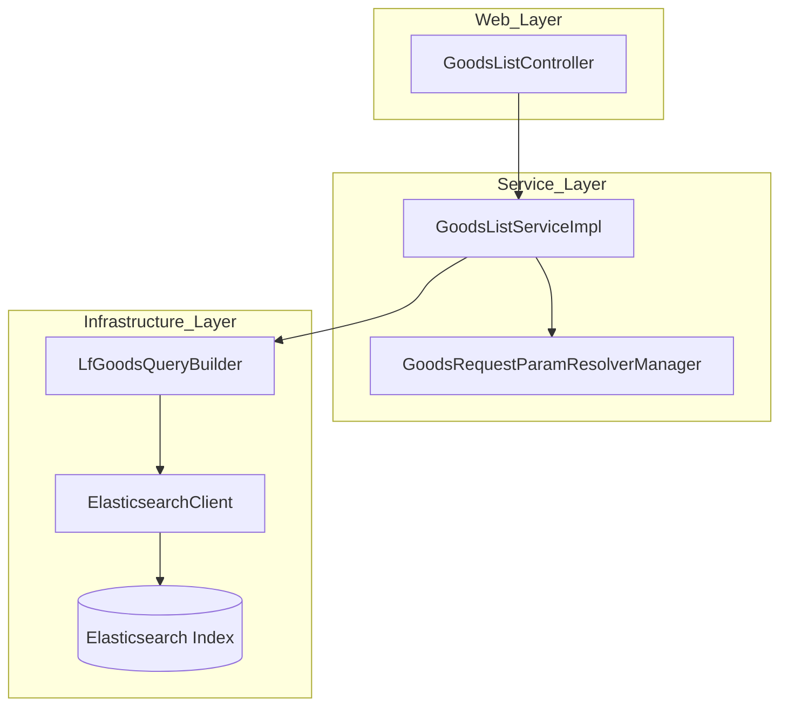
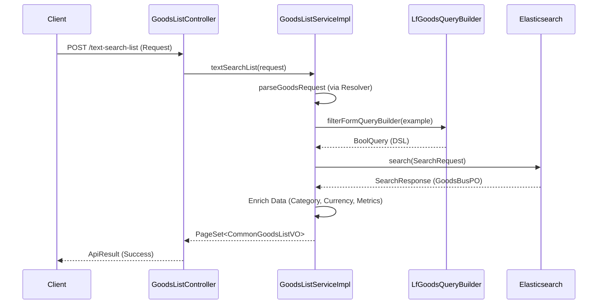

# Goods Search Listing Module

The `goods_search_listing` module is a core component of the Goods system, responsible for providing advanced search, filtering, and listing capabilities for products across multiple e-commerce platforms. It leverages Elasticsearch to deliver high-performance queries, supporting complex business logic such as "new arrival" calendars, site-specific listings, and multi-dimensional attribute filtering.

## Architecture Overview

The module follows a standard layered architecture, integrating closely with the [ElasticSearch-Infrastructure](ElasticSearch-Infrastructure.md) for data retrieval and the [goods_data_models](goods_data_models.md) for entity definitions.

## Core Components

### 1. GoodsListController
The entry point for all goods listing requests. It exposes RESTful endpoints for different search scenarios:
- `newCalendarList`: Filters products based on "new arrival" dates.
- `siteGoodsList`: Provides products specific to a platform/site.
- `textSearchList`: Handles keyword-based searches across product names and properties.

### 2. GoodsListServiceImpl
The central business logic engine. It orchestrates the search process by:
- Resolving complex request parameters into internal query examples.
- Applying permission filters and currency conversions.
- Managing Elasticsearch search requests and processing results.
- Enriching product data with category information and metrics (e.g., sales volume, stock rates).

### 3. LfGoodsQueryBuilder
A specialized utility for constructing complex Elasticsearch DSL (Domain Specific Language) queries. It handles:
- **Boolean Logic**: Combining filters for status, platform types, and product IDs.
- **Nested Queries**: Searching within nested objects like `box_label_ret` (colors/labels) and `on_sale_date_list`.
- **Range Filters**: Filtering by price, sales volume, and stock rates.
- **Text Matching**: Phrase matching for product names and properties.

## Data Flow

The following diagram illustrates the flow of a search request through the module:

## Key Features

### Multi-Platform Support
The module can filter and aggregate products across various platforms. It uses `PlatformHelper` and `PlatformRuleDetailHelper` to ensure that platform-specific rules (like support for comments or storage) are respected during sorting and filtering.

### Advanced Filtering
- **Temporal Filtering**: Supports "First Sale" vs "Re-stock" logic.
- **Attribute Filtering**: Deep filtering based on raw materials, patterns, and design details using `LfDesignOptionService`.
- **Visual Search Support**: Integrates with `ColorHelper` to adjust product images based on the user's selected color filters.

### Performance Optimization
- **Field Exclusion**: To reduce network overhead, the module explicitly excludes large fields (like `sku_info_list` or `seller_info_list`) from the ES response unless specifically required.
- **Collapsing**: Uses Elasticsearch field collapsing to group results by `parent_id` or `product_id`, preventing duplicate items from appearing in the listing.

## Dependencies
- **[goods_data_models](goods_data_models.md)**: Provides `GoodsBusPO` and `GoodsSkuPO`.
- **[product_discovery](product_discovery.md)**: Shared logic for product insights.
- **[ElasticSearch-Infrastructure](ElasticSearch-Infrastructure.md)**: Provides the underlying ES client and index configurations.
- **[Auth-Account-Module](Auth-Account-Module.md)**: Used for user-based filtering (e.g., "filter visited items").
