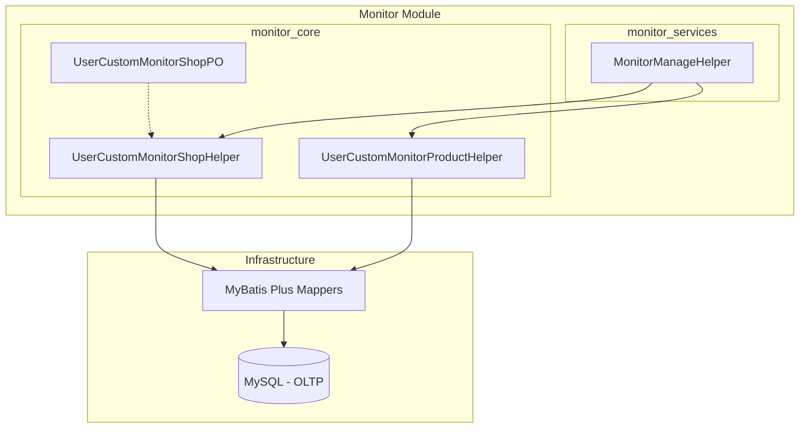
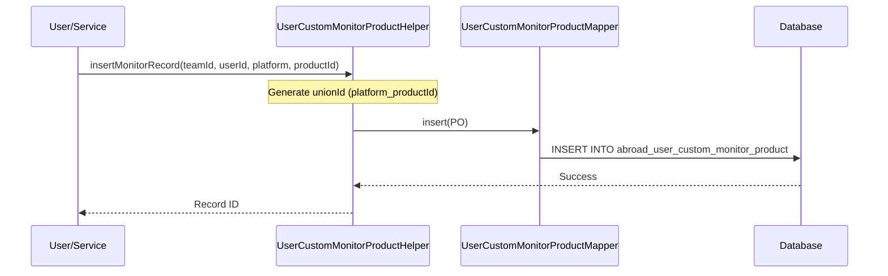

# Monitor Core Module

The `monitor_core` module serves as the foundational data management layer for the system's monitoring capabilities. It provides the core entities and helper services required to track and manage user-defined monitoring targets, such as shops, products, and social media influencers.

## Architecture Overview

The module follows a standard layered architecture within the `abroad-dataline-core` and `abroad-dataline-common` projects, focusing on persistence and low-level data manipulation.

## Core Components

### 1. Data Entities (PO)
The module defines Persistent Objects (POs) that map directly to the database schema.

*   **UserCustomMonitorShopPO**: Represents a user's custom monitoring configuration for a specific shop.
    *   `teamId` / `userId`: Ownership identifiers.
    *   `platformType`: The e-commerce platform (e.g., Amazon, Shopee).
    *   `shopId`: Unique identifier of the shop on the platform.
    *   `monitorStatus`: Current status of the monitoring task.
    *   `unionId`: A composite unique key (usually `platformType_shopId`).

### 2. Helper Services
Helpers encapsulate the business logic for CRUD operations and complex queries related to monitoring.

*   **UserCustomMonitorShopHelper**: Manages shop-level monitoring records.
*   **UserCustomMonitorProductHelper**: Manages product-level monitoring records. It includes logic for:
    *   Inserting new monitor records with `unionId` generation.
    *   Soft deletion by updating `monitorStatus` and `deletedAt`.
    *   Querying monitor counts and lists filtered by team or user.
    *   Batch updates for high-throughput status changes.

## Data Flow

The following diagram illustrates the process of creating a new monitoring task:

## Relationships with Other Modules

The `monitor_core` module provides the data foundation used by higher-level services:

*   **[monitor_services](monitor_services.md)**: Uses these helpers to implement complex management APIs and business workflows.
*   **[Goods-Module](Goods-Module.md)**: Monitoring records often reference products defined in the Goods module.
*   **[Fashion-Ins-Module](Fashion-Ins-Module.md)** & **[TikTok-Module](TikTok-Module.md)**: Similar monitoring patterns are applied to influencers (Bloggers/Streamers) using specialized helpers like `UserCustomMonitorInsBloggerHelper`.

## Key Features

1.  **Soft Deletion**: Uses MyBatis Plus `@TableLogic` and manual status updates (`monitorStatus = -1`) to ensure data traceability.
2.  **Multi-tenancy Support**: Every record is tied to a `teamId`, allowing for collaborative monitoring within organizations.
3.  **Uniqueness Constraints**: Uses a `unionId` field to prevent duplicate monitoring of the same entity within the same context.
4.  **Batch Processing**: Optimized for performance using `executeBatch` for bulk updates.
