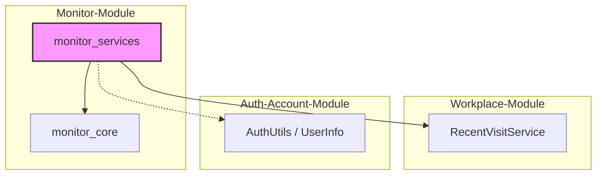
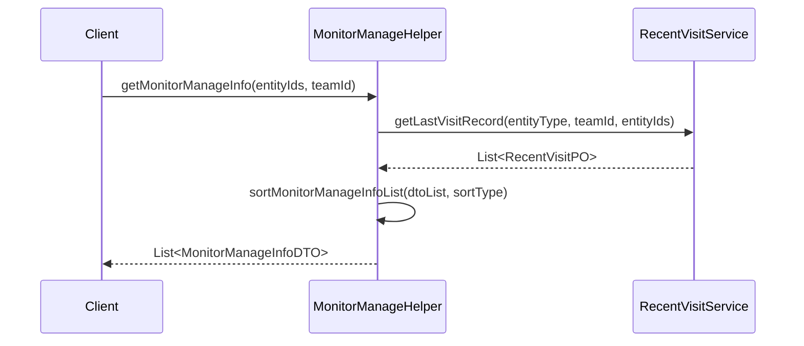

# Monitor Services Module

## Introduction
The `monitor_services` module is a sub-component of the **Monitor-Module** responsible for managing and processing monitoring data. It provides high-level business logic for handling monitoring entities, user associations, and visit history. This module acts as a bridge between the core data persistence layer and the presentation layer, offering utilities for sorting, filtering, and enriching monitoring information with user and team-specific context.

## Architecture and Component Relationships

### Component Overview
The module consists of two primary components:
1.  **MonitorManageHelper**: A service-layer helper component that contains business logic for processing monitoring data, including sorting, pagination, and integration with visit records.
2.  **MonitorManageInfoDTO**: A Data Transfer Object used to encapsulate monitoring information, including entity IDs, associated users, and timestamps for monitoring and visits.

### Dependency Diagram
The following diagram illustrates how `monitor_services` interacts with other parts of the system:

## Data Flow and Process Logic

### Monitoring Management Flow
The `MonitorManageHelper` facilitates the retrieval and organization of monitoring data. A typical flow involves fetching raw monitoring records and enriching them with visit history and user details.

### Core Functionalities

#### 1. Sorting and Pagination
The module provides robust in-memory sorting for monitoring data to avoid expensive cross-database join operations. Supported sort types include:
*   **Monitor Time**: Ascending/Descending
*   **Last Visit Time**: Ascending/Descending

#### 2. Visit Record Integration
It integrates with the `RecentVisitService` to track when a team last interacted with a monitored entity (e.g., a shop or a product).

#### 3. User Filtering
Allows filtering of monitoring DTOs based on specific user IDs, enabling personalized views of monitored entities within a team.

## Component Details

### MonitorManageHelper
Located in `abroad-dataline-service`, this component provides:
*   `getLastVisitRecord`: Fetches the most recent interaction data for a set of entities.
*   `sortMonitorManageInfoList`: Handles complex sorting logic for `MonitorManageInfoDTO`.
*   `filterDtoByMonitorUser`: Filters entities based on user participation.

### MonitorManageInfoDTO
Located in `abroad-dataline-common`, this DTO carries:
*   `entityId`: The unique identifier for the monitored item.
*   `monitorUserList`: List of users monitoring this entity.
*   `monitorTime`: When the monitoring was initiated.
*   `lastVisitTime`: The timestamp of the last team visit.

## Related Modules
*   [monitor_core](monitor_core.md): Provides the underlying POs and core helpers for custom shop monitoring.
*   [Auth-Account-Module](Auth-Account-Module.md): Used for user information and identity context.
*   [Goods-Module](Goods-Module.md): Often the target of monitoring activities (e.g., tracking specific goods).
