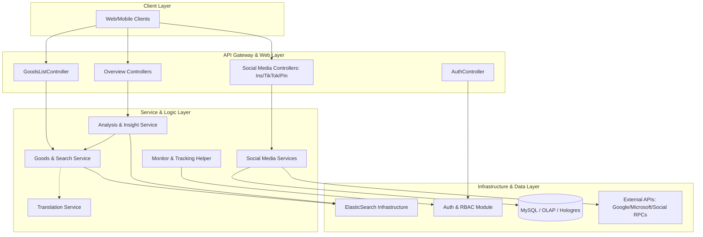

# TrendEngine-BackEnd Repository Overview

## Purpose
The **TrendEngine-BackEnd** (internally referred to as `abroad-dataline`) is a robust, data-driven backend system designed to aggregate, analyze, and visualize global e-commerce and social media trends. It serves as the core intelligence engine for tracking product performance across platforms like Amazon, Shein, and AliExpress, while simultaneously monitoring social signals from Instagram, TikTok, and Pinterest. 

The repository provides high-performance search capabilities, multi-dimensional market analysis, and automated translation services to support global e-commerce decision-making.

---

## End-to-End Architecture
The system follows a distributed, layered architecture optimized for high-volume data retrieval and complex analytical aggregations. It leverages **ElasticSearch** as its primary engine for search and trend analysis, while maintaining **MySQL/OLAP** for structured metadata and user management.

---

## Core Modules Documentation

The repository is organized into specialized modules handling specific data domains and infrastructure needs:

### 1. [Goods Module](Goods-Module.md)
The central component for e-commerce data. It manages product listings, SKU details, and advanced search (including image similarity) across multiple global platforms.
*   **Key Components:** `GoodServiceImpl`, `LfGoodsQueryBuilder`, `GoodsBusPO`.

### 2. [Social Media Modules](Social-Media-Integration.md)
A suite of modules dedicated to tracking fashion influencers and viral content:
*   **[Fashion-Ins-Module](Fashion-Ins-Module.md):** Tracks Instagram bloggers, topics, and engagement metrics.
*   **[TikTok-Module](TikTok-Module.md):** Manages TikTok streamer data and video performance.
*   **[Pinterest-Module](Pinterest-Module.md):** Handles Pin discovery and creator metadata.

### 3. [Analysis & Insight Module](Analysis-Insight-Module.md)
The analytical brain of the system. It performs time-series trend analysis, price distribution modeling, and cross-dimensional market overviews.
*   **Key Components:** `OverviewAnalyzeServiceImpl`, `OverviewAnalyzeHelper`.

### 4. [Auth & Account Module](Auth-Account-Module.md)
Provides security and identity management, including Microsoft SSO integration and complex Role-Based Access Control (RBAC) for data permissions.
*   **Key Components:** `AuthorityServiceImpl`, `AuthUtils`, `UserInfoEntity`.

### 5. [Infrastructure & Support](Infrastructure.md)
*   **[ElasticSearch-Infrastructure](ElasticSearch-Infrastructure.md):** Centralized ES client configuration and index management.
*   **[Translation-Module](Translation-Module.md):** Multi-language support and automated translation via Google Cloud API.
*   **[Monitor-Module](Monitor-Module.md):** User-defined tracking for specific shops and entities.

---
*Note: For detailed implementation specifics, please refer to the individual module documentation linked above.*