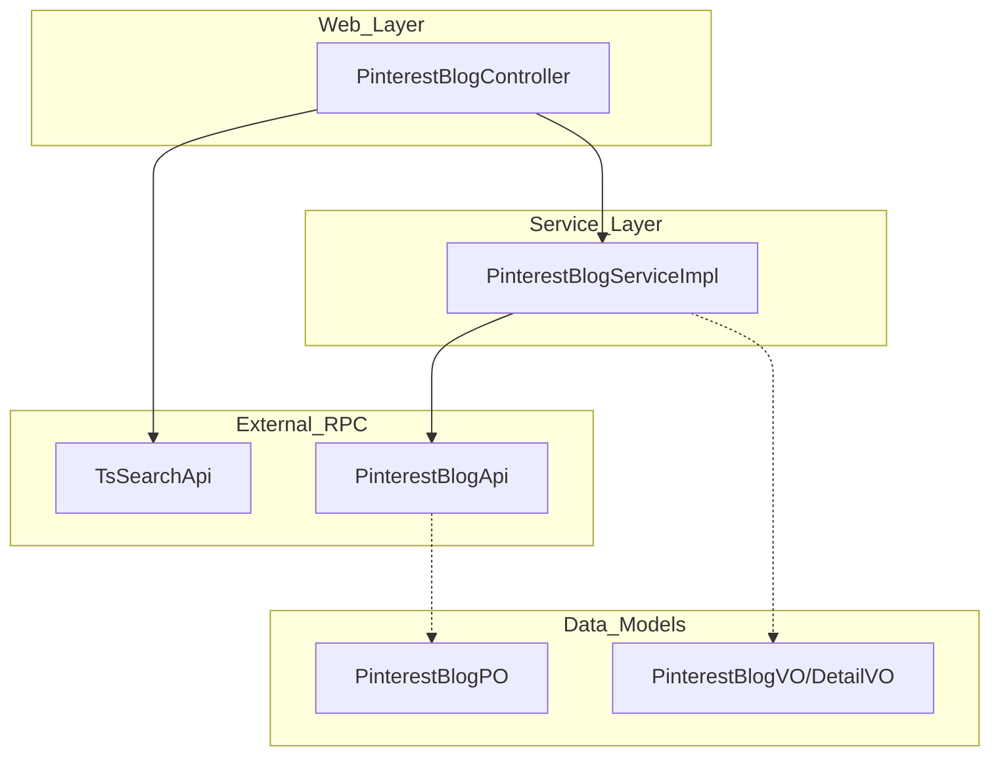
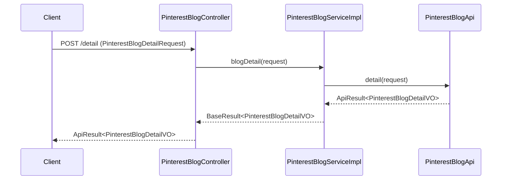

# Pinterest Blog Management Module

The `pinterest_blog_management` module is a core component of the Pinterest-Module, responsible for handling the lifecycle and data retrieval of Pinterest blog posts (Pins). It provides functionalities for searching, paginating, and retrieving detailed information about Pinterest content, serving as the bridge between external data sources (via RPC) and the application's frontend.

## Architecture Overview

The module follows a standard layered architecture:
1.  **Web Layer**: Handles HTTP requests and input validation.
2.  **Service Layer**: Implements business logic and coordinates data retrieval.
3.  **Data/RPC Layer**: Interacts with external search APIs and internal data structures.

### Component Relationship

## Core Components

### 1. Controller: PinterestBlogController
The entry point for Pinterest blog-related operations. It exposes RESTful endpoints for searching and viewing blog content.

*   **Endpoints**:
    *   `POST /pinterest/blog/search-list`: Directly invokes `TsSearchApi` for advanced search capabilities.
    *   `POST /pinterest/blog/page`: Retrieves a paginated list of blogs via the service layer.
    *   `POST /pinterest/blog/detail`: Retrieves specific details for a single blog post.

### 2. Service: PinterestBlogServiceImpl
Implements the `PinterestBlogService` interface. It acts as a wrapper around the `PinterestBlogApi` RPC client, handling error mapping and result transformation.

*   **Key Methods**:
    *   `pageBlog`: Fetches paginated blog data.
    *   `blogDetail`: Fetches detailed information for a specific Pin.

### 3. Data Model: PinterestBlogPO
The Persistent Object representing the Pinterest blog entity. It contains comprehensive metadata about a Pin.

| Field | Description |
| :--- | :--- |
| `pinId` | Unique identifier for the Pinterest post. |
| `userId` / `userName` | Information about the content creator. |
| `imageUrl` / `imageList` | Media content (covers and detail images). |
| `diggCount` / `collectCount` | Engagement metrics (likes and saves). |
| `jumpUrl` | Original source link on Pinterest. |

## Data Flow

The following diagram illustrates the flow of a request to retrieve blog details:

## Integration with Other Modules

*   **Pinterest User Data**: This module relates to [pinterest_user_data](pinterest_user_data.md) through the `userId` field in `PinterestBlogPO`, allowing for cross-referencing between content and creators.
*   **ElasticSearch Infrastructure**: Search operations initiated via `TsSearchApi` typically leverage the [ElasticSearch-Infrastructure](ElasticSearch-Infrastructure.md) for high-performance indexing and querying.
*   **Common Components**: Uses standard result wrappers (`ApiResult`, `BaseResult`) and pagination utilities (`PageSet`) defined in the common library.

## Related Modules
- [pinterest_user_data](pinterest_user_data.md): Manages Pinterest user profiles and metadata.
- [ElasticSearch-Infrastructure](ElasticSearch-Infrastructure.md): Provides the underlying search capabilities for `search-list` operations.
