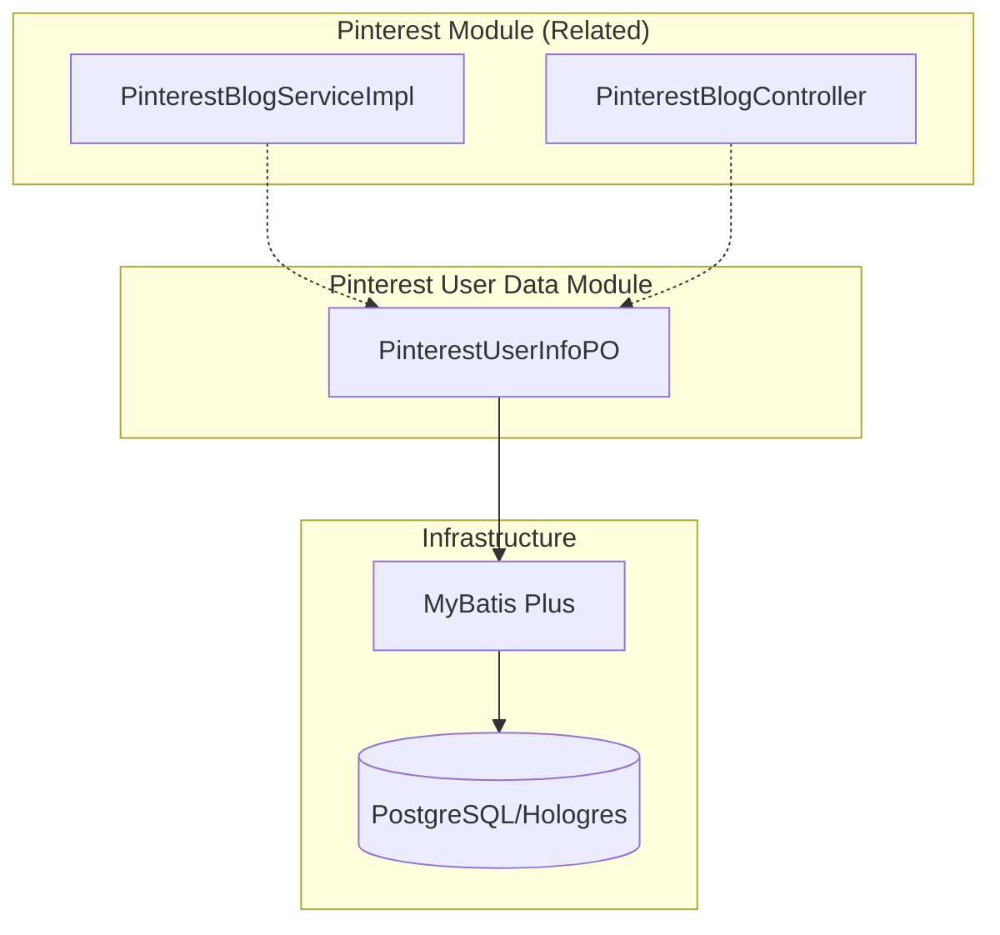
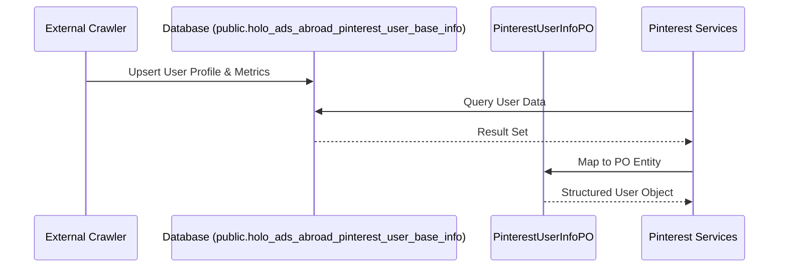

# Pinterest User Data Module

## Introduction
The `pinterest_user_data` module is a specialized component within the [Pinterest-Module](pinterest_blog_management.md) responsible for managing and representing the profile information of Pinterest creators and users. It serves as the data foundation for influencer marketing analysis, user discovery, and trend tracking on the Pinterest platform.

This module focuses on the persistence and structure of user-centric data, including demographic attributes (industry, style, identity), engagement metrics (fans, followers, monthly views), and content activity status.

## Architecture and Component Relationships

The module primarily consists of data models that interface with the persistence layer (PostgreSQL/Hologres via MyBatis Plus) and are utilized by higher-level services for search and analysis.

### Component Diagram

## Core Components

### PinterestUserInfoPO
The central entity representing a Pinterest user's profile and performance metrics.

**Key Attributes:**
*   **Identity & Profile:** `userId`, `userName`, `nickName`, `logo`, `signature`, and `jumpUrl`.
*   **Verification Status:** `isVerified` and `isVerifiedMerchant`.
*   **Categorization:** `industry`, `style`, `identity`, `skinColor`, and `bodyType`.
*   **Engagement Metrics:** `fansCount`, `followCount`, `collectCount`, `boardCount`, and `monthViews`.
*   **Activity Tracking:** `recordDate`, `lastUpdateDate`, `lastPinUpdateDate`, and `newPinPicCount`.
*   **Content Preview:** `newPinPicTop3` (JSON array containing metadata for the latest 3 pins).

## Data Flow

The data flow typically involves ingestion from external Pinterest crawlers into the database, which is then mapped to the `PinterestUserInfoPO` for application use.

## Integration with Other Modules

*   **[Pinterest Blog Management](pinterest_blog_management.md):** This module provides the user context for Pinterest blogs. While `pinterest_blog_management` handles individual pins and boards, `pinterest_user_data` provides the "Author" metadata.
*   **[Analysis Insight Module](overview_analyze_service_impl.md):** User metrics like `fansAddTrend` and `monthViews` are consumed by analysis services to generate trend reports and platform overviews.
*   **[Monitor Module](monitor_manage_helper.md):** User profiles can be flagged for monitoring to track daily changes in follower counts or new pin activity.

## Database Mapping
The module maps to the following table:
*   **Table Name:** `public.holo_ads_abroad_pinterest_user_base_info`
*   **Primary Key:** `userId` (Implicitly used in queries)
*   **Special Fields:** `new_pin_pic_top3` is stored as a JSON string representing the most recent visual content from the user.
