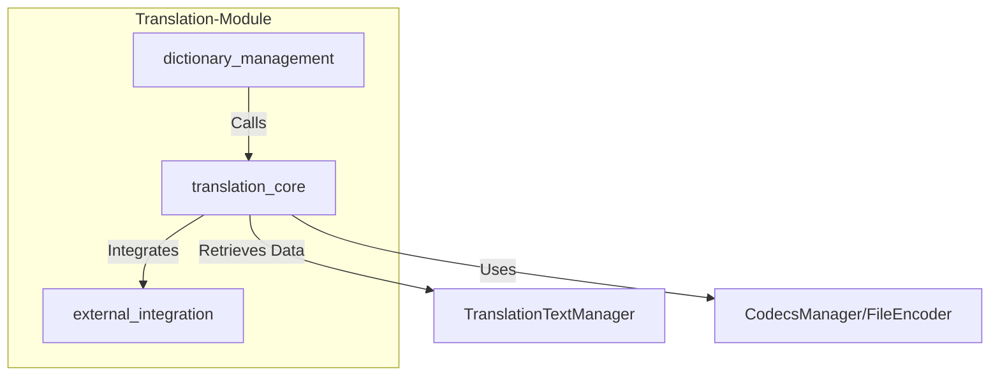
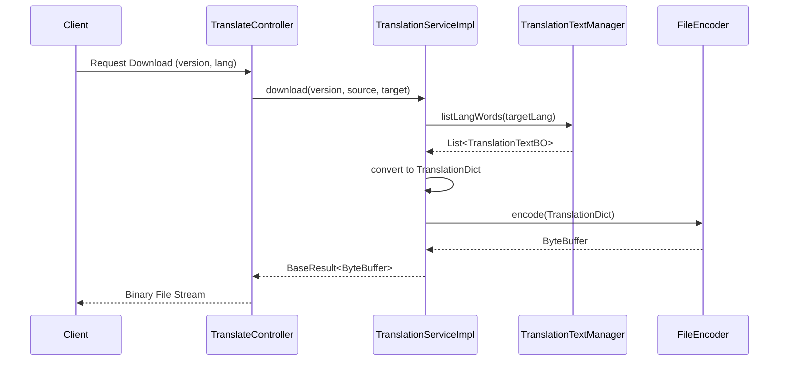

# Translation Core Module

The `translation_core` module serves as the central processing engine for the [Translation-Module](translation_module.md). it is responsible for managing translation dictionaries, handling language-specific text business objects (BOs), and orchestrating the encoding of translation data for client-side consumption.

## Architecture Overview

The module operates as a bridge between the data persistence layer (managed via `TranslationTextManager`) and the external-facing interfaces. It focuses on the internal logic of retrieving, converting, and packaging translation content.

### Component Relationship

## Core Components

### TranslationServiceImpl
The primary service implementation for translation logic. It handles the lifecycle of translation data from retrieval to binary encoding.

- **Dictionary Retrieval**: Fetches translation words based on target language and converts them into a standardized `TranslationDict` format.
- **Binary Export**: Supports downloading translation files by encoding the dictionary into a `ByteBuffer` using specific versioned encoders (e.g., for mobile or web client caching).

### TranslatorConfiguration
A configuration entity that defines the behavior of the translation client.

- **Enable Switch**: Global toggle for translation features.
- **Language Mapping**: Defines the `sourceLang` and a list of `supports` (Target Languages).
- **Loader Strategy**: Specifies how each target language should be loaded (via URL or specific loaders).

## Data Flow

The following diagram illustrates how a translation dictionary is processed and prepared for download.

## Key Processes

### 1. Content Conversion
The module transforms internal `TranslationTextBO` (Business Objects) into `Content` objects used by the translation protocol. This ensures that internal database structures are decoupled from the protocol sent to clients.

### 2. Versioned Encoding
Through the `CodecsManager`, the module supports multiple file versions (`EFileVersion`). This allows the system to evolve its binary format without breaking older clients that might still be using legacy translation file structures.

## Integration with Other Modules

- **[dictionary_management](dictionary_management.md)**: Provides the web controllers that invoke `TranslationServiceImpl`.
- **[external_integration](external_integration.md)**: Works alongside the Google Translation API to supplement the local dictionary when translations are missing.
- **Common Entities**: Utilizes `BaseResult` and `TranslationTextBO` from the `abroad-dataline-common` package for standardized communication.
