# Business Components Module

## Overview

The **business-components** module provides a comprehensive collection of reusable, domain-specific UI components built on top of the [ui-component-system](ui-component-system.md). These components encapsulate complex business logic and user interactions for the Trend Engine application, including batch operations, image management, filtering, data visualization, and navigation utilities.

This module serves as the bridge between generic UI components and application-specific features, offering pre-configured, production-ready components that handle common business scenarios such as multi-select operations, image galleries with labels, category filtering, time-based filtering, and chart visualizations.

---

## Architecture Overview

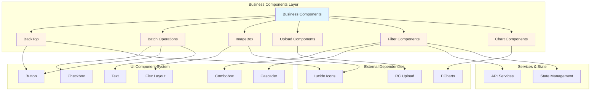

---

## Component Categories

### 1. Navigation Components

#### BackTop Component

A floating button that appears when users scroll down, allowing quick navigation back to the top of the page.

**Key Features:**
- Configurable visibility threshold
- Smooth scroll animation
- Customizable scroll duration
- Target element support (window or custom container)

**Props Interface:**
```typescript
interface BackTopProps {
  duration?: number              // Animation duration (default: 450ms)
  target?: () => HTMLElement     // Target scroll container (default: window)
  visibilityHeight?: number      // Show button after scrolling (default: 400px)
  onClick?: () => void          // Callback after scroll completes
}
```

**Usage Pattern:**
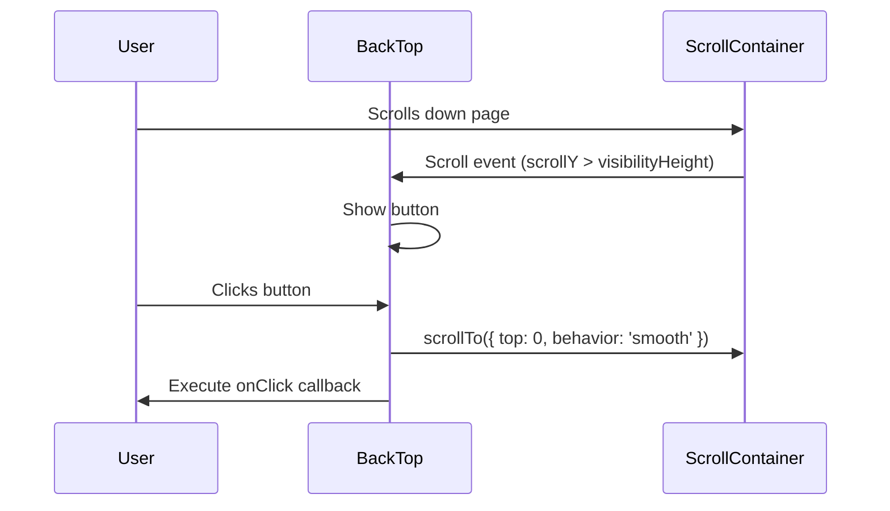

---

### 2. Batch Operation Components

The batch operation system provides a complete solution for multi-select functionality with selection limits, partial selection states, and user feedback.

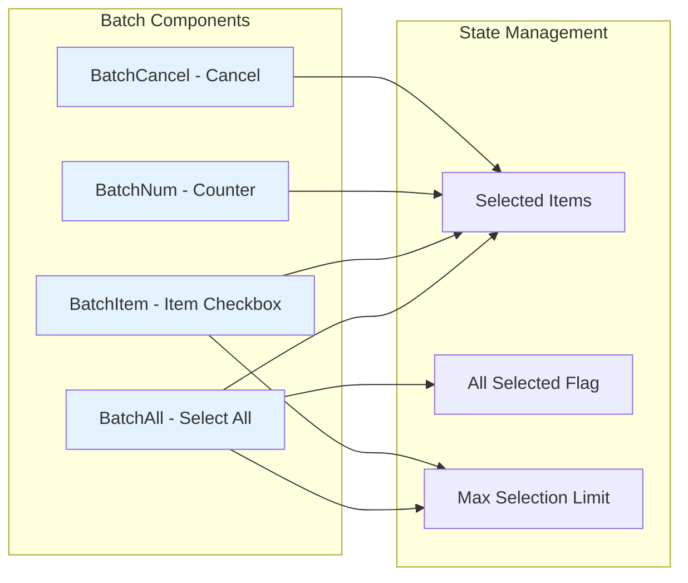

#### Core Interfaces

```typescript
interface ListItem {
  [key: string]: unknown  // Flexible item structure
}

interface BatchProps {
  className?: string
  data: ListItem[]              // Current page/view data
  selected: ListItem[]          // Currently selected items
  allSelected: boolean          // All items selected flag
  maxSelection?: number         // Maximum selection limit
  toggle: (item: ListItem) => void
  toggleAll: () => void
  setIsBatch: (isBatch: boolean) => void
  setSelected: (selected: ListItem[]) => void
}
```

#### Component Breakdown

**BatchAll** - Select all checkbox with intelligent partial selection handling:
- Displays indeterminate state when some items are selected
- Enforces maximum selection limits
- Shows toast notifications when limits are reached
- Handles partial page selection scenarios

**BatchNum** - Selection counter display:
- Shows count of selected items
- Internationalized text support

**BatchCancel** - Cancel batch mode:
- Exits batch selection mode
- Typically clears selections

**BatchItem** - Individual item checkbox:
- Manages single item selection
- Auto-enters batch mode on first selection
- Auto-exits batch mode when last item deselected
- Enforces maximum selection limits

#### Selection Flow

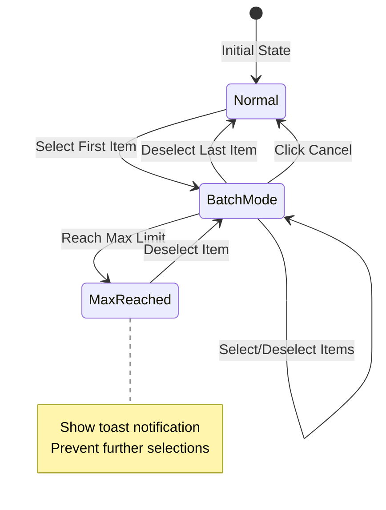

---

### 3. Image Management Components

#### ImageBox Component

A sophisticated image gallery component with thumbnail navigation, video support, and interactive labels.

**Architecture:**

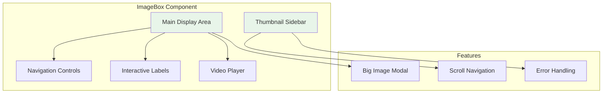

**Props Interface:**
```typescript
interface LabelItem {
  top: string      // CSS position (e.g., "20%")
  left: string     // CSS position (e.g., "30%")
  label: string    // Label text
  link?: string    // Optional link URL
}

type DataType = string | { imgUrl: string; videoUrl?: string }

interface ImageBoxProps {
  data: DataType[]
  currentIndex?: number
  onCurrentIndexChange?: (index: number) => void
  labelList?: LabelItem[]
  className?: string
  sideClassName?: string
  isShowBigImage?: boolean
}
```

**Key Features:**
- **Dual Display**: Main image area with thumbnail sidebar
- **Video Support**: Automatic video player with custom controls
- **Interactive Labels**: Positioned labels with optional links
- **Navigation**: Keyboard and click navigation between images
- **Scroll Management**: Auto-scroll thumbnails to current selection
- **Error Handling**: Fallback images for failed loads
- **Big Image Modal**: Full-screen image viewing

**Component Interaction:**

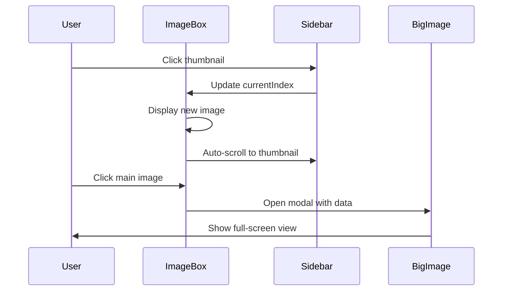

---

### 4. Upload Components

#### UploadImage Component

A lightweight wrapper around RC Upload library for image upload functionality.

**Props Interface:**
```typescript
interface UploadImageProps {
  children: React.ReactNode
  uploadHandle: UploadProps  // RC Upload configuration
}
```

**Integration Pattern:**
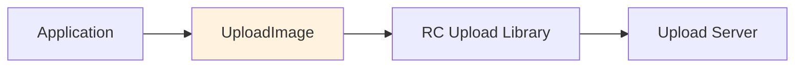

---

### 5. Filter Components

Filter components provide domain-specific filtering capabilities with data fetching and state management.

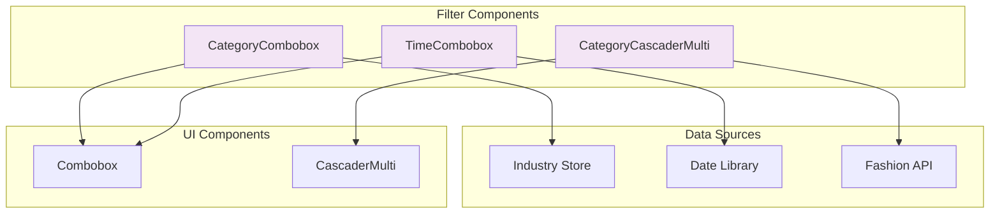

#### CategoryCombobox

Industry/category selection with configurable industry support.

**Props Interface:**
```typescript
interface CategoryComboboxProps extends React.ComponentProps<typeof Combobox> {
  supportedIndustries?: string[]  // Industry IDs to display
  isAllSupported?: boolean        // Show all industries
}
```

**Features:**
- Fetches industry data from global store
- Filters industries based on configuration
- Defaults to apparel industry
- Transforms API data to combobox options

#### TimeCombobox

Date range selection with preset options and custom input.

**Props Interface:**
```typescript
interface TimeComboboxProps {
  value?: [string, string] | []
  onValueChange?: (value: [string, string] | []) => void
  rangeOptions?: typeof RECENT_DATE_OPTIONS
  allowCustomInput?: boolean
}
```

**Features:**
- Preset date ranges (e.g., "Last 7 days", "Last 30 days")
- Custom date interval input
- Formatted date display
- Empty state handling

**Data Flow:**

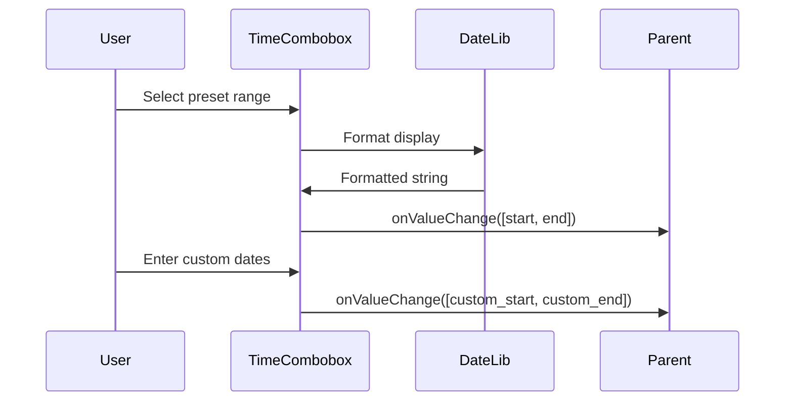

#### FashionIndustryAndCategoryNumCascaderMulti

Multi-level category selection with item counts for fashion industry.

**Props Interface:**
```typescript
interface CategoryCascaderMultiProps extends MultiCascadeProps {
  onSuccess?: (res: OptionCategoryVo[]) => void
  params: object           // API request parameters
  industry?: string        // Industry ID (default: APPAREL_ID)
}
```

**Features:**
- Fetches category statistics from API
- Displays item counts per category
- Multi-select with full path display
- Industry-specific column configuration
- Debounced API requests
- Loading states

**Category Transformation:**

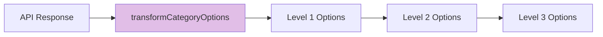

---

### 6. Chart Components

A declarative chart system built on ECharts with React component composition.

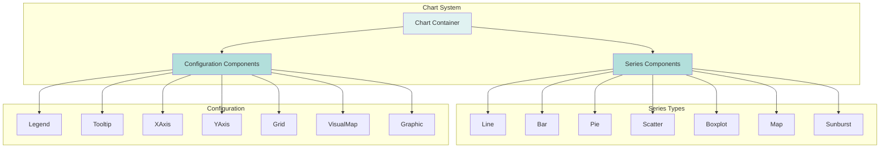

#### Architecture

**Chart Container:**
```typescript
interface ChartProps {
  className?: string
  style?: React.CSSProperties
  children: React.ReactNode
  theme?: string
  defaultOption?: EChartsCoreOption
  option?: EChartsCoreOption
  onReady?: (instance: ECharts) => void
}
```

**Component Pattern:**
```typescript
interface ChartItemComponent<P = object> extends FunctionComponent<P> {
  optionField: keyof EChartsOption  // ECharts option field name
  optionValue?: object              // Default values for this component
}
```

#### Available Components

**Series Components:**
- `Line` - Line charts
- `Bar` - Bar charts
- `Pie` - Pie/donut charts
- `Scatter` - Scatter plots
- `Boxplot` - Box plot charts
- `Map` - Geographic maps
- `Sunburst` - Sunburst diagrams

**Configuration Components:**
- `Legend` - Chart legend
- `Tooltip` - Interactive tooltips
- `XAxis` / `YAxis` - Axis configuration
- `Grid` - Grid layout
- `VisualMap` - Visual mapping
- `Graphic` - Custom graphics

#### Usage Pattern

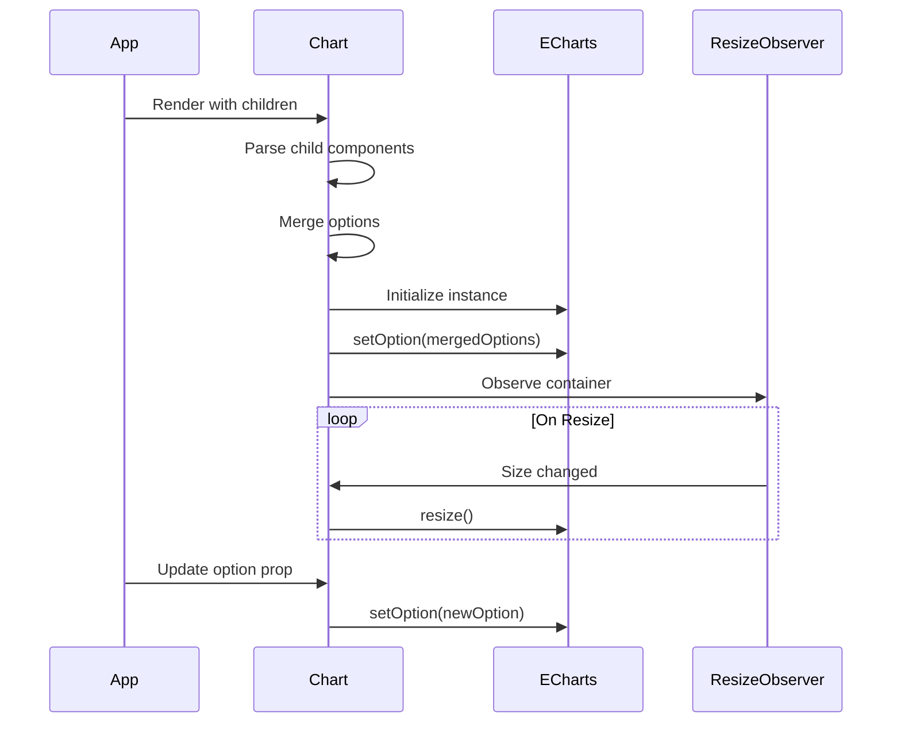

#### Declarative API Example

```typescript
<Chart className="h-80 w-full" theme="default">
  <Tooltip trigger="axis" />
  <Legend />
  <XAxis type="category" data={categories} />
  <YAxis type="value" />
  <Line data={lineData} smooth />
  <Bar data={barData} />
</Chart>
```

**Option Merging Process:**

```mermaid
graph LR
    Children[Child Components] --> Parse[Parse Components]
    Parse --> Extract[Extract Props]
    Extract --> Merge1[Merge with optionValue]
    Merge1 --> Merge2[Merge with defaultOption]
    Merge2 --> Merge3[Merge with option prop]
    Merge3 --> Final[Final ECharts Option]
    Final --> ECharts[ECharts Instance]
    
    style Parse fill:#ffecb3
    style Final fill:#c8e6c9
```

---

## Component Dependencies

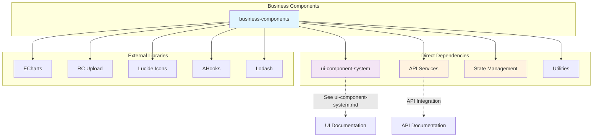

### Key Dependencies

| Dependency | Purpose | Components Using |
|------------|---------|------------------|
| [ui-component-system](ui-component-system.md) | Base UI components | All components |
| ECharts | Data visualization | Chart components |
| RC Upload | File upload | UploadImage |
| Lucide Icons | Icon library | BackTop, ImageBox |
| AHooks | React hooks | Filter components |
| Lodash | Utility functions | Chart (merge) |

---

## Data Flow Patterns

### Filter Component Data Flow

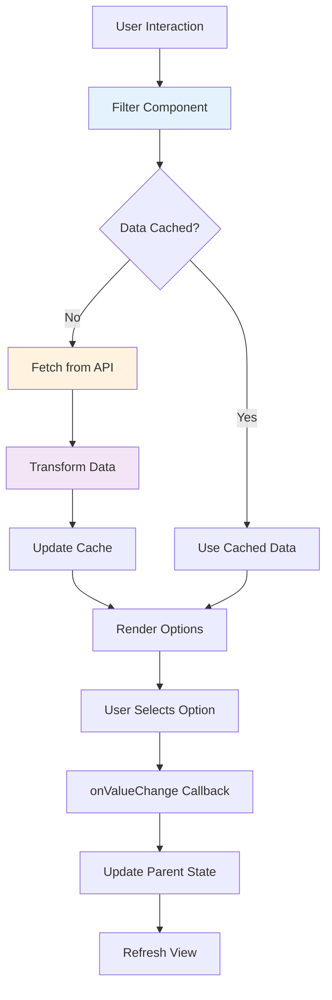

### Batch Operation Data Flow

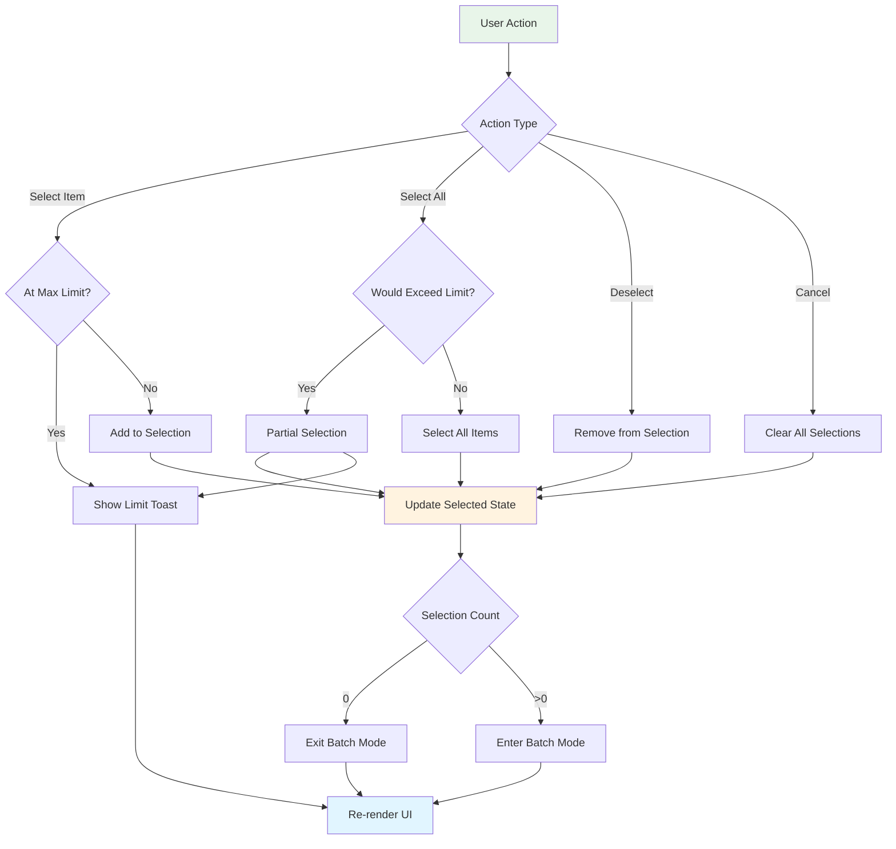

---

## Integration Patterns

### Using Business Components in Views

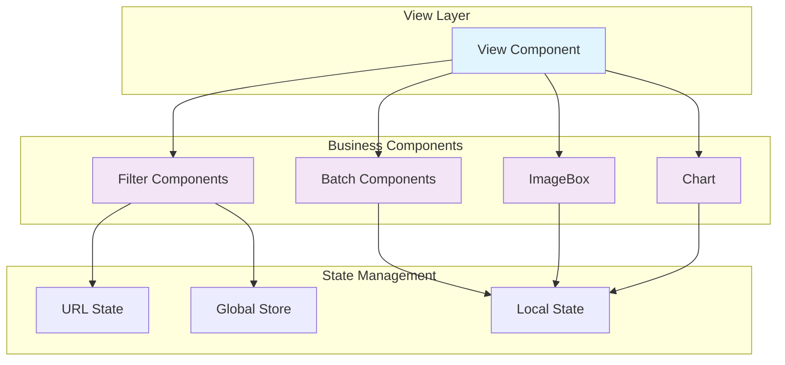

### Common Integration Pattern

```typescript
// View component using business components
function ProductListView() {
  // State management
  const [filters, setFilters] = useUrlState()
  const [selected, setSelected] = useState([])
  const [isBatch, setIsBatch] = useState(false)
  
  // Data fetching
  const { data, loading } = useRequest(() => 
    fetchProducts(filters)
  )
  
  return (
    <div>
      {/* Filters */}
      <CategoryCombobox 
        value={filters.category}
        onValueChange={(v) => setFilters({ category: v })}
      />
      <TimeCombobox
        value={filters.dateRange}
        onValueChange={(v) => setFilters({ dateRange: v })}
      />
      
      {/* Batch operations */}
      {isBatch && (
        <div>
          <BatchAll {...batchProps} />
          <BatchNum length={selected.length} />
          <BatchCancel setIsBatch={setIsBatch} />
        </div>
      )}
      
      {/* Content */}
      <div>
        {data.map(item => (
          <div key={item.id}>
            <BatchItem item={item} {...batchProps} />
            <ImageBox data={item.images} />
          </div>
        ))}
      </div>
      
      {/* Navigation */}
      <BackTop />
    </div>
  )
}
```

---

## Best Practices

### 1. Batch Operations

**DO:**
- Always set `maxSelection` for better UX
- Provide clear feedback via toasts
- Handle partial selection states
- Auto-enter/exit batch mode based on selection count

**DON'T:**
- Allow unlimited selections without warning
- Forget to clear selections on cancel
- Ignore indeterminate checkbox states

### 2. Image Components

**DO:**
- Provide fallback images for error states
- Implement lazy loading for large galleries
- Support both image and video content
- Use responsive sizing

**DON'T:**
- Load all images at once
- Ignore video player controls
- Forget accessibility attributes

### 3. Filter Components

**DO:**
- Debounce API requests
- Cache filter options when possible
- Sync filters with URL state
- Show loading states

**DON'T:**
- Make API calls on every keystroke
- Forget to handle empty states
- Block UI during data fetching

### 4. Chart Components

**DO:**
- Use declarative component API
- Handle responsive resizing
- Provide theme support
- Clean up ECharts instances

**DON'T:**
- Create multiple instances unnecessarily
- Forget to dispose instances on unmount
- Ignore resize events

---

## Performance Considerations

### Optimization Strategies

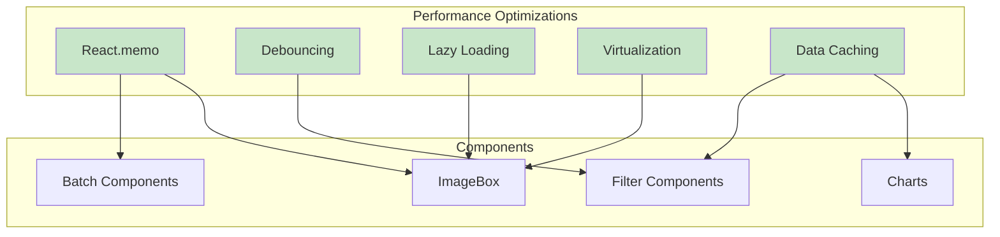

### Component-Specific Optimizations

| Component | Optimization | Implementation |
|-----------|--------------|----------------|
| Batch | Memoize callbacks | `useCallback` for toggle functions |
| ImageBox | Lazy load images | Load images as they scroll into view |
| Filters | Debounce API calls | 500ms debounce on search input |
| Charts | Resize throttling | ResizeObserver with throttle |
| All | Conditional rendering | Only render visible components |

---

## Testing Considerations

### Unit Testing Focus Areas

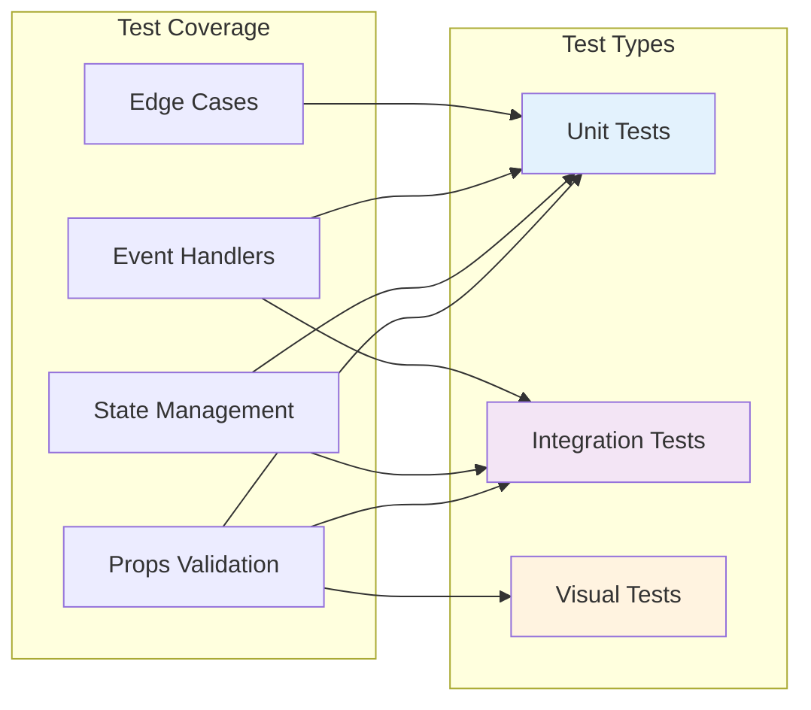

### Key Test Scenarios

**Batch Components:**
- Selection limit enforcement
- Partial selection states
- Toast notifications
- Mode transitions

**ImageBox:**
- Navigation between images
- Video playback
- Error handling
- Label positioning

**Filters:**
- API request handling
- Data transformation
- Empty states
- Loading states

**Charts:**
- Option merging
- Resize handling
- Theme application
- Instance cleanup

---

## Related Modules

- **[ui-component-system](ui-component-system.md)** - Base UI components used by business components
- **[view-modules](view-modules.md)** - Views that consume business components
- **[state-management-hooks](state-management-hooks.md)** - State management utilities
- **[utilities-helpers](utilities-helpers.md)** - Helper functions and utilities

---

## Future Enhancements

### Planned Features

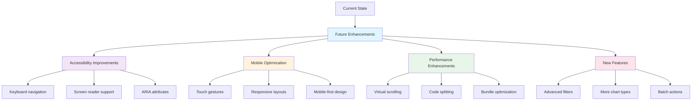

### Roadmap

1. **Q1 2024**: Accessibility audit and improvements
2. **Q2 2024**: Mobile optimization and touch support
3. **Q3 2024**: Performance optimization and virtual scrolling
4. **Q4 2024**: New chart types and advanced filtering

---

## Conclusion

The business-components module provides a robust foundation for building feature-rich, user-friendly interfaces in the Trend Engine application. By encapsulating complex business logic into reusable components, it enables rapid development while maintaining consistency and quality across the application.

Key strengths:
- **Reusability**: Components designed for multiple use cases
- **Composability**: Declarative APIs for easy composition
- **Performance**: Optimized for large datasets and complex interactions
- **Maintainability**: Clear separation of concerns and well-documented APIs

For implementation details and usage examples, refer to the individual component source files and the related module documentation.
