# Core Infrastructure Module

## Overview

The **core-infrastructure** module provides the foundational layer for the Trend Engine application, establishing the essential build-time and runtime infrastructure. This module encompasses environment configuration, build tooling, type definitions, and global augmentations that enable the entire application ecosystem to function cohesively.

This module serves as the bedrock upon which all other modules ([ui-component-system](ui-component-system.md), [business-components](business-components.md), [view-modules](view-modules.md), [state-management-hooks](state-management-hooks.md), and [utilities-helpers](utilities-helpers.md)) are built, providing:

- **Environment Configuration**: Type-safe environment variable management for Vite-based builds
- **Build-Time Route Generation**: Convention-based routing system with automatic route discovery
- **Global Type Augmentations**: Enhanced TypeScript definitions for Window, Array, and third-party libraries
- **Development Infrastructure**: Plugin system for build optimization and developer experience

---

## Architecture Overview

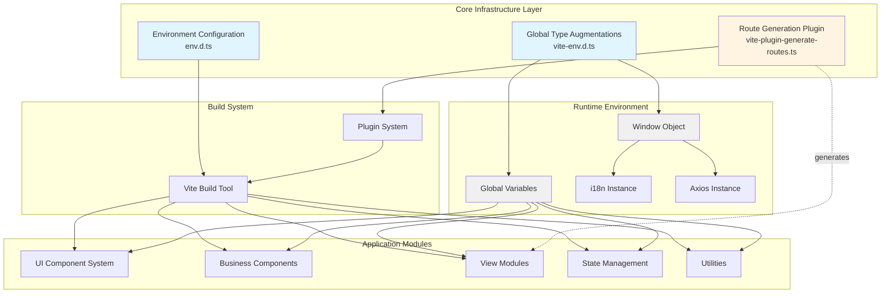

---

## Core Components

### 1. Environment Configuration (`env.d.ts`)

Defines type-safe environment variables for the Vite build system, ensuring compile-time validation of configuration values.

#### Component Structure

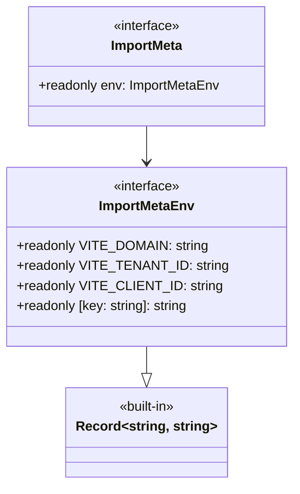

#### Key Features

- **Type Safety**: Strongly typed environment variables prevent runtime errors
- **Readonly Properties**: Immutable configuration values ensure consistency
- **Extensibility**: Inherits from `Record<string, string>` for additional variables
- **Build-Time Validation**: Vite validates environment variables during build

#### Environment Variables

| Variable | Type | Purpose |
|----------|------|---------|
| `VITE_DOMAIN` | string | Application domain/base URL |
| `VITE_TENANT_ID` | string | Multi-tenant identifier for Azure AD |
| `VITE_CLIENT_ID` | string | OAuth client identifier |

#### Usage Pattern

```typescript
// Accessing environment variables with type safety
const domain = import.meta.env.VITE_DOMAIN
const tenantId = import.meta.env.VITE_TENANT_ID
const clientId = import.meta.env.VITE_CLIENT_ID
```

---

### 2. Route Generation Plugin (`vite-plugin-generate-routes.ts`)

A sophisticated Vite plugin that implements convention-based routing with automatic route discovery, lazy loading, and error boundary support.

#### Architecture

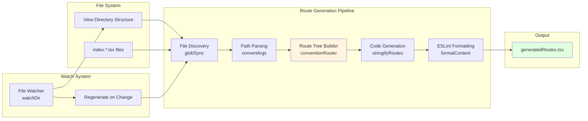

#### Core Data Structures

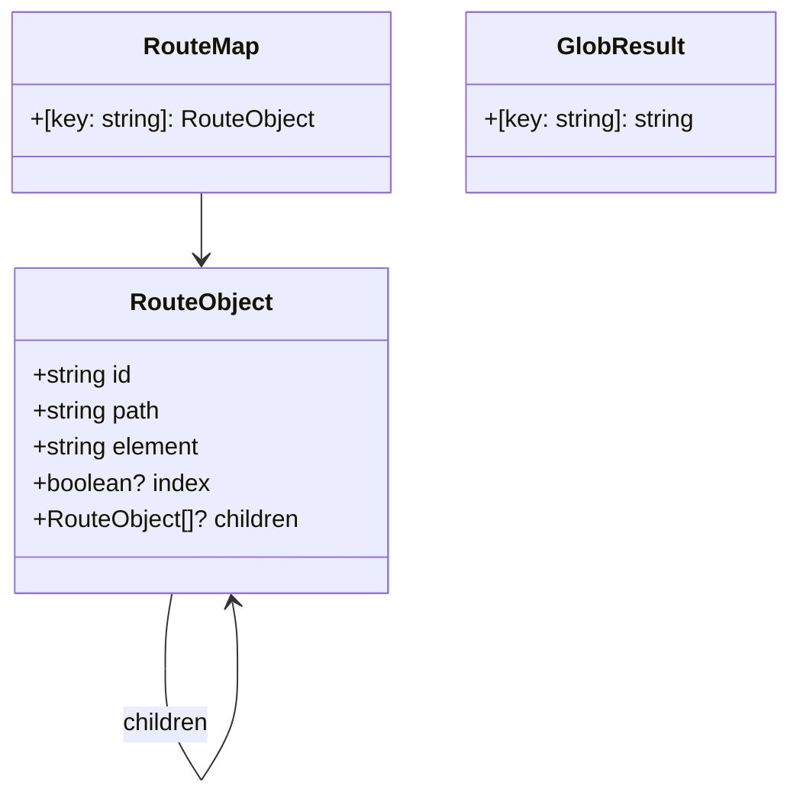

#### Convention-Based Routing Rules

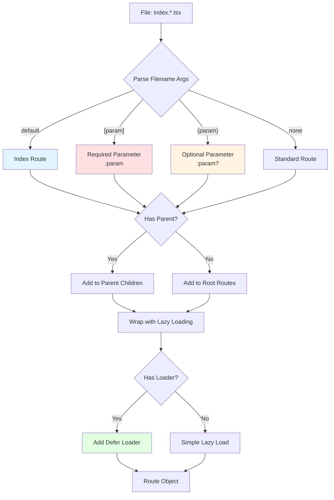

#### File Naming Conventions

| Pattern | Example | Generated Route | Description |
|---------|---------|-----------------|-------------|
| `index.tsx` | `view/dashboard/index.tsx` | `/view/dashboard` | Standard route |
| `index.default.tsx` | `view/home/index.default.tsx` | `/view/home` + index | Default child route |
| `index.[id].tsx` | `view/product/index.[id].tsx` | `/view/product/:id` | Required parameter |
| `index.(id).tsx` | `view/user/index.(id).tsx` | `/view/user/:id?` | Optional parameter |
| `index.[id].default.tsx` | `view/detail/index.[id].default.tsx` | `/view/detail/:id` + index | Parameterized default |

#### Route Generation Process

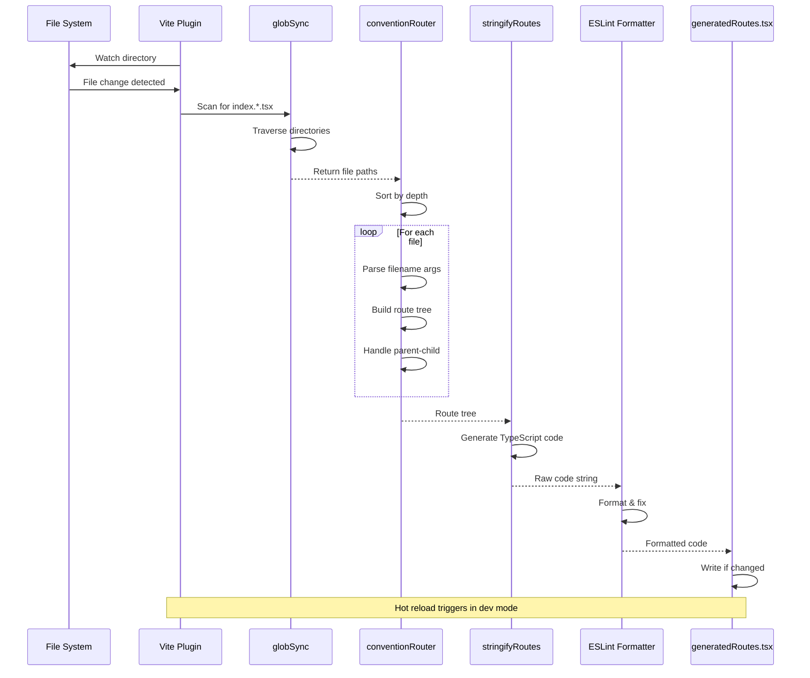

#### Generated Route Structure

The plugin generates a TypeScript file with the following structure:

```typescript
// Generated structure (simplified)
import { DeferLoader, defineDeferLoader } from "./bc/defer-loader.tsx"
import { Text } from "./component/index.ts"

function lazyLoad(r: Promise<any>) {
  return async () => {
    const res = await r
    const Component = res.default
    if (!res.loader) return { Component, ErrorBoundary: res.ErrorBoundary }
    const HydrateFallback = res.HydrateFallback
    return {
      element: (
        <DeferLoader fallback={HydrateFallback ? <HydrateFallback /> : <Text t="text.loading" />}>
          <Component />
        </DeferLoader>
      ),
      loader: defineDeferLoader(res.loader),
      ErrorBoundary: res.ErrorBoundary,
    }
  }
}

const routes = [
  {
    path: "/view/dashboard",
    id: "view/dashboard",
    lazy: lazyLoad(import("../view/dashboard/index.tsx")),
    children: []
  },
  // ... more routes
]

export default routes
```

#### Key Features

- **Automatic Discovery**: Scans directory structure for route files
- **Lazy Loading**: Code-splitting for optimal performance
- **Defer Loader Support**: Handles async data loading with fallbacks
- **Error Boundaries**: Per-route error handling
- **Hot Reload**: Watches file system for changes in development
- **Type Safety**: Generates TypeScript code with proper types
- **ESLint Integration**: Automatically formats generated code

---

### 3. Global Type Augmentations (`vite-env.d.ts`)

Extends global TypeScript definitions to provide enhanced type safety and developer experience across the entire application.

#### Global Augmentation Architecture

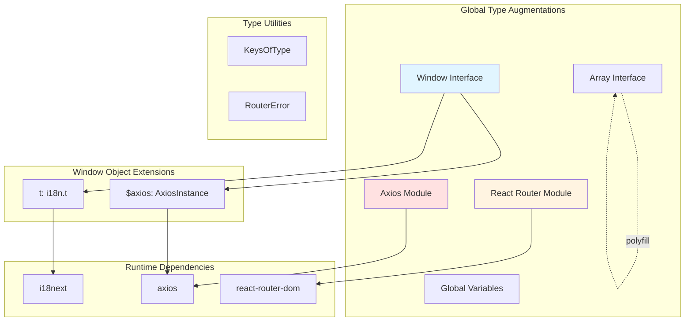

#### Type Augmentation Details

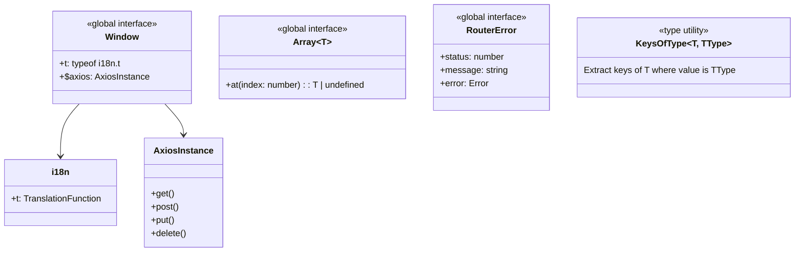

#### Global Augmentations Breakdown

##### 1. Window Interface Extensions

```typescript
interface Window {
  t: typeof i18n.t              // Global translation function
  $axios: AxiosInstance         // Global HTTP client
}
```

**Purpose**: Provides global access to commonly used utilities without imports.

**Benefits**:
- Simplified internationalization: `window.t('key')` instead of importing
- Centralized HTTP client: `window.$axios.get()` with interceptors
- Consistent API across all components

##### 2. Global Variable Declarations

```typescript
let t: typeof i18n.t
let $axios: AxiosInstance
```

**Purpose**: Enables direct usage without `window.` prefix.

**Usage**:
```typescript
// Direct usage in any file
const text = t('common.save')
const data = await $axios.get('/api/data')
```

##### 3. Type Utility: KeysOfType

```typescript
type KeysOfType<T, TType> = {
  [K in keyof T]-?: T[K] extends TType ? K : never
}[keyof T]
```

**Purpose**: Extracts keys from an object type where the value matches a specific type.

**Example**:
```typescript
interface User {
  id: number
  name: string
  email: string
  age: number
}

type StringKeys = KeysOfType<User, string>  // "name" | "email"
type NumberKeys = KeysOfType<User, number>  // "id" | "age"
```

##### 4. Router Error Interface

```typescript
interface RouterError {
  status: number
  message: string
  error: Error
}
```

**Purpose**: Standardized error structure for routing errors.

**Usage**: Error boundaries and error handling in route loaders.

##### 5. Array.prototype.at() Polyfill

```typescript
interface Array<T> {
  at(index: number): T | undefined
}
```

**Purpose**: Type definition for ES2022 `Array.at()` method for negative indexing.

##### 6. React Router Module Augmentation

```typescript
declare module "react-router-dom" {
  export function useLoaderData<T>(): T extends (...args: any) => infer R ? Awaited<R> : T
}
```

**Purpose**: Enhanced type inference for `useLoaderData` hook.

**Benefits**:
- Automatic type extraction from loader functions
- Handles async loaders with `Awaited<R>`
- Eliminates manual type annotations

##### 7. Axios Module Augmentation

```typescript
declare module "axios" {
  export function get<T>(url: string, config?: AxiosRequestConfig): Promise<T>
  export function post<T>(url: string, data?: unknown, config?: AxiosRequestConfig): Promise<T>
}
```

**Purpose**: Simplified return types for Axios methods (removes `AxiosResponse` wrapper).

**Benefits**:
- Direct data access: `const data = await axios.get<User[]>('/users')`
- Works with response interceptors that unwrap data
- Cleaner type signatures

---

## Module Dependencies

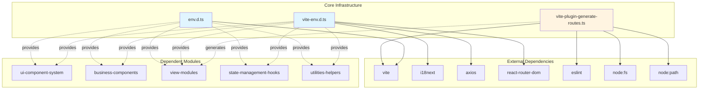

### Dependency Analysis

#### External Dependencies

| Dependency | Used By | Purpose |
|------------|---------|---------|
| `vite` | Route Generation Plugin | Build tool and plugin system |
| `eslint` | Route Generation Plugin | Code formatting for generated routes |
| `node:fs` | Route Generation Plugin | File system operations |
| `node:path` | Route Generation Plugin | Path manipulation |
| `i18next` | Global Augmentations | Internationalization |
| `axios` | Global Augmentations | HTTP client |
| `react-router-dom` | Global Augmentations | Routing library |

#### Module Relationships

The core-infrastructure module has a **foundational relationship** with all other modules:

- **[ui-component-system](ui-component-system.md)**: Uses global types and environment config
- **[business-components](business-components.md)**: Relies on global utilities and types
- **[view-modules](view-modules.md)**: Generated by route plugin, uses global augmentations
- **[state-management-hooks](state-management-hooks.md)**: Uses global types and utilities
- **[utilities-helpers](utilities-helpers.md)**: Built on core type definitions

---

## Build Process Integration

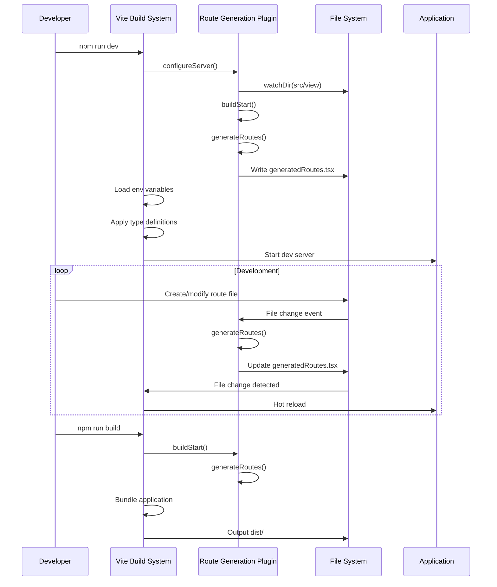

### Build Configuration Flow

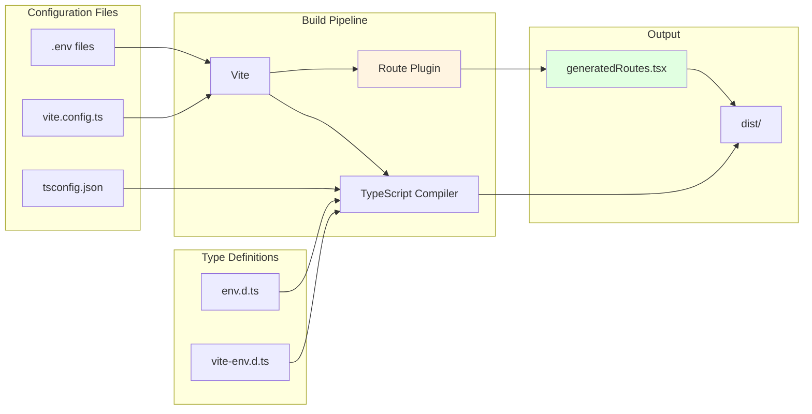

---

## Runtime Initialization

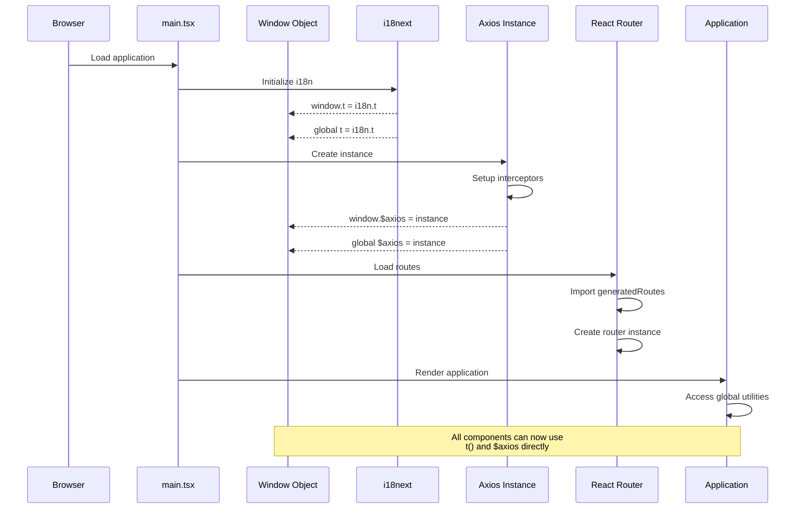

### Global Initialization Pattern

```typescript
// Typical initialization in main.tsx
import i18n from 'i18next'
import axios from 'axios'
import routes from './generatedRoutes'

// Setup i18n
await i18n.init(/* config */)
window.t = i18n.t
globalThis.t = i18n.t

// Setup axios
const axiosInstance = axios.create({
  baseURL: import.meta.env.VITE_DOMAIN
})
// Add interceptors...
window.$axios = axiosInstance
globalThis.$axios = axiosInstance

// Setup router
const router = createBrowserRouter(routes)

// Render app
ReactDOM.createRoot(document.getElementById('root')!).render(
  <RouterProvider router={router} />
)
```

---

## Usage Patterns

### 1. Environment Variables

```typescript
// Accessing environment variables
const apiUrl = `${import.meta.env.VITE_DOMAIN}/api`
const authConfig = {
  tenantId: import.meta.env.VITE_TENANT_ID,
  clientId: import.meta.env.VITE_CLIENT_ID
}

// Type-safe access with autocomplete
// TypeScript will error if variable doesn't exist
```

### 2. Convention-Based Routing

```typescript
// File structure determines routes
// src/view/dashboard/index.tsx → /view/dashboard
// src/view/product/index.[id].tsx → /view/product/:id
// src/view/home/index.default.tsx → /view/home (index route)

// Route component with loader
export default function ProductDetail() {
  const product = useLoaderData<typeof loader>()
  return <div>{product.name}</div>
}

export async function loader({ params }: LoaderFunctionArgs) {
  return await $axios.get(`/api/products/${params.id}`)
}

// Optional: Error boundary
export function ErrorBoundary() {
  const error = useRouteError() as RouterError
  return <div>Error {error.status}: {error.message}</div>
}

// Optional: Hydration fallback
export function HydrateFallback() {
  return <Skeleton />
}
```

### 3. Global Utilities

```typescript
// Using global translation function
function MyComponent() {
  return (
    <button>{t('common.save')}</button>
  )
}

// Using global axios instance
async function fetchData() {
  const users = await $axios.get<User[]>('/api/users')
  return users  // Direct data access, no .data property
}

// Type utility usage
interface FormData {
  name: string
  email: string
  age: number
  active: boolean
}

type StringFields = KeysOfType<FormData, string>  // "name" | "email"
```

### 4. Enhanced Type Inference

```typescript
// React Router loader with automatic type inference
export async function loader() {
  return {
    users: await $axios.get<User[]>('/api/users'),
    settings: await $axios.get<Settings>('/api/settings')
  }
}

function Component() {
  // Type is automatically inferred from loader return type
  const { users, settings } = useLoaderData<typeof loader>()
  // users: User[]
  // settings: Settings
}

// Axios with simplified types
const response = await axios.get<Product[]>('/api/products')
// response is Product[], not AxiosResponse<Product[]>
```

---

## Best Practices

### 1. Environment Configuration

```typescript
// ✅ DO: Use type-safe environment variables
const domain = import.meta.env.VITE_DOMAIN

// ❌ DON'T: Use process.env (not available in Vite)
const domain = process.env.VITE_DOMAIN

// ✅ DO: Prefix with VITE_ for client-side variables
// VITE_API_URL=https://api.example.com

// ❌ DON'T: Use non-prefixed variables (won't be exposed)
// API_URL=https://api.example.com
```

### 2. Route Organization

```typescript
// ✅ DO: Follow naming conventions
// view/products/index.tsx              → /view/products
// view/products/index.[id].tsx         → /view/products/:id
// view/products/index.[id].default.tsx → /view/products/:id (index)

// ❌ DON'T: Use non-standard naming
// view/products/product.tsx            → Won't be discovered
// view/products/[id].tsx               → Won't be discovered

// ✅ DO: Use optional parameters for flexible routes
// view/search/index.(query).tsx        → /view/search/:query?

// ✅ DO: Export loader, ErrorBoundary, HydrateFallback as needed
export default function Component() { /* ... */ }
export async function loader() { /* ... */ }
export function ErrorBoundary() { /* ... */ }
export function HydrateFallback() { /* ... */ }
```

### 3. Global Utilities

```typescript
// ✅ DO: Use global utilities for common operations
const text = t('common.save')
const data = await $axios.get('/api/data')

// ✅ DO: Import when you need the full API
import i18n from 'i18next'
i18n.changeLanguage('en')

// ❌ DON'T: Overwrite global utilities
window.t = myCustomFunction  // Bad practice

// ✅ DO: Use type utilities for type-safe operations
type StringKeys = KeysOfType<MyInterface, string>
```

### 4. Type Augmentations

```typescript
// ✅ DO: Leverage enhanced type inference
const data = useLoaderData<typeof loader>()

// ❌ DON'T: Manually type when inference works
const data = useLoaderData() as LoaderData

// ✅ DO: Use simplified Axios types
const users = await axios.get<User[]>('/api/users')
// users is User[], not AxiosResponse<User[]>

// ✅ DO: Use RouterError for error handling
function ErrorBoundary() {
  const error = useRouteError() as RouterError
  return <div>Error {error.status}</div>
}
```

---

## Performance Considerations

### 1. Route Code Splitting

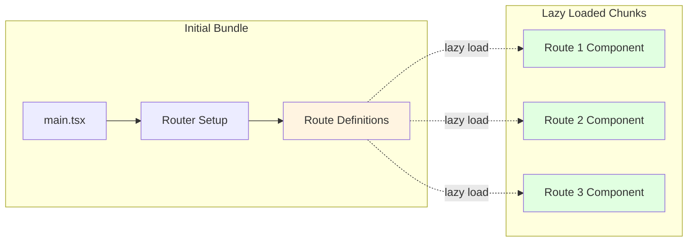

**Benefits**:
- Smaller initial bundle size
- Faster time to interactive
- On-demand loading of route components
- Automatic code splitting by Vite

### 2. Build Optimization

```typescript
// Route generation only runs when files change
// Incremental updates in development
// Single generation in production build

// ESLint formatting is cached
// Only reformats if content changes
```

### 3. Type Checking Performance

```typescript
// Global augmentations are loaded once
// Type inference is compile-time only
// No runtime overhead for type utilities
```

---

## Error Handling

### 1. Route Generation Errors

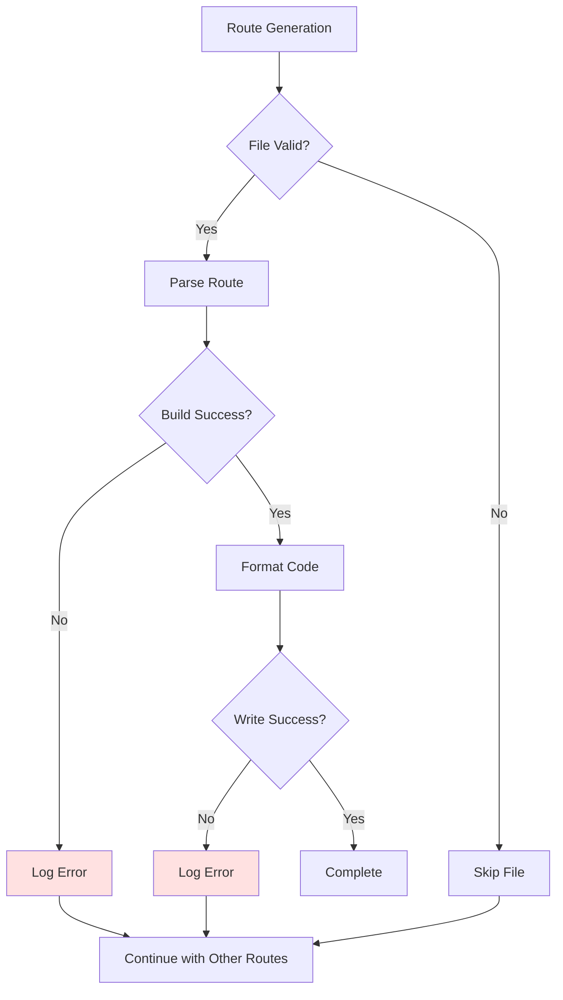

### 2. Runtime Error Boundaries

```typescript
// Per-route error boundaries
export function ErrorBoundary() {
  const error = useRouteError() as RouterError
  
  if (error.status === 404) {
    return <NotFound />
  }
  
  if (error.status === 403) {
    return <Forbidden />
  }
  
  return <GenericError error={error} />
}
```

### 3. Environment Variable Validation

```typescript
// Type system ensures variables exist at compile time
// Runtime validation can be added in main.tsx

const requiredEnvVars = [
  'VITE_DOMAIN',
  'VITE_TENANT_ID',
  'VITE_CLIENT_ID'
] as const

requiredEnvVars.forEach(varName => {
  if (!import.meta.env[varName]) {
    throw new Error(`Missing required environment variable: ${varName}`)
  }
})
```

---

## Testing Considerations

### 1. Route Generation Testing

```typescript
// Test route discovery
describe('Route Generation', () => {
  it('should discover all index files', () => {
    const routes = conventionRouter('src/view')
    expect(routes).toHaveLength(expectedCount)
  })
  
  it('should handle parameterized routes', () => {
    const routes = conventionRouter('src/view')
    const productRoute = routes.find(r => r.id === 'view/product')
    expect(productRoute?.path).toBe('view/product/:id')
  })
})
```

### 2. Global Utilities Testing

```typescript
// Mock global utilities in tests
beforeEach(() => {
  global.t = jest.fn((key) => key)
  global.$axios = {
    get: jest.fn(),
    post: jest.fn()
  } as any
})
```

### 3. Type Testing

```typescript
// Use type assertions to test type utilities
type Test1 = KeysOfType<{ a: string, b: number }, string>
const _test1: Test1 = 'a'  // Should compile

type Test2 = KeysOfType<{ a: string, b: number }, number>
const _test2: Test2 = 'b'  // Should compile
```

---

## Migration Guide

### From Manual Routes to Convention-Based

```typescript
// Before: Manual route configuration
const routes = [
  {
    path: '/dashboard',
    element: <Dashboard />,
    loader: dashboardLoader
  },
  {
    path: '/product/:id',
    element: <ProductDetail />,
    loader: productLoader
  }
]

// After: Convention-based routing
// 1. Create view/dashboard/index.tsx
export default function Dashboard() { /* ... */ }
export async function loader() { /* ... */ }

// 2. Create view/product/index.[id].tsx
export default function ProductDetail() { /* ... */ }
export async function loader({ params }) { /* ... */ }

// 3. Routes are automatically generated
import routes from './generatedRoutes'
const router = createBrowserRouter(routes)
```

### Adding Global Utilities

```typescript
// 1. Extend Window interface in vite-env.d.ts
interface Window {
  t: typeof i18n.t
  $axios: AxiosInstance
  myUtility: MyUtilityType  // Add new utility
}

// 2. Initialize in main.tsx
window.myUtility = createMyUtility()
globalThis.myUtility = window.myUtility

// 3. Declare global variable
declare let myUtility: MyUtilityType

// 4. Use anywhere without imports
myUtility.doSomething()
```

---

## Related Modules

- **[ui-component-system](ui-component-system.md)**: Built on core infrastructure, uses global types
- **[business-components](business-components.md)**: Leverages global utilities and routing
- **[view-modules](view-modules.md)**: Generated by route plugin, primary consumer of routing system
- **[state-management-hooks](state-management-hooks.md)**: Uses global types and utilities
- **[utilities-helpers](utilities-helpers.md)**: Extends core infrastructure with helper functions

---

## Summary

The **core-infrastructure** module provides the essential foundation for the Trend Engine application:

### Key Capabilities

1. **Type-Safe Configuration**: Environment variables with compile-time validation
2. **Automatic Routing**: Convention-based route generation with lazy loading
3. **Global Utilities**: Centralized access to i18n and HTTP client
4. **Enhanced Types**: Improved type inference for React Router and Axios
5. **Developer Experience**: Hot reload, automatic formatting, and type safety

### Architecture Principles

- **Convention over Configuration**: File structure determines routes
- **Type Safety First**: Strong typing at every level
- **Performance Optimized**: Code splitting and lazy loading by default
- **Developer Friendly**: Minimal boilerplate, maximum productivity

### Integration Points

- Vite build system for bundling and development
- React Router for routing and navigation
- i18next for internationalization
- Axios for HTTP communication
- ESLint for code quality

This module serves as the bedrock for all other modules, providing the infrastructure that enables rapid development while maintaining type safety and performance.
