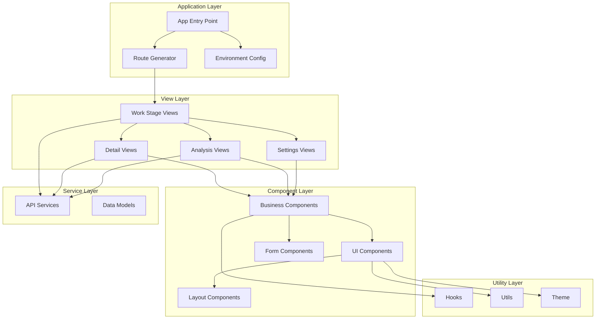
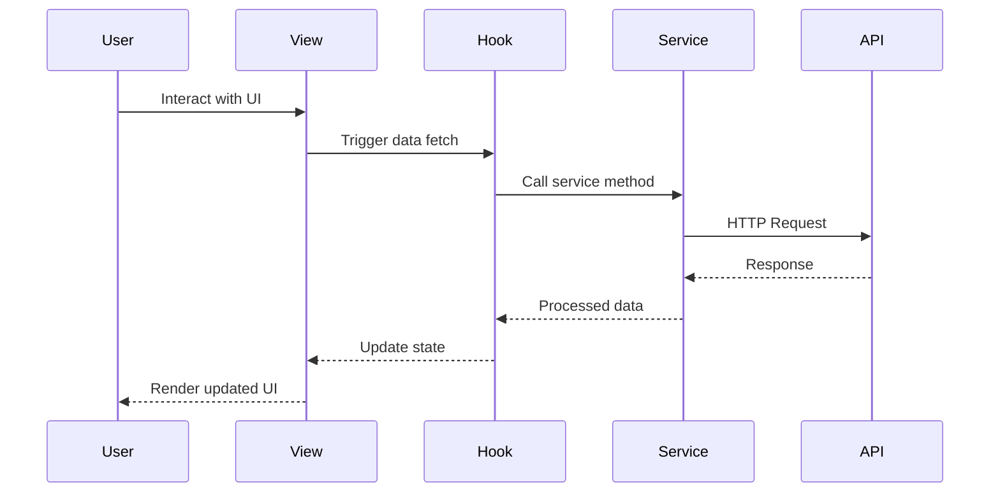
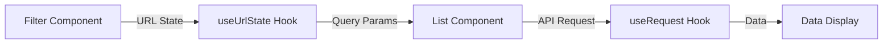
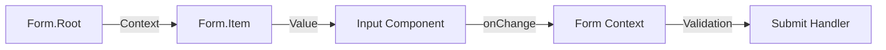
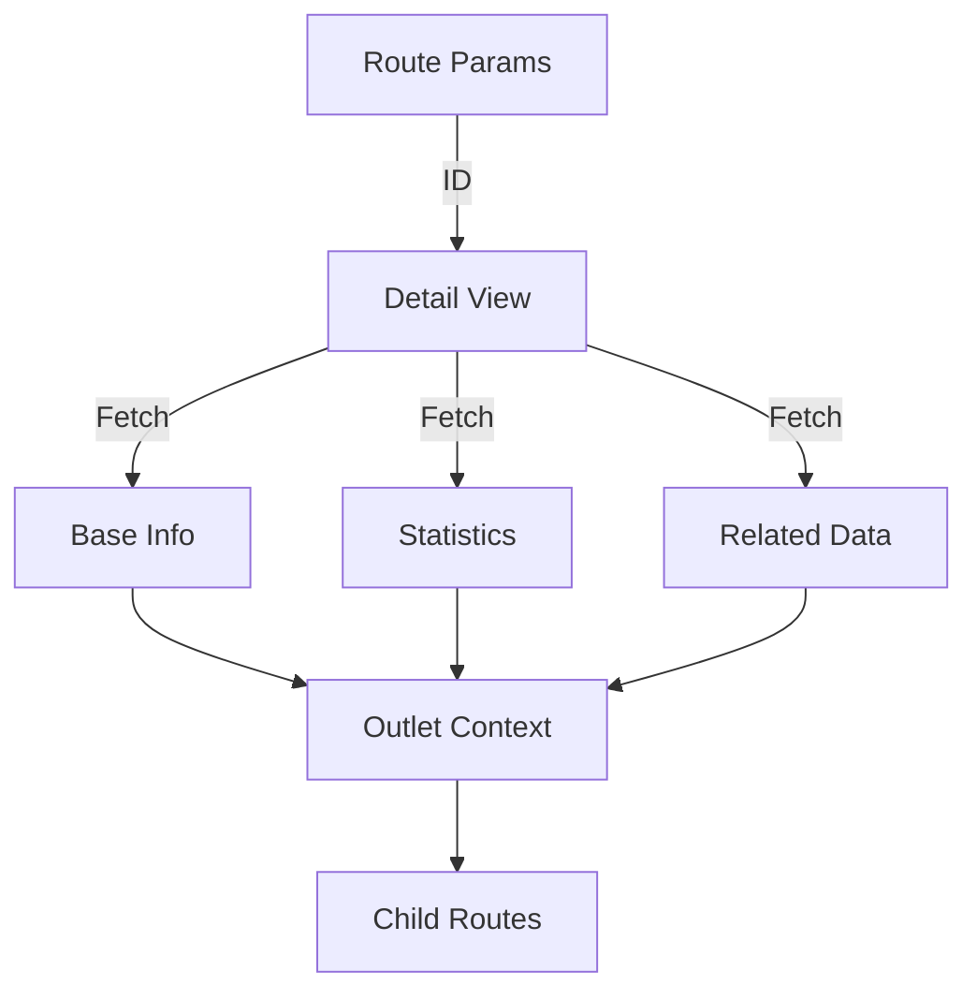

# TrendEngine-FrontEnd Module Documentation

## Overview

The TrendEngine-FrontEnd module is a comprehensive React-based frontend application built with TypeScript, Vite, and modern UI libraries. It provides a sophisticated platform for trend analysis, market research, and fashion industry insights with features including product analysis, runway analysis, consumer insights, and data visualization.

## Architecture

### Technology Stack

- **Framework**: React 18+ with TypeScript
- **Build Tool**: Vite
- **Routing**: React Router v6 with convention-based routing
- **State Management**: React Context + Hooks (ahooks)
- **UI Components**: Radix UI primitives with custom components
- **Styling**: Tailwind CSS with class-variance-authority (CVA)
- **Charts**: ECharts
- **Forms**: Custom form system with context-based state management
- **Internationalization**: i18next

### High-Level Architecture



## Module Structure

The TrendEngine-FrontEnd module is organized into several key sub-modules:

### 1. [Core Infrastructure](./core-infrastructure.md)
Handles application bootstrapping, routing, environment configuration, and build-time code generation.

**Key Components:**
- Convention-based route generation system
- Environment configuration with TypeScript definitions
- Vite plugin for automatic route generation
- Global type definitions and extensions

### 2. [UI Component System](./ui-component-system.md)
Provides a comprehensive library of reusable UI components built on Radix UI primitives.

**Key Components:**
- Form components with context-based state management
- Data display components (Button, Badge, Text, Toast)
- Input components (Combobox, Cascader, Textbox)
- Layout components (Flex, Grid, Masonry)
- Chart components (ECharts wrapper)

### 3. [Business Components](./business-components.md)
Domain-specific components for fashion and trend analysis features.

**Key Components:**
- Filter components (Category, Time, Color, Style)
- Image handling (ImageBox, BigImage, Upload)
- Data visualization (Charts, Panels)
- Batch operations
- List layouts and pagination

### 4. [View Modules](./view-modules.md)
Feature-specific views and pages for different analysis workflows.

**Key Components:**
- Product detail views with SKU analysis
- Runway analysis with image processing
- Consumer analysis and trend discovery
- Market analysis statistics
- Search results and filtering
- Settings and role management

### 5. [State Management & Hooks](./state-management-hooks.md)
Custom hooks and state management patterns for data fetching, URL state, and component lifecycle.

**Key Components:**
- URL state management
- Record flow persistence
- Image list management
- Form field management
- Tree data structures

### 6. [Utilities & Helpers](./utilities-helpers.md)
Common utilities for data formatting, file operations, and type safety.

**Key Components:**
- File export (Excel, CSV, ZIP)
- Date formatting
- Number formatting
- Theme management

## Key Features

### 1. Convention-Based Routing

The application uses a file-system based routing convention that automatically generates routes from the directory structure:

```
src/view/
  └── work-stage/
      ├── index.default.tsx          → /work-stage (default route)
      ├── detail/
      │   └── product/
      │       └── [id]/              → /work-stage/detail/product/:id
      │           └── index.tsx
      └── search-result/
          └── all/
              └── index.tsx           → /work-stage/search-result/all
```

### 2. Form System

A powerful form system with automatic state management:

```typescript
<Form.Root value={formData} onValueChange={setFormData}>
  <Form.Item name="category">
    <CategoryCombobox />
  </Form.Item>
  <Form.Item name="dateRange">
    <TimeCombobox />
  </Form.Item>
</Form.Root>
```

### 3. Data Visualization

Declarative chart components built on ECharts:

```typescript
<Chart option={chartOption}>
  <Line data={lineData} />
  <Bar data={barData} />
  <Tooltip />
  <Legend />
</Chart>
```

### 4. Virtual Scrolling & Performance

Optimized list rendering with masonry layout and virtual scrolling:

```typescript
<Masonry.Root loading={loading} empty={empty}>
  <Masonry.ViewBox data={items} columnWidth={255} gap={16}>
    {({ data, x, y, w, h }) => (
      <Masonry.Item x={x} y={y} w={w} h={h}>
        <ProductCard data={data} />
      </Masonry.Item>
    )}
  </Masonry.ViewBox>
</Masonry.Root>
```

## Data Flow



## Component Interaction Patterns

### 1. Filter → List Pattern



### 2. Form → Validation → Submit Pattern



### 3. Detail View Pattern



## Environment Configuration

The application uses environment variables for configuration:

```typescript
interface ImportMetaEnv {
  readonly VITE_DOMAIN: string
  readonly VITE_TENANT_ID: string
  readonly VITE_CLIENT_ID: string
}
```

## Type Safety

The module extends global types for enhanced developer experience:

```typescript
// Global window extensions
interface Window {
  t: typeof i18n.t
  $axios: AxiosInstance
}

// Array extensions
interface Array<T> {
  at(index: number): T | undefined
}

// Router type enhancements
interface RouterError {
  status: number
  message: string
  error: Error
}
```

## Best Practices

### 1. Component Composition

Use composition patterns with Radix UI Slot for flexible component APIs:

```typescript
<Button asChild>
  <Link to="/path">Navigate</Link>
</Button>
```

### 2. State Management

- Use URL state for filter parameters
- Use React Context for form state
- Use custom hooks for data fetching
- Use local state for UI-only state

### 3. Performance Optimization

- Virtual scrolling for large lists
- Lazy loading with React.lazy
- Debounced search inputs
- Memoized computed values

### 4. Type Safety

- Strict TypeScript configuration
- Typed API responses
- Typed form values
- Typed route parameters

## Integration Points

### API Integration

All API calls go through a configured Axios instance with interceptors:

```typescript
// Global axios instance
window.$axios = configuredAxiosInstance

// Usage in services
export async function serviceGetProduct(id: string) {
  return $axios.get<ProductDto>(`/api/product/${id}`)
}
```

### Internationalization

Global translation function available everywhere:

```typescript
// Global t function
window.t = i18n.t

// Usage in components
<Text t="common.save" />
// or
{t("common.save")}
```

## Development Workflow

### 1. Adding New Routes

Simply create files following the convention:

```
src/view/work-stage/new-feature/index.tsx
```

Routes are automatically generated on build and during development.

### 2. Creating New Components

Follow the established patterns:

```typescript
// UI Component
export interface MyComponentProps {
  value?: string
  onValueChange?: (value: string) => void
}

export const MyComponent = ({ value, onValueChange }: MyComponentProps) => {
  // Implementation
}
```

### 3. Adding New Filters

Use the Form system with existing filter components:

```typescript
<Form.Root value={filters} onValueChange={setFilters}>
  <Form.Item name="category">
    <CategoryCombobox />
  </Form.Item>
</Form.Root>
```

## Testing Considerations

- Component testing with React Testing Library
- Hook testing with @testing-library/react-hooks
- E2E testing with Playwright/Cypress
- Type checking with TypeScript compiler

## Performance Metrics

- Initial load time optimization with code splitting
- Virtual scrolling for 1000+ items
- Debounced search (500ms default)
- Lazy loaded routes
- Optimized bundle size with tree shaking

## Browser Support

- Modern browsers (Chrome, Firefox, Safari, Edge)
- ES2020+ features
- CSS Grid and Flexbox
- ResizeObserver API
- IntersectionObserver API

## Related Documentation

- [Core Infrastructure](./core-infrastructure.md) - Routing, configuration, and build system
- [UI Component System](./ui-component-system.md) - Reusable UI components
- [Business Components](./business-components.md) - Domain-specific components
- [View Modules](./view-modules.md) - Feature views and pages
- [State Management & Hooks](./state-management-hooks.md) - Custom hooks and state patterns
- [Utilities & Helpers](./utilities-helpers.md) - Common utilities and helpers

## Conclusion

The TrendEngine-FrontEnd module provides a robust, scalable, and maintainable foundation for building complex data-driven applications in the fashion and trend analysis domain. Its architecture emphasizes type safety, component reusability, and developer experience while maintaining high performance and user experience standards.
