# State Management Hooks Module

## Overview

The **state-management-hooks** module provides a collection of custom React hooks and utilities for managing application state across different persistence layers. This module focuses on three key areas: URL-based state management, server-side record persistence, and component state preservation during navigation. These hooks enable seamless state synchronization between the browser URL, backend services, and React component lifecycle, ensuring a consistent user experience across page navigations and sessions.

## Module Purpose

This module serves as the state management layer that bridges:
- **URL State**: Synchronizing application state with browser URL query parameters for shareable and bookmarkable application states
- **Server-Side Persistence**: Saving and restoring user preferences and filter states across sessions
- **Component State Preservation**: Maintaining component state during route transitions using a KeepAlive mechanism

The module is essential for applications requiring complex state management scenarios where state needs to persist across different contexts (URL, server, component lifecycle).

---

## Architecture Overview

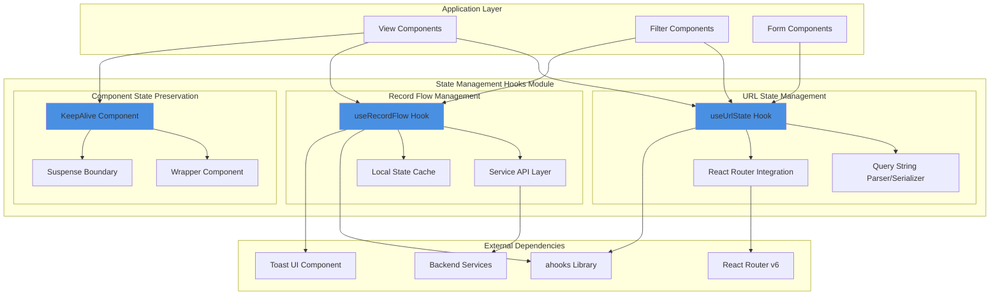

---

## Core Components

### 1. useUrlState Hook

**Purpose**: Manages application state through URL query parameters, enabling shareable and bookmarkable application states.

**Key Features**:
- Bidirectional synchronization between React state and URL
- Support for complex data structures (nested objects, arrays)
- Configurable navigation modes (push/replace)
- Deep parsing and serialization with `qs` library
- Automatic state restoration from URL on mount

**Type Definitions**:

```typescript
interface Options {
  navigateMode?: "push" | "replace"      // URL update strategy
  parseOptions?: qs.IParseOptions        // Query string parsing config
  stringifyOptions?: qs.IStringifyOptions // Query string serialization config
}
```

**Configuration**:
- **Parse Options**: 
  - `parseArrays: true` - Parse array notation in URLs
  - `arrayLimit: 999` - Support large arrays
  - `allowDots: true` - Support dot notation for nested objects
  - `strictNullHandling: true` - Distinguish between null and undefined
  - `depth: 10` - Support deeply nested structures

- **Stringify Options**:
  - `allowDots: true` - Use dot notation for nested objects
  - `strictNullHandling: true` - Preserve null values
  - `arrayFormat: "indices"` - Use indexed array format

**Usage Flow**:

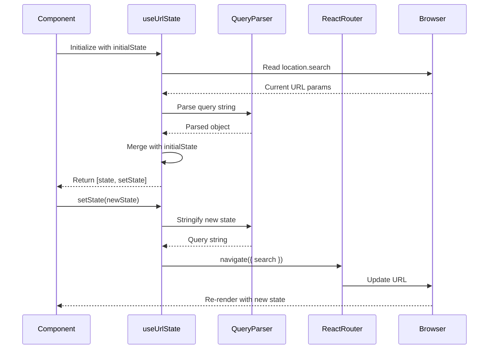

---

### 2. useRecordFlow Hook

**Purpose**: Manages server-side persistence of user selections and filter states, enabling state restoration across sessions.

**Key Features**:
- Automatic loading of saved records on mount
- Asynchronous save operations with user feedback
- Type-safe record management with generics
- Integration with backend service layer
- Toast notifications for save operations

**Type Definitions**:

```typescript
enum RECORD_ID {
  RUNWAY = "LFRunwayParamsRecord",
  // Extensible for other record types
}

interface Options {
  exclude?: string[]  // Fields to exclude from persistence
  extend?: string[]   // Additional fields to include
}

interface RecordFlowProps {
  id: RECORD_ID       // Unique identifier for record type
  options?: Options   // Configuration options
}
```

**Data Flow**:

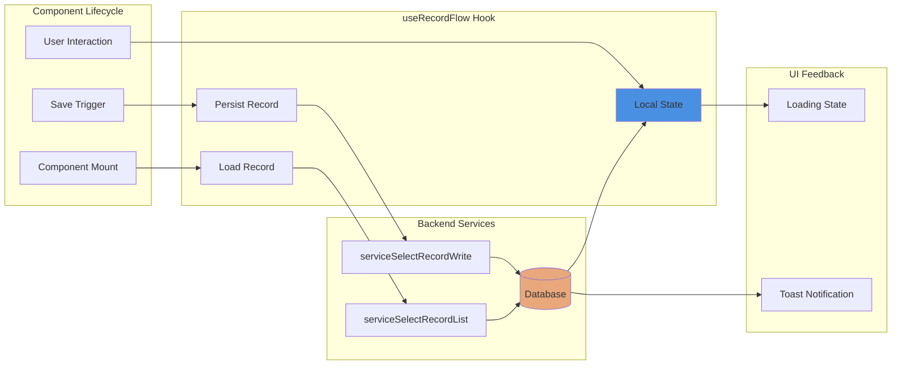

**Record Structure**:

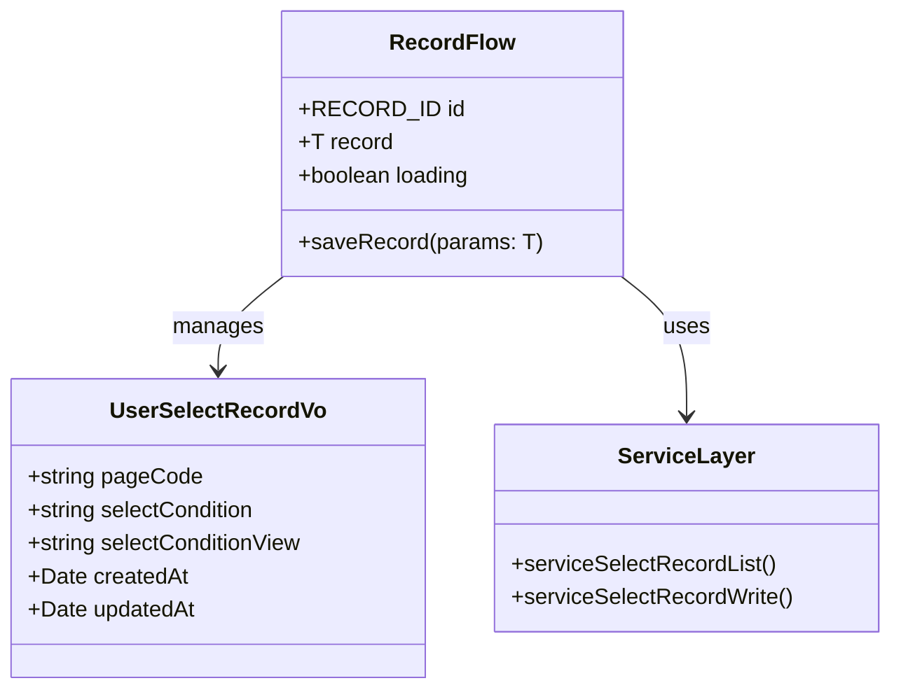

---

### 3. KeepAlive Component

**Purpose**: Preserves component state during route transitions by preventing component unmounting.

**Key Features**:
- Maintains component state across navigation
- Uses React Suspense for conditional rendering
- Automatic scroll restoration on activation
- Zero-configuration state preservation
- Minimal performance overhead

**Type Definitions**:

```typescript
interface KeepAliveProps {
  children: ReactNode  // Component to preserve
  active: boolean      // Visibility control
}

interface WrapperProps {
  children: ReactNode
  active: boolean
}
```

**Implementation Strategy**:

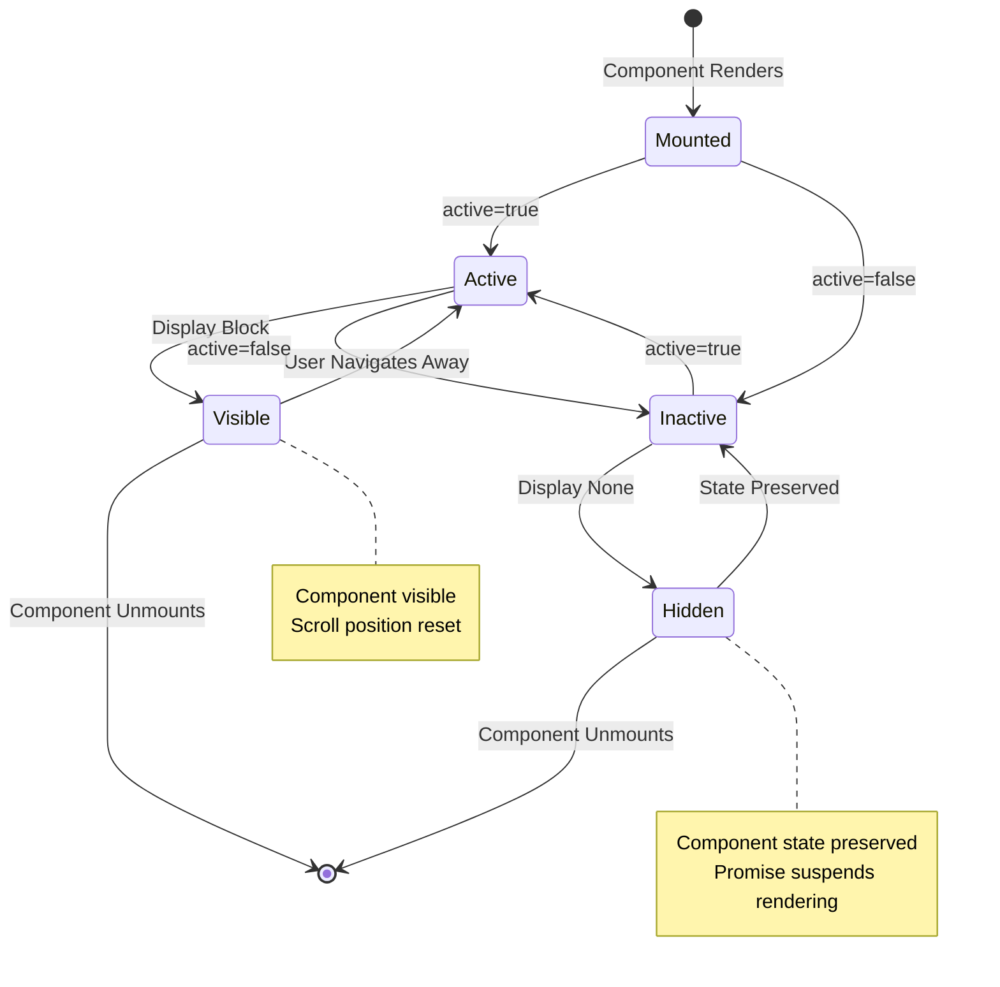

**Rendering Mechanism**:

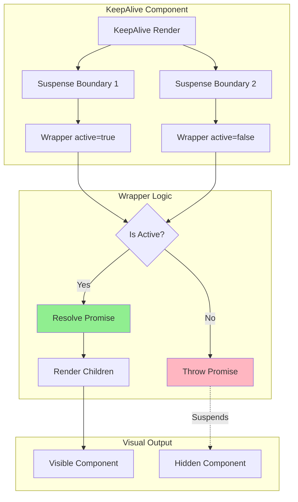

---

## Integration Patterns

### Pattern 1: URL State + Record Flow Combination

This pattern combines URL state for immediate UI updates with server-side persistence for long-term storage.

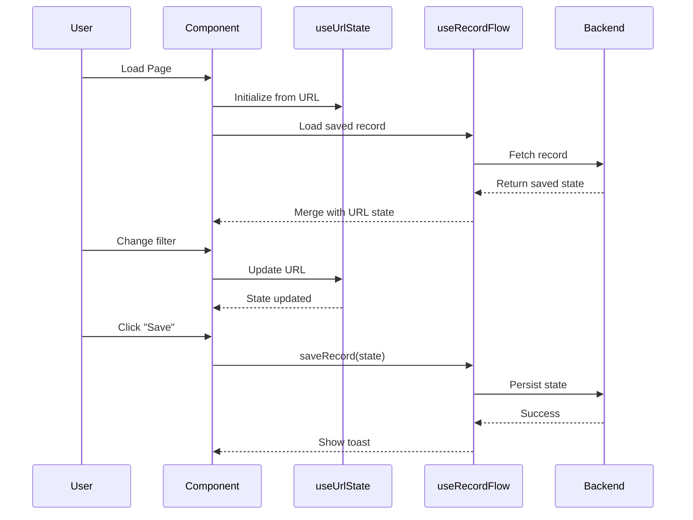

**Use Case**: Filter pages where users want to:
- Share current filters via URL
- Save favorite filter combinations for later use
- Restore last used filters on page load

**Example Implementation**:
```typescript
// In a filter component
const [urlState, setUrlState] = useUrlState<FilterState>(defaultFilters)
const { record, saveRecord } = useRecordFlow<FilterState>({ 
  id: RECORD_ID.RUNWAY 
})

// On mount: merge URL state with saved record
useEffect(() => {
  setUrlState({ ...record, ...urlState })
}, [record])

// On filter change: update URL immediately
const handleFilterChange = (newFilters) => {
  setUrlState(newFilters)
}

// On save: persist to backend
const handleSave = () => {
  saveRecord(urlState)
}
```

---

### Pattern 2: KeepAlive with Tab Navigation

Preserves state across tab switches without losing user input or scroll position.

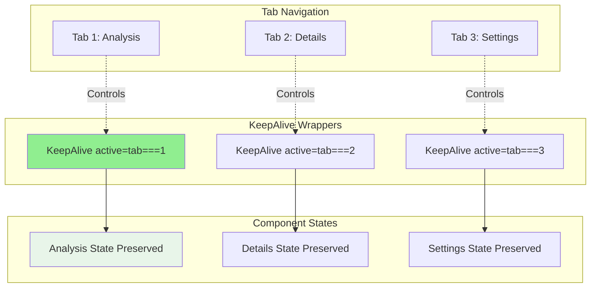

**Use Case**: Multi-tab interfaces where:
- Each tab has complex forms or filters
- Users frequently switch between tabs
- Losing state would frustrate users

---

### Pattern 3: Hierarchical State Management

Combines all three hooks for complex, multi-level state management.

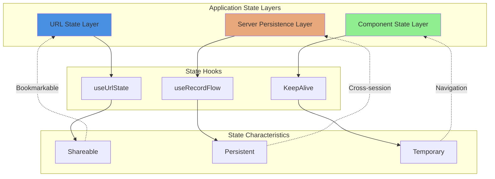

---

## Dependencies

### External Dependencies

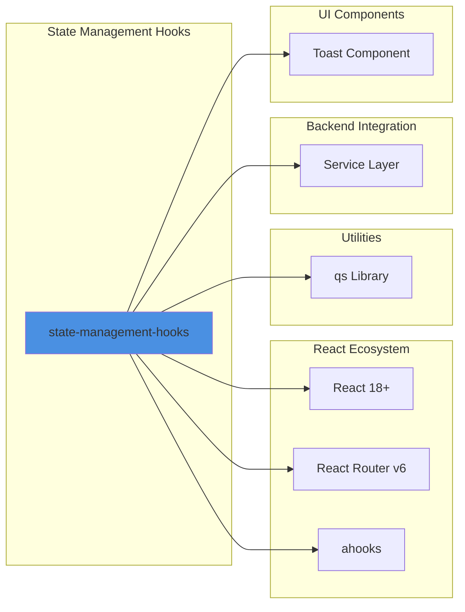

**Key Dependencies**:

1. **ahooks** - Provides foundational hooks:
   - `useRequest`: Async data fetching with loading states
   - `useMemoizedFn`: Memoized callback functions
   - `useUpdate`: Force component updates

2. **React Router v6** - Navigation and location management:
   - `useLocation`: Access current URL
   - `useNavigate`: Programmatic navigation

3. **qs** - Query string parsing/serialization:
   - Advanced parsing with nested object support
   - Configurable array and null handling

4. **Service Layer** - Backend API integration:
   - `serviceSelectRecordList`: Fetch saved records
   - `serviceSelectRecordWrite`: Persist records

5. **Toast Component** - User feedback:
   - Success/error notifications for save operations

---

## Module Dependencies

This module is consumed by:

### View Modules
- **Consumer Analysis**: Uses `useUrlState` for trend discovery filters
- **Search Results**: Combines `useUrlState` with `KeepAlive` for search state
- **Runway Analysis**: Uses `useRecordFlow` for saving analysis parameters
- **Market Analysis**: Persists filter states across sessions
- **Libraries**: URL state management for Pinterest filters

See [view-modules.md](view-modules.md) for detailed view component documentation.

### Business Components
- **Filter Components**: Category and time filters use `useUrlState`
- **Batch Operations**: State preservation during batch processing
- **Chart Components**: Maintains chart configurations

See [business-components.md](business-components.md) for business component details.

---

## Data Flow Architecture

### Complete State Lifecycle

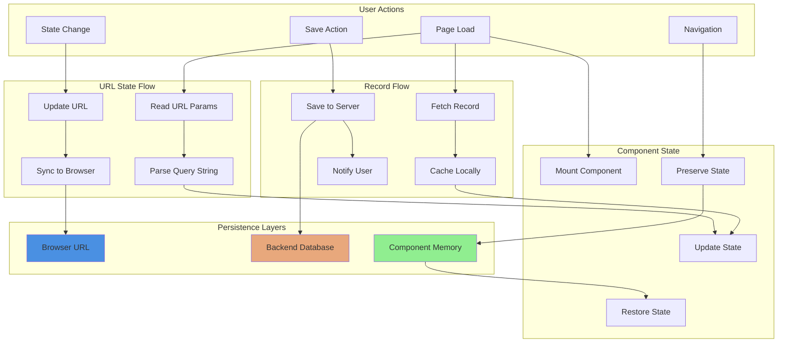

---

## Advanced Usage Patterns

### 1. Conditional State Persistence

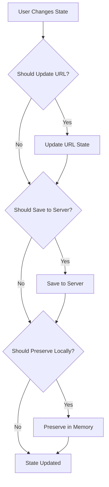

**Decision Criteria**:
- **URL State**: For shareable, bookmarkable state (filters, pagination)
- **Server Persistence**: For user preferences, saved configurations
- **Local Preservation**: For temporary UI state during navigation

---

### 2. State Synchronization Strategy

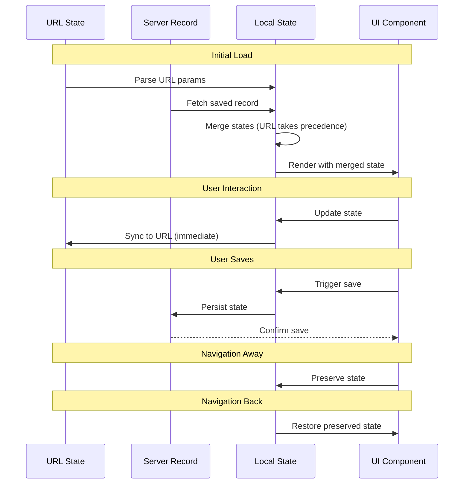

---

## Performance Considerations

### Optimization Strategies

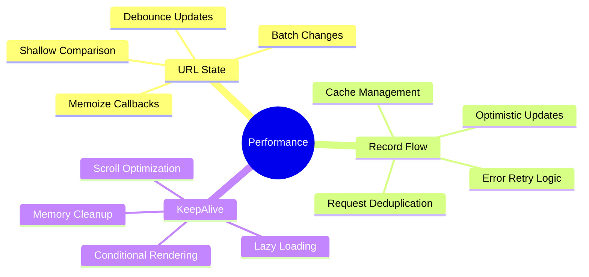

**Best Practices**:

1. **URL State Optimization**:
   - Debounce rapid state changes to prevent excessive URL updates
   - Use `useMemoizedFn` to prevent unnecessary re-renders
   - Implement shallow comparison for complex objects

2. **Record Flow Optimization**:
   - Leverage `ahooks` request deduplication
   - Implement optimistic UI updates for better UX
   - Cache records locally to reduce server requests

3. **KeepAlive Optimization**:
   - Limit number of preserved components
   - Implement cleanup for unmounted components
   - Use lazy loading for heavy components

---

## Error Handling

### Error Flow Diagram

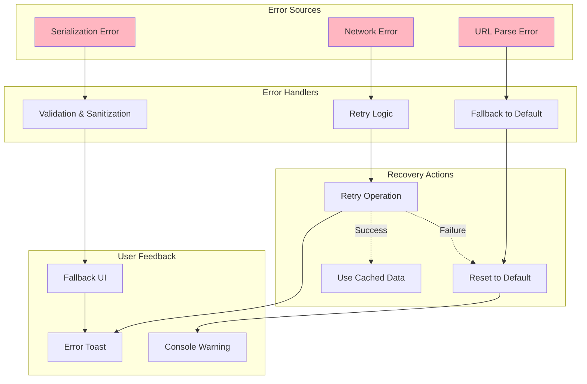

**Error Handling Strategies**:

1. **URL State Errors**:
   - Malformed query strings → Fallback to initial state
   - Invalid data types → Type coercion or default values
   - Missing parameters → Merge with defaults

2. **Record Flow Errors**:
   - Network failures → Toast notification + retry option
   - Server errors → Graceful degradation to local state
   - Parse errors → Log warning + use empty state

3. **KeepAlive Errors**:
   - Suspense errors → Fallback to normal rendering
   - Memory issues → Automatic cleanup of old states

---

## Testing Strategies

### Test Coverage Map

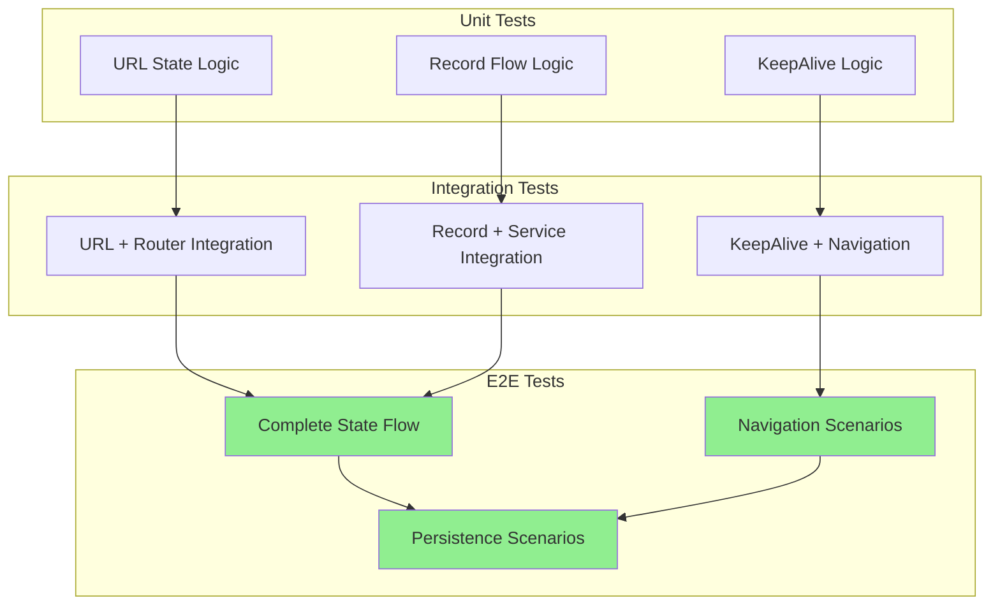

**Testing Recommendations**:

1. **useUrlState Tests**:
   - URL parsing with various data types
   - State updates and URL synchronization
   - Navigation mode behavior (push vs replace)
   - Edge cases: empty state, null values, nested arrays

2. **useRecordFlow Tests**:
   - Record loading on mount
   - Save operation success/failure
   - Toast notification triggers
   - Loading state management

3. **KeepAlive Tests**:
   - State preservation across active/inactive transitions
   - Scroll position restoration
   - Memory cleanup on unmount
   - Multiple KeepAlive instances

---

## Migration Guide

### From Local State to URL State

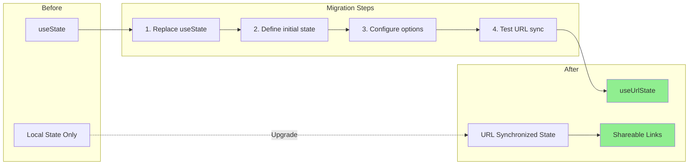

**Migration Checklist**:
- [ ] Identify state that should be shareable
- [ ] Define TypeScript interfaces for state shape
- [ ] Configure parse/stringify options for complex types
- [ ] Update state setters to use new hook
- [ ] Test URL updates and parsing
- [ ] Verify backward compatibility with old URLs

---

## Future Enhancements

### Roadmap

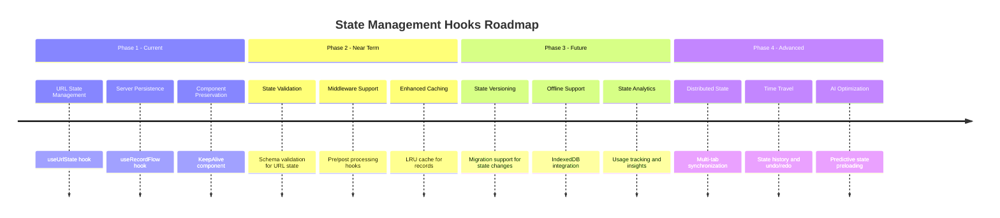

**Planned Features**:

1. **State Validation**:
   - Schema-based validation for URL parameters
   - Type guards for runtime safety
   - Automatic sanitization of invalid values

2. **Enhanced Caching**:
   - LRU cache for frequently accessed records
   - Configurable cache expiration
   - Cache invalidation strategies

3. **Offline Support**:
   - IndexedDB integration for offline persistence
   - Sync queue for pending saves
   - Conflict resolution strategies

4. **Developer Tools**:
   - State debugging panel
   - Time-travel debugging
   - State change visualization

---

## API Reference

### useUrlState

```typescript
function useUrlState<S>(
  initialState?: S | (() => S),
  options?: Options
): [S, (s: React.SetStateAction<S>) => void]
```

**Parameters**:
- `initialState`: Initial state object or factory function
- `options`: Configuration options
  - `navigateMode`: "push" | "replace" (default: "push")
  - `parseOptions`: qs.IParseOptions
  - `stringifyOptions`: qs.IStringifyOptions

**Returns**: Tuple of [state, setState]

**Example**:
```typescript
const [filters, setFilters] = useUrlState<FilterState>({
  category: [],
  dateRange: null
}, {
  navigateMode: 'replace'
})
```

---

### useRecordFlow

```typescript
function useRecordFlow<T>({ 
  id, 
  options 
}: RecordFlowProps): {
  record: object
  saveRecord: (params: T) => void
  loading: boolean
}
```

**Parameters**:
- `id`: RECORD_ID enum value
- `options`: Configuration options
  - `exclude`: Fields to exclude from persistence
  - `extend`: Additional fields to include

**Returns**: Object with record, saveRecord function, and loading state

**Example**:
```typescript
const { record, saveRecord, loading } = useRecordFlow<RunwayParams>({
  id: RECORD_ID.RUNWAY
})
```

---

### KeepAlive

```typescript
function KeepAlive({ 
  children, 
  active 
}: KeepAliveProps): JSX.Element
```

**Props**:
- `children`: ReactNode to preserve
- `active`: Boolean controlling visibility

**Example**:
```typescript
<KeepAlive active={currentTab === 'analysis'}>
  <AnalysisComponent />
</KeepAlive>
```

---

## Troubleshooting

### Common Issues

| Issue | Cause | Solution |
|-------|-------|----------|
| URL not updating | Navigate mode misconfigured | Check `navigateMode` option |
| State not persisting | Record ID mismatch | Verify RECORD_ID enum value |
| Component remounting | KeepAlive active prop incorrect | Ensure boolean active prop |
| Parse errors | Complex nested objects | Adjust `depth` in parseOptions |
| Save failures | Network issues | Check service layer integration |
| Memory leaks | Too many KeepAlive instances | Limit preserved components |

---

## Best Practices Summary

1. **URL State**:
   - Use for shareable, bookmarkable state
   - Keep URL parameters minimal and readable
   - Implement proper TypeScript types
   - Configure appropriate parse/stringify options

2. **Record Flow**:
   - Use for user preferences and saved configurations
   - Implement proper error handling
   - Provide user feedback for save operations
   - Consider caching strategies for performance

3. **KeepAlive**:
   - Use sparingly for expensive components
   - Implement proper cleanup logic
   - Consider memory implications
   - Test navigation scenarios thoroughly

4. **General**:
   - Combine hooks appropriately for complex scenarios
   - Document state shape and persistence strategy
   - Implement comprehensive error handling
   - Test edge cases and error scenarios

---

## Related Documentation

- [view-modules.md](view-modules.md) - View components using these hooks
- [business-components.md](business-components.md) - Business components integration
- [ui-component-system.md](ui-component-system.md) - Toast and other UI components
- [core-infrastructure.md](core-infrastructure.md) - Service layer and routing

---

## Conclusion

The **state-management-hooks** module provides a robust, flexible foundation for managing application state across multiple persistence layers. By combining URL state management, server-side persistence, and component state preservation, it enables complex state management scenarios while maintaining a clean, intuitive API. The module's integration with React Router, ahooks, and the service layer ensures seamless operation within the broader application architecture.

Key strengths:
- **Flexibility**: Multiple persistence strategies for different use cases
- **Type Safety**: Full TypeScript support with generics
- **Performance**: Optimized with memoization and caching
- **Developer Experience**: Intuitive APIs with comprehensive error handling
- **Integration**: Seamless integration with existing application infrastructure

This module is essential for building modern, stateful web applications that require sophisticated state management capabilities.
