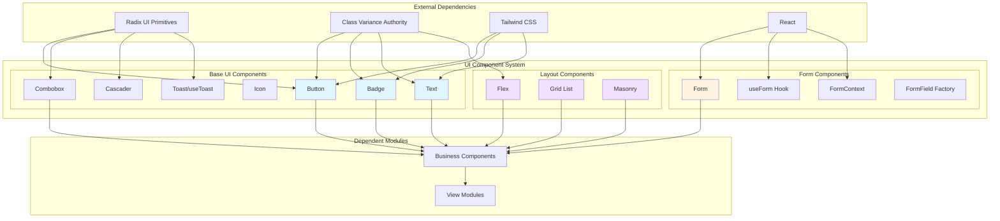
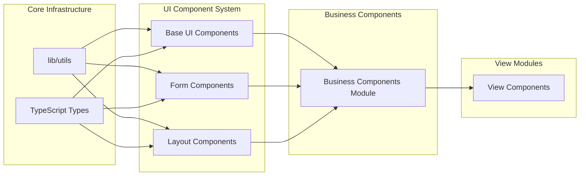
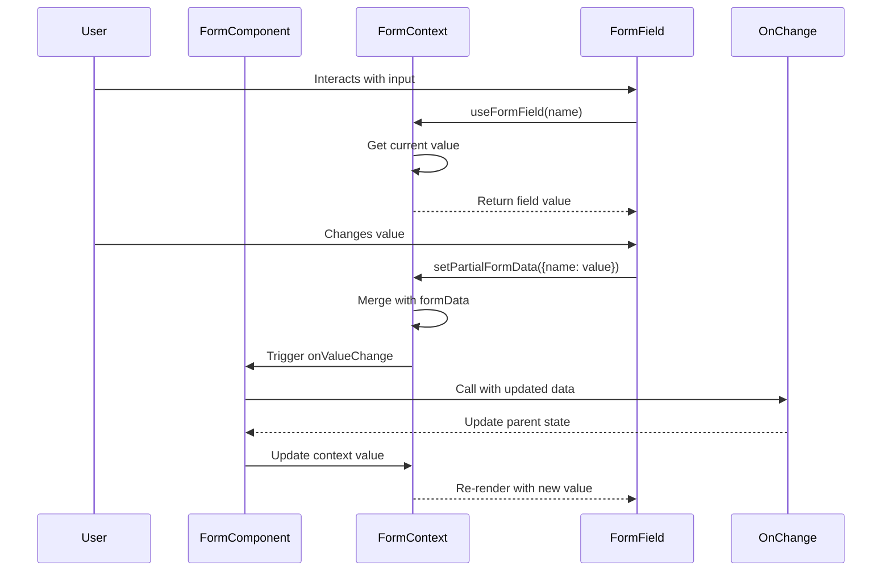
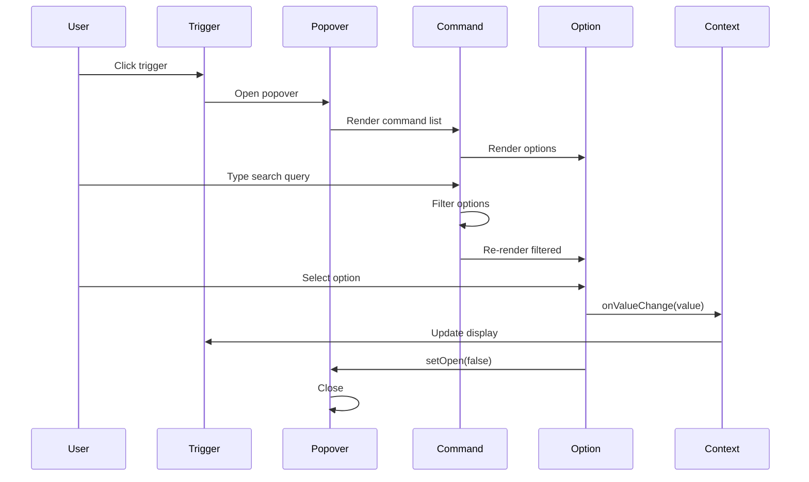
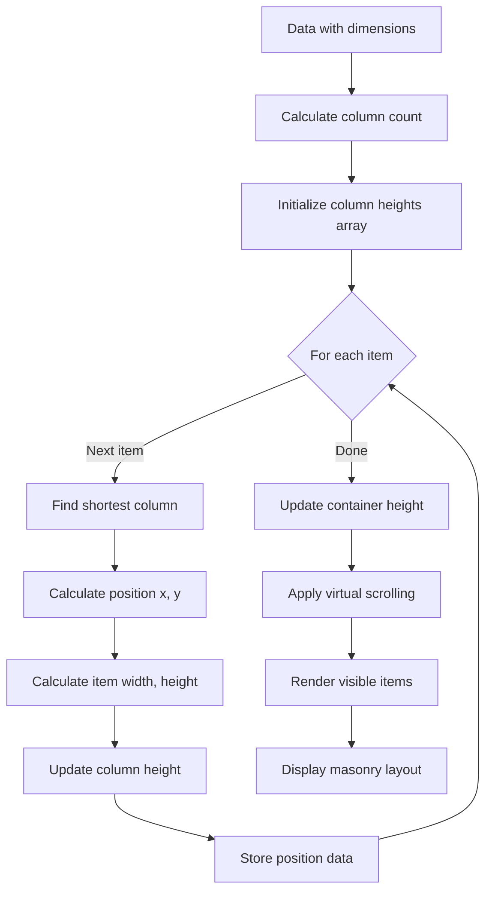
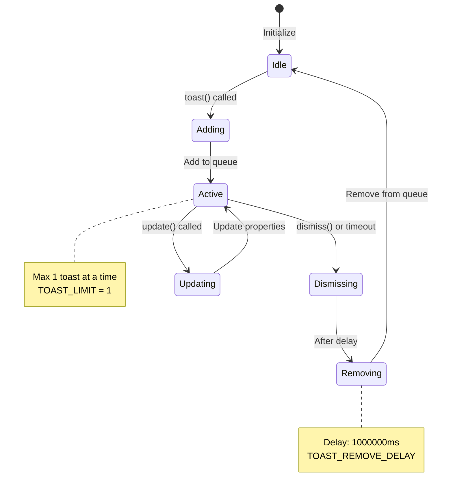
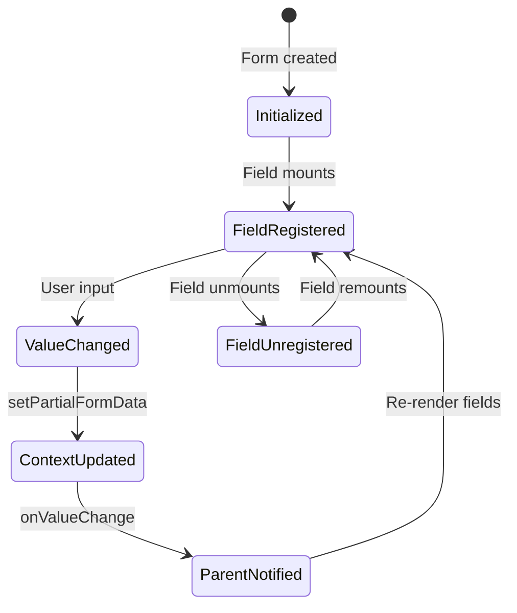
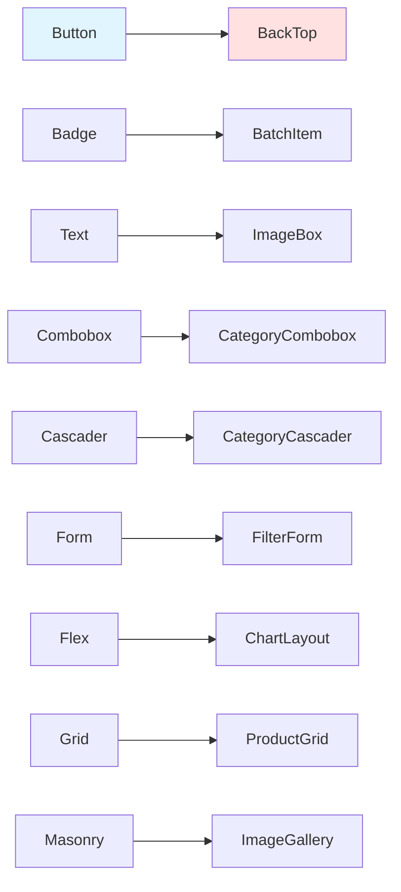
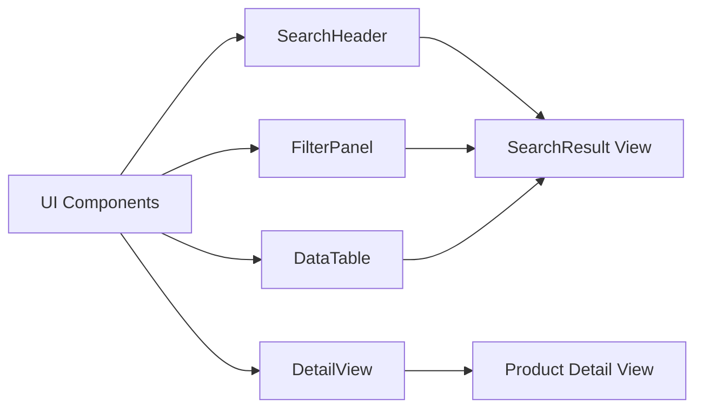

# UI Component System Module

## Overview

The **UI Component System** module provides a comprehensive collection of reusable, accessible, and customizable React components that form the foundation of the TrendEngine application's user interface. Built on top of Radix UI primitives and styled with Tailwind CSS using class-variance-authority (CVA), this module delivers a consistent design system with flexible theming capabilities.

This module encompasses three primary layers:
1. **Base UI Components** - Fundamental building blocks (buttons, badges, text, icons, etc.)
2. **Form Components** - Form management and field components with context-based state
3. **Layout Components** - Flexible layout primitives (Flex, Grid, Masonry) for organizing content

The component system emphasizes composition, accessibility, type safety, and developer experience, providing a solid foundation for building complex user interfaces throughout the application.

---

## Architecture

### Component Hierarchy



### Module Dependencies



---

## Core Components

### 1. Base UI Components

#### Button Component

The Button component provides a versatile, accessible button with multiple variants and sizes.

**Key Features:**
- Multiple visual variants (default, accent, destructive, outline, ghost, link)
- Three size options (s, m, l) plus icon-only variant
- Support for composition via `asChild` prop (Radix Slot pattern)
- Full TypeScript support with proper type inference
- Disabled state handling with visual feedback

**Props Interface:**
```typescript
interface ButtonProps extends 
  React.ButtonHTMLAttributes<HTMLButtonElement>, 
  VariantProps<typeof buttonVariants> {
  asChild?: boolean
}
```

**Variants:**
- `accent` - Primary accent color
- `destructive` - Destructive actions (delete, remove)
- `outline` - Outlined style with border
- `default` - Standard foreground/background
- `ghost` - Minimal style with hover effect
- `link` - Text link style with underline

**Usage Example:**
```typescript
<Button variant="accent" size="m">Click Me</Button>
<Button variant="destructive" size="s">Delete</Button>
<Button asChild>
  <a href="/link">Link Button</a>
</Button>
```

#### Badge Component

A compact component for displaying status, labels, or counts.

**Key Features:**
- Four visual variants matching design system
- Rounded pill shape for visual consistency
- Focus ring support for accessibility
- Flexible content via children prop

**Props Interface:**
```typescript
interface BadgeProps extends 
  React.HTMLAttributes<HTMLDivElement>, 
  VariantProps<typeof badgeVariants> {}
```

#### Text Component

A flexible text component with extensive styling options and i18n support.

**Key Features:**
- Multiple size variants (xs, sm, lg, xl)
- Semantic color variants (muted, accent, error, growth, declining)
- Line clamping support (1-3 lines)
- Font weight control (normal, medium, bold)
- Built-in i18n integration
- Text decoration options (underline)

**Props Interface:**
```typescript
interface Props extends 
  React.ComponentProps<"span">, 
  VariantProps<typeof textVariants> {
  t?: string          // i18n key
  ns?: string         // i18n namespace
  tOptions?: TOptions // i18n options
}
```

**Usage Example:**
```typescript
<Text muted sm>Muted small text</Text>
<Text accent bold lg>Bold accent text</Text>
<Text line={2}>Text with 2-line clamp</Text>
<Text t="common.welcome" ns="app" />
```

#### Icon Component

Base interface for icon components with consistent sizing and coloring.

**Props Interface:**
```typescript
interface IconProps extends React.SVGAttributes<SVGElement> {
  children?: never
  size?: number
  color?: string
}
```

#### Toast System (useToast Hook)

A notification system for displaying temporary messages to users.

**Key Features:**
- Centralized toast state management
- Automatic toast removal with configurable delay
- Toast limit to prevent UI clutter
- Update and dismiss capabilities
- Action button support

**State Interface:**
```typescript
interface State {
  toasts: ToasterToast[]
}

type ToasterToast = ToastProps & {
  id: string
  title?: React.ReactNode
  description?: React.ReactNode
  action?: ToastActionElement
}
```

**Usage Example:**
```typescript
const { toast } = useToast()

toast({
  title: "Success",
  description: "Operation completed successfully",
})

toast({
  title: "Error",
  description: "Something went wrong",
  variant: "destructive",
})
```

#### Combobox Component

A searchable dropdown component with single selection support.

**Key Features:**
- Search functionality with keyword filtering
- Custom display rendering
- Range input support for numeric ranges
- Date interval selection
- Clear functionality
- Keyboard navigation
- Composition pattern for options

**Props Interface:**
```typescript
interface ComboboxProps extends ComboboxValueProps {
  allowClear?: boolean
  placeholder?: string
  defaultValue?: string
  showSearch?: boolean
  searchPlaceholder?: string
  searchKeyword?: string
  onSearch?: (keyword: string) => void
  shouldFilter?: boolean
  options?: ComboboxOptionProp[]
  customDownIcon?: React.ReactNode
}
```

**Sub-components:**
- `Combobox.Option` - Individual selectable option
- `Combobox.Display` - Custom display rendering
- `Combobox.RangeInput` - Numeric range input
- `Combobox.Interval` - Date interval selector
- `Combobox.Separator` - Visual separator

**Usage Example:**
```typescript
<Combobox 
  placeholder="Select option"
  value={value}
  onValueChange={setValue}
  showSearch
>
  <Combobox.Option value="1" label="Option 1" />
  <Combobox.Option value="2" label="Option 2" />
  <Combobox.Separator />
  <Combobox.Option value="3" label="Option 3" />
</Combobox>
```

#### Cascader Component

A hierarchical selection component for nested data structures.

**Key Features:**
- Multi-level cascading selection
- Search across all levels
- Leaf-only or any-level selection
- Responsive positioning (auto-reverse)
- Keyboard navigation
- Optional item counts display
- Path-based value management

**Props Interface:**
```typescript
interface CascadeProps {
  value?: string[]
  onValueChange?: (valuePath: string[]) => void
  options?: Option[]
  placeholder?: string
  defaultValue?: string[]
  onlyLeaf?: boolean
  searchPlaceholder?: string
  allowClear?: boolean
  columnClassName?: string
  isShowNum?: boolean
  loading?: boolean
}

type Option = {
  label: React.ReactNode
  keyword?: string
  value: string
  disabled?: boolean
  children?: Option[]
  num?: number
}
```

**Usage Example:**
```typescript
<Cascader
  placeholder="Select category"
  value={categoryPath}
  onValueChange={setCategoryPath}
  options={categoryTree}
  onlyLeaf
  isShowNum
/>
```

### 2. Form Components

#### Form Component

A context-based form container that manages form state and provides automatic data binding.

**Key Features:**
- Centralized form state management
- Automatic field binding via context
- Type-safe form data handling
- Composition support via `asChild`
- Controlled component pattern

**Props Interface:**
```typescript
interface FormProps<T> extends React.HTMLAttributes<HTMLDivElement> {
  value: T
  children: React.ReactNode
  asChild?: boolean
  onValueChange?: (value: T) => void
}
```

**Usage Example:**
```typescript
<Form value={formData} onValueChange={setFormData}>
  <Form.Item name="username">
    <Textbox placeholder="Username" />
  </Form.Item>
  <Form.Item name="email">
    <Textbox placeholder="Email" />
  </Form.Item>
</Form>
```

#### useForm Hook

Provides form field state management through React Context.

**Key Features:**
- Context-based field registration
- Automatic value binding
- Type-safe field access
- Partial form updates
- Field-level change handlers

**Interfaces:**
```typescript
interface FormFieldProps {
  name?: string
  value?: FormFieldValue
  onValueChange?: (val: FormFieldValue) => void
}

type FormFieldValue = 
  | string 
  | number 
  | boolean 
  | string[] 
  | number[] 
  | boolean[] 
  | undefined

interface FormContext {
  formData: Record<string, FormFieldValue>
  setPartialFormData: (data: Record<string, FormFieldValue>) => void
}
```

**Hooks:**
- `useFormContext()` - Access form context
- `useFormField(name)` - Get/set specific field value
- `formFieldFactory(Component)` - Create form-aware component wrapper (deprecated)

### 3. Layout Components

#### Flex Component

A flexible box layout component with comprehensive flexbox control.

**Key Features:**
- Direction control (row, column, reverse variants)
- Justify content options (start, end, center, between, around, evenly)
- Align items options (start, end, center, baseline, stretch)
- Wrap support
- Custom gap spacing
- Composition support

**Props Interface:**
```typescript
interface FlexProps extends 
  VariantProps<typeof flexVariants>, 
  React.ComponentPropsWithoutRef<"div"> {
  gap?: number | string
  asChild?: boolean
}
```

**Usage Example:**
```typescript
<Flex direction="row" justify="between" align="center" gap={16}>
  <div>Item 1</div>
  <div>Item 2</div>
  <div>Item 3</div>
</Flex>
```

#### Grid List Component

A grid-based list layout with loading, error, and empty states.

**Key Features:**
- Responsive column calculation based on container width
- Automatic grid layout
- Built-in loading state
- Error handling with error card
- Empty state support
- Footer section for pagination/actions

**Props Interface:**
```typescript
interface GridListProps {
  loading?: boolean
  error?: Error
  empty?: boolean
  asChild?: boolean
}

type GridListViewBoxProps = {
  gap?: number
  columnWidth?: number
} & React.HTMLAttributes<HTMLDivElement>
```

**Sub-components:**
- `Grid.Root` - Container with state management
- `Grid.ViewBox` - Grid layout container
- `Grid.Loading` - Loading spinner
- `Grid.Error` - Error display
- `Grid.Empty` - Empty state
- `Grid.Footer` - Footer section

**Usage Example:**
```typescript
<Grid.Root loading={isLoading} error={error} empty={!data.length}>
  <Grid.Loading />
  <Grid.Error />
  <Grid.Empty />
  <Grid.ViewBox gap={20} columnWidth={255}>
    {data.map(item => (
      <Card key={item.id} data={item} />
    ))}
  </Grid.ViewBox>
  <Grid.Footer>
    <Pagination />
  </Grid.Footer>
</Grid.Root>
```

#### Masonry Component

A Pinterest-style masonry layout with virtual scrolling support.

**Key Features:**
- Dynamic column calculation
- Automatic height balancing
- Virtual scrolling for performance
- Loading, error, and empty states
- Responsive column width
- Custom gap spacing
- Additional height support for card metadata

**Props Interface:**
```typescript
interface MasonryRootProps extends React.HTMLAttributes<HTMLElement> {
  loading?: boolean
  error?: Error
  empty?: boolean
  asChild?: boolean
}

interface MasonryData {
  width?: number
  height?: number
}

type MasonryMapProps<T extends MasonryData> = {
  data: T[]
  columnWidth?: number
  gap?: number
  addHeight?: number
  children: (params: { 
    data: T
    index: number 
  } & Position) => React.ReactNode
}
```

**Sub-components:**
- `Masonry.Root` - Container with state management
- `Masonry.ViewBox` - Virtual scrolling masonry layout
- `Masonry.Base` - Non-virtualized masonry layout
- `Masonry.Item` - Individual masonry item
- `Masonry.Loading` - Loading spinner
- `Masonry.Error` - Error display
- `Masonry.Empty` - Empty state
- `Masonry.Footer` - Footer section

**Usage Example:**
```typescript
<Masonry.Root loading={isLoading} error={error} empty={!images.length}>
  <Masonry.Loading />
  <Masonry.Error />
  <Masonry.Empty />
  <Masonry.ViewBox 
    data={images}
    columnWidth={255}
    gap={16}
    addHeight={60}
  >
    {({ data, x, y, w, h }) => (
      <Masonry.Item x={x} y={y} w={w} h={h} data={data}>
        <ImageCard image={data} />
      </Masonry.Item>
    )}
  </Masonry.ViewBox>
  <Masonry.Footer>
    <LoadMoreButton />
  </Masonry.Footer>
</Masonry.Root>
```

---

## Component Interaction Flow

### Form Data Flow



### Combobox Selection Flow



### Masonry Layout Calculation



---

## Design Patterns

### 1. Composition Pattern (Radix Slot)

The module extensively uses the Radix UI Slot pattern for component composition:

```typescript
const Button = ({ asChild, ...props }) => {
  const Comp = asChild ? Slot : "button"
  return <Comp {...props} />
}

// Usage
<Button asChild>
  <Link to="/page">Navigate</Link>
</Button>
```

**Benefits:**
- Flexible component composition
- Maintains semantic HTML
- Preserves accessibility
- Enables polymorphic components

### 2. Variant Pattern (CVA)

Class Variance Authority (CVA) provides type-safe variant management:

```typescript
const buttonVariants = cva(
  "base-classes",
  {
    variants: {
      variant: {
        default: "default-classes",
        accent: "accent-classes",
      },
      size: {
        s: "small-classes",
        m: "medium-classes",
      },
    },
    defaultVariants: {
      variant: "default",
      size: "m",
    },
  }
)
```

**Benefits:**
- Type-safe variant props
- Automatic TypeScript inference
- Consistent styling API
- Easy theme customization

### 3. Context-Based State Management

Form components use React Context for state distribution:

```typescript
const FormContext = React.createContext<FormContext>({
  formData: {},
  setPartialFormData: () => {},
})

// Provider
<FormContext.Provider value={contextValue}>
  {children}
</FormContext.Provider>

// Consumer
const { formData, setPartialFormData } = useFormContext()
```

**Benefits:**
- Avoids prop drilling
- Centralized state management
- Type-safe context access
- Easy field registration

### 4. Compound Component Pattern

Layout components use compound components for flexible composition:

```typescript
<Grid.Root loading={loading}>
  <Grid.Loading />
  <Grid.ViewBox>
    {/* content */}
  </Grid.ViewBox>
  <Grid.Footer />
</Grid.Root>
```

**Benefits:**
- Clear component relationships
- Flexible composition
- Shared context
- Better developer experience

---

## State Management

### Toast State Management



### Form State Management



---

## Performance Optimizations

### 1. Virtual Scrolling (Masonry)

The Masonry component implements virtual scrolling for large datasets:

```typescript
const useViewBox = (positionData, { overscan, containerTarget }) => {
  // Calculate visible viewport
  // Add overscan buffer
  // Return only visible items
}
```

**Benefits:**
- Renders only visible items
- Reduces DOM nodes
- Improves scroll performance
- Handles thousands of items

### 2. Memoization

Components use React.useMemo for expensive calculations:

```typescript
const positionData = useMemo(() => {
  // Calculate masonry positions
  return calculatedPositions
}, [containerSize, data, columnWidth, gap])
```

### 3. Debounced Search

Combobox implements composition-aware search:

```typescript
const [composing, setComposing] = useState(false)

onCompositionStart={() => setComposing(true)}
onCompositionEnd={(ev) => {
  setComposing(false)
  onSearch?.(ev.target.value)
}}
```

**Benefits:**
- Prevents premature API calls
- Supports IME input
- Better UX for international users

---

## Accessibility Features

### 1. Keyboard Navigation

All interactive components support keyboard navigation:

- **Button**: Enter/Space activation
- **Combobox**: Arrow keys, Enter, Escape
- **Cascader**: Arrow keys for navigation, Enter for selection
- **Form**: Tab navigation, Enter submission

### 2. ARIA Attributes

Components include proper ARIA attributes:

```typescript
<button
  role="combobox"
  aria-expanded={open}
  aria-controls="listbox"
  aria-label="Select option"
>
```

### 3. Focus Management

- Focus rings on interactive elements
- Focus trap in modals/popovers
- Logical focus order
- Skip links support

### 4. Screen Reader Support

- Semantic HTML elements
- Descriptive labels
- Status announcements
- Error messages

---

## Styling System

### Tailwind CSS Integration

The module uses Tailwind CSS with custom design tokens:

```typescript
// Theme colors
bg-accent          // Primary accent color
bg-destructive     // Error/destructive actions
bg-foreground      // Main foreground
bg-background      // Main background
text-muted-foreground-1  // Muted text

// Spacing
gap-{n}           // Consistent spacing scale
p-{n}, m-{n}      // Padding and margin

// Typography
text-{size}       // Font sizes (xs, sm, base, lg, xl)
font-{weight}     // Font weights (normal, medium, bold)
```

### Custom Utilities

```typescript
// Line clamping
line-clamp-{n}    // Truncate text to n lines

// Transitions
transition        // Smooth transitions

// Focus rings
focus-visible:outline-none
focus:ring-2
focus:ring-ring
```

---

## Integration with Other Modules

### Business Components Module

UI components are consumed by business components:



See [Business Components Module](business-components.md) for detailed integration examples.

### View Modules

View components build complex UIs using UI components:



See [View Modules](view-modules.md) for usage in application views.

---

## Testing Considerations

### Unit Testing

Components should be tested for:

1. **Rendering**: Correct output for different props
2. **Interactions**: Click, keyboard, focus events
3. **State Changes**: Value updates, form submissions
4. **Accessibility**: ARIA attributes, keyboard navigation
5. **Edge Cases**: Empty states, error states, loading states

### Example Test Structure

```typescript
describe('Button', () => {
  it('renders with correct variant', () => {
    render(<Button variant="accent">Click</Button>)
    expect(screen.getByRole('button')).toHaveClass('bg-accent')
  })
  
  it('handles click events', () => {
    const onClick = jest.fn()
    render(<Button onClick={onClick}>Click</Button>)
    fireEvent.click(screen.getByRole('button'))
    expect(onClick).toHaveBeenCalled()
  })
  
  it('supports asChild composition', () => {
    render(
      <Button asChild>
        <a href="/link">Link</a>
      </Button>
    )
    expect(screen.getByRole('link')).toBeInTheDocument()
  })
})
```

---

## Best Practices

### 1. Component Usage

**DO:**
- Use semantic variants (accent, destructive, etc.)
- Leverage composition with `asChild`
- Provide accessible labels and ARIA attributes
- Use TypeScript for type safety
- Follow consistent spacing with gap props

**DON'T:**
- Override core styles with inline styles
- Bypass form context for form fields
- Ignore loading/error states
- Use deprecated APIs (formFieldFactory)

### 2. Form Management

**DO:**
```typescript
<Form value={formData} onValueChange={setFormData}>
  <Form.Item name="field">
    <Input />
  </Form.Item>
</Form>
```

**DON'T:**
```typescript
// Avoid manual state management
<Input 
  value={formData.field}
  onChange={(e) => setFormData({
    ...formData,
    field: e.target.value
  })}
/>
```

### 3. Layout Components

**DO:**
- Use Grid/Masonry for image galleries
- Use Flex for simple layouts
- Provide loading/error/empty states
- Set appropriate column widths

**DON'T:**
- Mix layout patterns unnecessarily
- Forget to handle edge cases
- Ignore responsive behavior

### 4. Performance

**DO:**
- Use Masonry.ViewBox for large lists (virtual scrolling)
- Memoize expensive calculations
- Debounce search inputs
- Lazy load heavy components

**DON'T:**
- Render thousands of items without virtualization
- Perform expensive operations in render
- Ignore re-render optimization

---

## Migration Guide

### Deprecated APIs

#### formFieldFactory (Deprecated)

**Old:**
```typescript
const FormInput = formFieldFactory(Input)
<FormInput name="username" />
```

**New:**
```typescript
<Form.Item name="username">
  <Input />
</Form.Item>
```

### Breaking Changes

None currently. The module maintains backward compatibility.

---

## Future Enhancements

### Planned Features

1. **Component Variants**
   - Additional button sizes
   - More badge styles
   - Extended text variants

2. **Form Enhancements**
   - Built-in validation
   - Field-level error display
   - Form submission handling
   - Reset functionality

3. **Layout Improvements**
   - Grid auto-fit support
   - Masonry column pinning
   - Responsive breakpoint controls

4. **Accessibility**
   - Enhanced screen reader support
   - Better focus management
   - Keyboard shortcut system

5. **Performance**
   - Intersection Observer for lazy loading
   - Web Worker for layout calculations
   - Optimized re-render strategies

---

## Related Documentation

- [Core Infrastructure Module](core-infrastructure.md) - Utility functions and type definitions
- [Business Components Module](business-components.md) - Higher-level business components
- [View Modules](view-modules.md) - Application views and pages
- [State Management & Hooks](state-management-hooks.md) - Custom hooks and state management

---

## API Reference Summary

### Base UI Components

| Component | Purpose | Key Props |
|-----------|---------|-----------|
| Button | Interactive button | variant, size, asChild |
| Badge | Status/label display | variant |
| Text | Styled text | size, color, line, bold |
| Icon | Icon wrapper | size, color |
| Toast | Notifications | title, description, action |
| Combobox | Searchable dropdown | value, options, showSearch |
| Cascader | Hierarchical selector | value, options, onlyLeaf |

### Form Components

| Component/Hook | Purpose | Key Props/Returns |
|----------------|---------|-------------------|
| Form | Form container | value, onValueChange |
| useFormContext | Access form context | formData, setPartialFormData |
| useFormField | Field state hook | [value, setValue] |

### Layout Components

| Component | Purpose | Key Props |
|-----------|---------|-----------|
| Flex | Flexbox layout | direction, justify, align, gap |
| Grid.Root | Grid container | loading, error, empty |
| Grid.ViewBox | Grid layout | gap, columnWidth |
| Masonry.Root | Masonry container | loading, error, empty |
| Masonry.ViewBox | Masonry layout | data, columnWidth, gap |

---

## Conclusion

The UI Component System module provides a robust, accessible, and performant foundation for building user interfaces in the TrendEngine application. By leveraging modern React patterns, Radix UI primitives, and Tailwind CSS, it delivers a consistent design system that scales from simple buttons to complex masonry layouts.

The module's emphasis on composition, type safety, and developer experience makes it easy to build and maintain complex UIs while ensuring accessibility and performance standards are met throughout the application.
