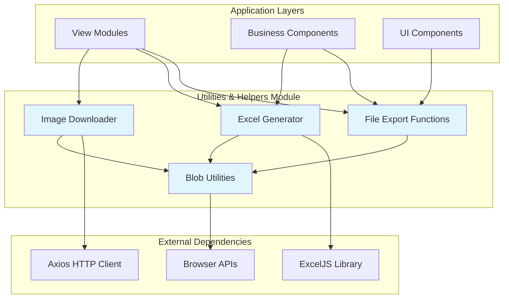
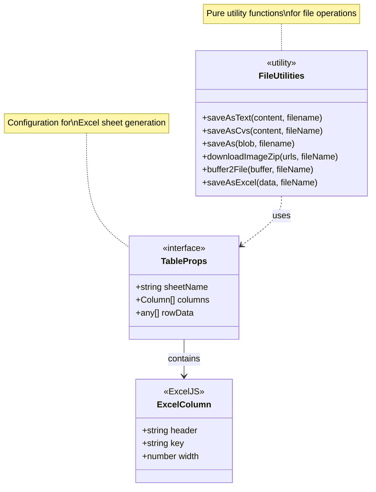
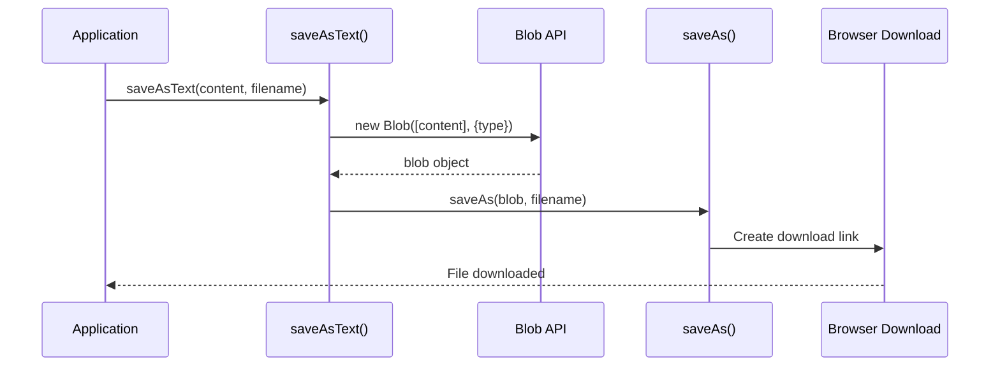
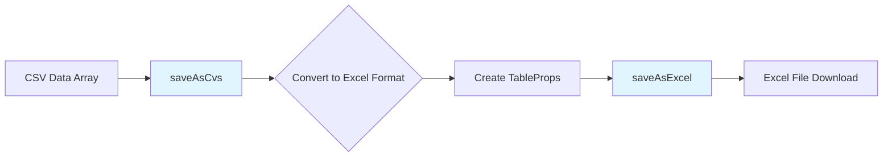
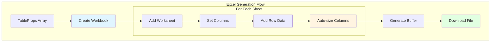
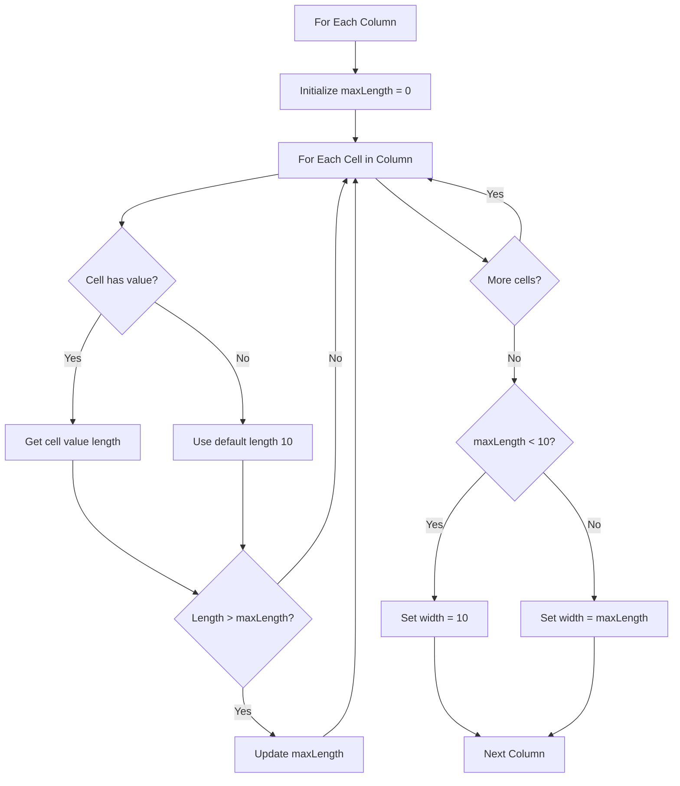
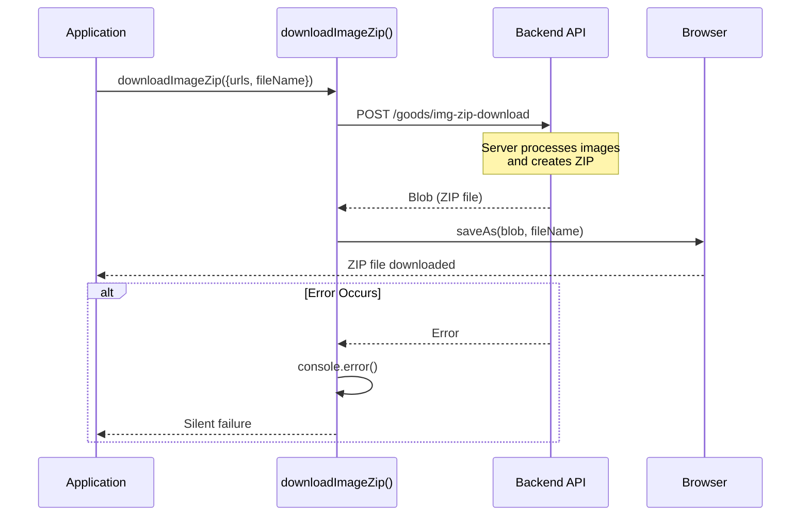
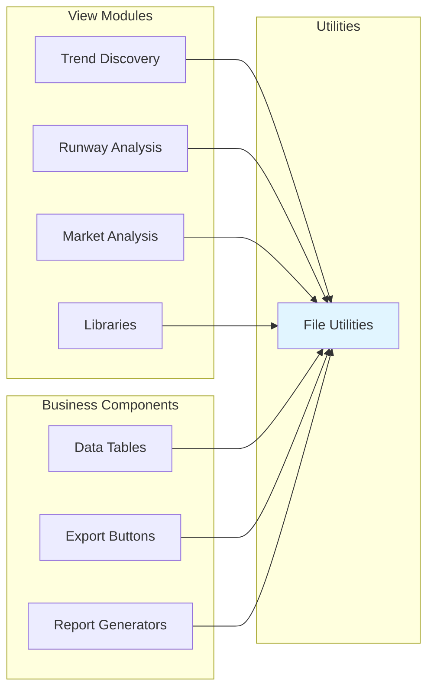
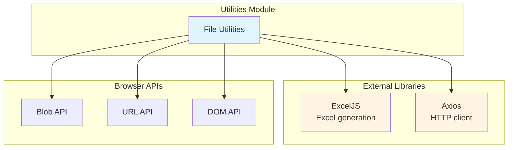
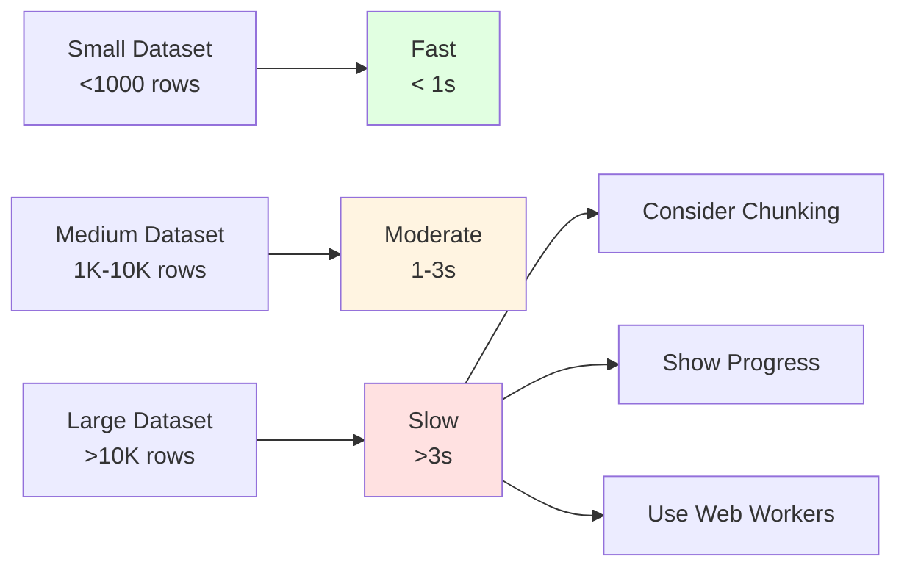

# Utilities & Helpers Module

## Overview

The **Utilities & Helpers** module provides essential file manipulation and export utilities for the TrendEngine application. This module focuses on client-side file operations, including exporting data to various formats (text, CSV, Excel) and handling image downloads. It serves as a foundational utility layer used across multiple modules for data export and file management operations.

**Key Capabilities:**
- Text file export with custom encoding
- CSV data export with Excel conversion
- Excel workbook generation with multi-sheet support
- Image batch download as ZIP archives
- Blob and buffer to file conversion utilities

---

## Table of Contents

1. [Architecture Overview](#architecture-overview)
2. [Core Components](#core-components)
3. [File Export Utilities](#file-export-utilities)
4. [Excel Generation](#excel-generation)
5. [Image Download](#image-download)
6. [Integration Patterns](#integration-patterns)
7. [Dependencies](#dependencies)
8. [Usage Examples](#usage-examples)

---

## Architecture Overview

The utilities-helpers module provides a collection of pure utility functions focused on file operations. It acts as a service layer for file-related operations across the application.



### Module Characteristics

- **Type**: Utility/Helper Module
- **Pattern**: Pure Functions
- **State**: Stateless
- **Side Effects**: File system operations (downloads)
- **Dependencies**: ExcelJS, Axios, Browser APIs

---

## Core Components

### File Utilities (`lib/file.ts`)

The primary file containing all file manipulation utilities.



#### TableProps Interface

Defines the structure for Excel sheet configuration:

```typescript
interface TableProps {
  sheetName: string                      // Name of the worksheet
  columns: Partial<ExcelJs.Column>[]     // Column definitions
  rowData: any[]                         // Data rows to export
}
```

**Properties:**
- `sheetName`: The name displayed on the Excel worksheet tab
- `columns`: Array of column configurations (header, key, width, etc.)
- `rowData`: Two-dimensional array or array of objects containing the data

---

## File Export Utilities

### Text File Export



#### `saveAsText(content: string, filename: string)`

Exports plain text content to a file with ANSI encoding.

**Parameters:**
- `content`: String content to export
- `filename`: Name of the file to save

**Use Cases:**
- Exporting log files
- Saving configuration files
- Exporting plain text reports

**Example:**
```typescript
saveAsText("Report content here", "report.txt")
```

---

### CSV Export



#### `saveAsCvs(content: string[][], fileName: string)`

Exports two-dimensional array data as a CSV file (via Excel format).

**Parameters:**
- `content`: 2D array of strings representing rows and columns
- `fileName`: Name of the output file

**Implementation Note:**
The function converts CSV data to Excel format using `saveAsExcel()` rather than plain text CSV. This ensures better compatibility and formatting.

**Example:**
```typescript
const csvData = [
  ["Name", "Age", "City"],
  ["John", "30", "New York"],
  ["Jane", "25", "London"]
]
saveAsCvs(csvData, "users.xlsx")
```

---

### Generic Blob Download

#### `saveAs(blob: Blob | File, filename: string)`

Low-level utility for triggering browser downloads from Blob or File objects.

**Process:**
1. Creates a temporary anchor element
2. Generates object URL from blob
3. Triggers download via programmatic click
4. Cleans up object URL to free memory

**Parameters:**
- `blob`: Blob or File object to download
- `filename`: Name for the downloaded file

**Memory Management:**
The function properly revokes the object URL after download to prevent memory leaks.

---

## Excel Generation

### Excel Export Architecture



### `saveAsExcel({ data, fileName })`

Generates and downloads Excel workbooks with multiple sheets and automatic column sizing.

**Signature:**
```typescript
function saveAsExcel({ 
  data, 
  fileName 
}: { 
  fileName: string
  data: TableProps[] 
}): Promise<void>
```

**Parameters:**
- `data`: Array of TableProps objects (one per worksheet)
- `fileName`: Name of the Excel file to generate

**Features:**

1. **Multi-Sheet Support**: Create workbooks with multiple worksheets
2. **Auto-sizing**: Automatically adjusts column widths based on content
3. **Default Formatting**: Sets default column width to 40 characters
4. **Minimum Width**: Ensures columns are at least 10 characters wide

**Column Auto-sizing Algorithm:**



**Example:**
```typescript
await saveAsExcel({
  fileName: "sales-report.xlsx",
  data: [
    {
      sheetName: "Q1 Sales",
      columns: [
        { header: "Product", key: "product" },
        { header: "Revenue", key: "revenue" },
        { header: "Units", key: "units" }
      ],
      rowData: [
        { product: "Widget A", revenue: 10000, units: 500 },
        { product: "Widget B", revenue: 15000, units: 750 }
      ]
    },
    {
      sheetName: "Q2 Sales",
      columns: [
        { header: "Product", key: "product" },
        { header: "Revenue", key: "revenue" }
      ],
      rowData: [
        { product: "Widget A", revenue: 12000 },
        { product: "Widget B", revenue: 18000 }
      ]
    }
  ]
})
```

---

### `buffer2File(buffer: BlobPart, fileName: string)`

Converts an ArrayBuffer or BlobPart to a downloadable Excel file.

**Parameters:**
- `buffer`: Binary data buffer (typically from ExcelJS)
- `fileName`: Name for the downloaded file

**MIME Type:**
Uses `application/vnd.openxmlformats-officedocument.spreadsheetml.sheet` for Excel compatibility.

**Cleanup:**
Revokes object URL after 40 seconds to ensure proper memory cleanup.

---

## Image Download

### Batch Image ZIP Download



### `downloadImageZip({ urls, fileName })`

Downloads multiple images as a single ZIP archive via backend processing.

**Signature:**
```typescript
async function downloadImageZip({ 
  urls, 
  fileName 
}: { 
  urls: string[]
  fileName: string 
}): Promise<void>
```

**Parameters:**
- `urls`: Array of image URLs to download
- `fileName`: Name for the ZIP file (without extension)

**Process:**
1. Sends image URLs to backend API endpoint
2. Backend fetches and compresses images into ZIP
3. Returns ZIP as blob with `responseType: 'blob'`
4. Triggers browser download

**Error Handling:**
Catches and logs errors silently without throwing, allowing the application to continue.

**Backend Integration:**
- **Endpoint**: `POST /goods/img-zip-download`
- **Payload**: `{ imgUrlList: string[] }`
- **Response**: Binary blob (ZIP file)

**Example:**
```typescript
await downloadImageZip({
  urls: [
    "https://example.com/image1.jpg",
    "https://example.com/image2.jpg",
    "https://example.com/image3.jpg"
  ],
  fileName: "product-images"
})
// Downloads: product-images.zip
```

---

## Integration Patterns

### Usage Across Modules



### Common Integration Scenarios

#### 1. Data Table Export

View modules use file utilities to export table data:

```typescript
// In view/work-stage/consumer-analysis/trend-discovery.tsx
const handleExport = async () => {
  await saveAsExcel({
    fileName: "trend-discovery-report.xlsx",
    data: [{
      sheetName: "Trends",
      columns: [
        { header: "Trend Name", key: "name" },
        { header: "Score", key: "score" },
        { header: "Category", key: "category" }
      ],
      rowData: trendData
    }]
  })
}
```

#### 2. Image Gallery Export

Business components use image download for batch operations:

```typescript
// In bc/image-box/index.tsx
const handleDownloadAll = async () => {
  const imageUrls = selectedImages.map(img => img.url)
  await downloadImageZip({
    urls: imageUrls,
    fileName: `gallery-${Date.now()}`
  })
}
```

#### 3. Report Generation

Multiple sheets for comprehensive reports:

```typescript
// In view/work-stage/market-analysis/
const generateReport = async () => {
  await saveAsExcel({
    fileName: "market-analysis-full-report.xlsx",
    data: [
      {
        sheetName: "Overview",
        columns: overviewColumns,
        rowData: overviewData
      },
      {
        sheetName: "Detailed Metrics",
        columns: metricsColumns,
        rowData: metricsData
      },
      {
        sheetName: "Trends",
        columns: trendsColumns,
        rowData: trendsData
      }
    ]
  })
}
```

---

## Dependencies

### External Dependencies



### Dependency Details

#### ExcelJS
- **Purpose**: Excel workbook generation and manipulation
- **Usage**: Creating worksheets, formatting columns, generating buffers
- **Version**: Check `package.json` for specific version
- **Documentation**: [ExcelJS GitHub](https://github.com/exceljs/exceljs)

#### Axios
- **Purpose**: HTTP client for API requests
- **Usage**: Downloading image ZIP from backend
- **Global Instance**: Uses `$axios` global instance
- **Configuration**: See [core-infrastructure.md](core-infrastructure.md) for Axios setup

#### Browser APIs
- **Blob API**: Creating binary data objects
- **URL API**: Creating and revoking object URLs
- **DOM API**: Creating anchor elements for downloads

---

## Usage Examples

### Example 1: Simple Text Export

```typescript
import { saveAsText } from "@/lib/file"

// Export configuration
const config = JSON.stringify(userSettings, null, 2)
saveAsText(config, "user-settings.json")
```

### Example 2: CSV Data Export

```typescript
import { saveAsCvs } from "@/lib/file"

// Export user list
const userData = [
  ["ID", "Name", "Email", "Role"],
  ["1", "John Doe", "john@example.com", "Admin"],
  ["2", "Jane Smith", "jane@example.com", "User"]
]

saveAsCvs(userData, "users-export.xlsx")
```

### Example 3: Complex Excel Report

```typescript
import { saveAsExcel } from "@/lib/file"

// Generate quarterly report with multiple sheets
await saveAsExcel({
  fileName: "Q1-2024-Report.xlsx",
  data: [
    {
      sheetName: "Summary",
      columns: [
        { header: "Metric", key: "metric", width: 30 },
        { header: "Value", key: "value", width: 15 },
        { header: "Change", key: "change", width: 15 }
      ],
      rowData: [
        { metric: "Total Revenue", value: "$1,250,000", change: "+15%" },
        { metric: "New Customers", value: "450", change: "+22%" },
        { metric: "Retention Rate", value: "94%", change: "+3%" }
      ]
    },
    {
      sheetName: "Detailed Sales",
      columns: [
        { header: "Date", key: "date" },
        { header: "Product", key: "product" },
        { header: "Quantity", key: "quantity" },
        { header: "Revenue", key: "revenue" }
      ],
      rowData: salesData // Large dataset
    },
    {
      sheetName: "Customer Segments",
      columns: [
        { header: "Segment", key: "segment" },
        { header: "Count", key: "count" },
        { header: "Avg Order Value", key: "aov" }
      ],
      rowData: segmentData
    }
  ]
})
```

### Example 4: Image Batch Download

```typescript
import { downloadImageZip } from "@/lib/file"

// Download selected runway images
const selectedImages = [
  "https://cdn.example.com/runway/fw2024/look1.jpg",
  "https://cdn.example.com/runway/fw2024/look2.jpg",
  "https://cdn.example.com/runway/fw2024/look3.jpg"
]

await downloadImageZip({
  urls: selectedImages,
  fileName: "runway-fw2024-selection"
})
```

### Example 5: Dynamic Column Configuration

```typescript
import { saveAsExcel } from "@/lib/file"

// Generate report with dynamic columns based on data
const generateDynamicReport = async (data: any[], metrics: string[]) => {
  const columns = metrics.map(metric => ({
    header: metric.replace(/_/g, " ").toUpperCase(),
    key: metric,
    width: 20
  }))
  
  await saveAsExcel({
    fileName: "dynamic-report.xlsx",
    data: [{
      sheetName: "Data",
      columns,
      rowData: data
    }]
  })
}

// Usage
await generateDynamicReport(
  analyticsData,
  ["date", "page_views", "unique_visitors", "bounce_rate"]
)
```

### Example 6: Error Handling Pattern

```typescript
import { downloadImageZip, saveAsExcel } from "@/lib/file"
import { toast } from "@/component/ui/use-toast"

// Robust export with user feedback
const handleExportWithFeedback = async () => {
  try {
    toast({ title: "Generating report..." })
    
    await saveAsExcel({
      fileName: "report.xlsx",
      data: prepareReportData()
    })
    
    toast({ 
      title: "Success", 
      description: "Report exported successfully" 
    })
  } catch (error) {
    console.error("Export failed:", error)
    toast({ 
      title: "Error", 
      description: "Failed to export report",
      variant: "destructive"
    })
  }
}

// Image download with validation
const handleImageDownload = async (urls: string[]) => {
  if (urls.length === 0) {
    toast({ 
      title: "No images selected",
      variant: "destructive"
    })
    return
  }
  
  if (urls.length > 100) {
    toast({ 
      title: "Too many images",
      description: "Please select 100 or fewer images",
      variant: "destructive"
    })
    return
  }
  
  toast({ title: "Preparing download..." })
  
  await downloadImageZip({
    urls,
    fileName: `images-${Date.now()}`
  })
  
  toast({ 
    title: "Download started",
    description: `Downloading ${urls.length} images`
  })
}
```

---

## Best Practices

### 1. File Naming Conventions

```typescript
// Include timestamps for uniqueness
const timestamp = new Date().toISOString().split('T')[0]
saveAsExcel({
  fileName: `report-${timestamp}.xlsx`,
  data: reportData
})

// Use descriptive names
saveAsExcel({
  fileName: "runway-analysis-fw2024-paris.xlsx",
  data: analysisData
})
```

### 2. Memory Management

```typescript
// For large datasets, process in chunks
const exportLargeDataset = async (data: any[]) => {
  const chunkSize = 10000
  const chunks = []
  
  for (let i = 0; i < data.length; i += chunkSize) {
    chunks.push({
      sheetName: `Data Part ${Math.floor(i / chunkSize) + 1}`,
      columns: columnDefs,
      rowData: data.slice(i, i + chunkSize)
    })
  }
  
  await saveAsExcel({
    fileName: "large-dataset.xlsx",
    data: chunks
  })
}
```

### 3. User Feedback

```typescript
// Always provide feedback for async operations
const exportWithProgress = async () => {
  const toastId = toast({ 
    title: "Exporting...", 
    duration: Infinity 
  })
  
  try {
    await saveAsExcel({ fileName: "report.xlsx", data })
    toast({ title: "Export complete!" })
  } finally {
    // Dismiss loading toast
    toastId.dismiss()
  }
}
```

### 4. Data Validation

```typescript
// Validate data before export
const safeExport = async (data: any[]) => {
  if (!data || data.length === 0) {
    toast({ 
      title: "No data to export",
      variant: "destructive"
    })
    return
  }
  
  // Sanitize data
  const sanitized = data.map(row => ({
    ...row,
    // Remove null/undefined values
    ...Object.fromEntries(
      Object.entries(row).filter(([_, v]) => v != null)
    )
  }))
  
  await saveAsExcel({
    fileName: "sanitized-data.xlsx",
    data: [{ sheetName: "Data", columns: [], rowData: sanitized }]
  })
}
```

---

## Performance Considerations

### Excel Generation Performance



### Optimization Strategies

1. **Lazy Loading**: Only prepare data when export is triggered
2. **Chunking**: Split large datasets across multiple sheets
3. **Debouncing**: Prevent multiple simultaneous exports
4. **Caching**: Cache formatted data if exporting repeatedly

### Browser Limitations

- **Memory**: Large Excel files (>50MB) may cause memory issues
- **Download Limits**: Some browsers limit concurrent downloads
- **File Size**: ZIP downloads depend on backend processing capacity

---

## Related Modules

- **[view-modules.md](view-modules.md)**: View components that consume file utilities for data export
- **[business-components.md](business-components.md)**: Business components using export functionality
- **[core-infrastructure.md](core-infrastructure.md)**: Axios configuration and global utilities
- **[state-management-hooks.md](state-management-hooks.md)**: Hooks that may trigger export operations

---

## Future Enhancements

### Potential Improvements

1. **Progress Tracking**: Add progress callbacks for large exports
2. **Format Options**: Support additional formats (PDF, JSON, XML)
3. **Streaming**: Implement streaming for very large datasets
4. **Compression**: Add client-side compression options
5. **Templates**: Support Excel templates with pre-defined styling
6. **Validation**: Add data validation rules to Excel exports
7. **Charts**: Include chart generation in Excel exports

### Example: Progress Tracking

```typescript
// Future API concept
interface ExportOptions {
  onProgress?: (progress: number) => void
}

await saveAsExcel({
  fileName: "report.xlsx",
  data: largeDataset,
  options: {
    onProgress: (progress) => {
      console.log(`Export progress: ${progress}%`)
      updateProgressBar(progress)
    }
  }
})
```

---

## Troubleshooting

### Common Issues

#### Issue 1: Excel File Won't Open

**Symptoms**: Downloaded Excel file shows corruption error

**Solutions:**
- Ensure data doesn't contain invalid characters
- Validate column definitions match data structure
- Check for circular references in data objects

#### Issue 2: Large Files Fail to Download

**Symptoms**: Browser crashes or download fails for large exports

**Solutions:**
- Implement chunking across multiple sheets
- Reduce data size by filtering unnecessary columns
- Consider server-side generation for very large files

#### Issue 3: Image ZIP Download Fails

**Symptoms**: ZIP download doesn't start or returns error

**Solutions:**
- Verify backend endpoint is accessible
- Check image URLs are valid and accessible
- Ensure backend has sufficient resources for processing
- Verify CORS configuration for image sources

#### Issue 4: Memory Leaks

**Symptoms**: Browser memory usage increases over time

**Solutions:**
- Ensure object URLs are properly revoked
- Clear large data structures after export
- Avoid storing export data in component state

---

## Summary

The **Utilities & Helpers** module provides essential file operation capabilities for the TrendEngine application. Its pure function design makes it easy to use across different modules while maintaining consistency in file export behavior.

**Key Strengths:**
- ✅ Simple, intuitive API
- ✅ Comprehensive Excel generation with auto-sizing
- ✅ Proper memory management
- ✅ Multi-sheet support
- ✅ Backend integration for complex operations

**Usage Guidelines:**
- Use for all file export operations in the application
- Provide user feedback for async operations
- Validate data before export
- Consider performance for large datasets
- Handle errors gracefully

This module serves as a critical utility layer, enabling data export and file management capabilities across the entire TrendEngine application ecosystem.
