# View Modules Documentation

## Overview

The **view-modules** layer represents the presentation and page-level components of the TrendEngine application. This module contains feature-specific views that compose UI components, business components, and state management to deliver complete user experiences across different functional areas including consumer analysis, product details, search results, runway analysis, market analysis, libraries, internal tools, and system settings.

This module serves as the top-level orchestration layer that:
- Integrates UI components from the [ui-component-system](ui-component-system.md)
- Utilizes business components from the [business-components](business-components.md)
- Implements page-specific logic and data fetching
- Manages view-level state and user interactions
- Provides navigation and routing structures

---

## Architecture Overview

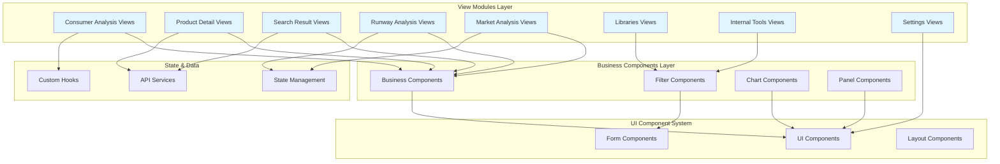

---

## Module Structure

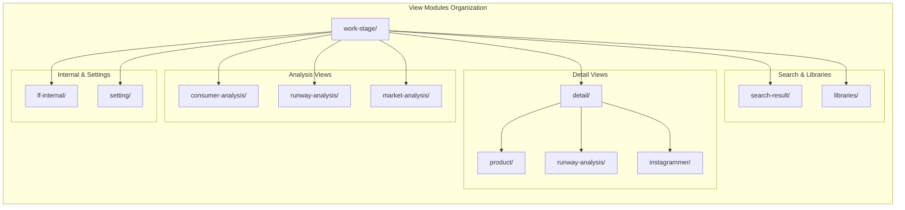

---

## Core Components

### 1. Consumer Analysis Views

#### TrendDiscovery Component
**Location**: `view/work-stage/consumer-analysis/trend-discovery.tsx`

A comprehensive trend analysis component that displays growth and declining trends with tabular data visualization.

**Key Features**:
- Dual analysis modes (growth/declining trends)
- Interactive data table with keyword selection
- Growth percentage visualization
- Post count tracking with tooltips

**Component Structure**:
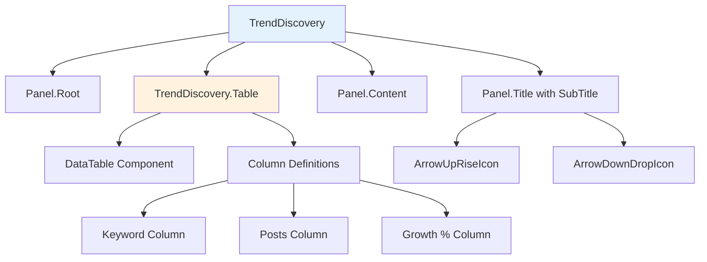

**Props Interface**:
```typescript
interface IProps {
  title: string | React.ReactNode
  analysisType?: ANALYSIS_TYPE  // 1-growth, 2-decline
  loading?: boolean
}

interface TableProps {
  data: ConsumerAnalysisKeywordDto[]
  keyword?: string
  onKeywordChange?: (keyword?: string) => void
  columns?: ColumnDef<ConsumerAnalysisKeywordDto>[]
}
```

**Usage Pattern**:
```typescript
<TrendDiscovery 
  title="Trend Discovery" 
  analysisType={ANALYSIS_TYPE.growth}
>
  <TrendDiscovery.Table
    data={trendData}
    keyword={selectedKeyword}
    onKeywordChange={handleKeywordChange}
  />
</TrendDiscovery>
```

---

### 2. Product Detail Views

#### Product Descriptions Overview
**Location**: `view/work-stage/detail/product/sku/product-descriptions/index.default.tsx`

Displays comprehensive product metrics and trends over time with granular data visualization.

**Data Flow**:
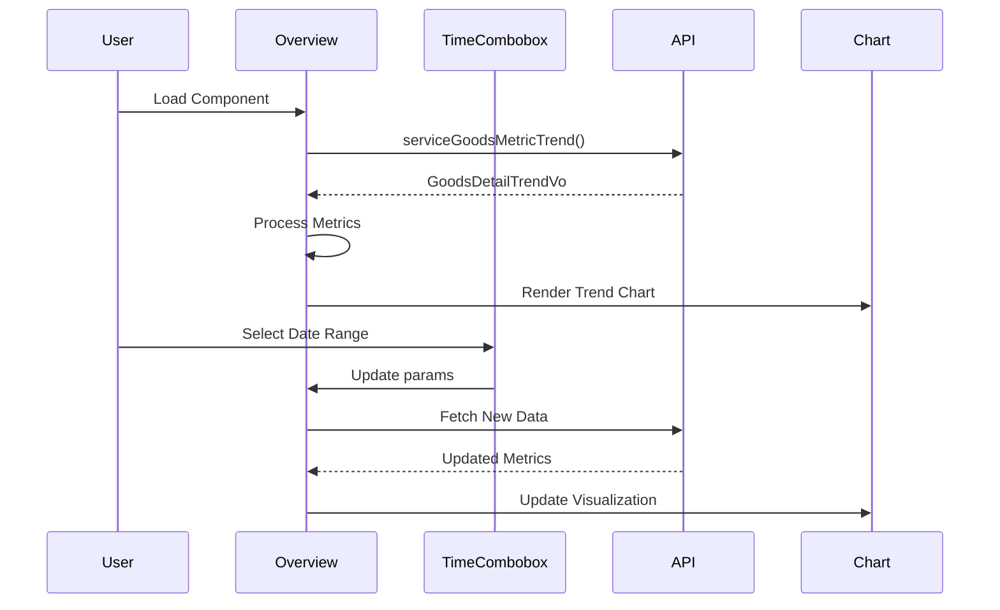

**Key Metrics Tracked**:
- Sales Volume
- Sales Amount
- Comments/Reviews
- Favorites Count
- Stock Changes
- Out of Stock Rate

**Granularity Component**:
```typescript
const Granularity = ({
  label: string,
  tip?: string,
  value: string,
  secondary?: React.ReactNode
}) => {
  // Displays individual metric with tooltip and secondary info
}
```

---

#### Product Tabs Component
**Location**: `view/work-stage/detail/product/tabs.tsx`

A reusable tab navigation component for product detail sections.

**Component Structure**:
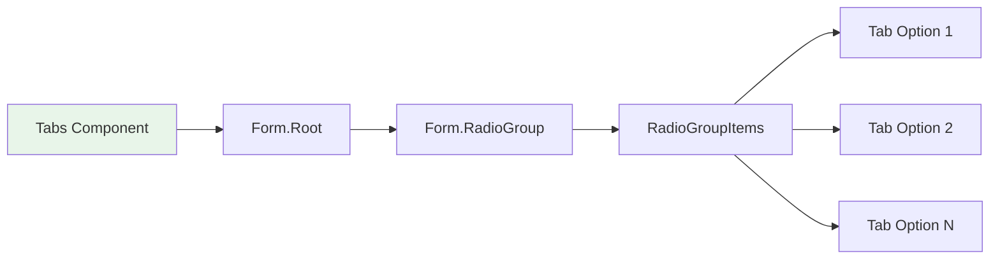

**Props Interface**:
```typescript
interface TabOption {
  label: string
  value: string
  [key: string]: string
}

interface TabProps {
  name: string
  value: Record<string, unknown>
  onValueChange: (val: Record<string, unknown>) => void
  options?: TabOption[]
}
```

---

#### Runway Image Box
**Location**: `view/work-stage/detail/runway-analysis/runway-image-box.tsx`

An advanced image viewer with thumbnail navigation, label overlays, and navigation controls.

**Features**:
- Thumbnail sidebar with scroll
- Full-size image display
- Label positioning overlays
- Previous/Next navigation
- Integration with image list context

**Component Architecture**:
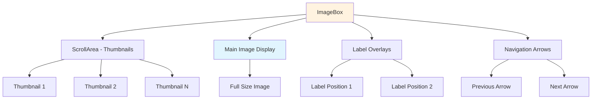

**Label Interface**:
```typescript
interface LabelItem {
  top: string      // CSS position
  left: string     // CSS position
  label: string    // Label text
}
```

---

#### Instagrammer Summary Cards
**Location**: `view/work-stage/detail/instagrammer/summary-cards.tsx`

Displays influencer metrics in a card-based layout with growth indicators.

**Card Configuration Pattern**:
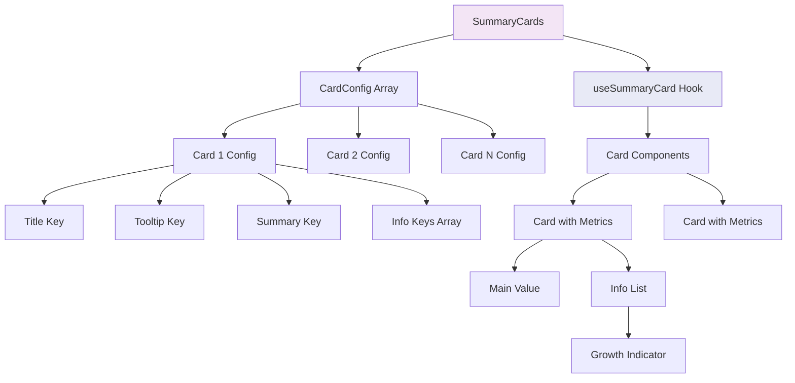

**Configuration Interface**:
```typescript
interface CardConfig {
  titleKey: string
  tipKey: string
  summaryKey: keyof Summary
  infoKeys: {
    label: string
    valueKey: keyof Summary | null
    showGrowth?: boolean
    value?: (v?: Summary) => string
  }[]
}
```

**Growth Cell Component**:
- Displays percentage with color coding
- Green with up arrow for positive growth
- Red with down arrow for negative growth
- Neutral for zero growth

---

### 3. Search Result Views

#### Search Header Component
**Location**: `view/work-stage/search-result/search-header.tsx`

Provides search interface with relevant results and navigation tabs.

**Component Flow**:
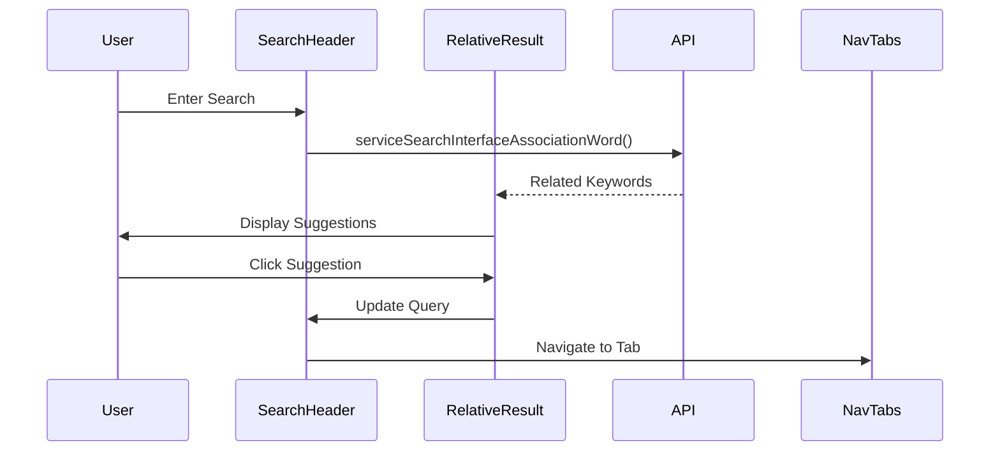

**Tab Options**:
- All Results
- Products
- Posts
- Influencers
- Sites

---

#### Content Component
**Location**: `view/work-stage/search-result/all/content.tsx`

A layout wrapper for search result sections with title and action links.

**Structure**:
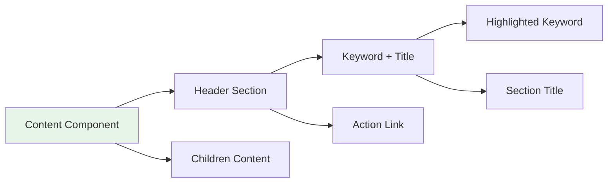

---

#### Info Card Component
**Location**: `view/work-stage/search-result/all/info-card.tsx`

Displays search results in a card format with images and descriptions.

**Props Interface**:
```typescript
interface InfoCardProps {
  title?: string
  list?: {
    picUrl?: string
    displayName?: string
    description?: string
    link?: string
  }[]
}
```

---

### 4. Analysis Statistics Views

#### Runway Analysis Statistics
**Location**: `view/work-stage/runway-analysis/analysis-statistics/index.tsx`

Provides tabbed navigation for runway analysis metrics.

**Tab Structure (Apparel Industry)**:
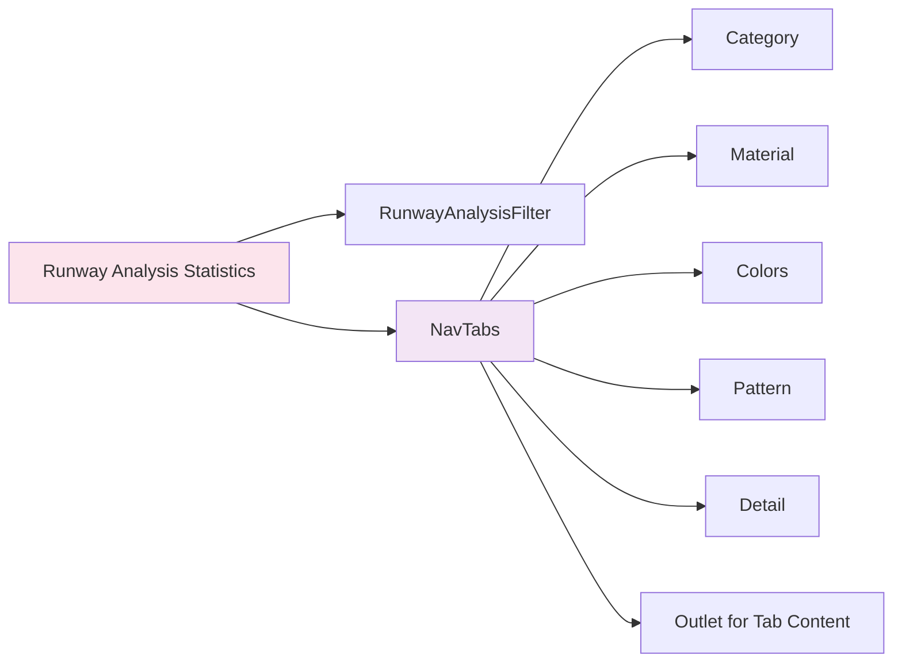

**Dynamic Tab Configuration**:
- Tabs adjust based on industry type
- Apparel industry shows additional tabs (Colors, Pattern)
- Auto-navigation to first valid tab

---

#### Market Analysis Statistics
**Location**: `view/work-stage/market-analysis/analysis-statistics/index.tsx`

Similar structure to runway analysis with market-specific metrics.

**Features**:
- Search textbox for product filtering
- Total result count display
- Industry-specific tab visibility
- Integration with market analysis state management

**Tab Configuration Logic**:
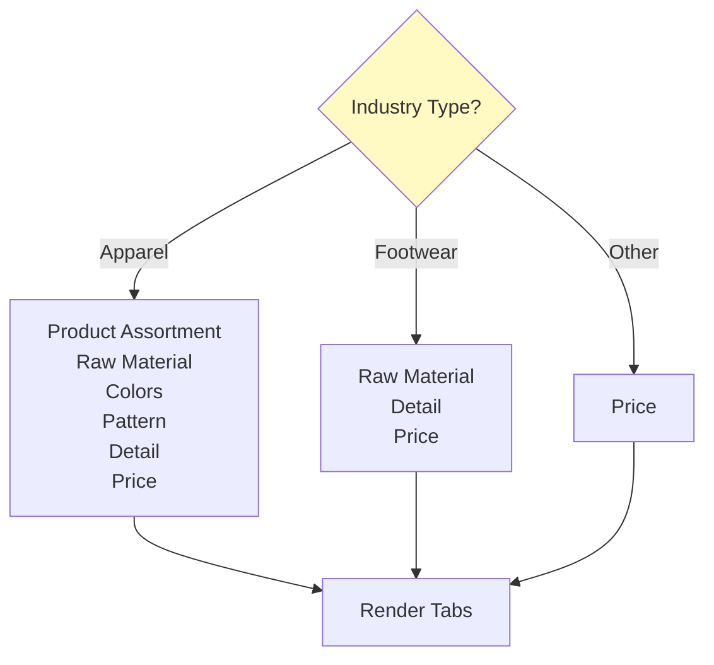

---

### 5. Libraries Views

#### Pinterest Filter
**Location**: `view/work-stage/libraries/pinterest/filter.tsx`

Comprehensive filtering interface for Pinterest content.

**Filter Components**:
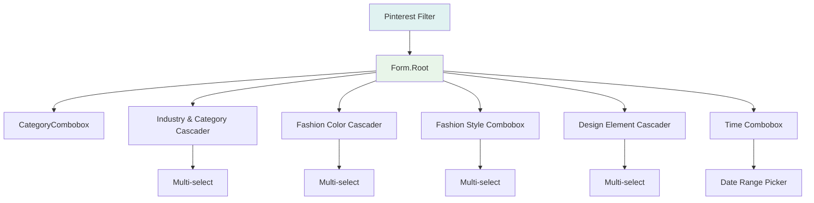

**Props Interface**:
```typescript
interface FilterProps {
  value: PinterestBlogQueryRequest
  onValueChange: (value: PinterestBlogQueryRequest) => void
}
```

---

### 6. Internal Tools Views

#### POM Filter
**Location**: `view/work-stage/lf-internal/apparel-baby/pom/PomFilter.tsx`

Specialized filter for internal Product Operations Management.

**Filter Structure**:
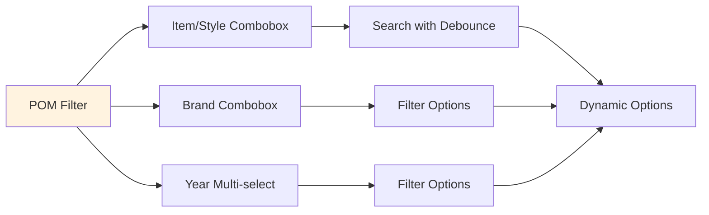

**Props Interface**:
```typescript
interface PDFFilterParams {
  assortmentKeyword?: string
  brandList?: string[]
  yearList?: string[]
  itemNumber?: string
}
```

**Key Features**:
- Cascading filter dependencies
- Debounced search for item numbers
- Dynamic option loading based on selections

---

#### Overview Utils
**Location**: `view/work-stage/lf-internal/overview/utils.ts`

Utility functions for internal overview tables.

**Column Configuration**:
```typescript
interface Column {
  title: string
  dataIndex: string
  tip?: string
}

// Dynamic column generation based on GroupByType
const getColumns = (type: GroupByType): Column[]
```

**Supported Group Types**:
- BRAND
- FAMILY
- PRODUCT_TYPE
- CAT1 (Gender)
- CAT2 (Category Group)
- CAT3 (Category)

---

### 7. Settings Views

#### Role Types
**Location**: `view/work-stage/setting/types.ts`

Type definitions for role management.

```typescript
interface RoleInfo {
  roleName?: string
  roleId?: string
}

type OptionType = 
  | "corporateCustomer"
  | "family"
  | "productType"
  | "brand"
  | "pomBrand"
  | "operatingGroupCode"
  | "fiber"
  | "fiberSustainability"
  | "year"
```

---

#### Delete Role Component
**Location**: `view/work-stage/setting/roles-config/delete-role.tsx`

Modal dialog for role deletion confirmation.

**Component Flow**:
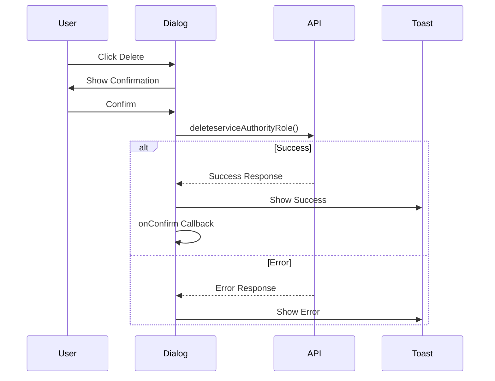

**Props Interface**:
```typescript
interface DeleteRoleProps {
  roleId?: string
  open?: boolean
  setOpen?(open: boolean): void
  onConfirm?: () => void
}
```

---

## Data Flow Patterns

### 1. URL State Management Pattern

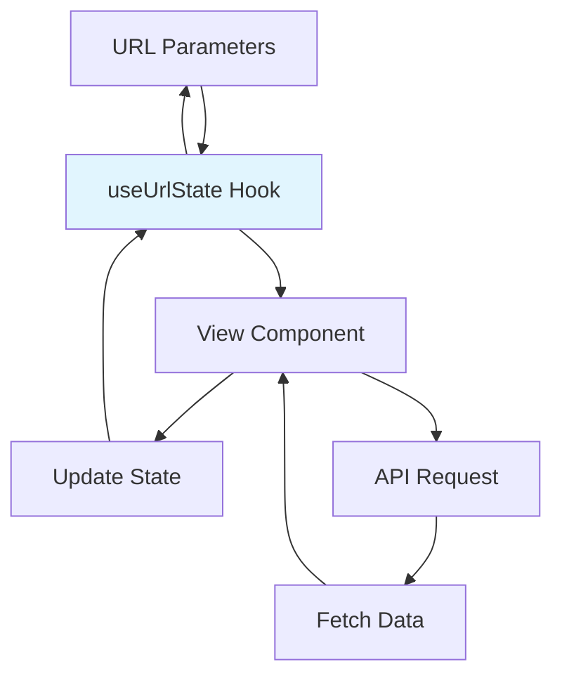

**Usage Example**:
```typescript
const [queryParams, setQueryParams] = useUrlState<SearchQueryProps>()

const onParamsChange = (_params: SearchQueryProps) => {
  setQueryParams((pre) => ({ ...pre, ..._params }))
}
```

---

### 2. Form-Based Filter Pattern

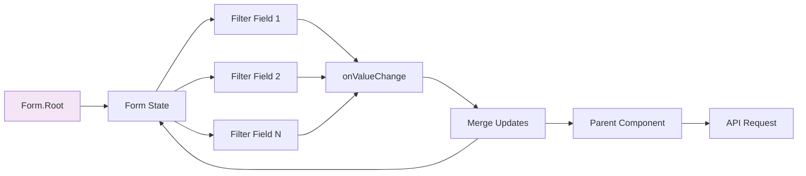

---

### 3. Tab Navigation Pattern

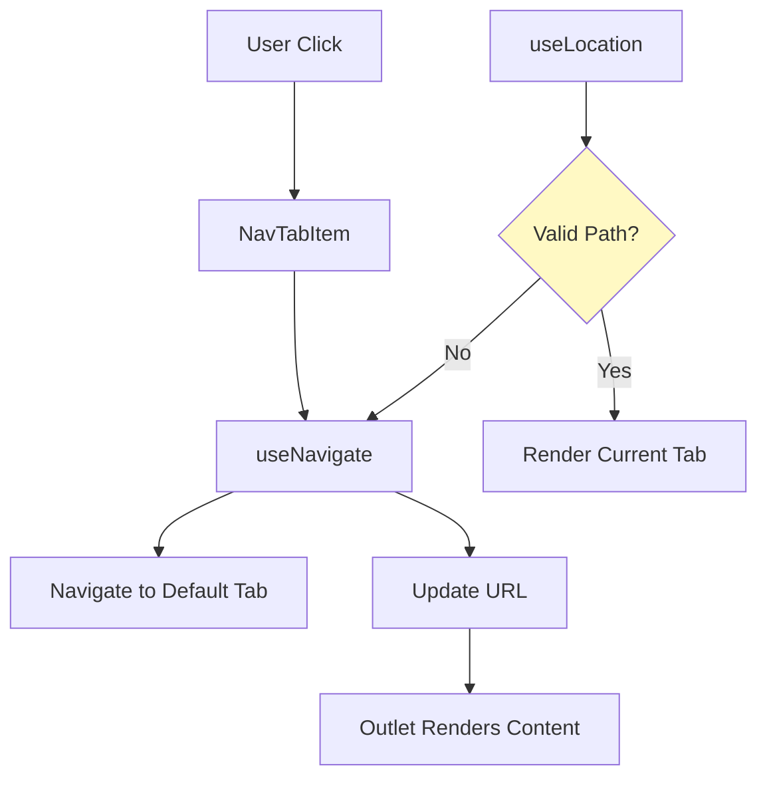

---

## Integration Patterns

### 1. Business Component Integration

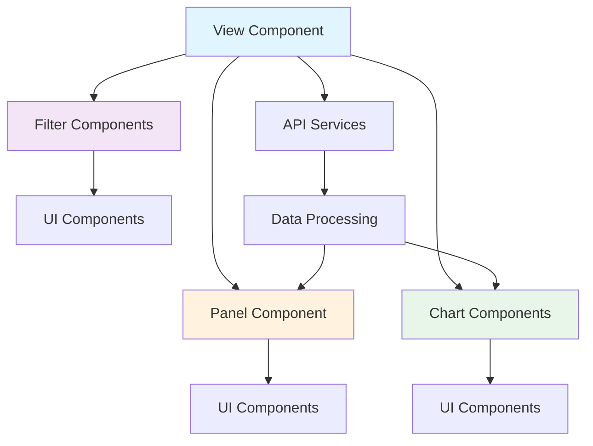

---

### 2. State Management Integration

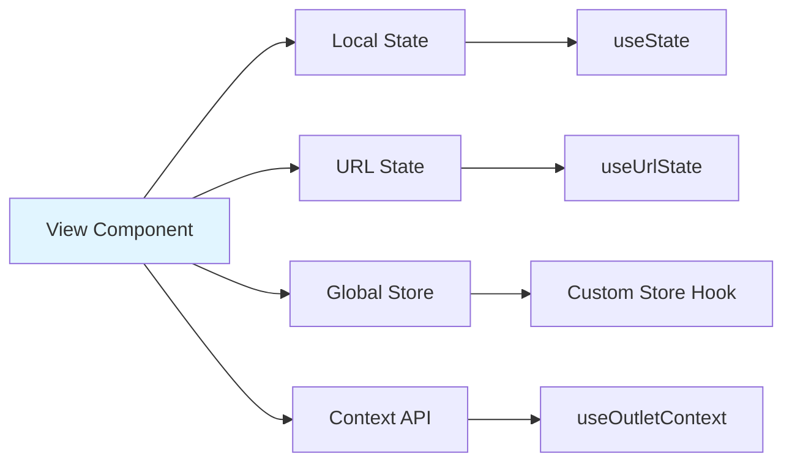

---

### 3. Data Fetching Pattern

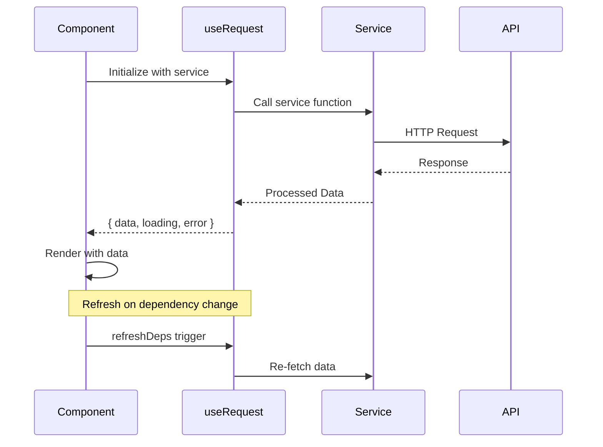

---

## Common Patterns and Best Practices

### 1. Component Composition Pattern

```typescript
// Parent component with sub-components
function TrendDiscovery({ children, ...props }) {
  return (
    <Panel.Root {...props}>
      <Panel.Loading />
      <Panel.Title>{title}</Panel.Title>
      <Panel.Content>{children}</Panel.Content>
    </Panel.Root>
  )
}

// Attach sub-component
TrendDiscovery.Table = Table
```

---

### 2. Conditional Rendering Pattern

```typescript
// Based on data availability
{isShowGranularity && <GranularityContent />}
{isShowChart && <TrendChart />}
{!isShowGranularity && !isShowChart && <Empty />}

// Based on loading state
{loading ? <Spinner /> : <Content />}
```

---

### 3. Dynamic Configuration Pattern

```typescript
// Tab configuration based on conditions
const tabs = useMemo<Tabs[]>(() => {
  const tabsConfig = [
    { label: "Category", path: "category" },
    isApparelIndustry && { label: "Colors", path: "colors" },
    isApparelIndustry && { label: "Pattern", path: "pattern" },
  ]
  
  return tabsConfig.filter(Boolean) as Tabs[]
}, [isApparelIndustry])
```

---

### 4. Props Spreading Pattern

```typescript
// Flexible component APIs
function Component({ 
  specificProp, 
  ...rest 
}: SpecificProps & React.ComponentProps<"div">) {
  return <div {...rest}>{specificProp}</div>
}
```

---

## Styling Patterns

### 1. Class Variance Authority (CVA)

```typescript
const tableCva = cva("bg-background cursor-pointer", {
  variants: {
    active: {
      true: "bg-muted",
      false: "bg-background",
    },
  },
  defaultVariants: { active: false },
})

// Usage
<div className={tableCva({ active: isActive })} />
```

---

### 2. Conditional Styling with cn()

```typescript
<Image
  className={cn(
    "h-32 w-32 border-4 border-border",
    { "border-transparent": i !== currentIndex }
  )}
/>
```

---

### 3. Inline Styles for Dynamic Positioning

```typescript
<div
  className="absolute"
  style={{
    top: label.top,
    left: label.left,
  }}
>
  {label.content}
</div>
```

---

## Navigation and Routing

### Route Structure

```mermaid
graph TB
    Root[work-stage]
    
    Root --> CA[consumer-analysis]
    Root --> Detail[detail]
    Root --> Search[search-result]
    Root --> Runway[runway-analysis]
    Root --> Market[market-analysis]
    Root --> Lib[libraries]
    Root --> Internal[lf-internal]
    Root --> Settings[setting]
    
    Detail --> Product[product/:id]
    Detail --> RunwayD[runway-analysis/:id]
    Detail --> Insta[instagrammer/:id]
    
    Search --> All[all]
    Search --> Products[product]
    Search --> Posts[post]
    
    Runway --> Stats[analysis-statistics]
    Market --> MStats[analysis-statistics]
    
    Stats --> Category[category]
    Stats --> Material[material]
    Stats --> Colors[colors]
    
    style Root fill:#e1f5ff
    style Detail fill:#fff3e0
    style Search fill:#f3e5f5
```

---

## Performance Considerations

### 1. Debounced Search

```typescript
const debounceKeyword = useDebounce(keyword, { wait: 500 })
```

### 2. Memoized Computations

```typescript
const isShowGranularity = useMemo(
  () => isIncludeGranularity(granulates, data?.metricList),
  [data?.metricList]
)
```

### 3. Conditional Data Fetching

```typescript
const { data } = useRequest(
  () => serviceAPI(params),
  {
    ready: !!requiredParam,
    refreshDeps: [params],
  }
)
```

---

## Error Handling

### 1. API Error Handling

```typescript
const { run } = useRequest(serviceFunction, {
  manual: true,
  onSuccess: () => {
    toast({ title: "Success" })
  },
  onError: (error) => {
    toast({
      title: "Error",
      description: error.message,
    })
  },
})
```

### 2. Empty State Handling

```typescript
{!data.list?.length ? (
  <Empty />
) : (
  <DataDisplay data={data.list} />
)}
```

---

## Internationalization

All view components use the translation function `t()` for internationalization:

```typescript
<Text t="dashboard.ty_ly_growth" />
<Text t="text.search_result" />
```

Translation keys are organized by:
- `text.*` - Common text labels
- `field.*` - Form field labels
- `dashboard.*` - Dashboard-specific terms
- `product.*` - Product-related terms
- `tips.*` - Tooltip content

---

## Dependencies

### External Dependencies
- **react-router-dom**: Navigation and routing
- **ahooks**: React hooks library (useRequest, useDebounce)
- **@tanstack/react-table**: Table functionality
- **class-variance-authority**: Styling variants
- **date-fns**: Date manipulation
- **lucide-react**: Icon components
- **qs**: Query string parsing

### Internal Dependencies
- [UI Component System](ui-component-system.md): Base UI components
- [Business Components](business-components.md): Domain-specific components
- **State Management Hooks**: Custom hooks for state management
- **API Services**: Backend integration layer

---

## Testing Considerations

### Component Testing Focus Areas

1. **User Interactions**
   - Tab navigation
   - Filter changes
   - Search functionality
   - Button clicks

2. **Data Display**
   - Correct rendering of fetched data
   - Empty state handling
   - Loading states
   - Error states

3. **Navigation**
   - Route changes
   - URL parameter updates
   - Navigation guards

4. **Form Validation**
   - Filter validation
   - Required fields
   - Date range validation

---

## Future Enhancements

### Potential Improvements

1. **Performance**
   - Implement virtual scrolling for large lists
   - Add pagination for heavy data sets
   - Optimize re-renders with React.memo

2. **User Experience**
   - Add keyboard shortcuts
   - Implement drag-and-drop for filters
   - Add export functionality

3. **Accessibility**
   - Enhance ARIA labels
   - Improve keyboard navigation
   - Add screen reader support

4. **Features**
   - Add comparison views
   - Implement saved filters
   - Add collaborative features

---

## Related Documentation

- [UI Component System](ui-component-system.md) - Base component library
- [Business Components](business-components.md) - Domain-specific components
- [Core Infrastructure](core-infrastructure.md) - Build and configuration
- **State Management Hooks** - Custom hooks documentation
- **Utilities & Helpers** - Utility functions documentation

---

## Summary

The **view-modules** layer serves as the presentation tier of the TrendEngine application, orchestrating UI components, business logic, and data management to deliver feature-rich user experiences. Key characteristics include:

- **Modular Organization**: Views organized by functional domain
- **Component Composition**: Extensive use of composition patterns
- **State Management**: Multiple state management strategies (local, URL, global)
- **Responsive Design**: Adaptive layouts and conditional rendering
- **Type Safety**: Comprehensive TypeScript interfaces
- **Internationalization**: Full i18n support
- **Performance**: Optimized data fetching and rendering

This module demonstrates modern React patterns and best practices while maintaining flexibility and extensibility for future enhancements.
